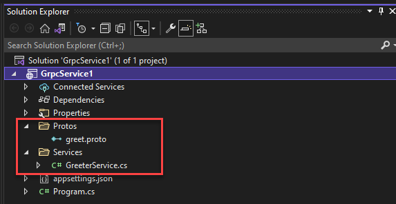

# gRPC

[!INCLUDE [book-preview](../../../includes/book-preview.md)]

So far in this book, we’ve focused on [REST-based](https://docs.microsoft.com/azure/architecture/best-practices/api-design) communication. REST is an architectural style that promotes interoperability between services distributed across computer systems. Embracing a request/response communication model, it's typically implemented with HTTP. Every response from the server is a reply to a request from a client. While widely used, a newer communication technology, gRPC, is rapidly gaining popularity for cloud-native applications.

## Introduction

gRPC is an open-source communication protocol that originates from Google. It's modeled after the [remote procedure call (RPC)](https://en.wikipedia.org/wiki/Remote_procedure_call) protocol, historically found in distributed computing systems. With this model, a client program exposes a local, in-process method. When invoked, the local method makes an out-of-process call to a remote function on computer across a shared network. The developer codes the operation as a local procedure call. The RPC plumbing abstracts the point-to-point networking communication, serialization, and execution.

gRPC is a modern implementation of the RPC model that is lightweight and highly performant. It uses HTTP/2 for its transport protocol. While compatible with HTTP 1.1, HTTP/2 features many advanced capabilities:

- HTTP/2 is a binary protocol, unlike HTTP 1.1, which sends data as clear text.
- HTTP/2 supports multiplexing, or multiple parallel requests over the same connection, while HTTP 1.1 is limited to processing one request/response round trip at a time.
- HTTP/2 supports full-duplex, or bidirectional communication, where both client and server and can communicate at the same time. The client can be sending request data at the same time the server is returning response data.
- HTTP/2 features built-in streaming with which both requests and responses can asynchronously stream large data sets. Multiple data streams can process independently on the same HTTP/2 connection.
- Combining gRPC and HTTP/2, performance dramatically increases. In Microsoft [Windows Communication Foundation (WCF)](https://docs.microsoft.com/dotnet/framework/wcf/whats-wcf) parlance, gRPC performance meets and exceeds the speed and efficiency of [NetTCP bindings](https://docs.microsoft.com/dotnet/api/system.servicemodel.nettcpbinding?view=netframework-4.8). However, unlike NetTCP, which favors the Microsoft stack, gRPC is cross-platform.

gRPC is supported across most popular platforms, including Java, JavaSript, C#, Golang, Swift, and NodeJS.

## Protocol Buffers

gRPC embraces another open-source technology called [Protocol Buffers](https://developers.google.com/protocol-buffers/docs/overview). This technology provides a highly efficient, platform-neutral engine for serializing structured messages that services communicate to one another. Using a common Interface Definition Language (IDL), the developer defines a service contract for each microservice. The contract, implemented as a ".proto" file, describes the methods, inputs, and outputs for each service. Then, using the Protobuf compiler, "Proton," both client and service code is automatically generated, including:

 - A strongly-typed DTO (Data Transfer Object) that the client and service can share.
 - A base class containing the necessary network plumbing that the service can inherit and extend.
 - A stub for the client that contains the necessary plumbing to invoke the remote service.

Code that is optimized for fast data serialization/deserialization can be generated for any of the supported platforms. At runtime, an HTTP/2 connection is established. Each message is serialized as a standard Protobuf representation and exchanged across clients and remote services.

The book, [gRPC for WCF Developers](https://docs.microsoft.com/dotnet/architecture/grpc-for-wcf-developers/), available for free from Microsoft, provides detailed coverage of the mechanics of gRPC and Protocol Buffers. 

## gRPC support in .NET

The Microsoft .NET Core framework 3.0 includes tooling and native support for gRPC. Figure 4-20 shows the Visual Studio 2019 template that scaffolds a skeleton project for a gRPC service. Note how .NET Core supports the Windows, Linux, and macOS platforms.

**Figure 4-20**. gRPC support in Visual Studio 2019

.NET Core 3.0 seamlessly integrates gRPC into its framework, including endpoint routing, built-in IoC support, and logging. The open-source Kestrel web server fully supports HTTP/2 connections.  

Figure 4-21 shows the structure of a gRPC service in Visual Studio 2019. Note how the structure includes folders for the proto description files and the service code. 

**Figure 4-21**. gRPC project in Visual Studio 2019

An excellent introduction to building gRPC services is [gRPC with ASP.NET Core 3.0](https://www.dotnetcurry.com/aspnet-core/1514/grpc-asp-net-core-3) from the .NET Curry magazine series.

## gRPC Usage

gRPC is well suited for the following scenarios:

- Low latency and high throughput communication. gRPC is great for lightweight microservices where efficiency is critical.
- Point-to-point real-time communication. gRPC has excellent support for bi-directional streaming. gRPC services can push messages in real time without polling.
- Polyglot environments – gRPC tooling supports most popular development languages, making it a good choice for multi-language environments.
- Network constrained environments – gRPC messages are serialized with Protobuf, a lightweight message format. A gRPC message is always smaller than an equivalent JSON message.

At the time of writing of this book, most browsers have limited support for gRPC. gRPC relies heavily on HTTP/2 features. Modern browsers can't provide the level of control required to support a gRPC client. Instead, gRPC is commonly implemented for internal microservice to microservice communication. Figure 4-22 shows a simple, but common usage pattern.

**Figure 4-22**. gRPC usage patterns

Note in the previous figure how front-end traffic (both browser and mobile) is implemented with HTTP when invoking the API gateway. However, traffic behind the gateway and across microservices implement gRPC. As discussed previously, ".proto" files define each of the microservices and are used to generate code stubs for both the client and the service. Consideration should be given to centralizing the gRPC service definitions in a single repo. This practice minimizes duplication, improves manageability, and provides consistent versioning.  

Looking ahead, gRPC could well play a major role in dethroning the dominance of REST for cloud-native systems. The performance benefits and ease of development are too good to pass up. However, make no mistake, REST will still be around for a long time. It still excels for publicly exposed APIs and for backward compatibility reasons.

>[!div class="step-by-step"] 
>[Previous](service-to-service-communication.md)
>[Next](service-mesh-communication-infrastructure.md)
