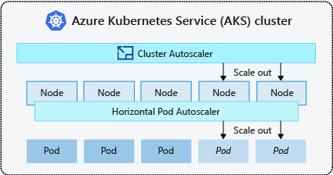

# Scaling containers and serverless applications

There are two ways to scale an application: up or out. The former refers to adding capacity to a single resource, while the latter refers to adding more resources to increase capacity.

## The simple solution: scaling up

Upgrading an existing host server with increased CPU, memory, disk I/O speed, and network I/O speed is known as *scaling up*. Scaling up a cloud-native application involves choosing more capable resources from the cloud vendor. For example, you can create a new node pool with larger VMs in your Kubernetes cluster. Then, migrate your containerized services to the new pool.

Serverless apps scale up by choosing the [premium Functions plan](/azure/azure-functions/functions-scale) or premium instance sizes from a dedicated app service plan.

## Scaling out cloud-native apps

Cloud-native applications often experience large fluctuations in demand and require scale on a moment's notice. They favor scaling out. Scaling out is done horizontally by adding additional machines (called nodes) or application instances to an existing cluster. In Kubernetes, you can scale manually by adjusting configuration settings for the app (for example, [scaling a node pool](/azure/aks/use-multiple-node-pools#scale-a-node-pool-manually)), or through autoscaling.

AKS clusters can autoscale in one of two ways:

First, the [Horizontal Pod Autoscaler](/azure/aks/tutorial-kubernetes-scale#autoscale-pods) monitors resource demand and automatically scales your POD replicas to meet it. When traffic increases, additional replicas are automatically provisioned to scale out your services. Likewise, when demand decreases, they're removed to scale-in your services. You define the metric on which to scale, for example, CPU usage. You can also specify the minimum and maximum number of replicas to run. AKS monitors that metric and scales accordingly.

Next, the [AKS Cluster Autoscaler](/azure/aks/cluster-autoscaler) feature enables you to automatically scale compute nodes across a Kubernetes cluster to meet demand. With it, you can automatically add new VMs to the underlying Azure Virtual Machine Scale Set whenever more compute capacity of is required. It also removes nodes when no longer required.

Figure 3-11 shows the relationship between these two scaling services.

**Figure 3-11**. Scaling out an App Service plan.

Working together, both ensure an optimal number of container instances and compute nodes to support fluctuating demand. The horizontal pod autoscaler optimizes the number of pods required. The cluster autoscaler optimizes the number of nodes required.

### Scaling Azure Functions

Azure Functions automatically scale out upon demand. Server resources are dynamically allocated and removed based on the number of triggered events. You're only charged for compute resources consumed when your functions run. Billing is based upon the number of executions, execution time, and memory used.

While the default consumption plan provides an economical and scalable solution for most apps, the premium option allows developers flexibility for custom Azure Functions requirements. Upgrading to the premium plan provides control over instance sizes, pre-warmed instances (to avoid cold start delays), and dedicated VMs.

>[!div class="step-by-step"]
>[Previous](deploy-containers-azure.md)
>[Next](other-deployment-options.md)
