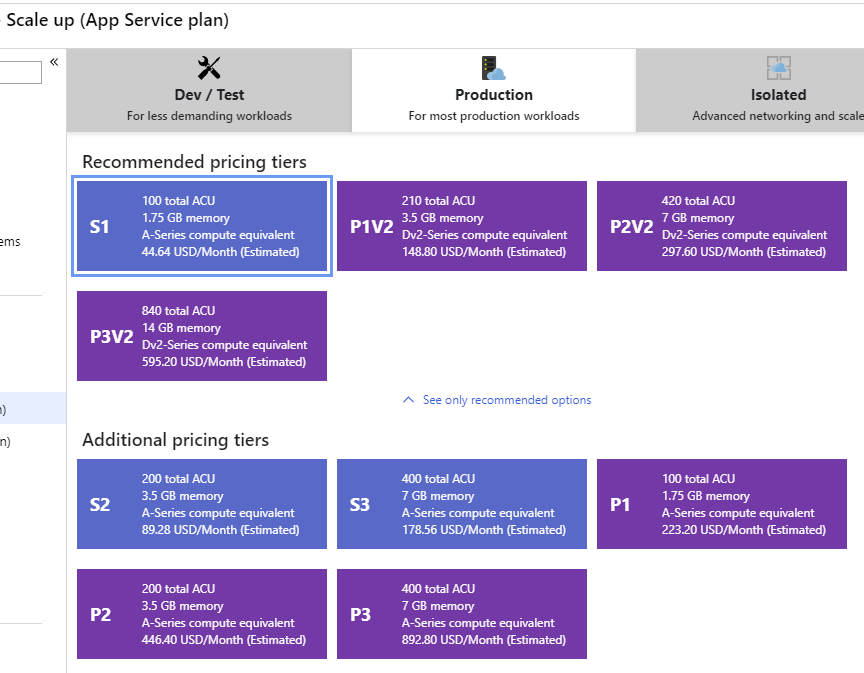
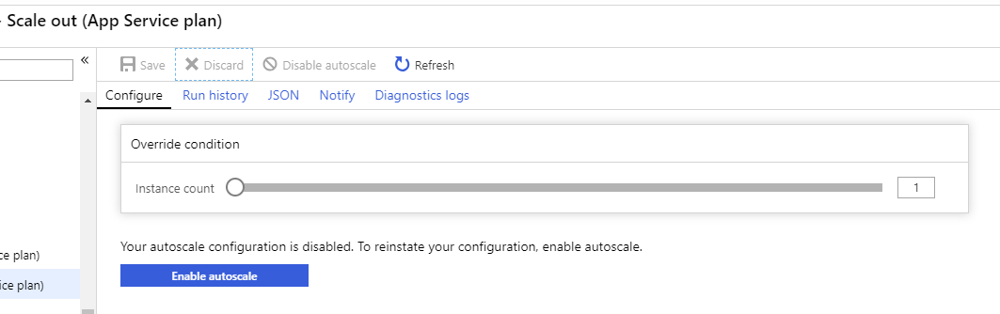
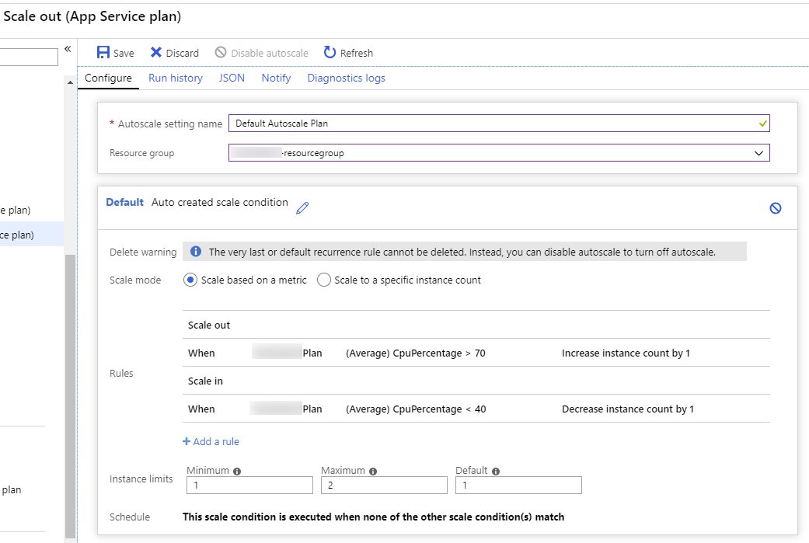

# Scaling cloud native applications

One of the most-often touted advantages of moving to a cloud hosting environment is scalability. Scalability, or the ability for an application to accept additional user load without unduly degrading performance for each user, is most often achieved by breaking up applications into small pieces that can each be given whatever resources they require. Another approach is to simply add more resources to the servers hosting the application. While simple and effective, this last approach usually hits its limits very quickly and is more difficult to apply dynamically in response to changing demands.

## The simple solution: scaling up

The process of upgrading existing servers to give them more resources (CPU, memory, disk I/O speed, network I/O speed) is known as *scaling up*. In cloud native applications, scaling up doesn't typically refer to purchasing and installing actual hardware on physical machines so much as choosing a more capable plan from a list of options available. Figure 2-1 shows several options available for Azure App Service Plans.

**Figure 2-1**. App Service Plans

Note that even among these plans, the actual hardware involved is abstracted. Each plan specifies a number of Azure Compute Units (ACU) that are dedicated to the plan, not specific hardware CPUs or cores that will be made available. Scaling up can quickly improve performance of an application, and can often be sufficient to respond to a small surge in traffic, but once the maximum plan is in place, scaling up is no longer an option. From there, you must look to scaling *out*.

## Scaling out App Services

Azure App Service plans can be configured to *scale out*, either manually when specified by an administrator or automatically using a feature called *autoscale*. Scaling out refers to increasing the number of (identical) instances used to support an application, such that incoming traffic is spread among the instances. Theoretically, there is no limit to the number of instances that can be added in support of a particular application. Figure 2-2 shows how to manually specify the number of instances that will support a given App Service plan.

**Figure 2-2**. Scaling out an App Service plan.

Autoscale is an Azure feature that can be enabled for App Services and other plans. It allows plan administrators to configure rules that dictate when additional instances should be added to or removed from the plan. Figure 2-3 shows an example set of rules that add an additional instance whenever the average CPU of all current instances exceeds 70%. A separate rule removes an instance whenever the average CPU of all current instances drops below 40%. The plan also supports upper and lower limits to prevent the pool from climbing out of control or dropping to zero, and by default there's a 5-minute delay between alterations so the plan isn't constantly adding and then immediately removing instances. Essentially, you can use these rules to act as a kind of thermostat for your application, where instead of regulating temperature with heating or cooling, you try to maintain a constant level of load across your app nodes. Autoscale adds and removes nodes as necessary to maintain this level.

**Figure 2-3**. Configuring autoscale for an App Service plan.

Although Azure App Service plans work for a wide variety of apps, many complex business apps benefit from leveraging containers that can be built and tested locally and then deployed to the cloud. Simple container-based apps can still leverage App Service plans using Web App for Containers, but once multiple containers are needed to work in concert with one another, it's likely time to look to more powerful deployment options.

## References

- [Web App for Containers](https://azure.microsoft.com/services/app-service/containers/)

>[!div class="step-by-step"]
>[Previous](candidate-apps.md)
>[Next](leverage-containers-orchestrators.md)
