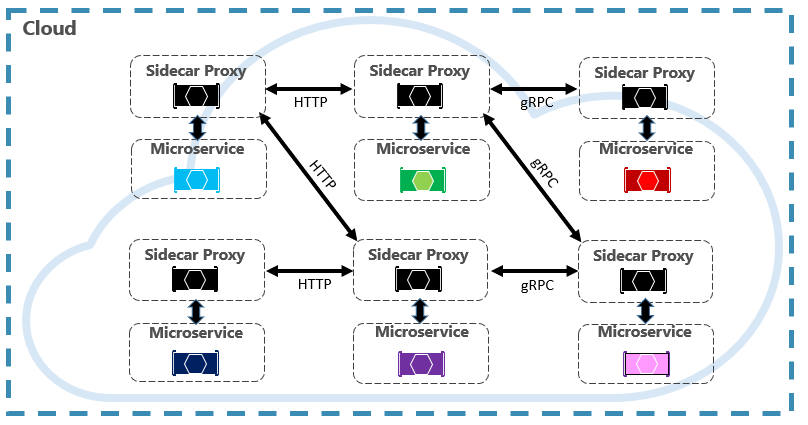

# Service Mesh communication infrastructure

Throughout this chapter, we've explored the challenges of microservice communication. We said that development teams need to be sensitive to how back-end services communicate with each other. Ideally, the less inter-service communication, the better. However, avoidance isn't always possible as back-end services often rely on one another to complete operations.

We explored different approaches for implementing synchronous HTTP communication and asynchronous messaging. In each of the cases, the developer is burdened with implementing communication code. Communication code is complex and time intensive. Incorrect decisions can lead to significant performance issues.

A more modern approach to microservice communication centers around a new and rapidly evolving technology entitled *Service Mesh*. A [service mesh](https://www.nginx.com/blog/what-is-a-service-mesh/) is a configurable infrastructure layer with built-in capabilities to handle service-to-service communication, resiliency, and many cross-cutting concerns. It moves the responsibility for these concerns out of the microservices and into service mesh layer. Communication is abstracted away from your microservices.

A key component of a service mesh is a proxy. In a cloud-native application, an instance of a proxy is typically colocated with each microservice. While they execute in separate processes, the two are closely linked and share the same lifecycle. This pattern, known as the [Sidecar pattern](/azure/architecture/patterns/sidecar), and is shown in Figure 4-24.

**Figure 4-24**. Service mesh with a side car

Note in the previous figure how messages are intercepted by a proxy that runs alongside each microservice. Each proxy can be configured with traffic rules specific to the microservice. It understands messages and can route them across your services and the outside world.

Along with managing service-to-service communication, the Service Mesh provides support for service discovery and load balancing.

Once configured, a service mesh is highly functional. The mesh retrieves a corresponding pool of instances from a service discovery endpoint. It sends a request to a specific service instance, recording the latency and response type of the result. It chooses the instance most likely to return a fast response based on different factors, including the observed latency for recent requests.

A service mesh manages traffic, communication, and networking concerns at the application level. It understands messages and requests. A service mesh typically integrates with a container orchestrator. Kubernetes supports an extensible architecture in which a service mesh can be added.

In chapter 6, we deep-dive into Service Mesh technologies including a discussion on its architecture and available open-source implementations.

## Summary

In this chapter, we discussed cloud-native communication patterns. We started by examining how front-end clients communicate with back-end microservices. Along the way, we talked about API Gateway platforms and real-time communication. We then looked at how microservices communicate with other back-end services. We looked at both synchronous HTTP communication and asynchronous messaging across services. We covered gRPC, an upcoming technology in the cloud-native world. Finally, we introduced a new and rapidly evolving technology entitled Service Mesh that can streamline microservice communication.

Special emphasis was on managed Azure services that can help implement communication in cloud-native systems:

- [Azure Application Gateway](/azure/application-gateway/overview)
- [Azure API Management](https://azure.microsoft.com/services/api-management/)
- [Azure SignalR Service](https://azure.microsoft.com/services/signalr-service/)
- [Azure Storage Queues](/azure/storage/queues/storage-queues-introduction)
- [Azure Service Bus](/azure/service-bus-messaging/service-bus-messaging-overview)
- [Azure Event Grid](/azure/event-grid/overview)
- [Azure Event Hub](https://azure.microsoft.com/services/event-hubs/)

We next move to distributed data in cloud-native systems and the benefits and challenges that it presents.

### References

- [.NET Microservices: Architecture for Containerized .NET applications](https://dotnet.microsoft.com/download/thank-you/microservices-architecture-ebook)

- [Designing Interservice Communication for Microservices](/azure/architecture/microservices/design/interservice-communication)

- [Azure SignalR Service, a fully managed service to add real-time functionality](https://azure.microsoft.com/blog/azure-signalr-service-a-fully-managed-service-to-add-real-time-functionality/)

- [Azure API Gateway Ingress Controller](https://azure.github.io/application-gateway-kubernetes-ingress/)

- [About Ingress in Azure Kubernetes Service (AKS)](https://vincentlauzon.com/2018/10/10/about-ingress-in-azure-kubernetes-service-aks/)

- [gRPC Documentation](https://grpc.io/docs/guides/)

- [gRPC for WCF Developers](../grpc-for-wcf-developers/index.md)

- [Comparing gRPC Services with HTTP APIs](/aspnet/core/grpc/comparison?view=aspnetcore-3.0&preserve-view=false)

- [Building gRPC Services with .NET video](/Shows/The-Cloud-Native-Show/Building-Microservices-with-gRPC-and-NET)

>[!div class="step-by-step"]
>[Previous](grpc.md)
>[Next](distributed-data.md)
