# Service-to-service communication

[!INCLUDE [book-preview](../../../includes/book-preview.md)]

Moving from the front-end client, we now address back-end microservices communicate with each other.

When constructing a cloud-native application, you'll want to be sensitive to how back-end services communicate with each other. Ideally, the less inter-service communication, the better. However, avoidance isn't always possible as back-end services often rely on one another to complete an operation.

There are several widely accepted approaches to implementing cross-service communication. The *type of communication interaction* will often determine the best approach.

Consider the following interaction types:

- *Query* – when a calling microservice requires a response from a called microservice, such as, "Hey, give me the buyer information for a given customer Id."

- *Command* – when the calling microservice needs another microservice to execute an action but doesn't require a response, such as, "Hey, just ship this order."

- *Event* – when a microservice, called the publisher, raises an event that state has changed or an action has occurred. Other microservices, called subscribers, who are interested, can react to the event appropriately. The publisher and the subscribers aren't aware of each other.

Microservice systems typically use a combination of these interaction types when executing operations that require cross-service interaction. Let's take a close look at each and how you might implement them.

## Queries

Many times, one microservice might need to *query* another, requiring an immediate response to complete an operation. A shopping basket microservice may need product information and a price to add an item to its basket. There are a number of approaches for implementing query operations.

### Request/Response Messaging

One option for implementing this scenario is for the calling back-end microservice to make direct HTTP requests to the microservices it needs to query, shown in Figure 4-8.

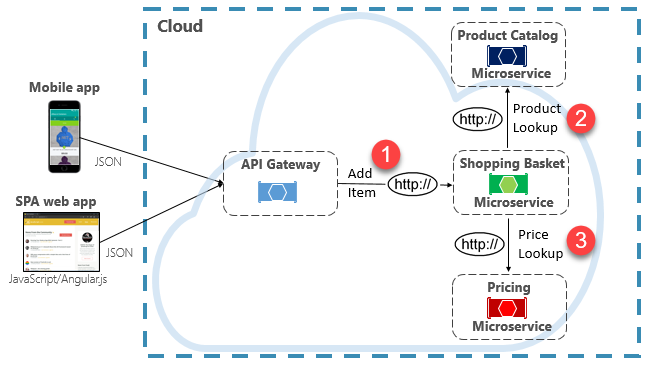

**Figure 4-8**. Direct HTTP communication

While direct HTTP calls between microservices are relatively simple to implement, care should be taken to minimize this practice. To start, these calls are always *synchronous* and will block the operation until a result is returned or the request times outs. What were once self-contained, independent services, able to evolve independently and deploy frequently, now become coupled to each other. As coupling among microservices increase, their architectural benefits diminish.

Executing an infrequent request that makes a single direct HTTP call to another microservice might be acceptable for some systems. However, high-volume calls that invoke direct HTTP calls to multiple microservices aren't advisable. They can increase latency and negatively impact the performance, scalability, and availability of your system. Even worse, a long series of direct HTTP communication can lead to deep and complex chains of synchronous microservices calls, shown in Figure 4-9:

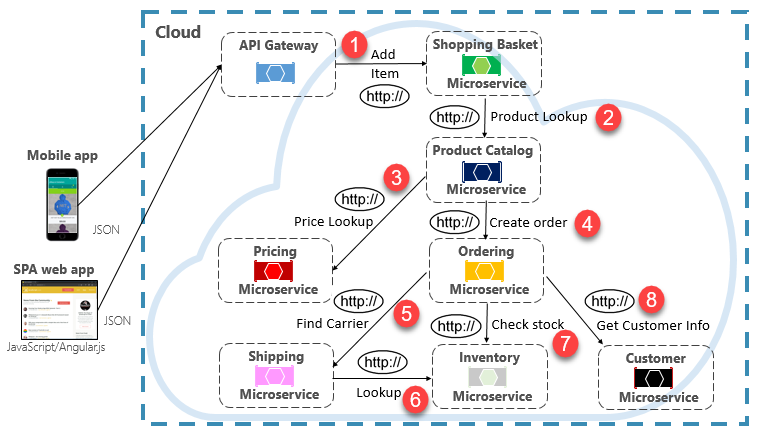

**Figure 4-9**. Chaining HTTP queries

You can certainly imagine the risk in the design shown in the previous image. What happens if Step \#3 fails? Or Step \#8 fails? How do you recover? What if Step \#6 is slow because the underlying service is busy? How do you continue? Even if all works correctly, think of the latency this call would incur, which is the sum of the latency of each step.

The large degree of coupling in the previous image suggests the services weren't optimally modeled. It would behoove the team to revisit their design.

### Materialized View pattern

A popular option for removing microservice coupling is the [Materialized View pattern](https://docs.microsoft.com/azure/architecture/patterns/materialized-view). With this pattern, a microservice stores its own local, denormalized copy of data that's owned by other services. Instead of the Shopping Basket microservice querying the Product Catalog and Pricing microservices, it maintains its own local copy of that data. This pattern eliminates unnecessary coupling and improves reliability and response time. The entire operation executes inside a single process. We explore this pattern and other data concerns in Chapter 5.

### Service Aggregator Pattern

Another option for eliminating microservice-to-microservice coupling is an [Aggregator microservice](https://devblogs.microsoft.com/cesardelatorre/designing-and-implementing-api-gateways-with-ocelot-in-a-microservices-and-container-based-architecture/), shown in purple in Figure 4-10. 

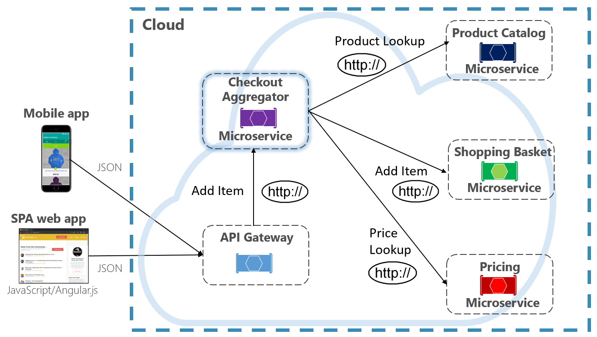

**Figure 4-10**. Aggregator microservice

The pattern isolates an operation that makes calls to multiple back-end microservices, centralizing its logic into a specialized microservice.  The purple checkout aggregator microservice in the previous figure orchestrates the workflow for the Checkout operation. It includes calls to several back-end microservices in a sequenced order. Data from the workflow is aggregated and returned to the caller. While it still implements direct HTTP calls, the aggregator microservice reduces direct dependencies among back-end microservices. 

### Request/Reply Pattern

Another approach for decoupling synchronous HTTP messages is a [Request-Reply Pattern](https://www.enterpriseintegrationpatterns.com/patterns/messaging/RequestReply.html), which uses queuing communication. Communication using a queue is always a one-way channel, with a producer sending the message and consumer receiving it. With this pattern, both a request queue and response queue are implemented, shown in Figure 4-11.

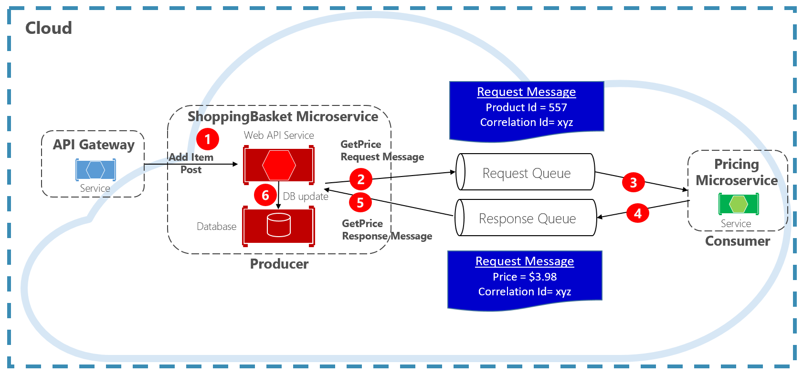

**Figure 4-11**. Request-reply pattern

Here, the message producer creates a query-based message that contains a unique correlation ID and places it into a request queue. The consuming service dequeues the messages, processes it and places the response into the response queue with the same correlation ID. The producer service dequeues the message, matches it with the correlation ID and continues processing. We cover queues in detail in the next section.

## Commands

Another type of communication interaction is a *command*. A microservice may need another microservice to perform an action. The Ordering microservice may need the Shipping microservice to create a shipment for an approved order. In Figure 4-12, one microservice, called a Producer, sends a message to another microservice, the Consumer, commanding it to do something. 

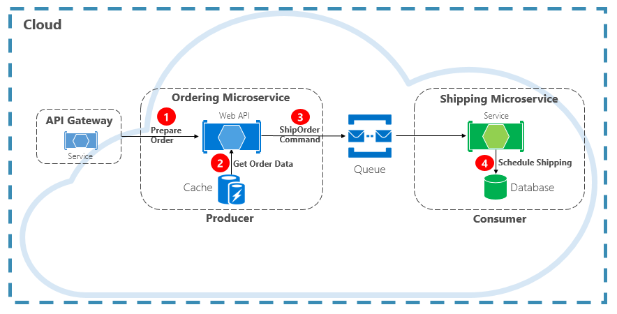

**Figure 4-12**. Command interaction with a queue

Most often, the Producer doesn't require a response and can *fire-and-forget* the message. If a reply is needed, the Consumer sends a separate message back to Producer on another channel. A command message is best sent asynchronously with a message queue. supported by a lightweight message broker. In the previous diagram, note how a queue separates and decouples both services.

A message queue is an intermediary construct through which a producer and consumer pass a message. Queues implement an asynchronous, point-to-point messaging pattern. The Producer knows where a command needs to be sent and routes appropriately. The queue guarantees that a message is processed by exactly one of the consumer instances that are reading from the channel. In this scenario, either the producer or consumer service can scale out without affecting the other. As well, technologies can be disparate on each side, meaning that we might have a Java microservice calling a [Golang](https://golang.org) microservice. 

In chapter 1, we talked about *backing services*. Backing services are ancillary resources upon which cloud-native systems depend. Message queues are backing services. The Azure cloud supports two types of message queues that your cloud-native systems can consume to implement command messaging: Azure Storage Queues and Azure Service Bus Queues.

### Azure Storage Queues

Azure storage queues offer a simple queueing infrastructure that is fast, affordable, and backed by Azure storage accounts.

[Azure Storage Queues](https://docs.microsoft.com/azure/storage/queues/storage-queues-introduction) feature a REST-based queuing mechanism with reliable and persistent messaging. They provide a minimal feature set, but are inexpensive and store millions of messages. Their capacity ranges up to 500 TB. A single message can be up to 64 KB in size.

You can access messages from anywhere in the world via authenticated calls using HTTP or HTTPS. Storage queues can scale out to large numbers of concurrent clients to handle traffic spikes.

That said, there are limitations with the service:

- Message order isn't guaranteed.

- A message can only persist for seven days before it's automatically removed.

- Support for state management, duplicate detection, or transactions isn't available.

Figure 4-13 shows the hierarchy of an Azure Storage Queue.

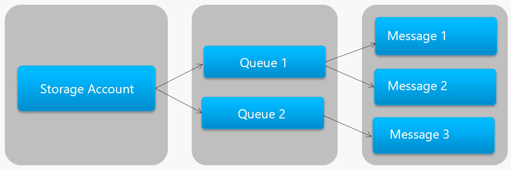

**Figure 4-13**. Storage queue hierarchy

In the previous figure, note how storage queues store their messages in the underlying Azure Storage account.

For developers, Microsoft provides several client and server-side libraries for Storage queue processing. Most major platforms are supported including .NET, Java, JavaScript, Ruby, Python, and Go. Developers should never communicate directly with these libraries. Doing so will tightly couple your microservice code to the Azure Storage Queue service. It's a better practice to insulate the implementation details of the API. Introduce an intermediation layer, or intermediate API, that exposes generic operations and encapsulates the concrete library. This loose coupling enables you to swap out one queuing service for another without having to make changes to the mainline service code. 

Azure Storage queues are an economical option to implement command messaging in your cloud-native applications. Especially when a queue size will exceed 80 GB, or a simple feature set is acceptable. You only pay for the storage of the messages; there are no fixed hourly charges.

### Azure Service Bus Queues

For more complex messaging requirements, consider Azure Service Bus queues.

Sitting atop a robust message infrastructure, [Azure Service Bus](https://docs.microsoft.com/azure/service-bus-messaging/service-bus-messaging-overview) supports a *brokered messaging model*. Messages are reliably stored in a broker (the queue) until received by the consumer. The queue guarantees First-In/First-Out (FIFO) message delivery, respecting the order in which messages were added to the queue.

The size of a message can be much larger, up to 256 KB. Messages are persisted in the queue for an unlimited period of time. Service Bus supports not only HTTP-based calls, but also provides full support for the [AMPQ protocol](https://docs.microsoft.com/azure/service-bus-messaging/service-bus-amqp-overview). AMPQ is an open-standard across vendors that supports a binary protocol and higher degrees of reliability.

Service Bus provides a rich set of features, including [transaction support](https://docs.microsoft.com/azure/service-bus-messaging/service-bus-transactions) and a [duplicate detection feature](https://docs.microsoft.com/azure/service-bus-messaging/duplicate-detection). The queue guarantees "at most once delivery" per message. It automatically discards a message that has already been sent. If a producer is in doubt, it can resend the same message, and Service Bus guarantees that only one copy will be processed. Duplicate detection frees you from  having to build additional infrastructure plumbing.

Two more enterprise features are partitioning and sessions. A conventional Service Bus queue is handled by a single message broker and stored in a single message store. But, [Service Bus Partitioning](https://docs.microsoft.com/azure/service-bus-messaging/service-bus-partitioning) spreads the queue across multiple message brokers and message stores. The overall throughput is no longer limited by the performance of a single message broker or messaging store. A temporary outage of a messaging store doesn't render a partitioned queue unavailable.

[Service Bus Sessions](https://codingcanvas.com/azure-service-bus-sessions/) provide a way to group-related messages. Imagine a workflow scenario where messages must be processed together and the operation completed at the end. To take advantage, sessions must be explicitly enabled for the queue and each related messaged must contain the same session ID.

However, there are some important caveats: Service Bus queues size is limited to 80 GB, which is much smaller than what's available from store queues. Additionally, Service Bus queues incur a base cost and charge per operation.

Figure 4-14 outlines the high-level architecture of a Service Bus queue.

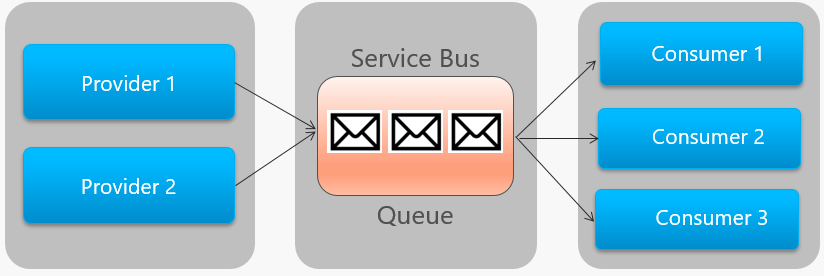

**Figure 4-14**. Service Bus queue

In the previous figure, note the point-to-point relationship. Two instances of the same provider are enqueuing messages into a single Service Bus queue. Each message is consumed by only one of three consumer instances on the right. Next, we discuss how to implement messaging where different consumers may all be interested the same message.

## Events

Message queuing is an effective way to implement communication where a producer can asynchronously send a consumer a message. However, what happens when *many different consumers* are interested in the same message? A dedicated message queue for each consumer wouldn't scale well and would become difficult to manage. 

To address this scenario, we move to the third type of message interaction, the *event*. One microservice announces that an action had occurred. Other microservices, if interested, react to the action, or event. 

Eventing is a two-step process. For a given state change, a microservice publishes an event to a message broker, making it available to any other interested microservice. The interested microservice is notified by subscribing to the event in the message broker. You use the [Publish/Subscribe](https://docs.microsoft.com/azure/architecture/patterns/publisher-subscriber) pattern to implement [event-based communication](https://docs.microsoft.com/dotnet/standard/microservices-architecture/multi-container-microservice-net-applications/integration-event-based-microservice-communications).

Figure 4-15 shows a shopping basket microservice publishing an event with two other microservices subscribing to it.

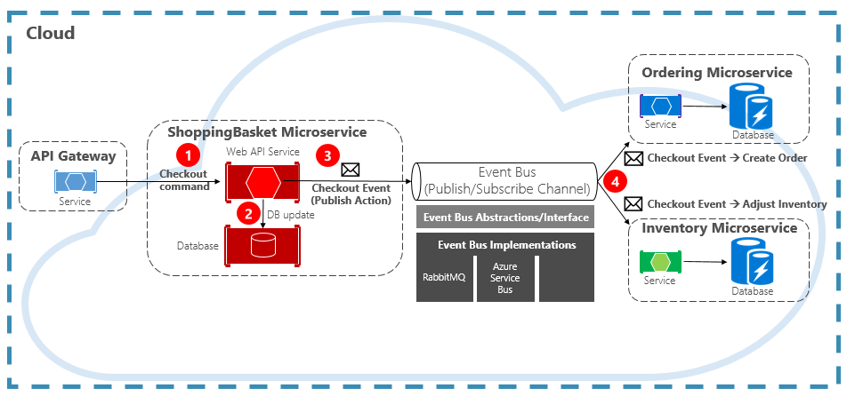

**Figure 4-15**. Event-Driven messaging

Note the *event bus* component that sits in the middle of the communication channel. It's a custom class that encapsulates the message broker and decouples it from the underlying application. The ordering and inventory microservices independently operate the event with no knowledge of each other, nor the shopping basket microservice. When the registered event is published to the event bus, they act upon it.

With eventing, we move from queuing technology to *topics*. A [topic](https://docs.microsoft.com/azure/service-bus-messaging/service-bus-dotnet-how-to-use-topics-subscriptions) is similar to a queue, but supports a one-to-many messaging pattern. One microservice publishes a message. Multiple subscribing microservices can choose to receive and act upon that message. Figure 4-16 shows a topic architecture.

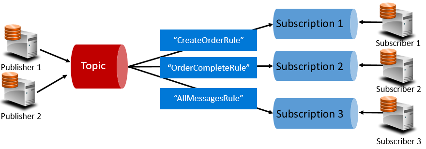

**Figure 4-16**. Topic architecture

In the previous figure, publishers send messages to the topic. At the end, subscribers receive messages from subscriptions. In the middle, the topic forwards messages to subscriptions based on a set of *rules*, shown in dark blue boxes. Rules act as a filter that forward specific messages to a subscription. Here, a "CreateOrder" event would be sent to Subscription \#1 and Subscription \#3, but not to Subscription \#2. An "OrderCompleted" event would be sent to Subscription \#2 and Subscription \#3.

The Azure cloud supports two different topic services: Azure Service Bus Topics and Azure EventGrid.

### Azure Service Bus Topics

Sitting on top of the same robust brokered message model of Azure Service Bus queues are [Azure Service Bus Topics](https://docs.microsoft.com/azure/service-bus-messaging/service-bus-dotnet-how-to-use-topics-subscriptions). A topic can receive messages from multiple independent publishers and send messages to up to 2,000 subscribers. Subscriptions can be dynamically added or removed at runtime without stopping the system or recreating the topic.

Many advanced features from Azure Service Bus queues are also available for topics, including [Duplicate Detection](https://docs.microsoft.com/azure/service-bus-messaging/duplicate-detection) and [Transaction support](https://docs.microsoft.com/azure/service-bus-messaging/service-bus-transactions). By default, Service Bus topics are handled by a single message broker and stored in a single message store. But, [Service Bus Partitioning](https://docs.microsoft.com/azure/service-bus-messaging/service-bus-partitioning) scales a topic by spreading it across many message brokers and message stores.

[Scheduled Message Delivery](https://docs.microsoft.com/azure/service-bus-messaging/message-sequencing) tags a message with a specific time for processing. The message won't appear in the topic before that time. [Message Deferral](https://docs.microsoft.com/azure/service-bus-messaging/message-deferral) enables you to defer a retrieval of a message to a later time. Both are commonly used in workflow processing scenarios where operations are processed in a particular order. You can postpone processing of received messages until prior work has been completed.

Service Bus topics are a robust and proven technology for enabling publish/subscribe communication in your cloud-native systems.

### Azure Event Grid

While Azure Service Bus is a battle-tested messaging broker with a full set of enterprise features, [Azure Event Grid](https://docs.microsoft.com/azure/event-grid/overview) is the new kid on the block.

At first glance, Event Grid may look like just another topic-based messaging system. However, it's different in many ways. Focused on event-driven workloads, it enables real-time event processing, deep Azure integration, and an open-platform - all on serverless infrastructure. It's designed for contemporary cloud-native and serverless applications

As a centralized *eventing backplane*, or pipe, Event Grid reacts to events inside Azure resources and from your own services.

Event notifications are published to an Event Grid Topic, which, in turn, routes each event to a subscription. Subscribers map to subscriptions and consume the events. Like Service Bus, Event Grid supports a *filtered subscriber model* where a subscription sets rule for the events it wishes to receive. Event Grid provides fast throughput with a guarantee of 10 million events per second enabling near real-time delivery - far more than what Azure Service Bus can generate.

A sweet spot for Event Grid is its deep integration into the fabric of Azure infrastructure. An Azure resource, such as Cosmos DB, can publish built-in events directly to other interested Azure resources - without the need for custom code. Event Grid can publish events from an Azure Subscription, Resource Group, or Service, giving developers fine-grained control over the lifecycle of cloud resources. However, Event Grid isn't limited to Azure. It's an open platform that can consume custom HTTP events published from applications or third-party services and route events to external subscribers.

When publishing and subscribing to native events from Azure resources, no coding is required. With simple configuration, you can integrate events from one Azure resource to another leveraging built-in plumbing for Topics and Subscriptions. Figure 4-17 shows the anatomy of Event Grid.

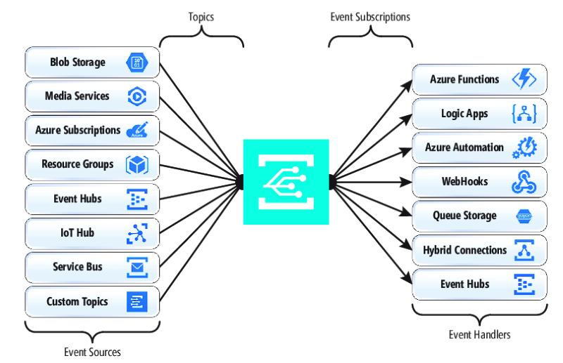

**Figure 4-17**. Event Grid anatomy

A major difference between EventGrid and Service Bus is the underlying *message exchange pattern*.

Service Bus implements an older style *pull model* in which the downstream subscriber actively polls the topic subscription for new messages. On the upside, this approach gives the subscriber full control of the pace at which it processes messages. It controls when and how many messages to process at any given time. Unread messages remain in the subscription until processed. A significant shortcoming is the latency between the time the event is generated and the polling operation that pulls that message to the subscriber for processing. Also, the overhead of constant polling for the next event consumes resources and money.

EventGrid, however, is different. It implements a *push model* in which events are sent to the EventHandlers as received, giving near real-time event delivery. It also reduces cost as the service is triggered only when it's needed to consume an event – not continually as with polling. That said, an event handler must handle the incoming load and provide throttling mechanisms to protect itself from becoming overwhelmed. Many Azure services that consume these events, such as Azure Functions and Logic Apps provide automatic autoscaling capabilities to handle increased loads.  

Event Grid is a fully managed serverless cloud service. It dynamically scales based on your traffic and charges you only for your actual usage, not pre-purchased capacity. The first 100,000 operations per month are free – operations being defined as event ingress (incoming event notifications), subscription delivery attempts, management calls, and filtering by subject. With 99.99% availability, EventGrid guarantees the delivery of an event within a 24-hour period, with built-in retry functionality for unsuccessful delivery. Undelivered messages can be moved to a "dead-letter" queue for resolution.  Unlike Azure Service Bus, Event Grid is tuned for fast performance and doesn't support features like ordered messaging, transactions, and sessions.

### Streaming messages in the Azure cloud

Azure Service Bus and Event Grid provide great support for applications that expose single, discrete events like a new document been inserted into a Cosmos DB). But, what if your cloud-native system needs to process a *stream of related events*? [Event streams](https://msdn.microsoft.com/magazine/dn904671.aspx?f=255&MSPPError=-2147217396) are more complex. They're typically time-ordered, interrelated and must be processed as a group.

[Azure Event Hub](https://azure.microsoft.com/services/event-hubs/) is a data streaming platform and event ingestion service that collects, transforms, and stores events. It's fine-tuned to capture streaming data, such as continuous event notifications emitted from a telemetry context. The service is highly scalable and can store and [process millions of events per second](https://docs.microsoft.com/azure/event-hubs/event-hubs-about). Shown in Figure 4-18, it's often a front door for an event pipeline, decoupling ingest stream from event consumption.

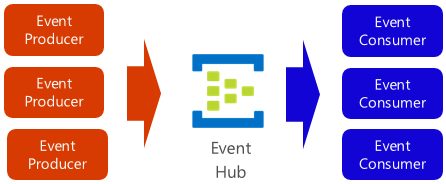

**Figure 4-18**. Azure Event Hub

Event Hub supports low latency and configurable time retention. Unlike queues and topics, Event Hubs keep event data after it's been read by a consumer. This feature enables other data analytic services, both internal and external, to replay the data for further analysis. Events stored in event hub are only deleted upon expiration of the retention period, which is one day by default, but configurable.

Event Hub supports common event publishing protocols including HTTPS and AMQP. It also supports Kafka 1.0. [Existing Kafka applications can communicate with Event Hub](https://docs.microsoft.com/azure/event-hubs/event-hubs-for-kafka-ecosystem-overview) using the Kafka protocol providing an alternative to managing large Kafka clusters. Many open-source cloud-native systems embrace Kafka.

Event Hubs implements message streaming through a [partitioned consumer model](https://docs.microsoft.com/azure/event-hubs/event-hubs-features) in which each consumer only reads a specific subset, or partition, of the message stream. This pattern enables tremendous horizontal scale for event processing and provides other stream-focused features that are unavailable in queues and topics. A partition is an ordered sequence of events that is held in an event hub. As newer events arrive, they're added to the end of this sequence. Figure 4-19 shows partitioning in an Event Hub.

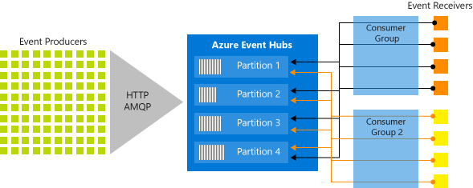

**Figure 4-19**. Event Hub partitioning

Instead of reading from the same resource, each consumer group reads across a subset, or partition, of the message stream. 

For cloud-native applications that must stream large numbers of events, Azure Event Hub can be a robust and affordable solution.

>[!div class="step-by-step"]
>[Previous](front-end-communication.md)
>[Next](rest-grpc.md)
