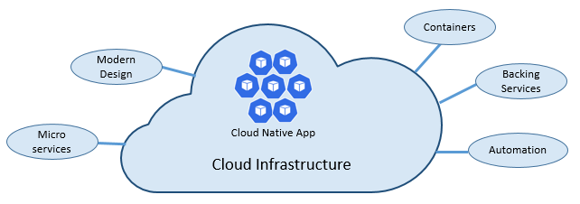

# Summary: Architecting cloud-native apps

In summary, here are important conclusions from this guide:

- **Cloud-native** is about designing modern applications that embrace rapid change, large scale, and resilience, in modern, dynamic environments such as public, private, and hybrid clouds.

- The **[Cloud Native Computing Foundation](https://www.cncf.io/) (CNCF)** is an influential open-source consortium of over 300 major corporations. It's responsible for driving the adoption of cloud-native computing across technology and cloud stacks.

- **CNCF guidelines** recommend that cloud-native applications embrace six important pillars as shown in Figure 11-1:

  

  **Figure 11-1**. Cloud-native foundational pillars

- These cloud-native pillars include:
  - The cloud and its underlying service model
  - Modern design principles
  - Microservices
  - Containerization and container orchestration
  - Cloud-based backing services, such as databases and message brokers
  - Automation, including Infrastructure as Code and code deployment

- **Kubernetes** is the hosting environment of choice for most cloud-native applications. Smaller, simple services are sometimes hosted in serverless platforms, such as Azure Functions. Among many key automation features, both environments provide automatic scaling to handle fluctuating workload volumes.

- **Service communication** becomes a significant design decision when constructing a cloud-native application. Applications typically expose an API gateway to manage front-end client communication. Then backend microservices strive to communicate with each other implementing asynchronous communication patterns, when possible.

- **gRPC** is a modern, high-performance framework that evolves the age-old remote procedure call (RPC) protocol. Cloud-native applications often embrace gRPC to streamline messaging between back-end services. gRPC uses HTTP/2 for its transport protocol. It can be up to 8x faster than JSON serialization with message sizes 60-80% smaller. gRPC is open source and managed by the Cloud Native Computing Foundation (CNCF).

- **Distributed data** is a model often implemented by cloud-native applications. Applications segregate business functionality into small, independent microservices. Each microservice encapsulates its own dependencies, data, and state. The classic shared database model evolves into one of many smaller databases, each aligning with a microservice. When the smoke clears, we emerge with a design that exposes a `database-per-microservice` model.

- **No-SQL databases** refer to high-performance, non-relational data stores. They excel in their ease-of-use, scalability, resilience, and availability characteristics. High volume services that require sub second response time favor NoSQL datastores. The proliferation of NoSQL technologies for distributed cloud-native systems can't be overstated.

- **NewSQL** is an emerging database technology that combines the distributed scalability of NoSQL and the ACID guarantees of a relational database. NewSQL databases target business systems that must process high-volumes of data, across distributed environments, with full transactional/ACID compliance. The Cloud Native Computing Foundation (CNCF) features several NewSQL database projects.

- **Resiliency** is the ability of your system to react to failure and still remain functional. Cloud-native systems embrace distributed architecture where failure is inevitable. Applications must be constructed to respond elegantly to failure and quickly return to a fully functioning state.

- **Service meshes** are a configurable infrastructure layer with built-in capabilities to handle service communication and other cross-cutting challenges. They decouple cross-cutting responsibilities from your business code. These responsibilities move into a service proxy. Referred to as the `Sidecar pattern`, the proxy is deployed into a separate process to provide isolation from your business code.

- **Observability** is a key design consideration for cloud-native applications. As services are distributed across a cluster of nodes, centralized logging, monitoring, and alerts, become mandatory. Azure Monitor is a collection of cloud-based tools designed to provide visibility into the state of your system.

- **Infrastructure as Code** is a widely accepted practice that automates platform provisioning. Your infrastructure and deployments are automated, consistent, and repeatable. Tools like Azure Resource Manager, Terraform, and the Azure CLI, enable you to declaratively script the cloud infrastructure you require.

- **Code automation** is a requirement for cloud-native applications. Modern CI/CD systems help fulfill this principle. They provide separate build and deployment steps that help ensure consistent and quality code. The build stage transforms the code into a binary artifact. The release stage picks up the binary artifact, applies external environment configuration, and deploys it to a specified environment. Azure DevOps and GitHub are full-featured DevOps environments.

>[!div class="step-by-step"]
>[Previous](application-bundles.md)
