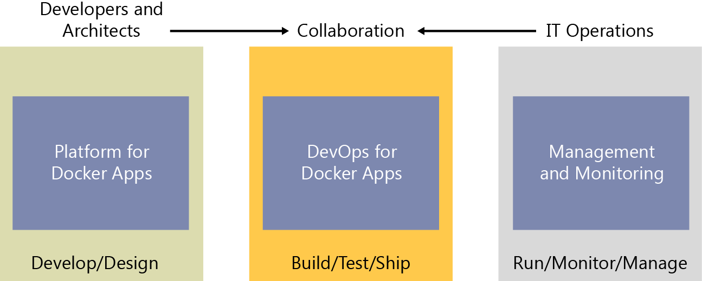
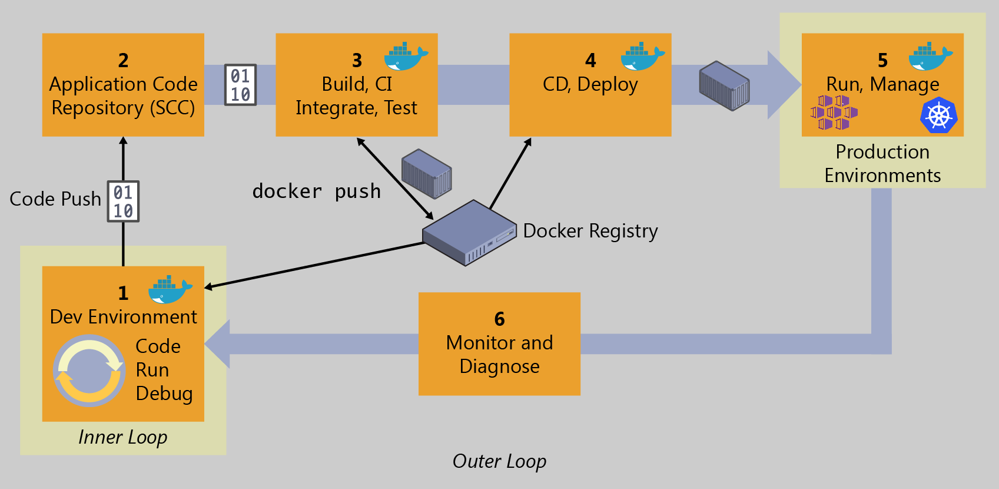

# Containers as the foundation for DevOps collaboration

By the very nature of the containers and Docker technology, developers can share their software and dependencies easily with IT operations and production environments while eliminating the typical "it works on my machine" excuse. Containers solve application conflicts between different environments. Indirectly, containers and Docker bring developers and IT operations closer together, making it easier for them to collaborate effectively. Adopting the container workflow provides many customers with the DevOps continuity they've sought but previously had to implement via more complex configuration for release and build pipelines. Containers simplify the build/test/deploy pipelines in DevOps.

**Figure 2-1.** Main workloads per "personas" in the life cycle for containerized Docker applications

With Docker containers, developers own what's within the container (application and service, and dependencies to frameworks and components) and how the containers and services behave together as an application composed by a collection of services. The interdependencies of the multiple containers are defined in a `docker-compose.yml` file, or what could be called a *deployment manifest*. Meanwhile, IT operations teams (IT professionals and management) can focus on the management of production environments; infrastructure; scalability; monitoring; and, ultimately, ensuring that the applications are delivering properly for the end users, without having to know the contents of the various containers. Hence, the name "container," recalling the analogy to real-world shipping containers. Thus, the owners of a container's content need not concern themselves with how the container will be shipped, and the shipping company transports a container from its point of origin to its destination without knowing or caring about the contents. In a similar manner, developers can create and own the contents within a Docker container without the need to concern themselves with the "transport" mechanisms.

In the pillar on the left side of Figure 2-1, developers write and run code locally in Docker containers by using Docker for Windows or Mac. They define the operating environment for the code by using a Dockerfile that specifies the base operating system to run as well as the build steps for building their code into a Docker image. The developers define how one or more images will interoperate using the aforementioned `docker-compose.yml` file deployment manifest. As they complete their local development, they push their application code plus the Docker configuration files to the code repository of their choice (that is, Git repository).

The DevOps pillar defines the build–Continuous Integration (CI) pipelines using the Dockerfile provided in the code repository. The CI system pulls the base container images from the selected Docker registry and builds the custom Docker images for the application. The images then are validated and pushed to the Docker registry used for the deployments to multiple environments.

In the pillar on the right, operations teams manage deployed applications and infrastructure in production while monitoring the environment and applications so that they can provide feedback and insights to the development team about how the application might be improved. Container apps are typically run in production using container orchestrators.

The two teams are collaborating through a foundational platform (Docker containers) that provides a separation of concerns as a contract, while greatly improving the two teams' collaboration in the application life cycle. The developers own the container contents, its operating environment, and the container interdependencies, whereas the operations teams take the built images along with the manifest and runs them in their orchestration system.

## Challenges in application life cycle when using Docker.

There are many reasons that will increase the number of containerized applications in the upcoming years, and one of these reasons is the creation of applications based on microservices.

During the last 15 years, the use of web services has been the base of thousands of applications, and probably, after a few years, we'll find the same situation with microservice-based applications running on Docker containers.

It is also worth to mention that you can also use Docker containers for monolithic applications and you still get most of the benefits of Docker. Containers are not targeting only microservices.

The use of Docker containerization and microservices causes new challenges in the development process of your organizations and therefore, you need a solid strategy to maintain many containers and microservices running on production systems. Eventually, enterprise applications will have hundreds or thousands of containers/instances running in production.

These challenges create new demands when using DevOps tools, so you'll have to define new processes in your DevOps activities, and find answers for this type of questions:

- Which tools can I use for development, for CI/CD, management and operations?

- How can my company manage errors in containers when running in production?

- How can we change pieces of our software in production with minimum downtime?

- How can we scale and how can we monitor our production system?

- How can we include testing and deployment of containers in our release pipeline?

- How can we use Open Source tools/platforms for containers in Microsoft Azure?

If you can answer all those questions, you'll be better prepared to move your applications (existing or new apps) to Docker containers. 

## Introduction to a generic end-to-end Docker application life cycle workflow

Figure 2-2 presents a more detailed workflow for a Docker application life cycle, focusing in this instance on specific DevOps activities and assets.

**Figure 2-2.** High-level workflow for the Docker containerized application life cycle

This diagram shows the "outer loop" of DevOps. When code is pushed to the repo, a CI pipeline is started, then begins the CD pipeline, where the application gets deployed. Metrics collected from deployed applications are fed back into the development workload, where the "inner loop" occurs, so development teams have actual data to respond to user and business needs.

Everything begins with the developer, who starts writing code in the inner-loop workflow. The inner-loop stage is where developers define everything that happens before pushing code into the code repository (for example, a source control system such as Git). After it's committed, the repository triggers Continuous Integration (CI) and the rest of the workflow.

The inner loop basically consists of typical steps like "code," "run," "test," and "debug," plus the additional steps needed right before running the app locally. This is the developer's process to run and test the app as a Docker container. The inner-loop workflow will be explained in the sections that follow.

Taking a step back to look at the end-to end workflow, the DevOps workflow is more than a technology or a tool set: it's a mindset that requires cultural evolution. It's people, processes, and the appropriate tools to make your application life cycle faster and more predictable. Enterprises that adopt a containerized workflow typically restructure their organizations to represent people and processes that match the containerized workflow.

Practicing DevOps can help teams respond faster together to competitive pressures by replacing error-prone manual processes with automation, which results in improved traceability and repeatable workflows. Organizations also can manage environments more efficiently and realize cost savings with a combination of on-premises and cloud resources as well as tightly integrated tooling.

When implementing your DevOps workflow for Docker applications, you'll see that Docker technologies are present in almost every stage of the workflow, from your development box while working in the inner loop (code, run, debug), the build-test-CI phase, and, finally, the deployment of those containers to the staging and production environments.

Improvement of quality practices helps to identify defects early in the development cycle, which reduces the cost of fixing them. By including the environment and dependencies in the image and adopting a philosophy of deploying the same image across multiple environments, you promote a discipline of extracting the environment-specific configurations making deployments more reliable.

Rich data obtained through effective instrumentation (monitoring and diagnostics) provides insight into performance issues and user behavior to guide future priorities and investments.

DevOps should be considered a journey, not a destination. It should be implemented incrementally through appropriately scoped projects from which you can demonstrate success, learn, and evolve.

## Benefits of DevOps for containerized applications

Here are some of the most important benefits provided by a solid DevOps workflow:

- Deliver better-quality software, faster and with better compliance.

- Drive continuous improvement and adjustments earlier and more economically.

- Increase transparency and collaboration among stakeholders involved in delivering and operating software.

- Control costs and utilize provisioned resources more effectively while minimizing security risks.

- Plug and play well with many of your existing DevOps investments, including investments in open-source.

>[!div class="step-by-step"]
>[Previous](index.md)
>[Next](../Microsoft-platform-tools-containerized-apps/index.md)
