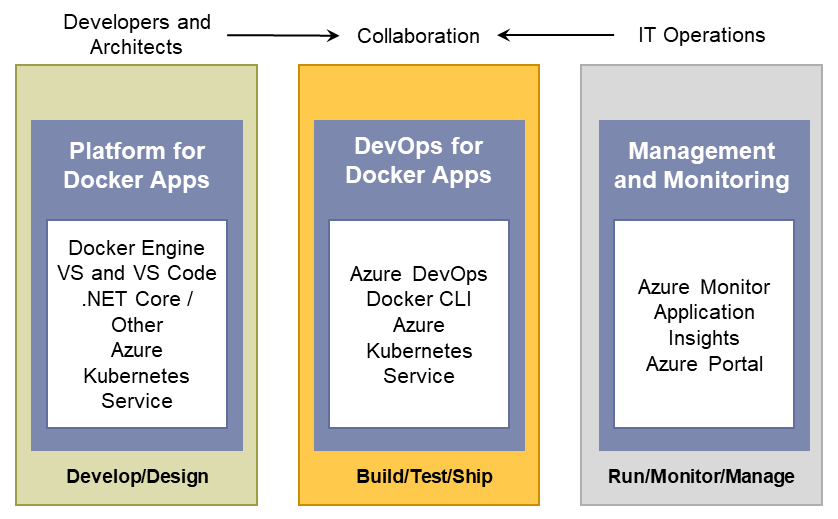

# Introduction to the Microsoft platform and tools for containerized apps

*Vision: Create an adaptable, enterprise-grade, containerized application life cycle that spans your development, IT operations, and production management.*

Figure 3-1 shows the main pillars in the life cycle of Docker apps classified by the type of work delivered by multiple teams (app-development, DevOps infrastructure processes, and IT management and operations). Usually, in the enterprise, the profiles of "the persona" responsible for each area are different. So are their skills.

**Figure 3-1.** Main pillars in the life cycle for containerized Docker applications with Microsoft platform and tools

A containerized Docker life-cycle workflow can be initially prescriptive based on "by-default product choices," making it easier for developers to get started faster, but it's fundamental that under the hood there must be an open framework so that it will be a flexible workflow capable of adjusting to the different contexts from each organization or enterprise. The workflow infrastructure (components and products) must be flexible enough to cover the environment that each company will have in the future, even being capable of swapping development or DevOps products to others. This flexibility, openness, and broad choice of technologies in the platform and infrastructure are precisely the Microsoft priorities for containerized Docker applications, as explained in the chapters that follow.

Table 3-1 demonstrates that the intention of the Microsoft DevOps for containerized Docker applications is to provide an open DevOps workflow so that you can choose what products to use for each phase (Microsoft or third party) while providing a simplified workflow that provides "by-default-products" already connected; thus, you can quickly get started with your enterprise-level DevOps workflow for Docker apps.

**Table 3-1.** DevOps workflows, open to any technology

| Host | Microsoft technologies | Third-party—Azure pluggable |
| ---------------------------| ----------------------------------------------------| --------------------------------------------------------------------------------|
| Platform for Docker apps   | • Microsoft Visual Studio and Visual Studio Code  • .NET  • Microsoft Azure Kubernetes Service (AKS)  • Azure Service Fabric  • Azure Container Registry  | • Any code editor (for example, Sublime)  • Any language (Node.js, Java, Go, etc.)  • Any orchestrator and scheduler  • Any Docker registry  |
| DevOps for Docker apps     | • Azure DevOps Services  • Microsoft Team Foundation Server  • Azure Kubernetes Service (AKS)  • Azure Service Fabric  | • GitHub, Git, Subversion, etc.  • Jenkins, Chef, Puppet, Velocity, CircleCI, TravisCI, etc.  • On-premises Docker Datacenter, Docker Swarm, Mesos DC/OS, Kubernetes, etc.  |
| Management and monitoring  | • Azure Monitor | • Marathon, Chronos, etc. |

The Microsoft platform and tools for containerized Docker apps, as defined in Table 3-1, comprise the following components:

- **Platform for Docker Apps development** The development of a service, or collection of services that make up an "app." The development platform provides all the work developers requires prior to pushing their code to a shared code repository. Developing services, deployed as containers, are similar to the development of the same apps or services without Docker. You continue to use your preferred language (.NET, Node.js, Go, etc.) and preferred editor or IDE like Visual Studio or Visual Studio Code. However, rather than consider Docker a deployment destination, you develop your services in the Docker environment. You build, run, test, and debug your code in containers locally, providing the destination environment at development time. By providing the destination environment locally, Docker containers set up what will drastically help you improve your DevOps life cycle. Visual Studio and Visual Studio Code have extensions to integrate Docker containers within your development process.

- **DevOps for Docker Apps** Developers creating Docker applications can use [Azure DevOps Services](https://azure.microsoft.com/services/devops/) or any other third-party product, like Jenkins, to build out a comprehensive automated application life-cycle management (ALM).

  With Azure DevOps Services, developers can create container-focused DevOps for a fast, iterative process that covers source-code control from anywhere (Azure DevOps Services-Git, GitHub, any remote Git repository, or Subversion), Continuous Integration (CI), internal unit tests, inter-container/service integration tests, Continuous Delivery (CD), and release management (RM). Developers also can automate their Docker application releases into Azure Kubernetes Service (AKS), from development to staging and production environments.

- **Management and Monitoring** IT can manage and monitor production applications and services in several ways, integrating both perspectives in a consolidated experience.

  - **Azure portal** If you're using open-source orchestrators, Azure Kubernetes Service (AKS), Service Fabric and other orchestrators help you to set up and maintain your Docker environments. If you're using Azure Service Fabric, the Service Fabric Explorer tool makes it possible for you to visualize and configure your cluster.

  - **Docker tools** You can manage your container applications using familiar tools. There's no need to change your existing Docker management practices to move container workloads to the cloud. Use the application management tools you're already familiar with and connect via the standard API endpoints for the orchestrator of your choice. You also can use other third-party tools to manage your Docker applications, such as Docker Datacenter or even CLI Docker tools. 

    Even if you're familiar with Linux commands, you can manage your container applications using Microsoft Windows and PowerShell with a Linux Subsystem command line and the products (Docker, Kubernetes…) clients running on this Linux Subsystem capability. You'll learn more about using these tools under Linux Subsystem using your favorite Microsoft Windows OS later in this book.

  - **Open-source tools** Because AKS exposes the standard API endpoints for the orchestration engine, the most popular tools are compatible with AKS and, in most cases, will work out of the box—including visualizers, monitoring, command-line tools, and even future tools as they become available.

  - **Azure Monitor** Is Azure's solution to monitor every angle of your production environment. You can monitor production Docker applications by just setting up its SDK into your services so that you can get system-generated log data from the applications.

Thus, Microsoft offers a complete foundation for an end-to-end containerized Docker application life cycle. However, it's *a collection of products and technologies that allow you to optionally select and integrate with existing tools and processes*. The flexibility in a broad approach along with the strength in the depth of capabilities place Microsoft in a strong position for containerized Docker application development.

>[!div class="step-by-step"]
>[Previous](../Docker-application-lifecycle/containers-foundation-for-devops-collaboration.md)
>[Next](../design-develop-containerized-apps/index.md)
