# Build ASP.NET Core applications deployed as Linux containers into an AKS/Kubernetes orchestrator

Azure Kubernetes Services (AKS) is Azure's managed Kubernetes orchestrations services that simplify container deployment and management.

AKS main features are:

- An Azure-hosted control plane
- Automated upgrades
- Self-healing
- User-configurable scaling
- Simpler user experience for both developers and cluster operators.

The following examples explore the creation of an ASP.NET Core 6.0 application that runs on Linux and deploys to an AKS Cluster in Azure, while development is done using Visual Studio 2022 version 17.0.

## Creating the ASP.NET Core Project using Visual Studio 2022

ASP.NET Core is a general-purpose development platform maintained by Microsoft and the .NET community on GitHub. It's cross-platform, supporting Windows, macOS and Linux, and can be used in device, cloud, and embedded/IoT scenarios.

This example uses a couple of simple projects based on Visual Studio templates, so you don't need much additional knowledge to create the sample. You only have to create the project using a standard template that includes all the elements to run a small project with a REST API and a Web App with Razor pages, using ASP.NET Core 6.0 technology.

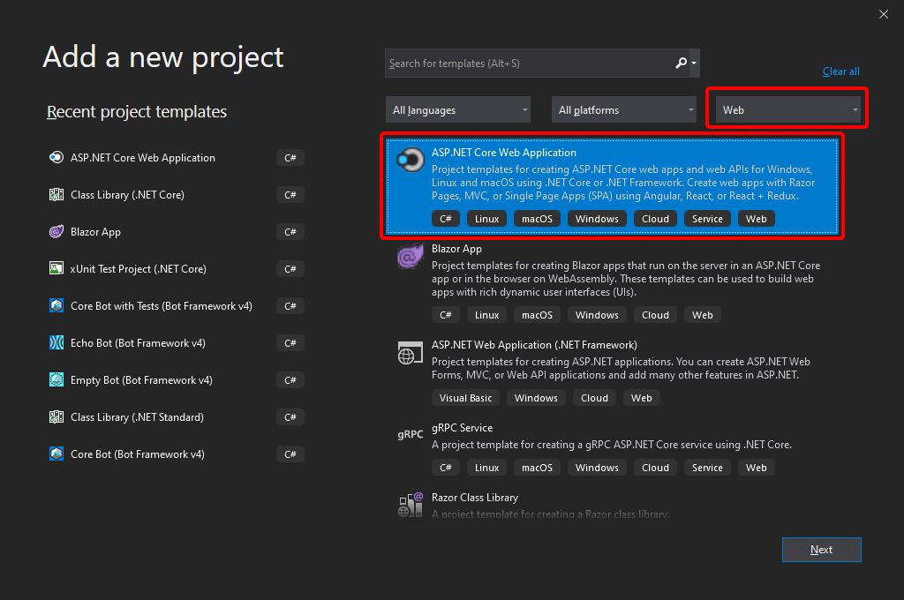

**Figure 4-35**. Creating an ASP.NET Core Web Application in Visual Studio 2022.

To create the sample project in Visual Studio, select **File** > **New** > **Project**, select the **Web** project type and then the **ASP.NET Core Web Application** template. You can also search for the template if you need it.

Then enter the application name and location as shown in the next image.

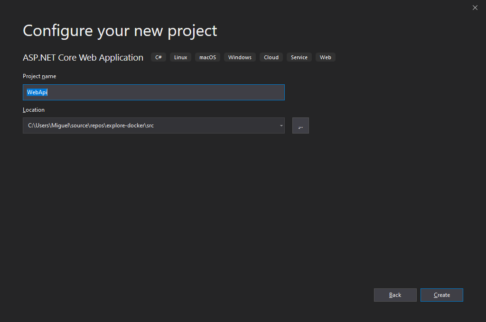

**Figure 4-36**. Enter the project name and location in Visual Studio 2022.

Verify that you've selected ASP.NET Core 6.0 as the framework. .NET 6 is included in the latest release of Visual Studio 2022 and is automatically installed and configured for you when you install Visual Studio.

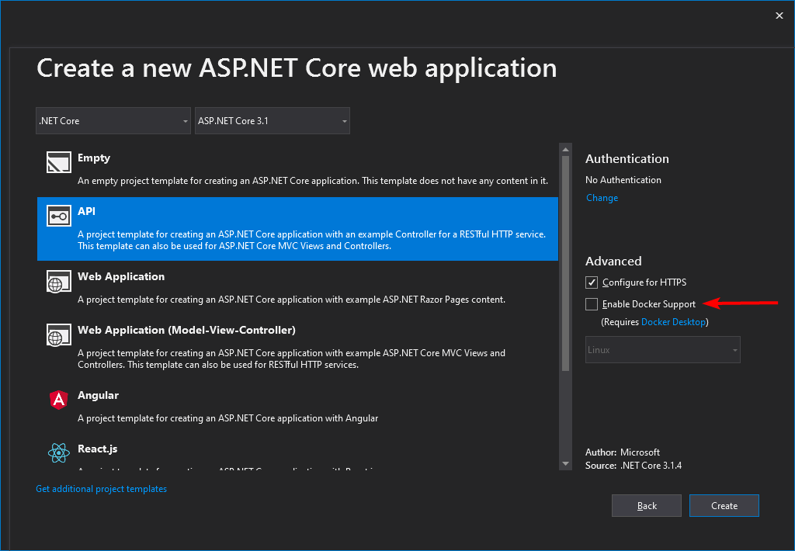

**Figure 4-37**. Selecting ASP.NET CORE 6.0 and Web API project type

Notice Docker support is not enabled now. You'll do that in the next step after the project creation. You'll also notice that by default controller option is checked. You can uncheck that if you want to [Create a minimal web API with ASP.NET Core](/aspnet/core/tutorials/min-web-api?tabs=visual-studio).

To show you can "Dockerize" your project at any time, you'll add Docker support now. So right-click on the project node in Solution Explorer and select **Add** > **Docker support** on the context menu.

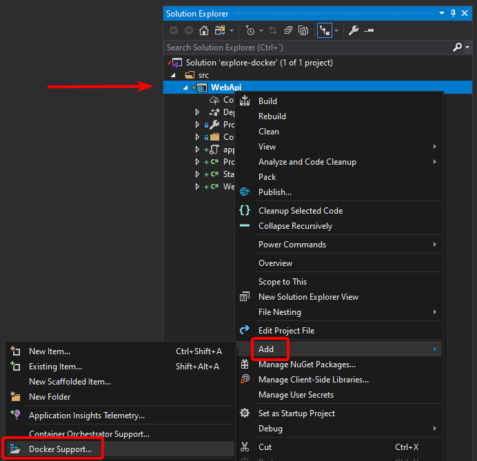

**Figure 4-38**. Adding Docker support to an existing project

To complete adding Docker support, you can choose Windows or Linux. In this case, select **Linux**.

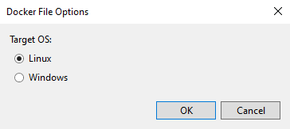

**Figure 4-39**. Selecting Linux containers.

With these simple steps, you have your ASP.NET Core 6.0 application running on a Linux container.

In a similar way, you can also add a very simple **WebApp** project (Figure 4-40) to consume the web API endpoint, although the details are not discussed here.

After that, you add orchestrator support for your **WebApi** project as shown next, in image 4-40.

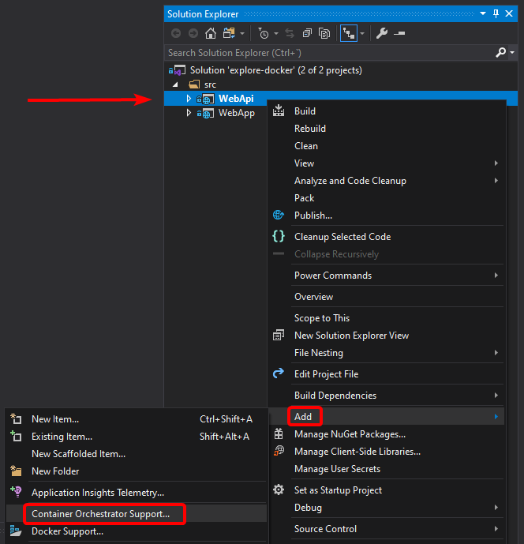

**Figure 4-40**. Adding orchestrator support to *WebApi* project.

When you choose the `Docker Compose` option, which is fine for local development, Visual Studio adds the docker-compose project, with the docker-compose files as shown in image 4-41.

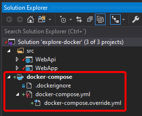

**Figure 4-41**. Adding orchestrator support to *WebApi* project.

The initial files added are similar to these ones:

`docker-compose.yml`

```yml
version: "3.4"

services:
  webapi:
    image: ${DOCKER_REGISTRY-}webapi
    build:
      context: .
      dockerfile: WebApi/Dockerfile

  webapp:
    image: ${DOCKER_REGISTRY-}webapp
    build:
      context: .
      dockerfile: WebApp/Dockerfile
```

`docker-compose.override.yml`

```yml
version: "3.4"

services:
  webapi:
    environment:
      - ASPNETCORE_ENVIRONMENT=Development
      - ASPNETCORE_URLS=https://+:443;http://+:80
    ports:
      - "80"
      - "443"
    volumes:
      - ${APPDATA}/Microsoft/UserSecrets:/root/.microsoft/usersecrets:ro
      - ${APPDATA}/ASP.NET/Https:/root/.aspnet/https:ro
  webapp:
    environment:
      - ASPNETCORE_ENVIRONMENT=Development
      - ASPNETCORE_URLS=https://+:443;http://+:80
    ports:
      - "80"
      - "443"
    volumes:
      - ${APPDATA}/Microsoft/UserSecrets:/root/.microsoft/usersecrets:ro
      - ${APPDATA}/ASP.NET/Https:/root/.aspnet/https:ro
```

To have you app running with Docker Compose you just have to make a few tweaks to `docker-compose.override.yml`

```yml
services:
  webapi:
    #...
    ports:
      - "51080:80"
      - "51443:443"
    #...
  webapp:
    environment:
      #...
      - WebApiBaseAddress=http://webapi
    ports:
      - "50080:80"
      - "50443:443"
    #...
```

Now you can run your application with the **F5** key, or by using the **Play** button, or the **Ctrl+F5** key, selecting the docker-compose project, as shown in image 4-42.

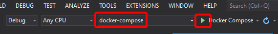

**Figure 4-42**. Adding orchestrator support to *WebApi* project.

When running the docker-compose application as explained, you get:

1. The images built and containers created as per the docker-compose file.
2. The browser open in the address configured in the "Properties" dialog for the `docker-compose` project.
3. The **Container** window open (in Visual Studio 2022 version 17.0 and later).
4. Debugger support for all projects in the solution, as shown in the following images.

Browser opened:


**Figure 4-43**. Browser window with an application running on multiple containers.

Containers window:


**Figure 4-44**. Visual Studio "Containers" window

The **Containers** window lets you view running containers, browse available images, view environment variables, logs, and port mappings, inspect the filesystem, attach a debugger, or open a terminal window inside the container environment.

As you can see, the integration between Visual Studio 2022 and Docker is completely oriented to the developer's productivity.

Of course, you can also list the images using the `docker images` command. You should see the `webapi` and `webapp` images with the `dev` tags created by the automatic deployment of our project with Visual Studio 2022.

```console
docker images
```

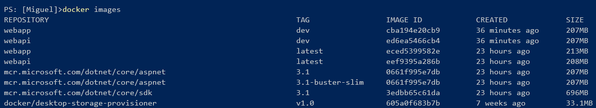

**Figure 4-45**. View of Docker images

## Register the Solution in an Azure Container Registry (ACR)

You can upload the images to the [Azure Container Registry (ACR)](https://azure.microsoft.com/services/container-registry/), but you could also use Docker Hub or any other registry, so the images can be deployed to the AKS cluster from that registry.

### Create an ACR instance

Run the following command from the **az cli**:

```powershell
az acr create --name exploredocker --resource-group explore-docker-aks-rg --sku basic --admin-enabled
```

> [!NOTE]
> The container registry name (e.g `exploredocker`) must be unique within Azure, and contain 5-50 alphanumeric characters. For more details, refer [Create a container registry](/azure/container-registry/container-registry-get-started-azure-cli#create-a-container-registry)

### Create the image in Release mode

You'll now create the image in **Release** mode (ready for production) by changing to **Release**, as shown in Figure 4-46, and running the application as you did before.

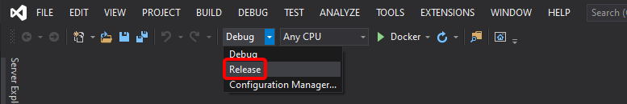

**Figure 4-46**. Selecting Release Mode

If you execute the `docker images` command, you'll see both images created, one for `debug` (**dev**) and the other for `release` (**latest**) mode.

### Create a new Tag for the Image

Each container image needs to be tagged with the `loginServer` name of the registry. This tag is used for routing when pushing container images to an image registry.

You can view the `loginServer` name from the Azure portal, taking the information from the Azure Container Registry

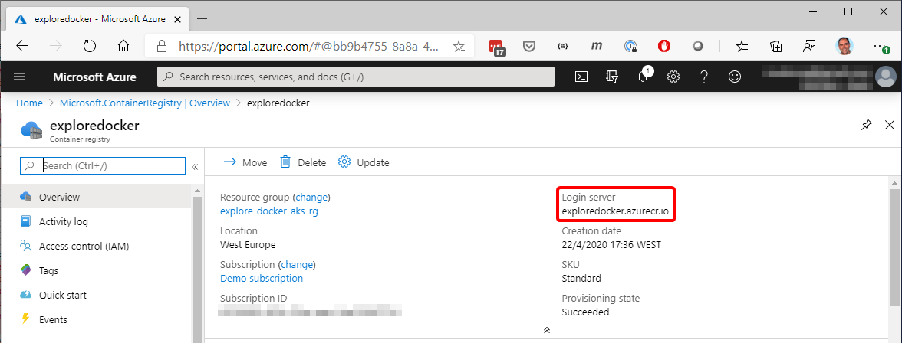

**Figure 4-47**. View of the name of the Registry

Or by running the following command:

```console
az acr list --resource-group <resource-group-name> --query "[].{acrLoginServer:loginServer}" --output table
```

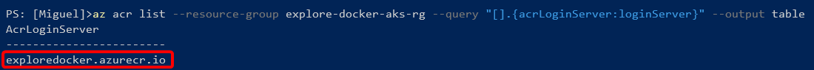

**Figure 4-48**. Get the name of the registry using **az cli**

In both cases, you'll obtain the name. In our example, `exploredocker.azurecr.io`.

Now you can tag the image, taking the latest image (the Release image), with the command:

```console
docker tag <image-name>:latest <login-server-name>/<image-name>:v1
```

After running the `docker tag` command, list the images with the `docker images` command, and you should see the image with the new tag.

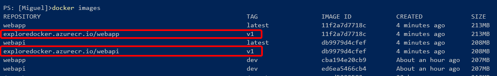

**Figure 4-49**. View of tagged images

### Push the image into the Azure ACR

Log in to the Azure Container Registry

```console
az acr login --name exploredocker
```

Push the image into the Azure ACR, using the following command:

```console
docker push <login-server-name>/<image-name>:v1
```

This command takes a while uploading the images but gives you feedback in the process. In the following image, you can see the output from one image completed and another in progress.

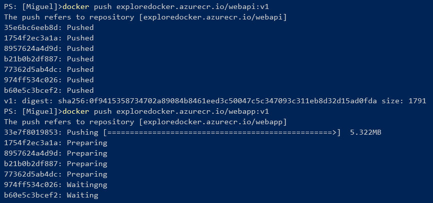

**Figure 4-50**. Console output from the push command.

To deploy your multi-container app into your AKS cluster you need some manifest `.yaml` files that have, most of the properties taken from the `docker-compose.yml` and `docker-compose.override.yml` files.

#### `deploy-webapi.yml`

```yml
apiVersion: apps/v1
kind: Deployment
metadata:
  name: webapi
  labels:
    app: weather-forecast
spec:
  replicas: 1
  selector:
    matchLabels:
      service: webapi
  template:
    metadata:
      labels:
        app: weather-forecast
        service: webapi
    spec:
      containers:
        - name: webapi
          image: exploredocker.azurecr.io/webapi:v1
          imagePullPolicy: IfNotPresent
          ports:
            - containerPort: 80
              protocol: TCP
          env:
            - name: ASPNETCORE_URLS
              value: http://+:80
---
apiVersion: v1
kind: Service
metadata:
  name: webapi
  labels:
    app: weather-forecast
    service: webapi
spec:
  ports:
    - port: 80
      targetPort: 80
      protocol: TCP
  selector:
    service: webapi
```

#### `deploy-webapp.yml`

```yml
apiVersion: apps/v1
kind: Deployment
metadata:
  name: webapp
  labels:
    app: weather-forecast
spec:
  replicas: 1
  selector:
    matchLabels:
      service: webapp
  template:
    metadata:
      labels:
        app: weather-forecast
        service: webapp
    spec:
      containers:
        - name: webapp
          image: exploredocker.azurecr.io/webapp:v1
          imagePullPolicy: IfNotPresent
          ports:
            - containerPort: 80
              protocol: TCP
          env:
            - name: ASPNETCORE_URLS
              value: http://+:80
            - name: WebApiBaseAddress
              value: http://webapi
---
apiVersion: v1
kind: Service
metadata:
  name: webapp
  labels:
    app: weather-forecast
    service: webapp
spec:
  type: LoadBalancer
  ports:
    - port: 80
      targetPort: 80
      protocol: TCP
  selector:
    service: webapp
```

> [!NOTE]
> The previous `.yml` files only enable the `HTTP` ports, using the `ASPNETCORE_URLS` parameter, to avoid issues with the missing certificate in the sample app.

> [!TIP]
> You can see how to create the AKS Cluster for this sample in section [**Deploy to Azure Kubernetes Service (AKS)**](deploy-azure-kubernetes-service.md) on this guide.

Now you're almost ready to deploy using **kubectl**, but first you must get the credentials from the AKS Cluster with this command:

```console
az aks get-credentials --resource-group explore-docker-aks-rg --name explore-docker-aks
```

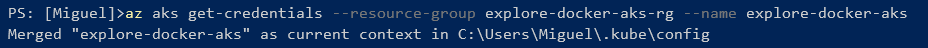

**Figure 4-51**. Getting credentials from AKS into the kubectl environment.

You also have to allow the AKS cluster to pull images from the ACR, using this command:

```console
az aks update --name explore-docker-aks --resource-group explore-docker-aks-rg --attach-acr exploredocker
```

The previous command might take a couple of minutes to complete. Then, use the `kubectl apply` command to launch the deployments, and then `kubectl get all` get list the cluster objects.

```console
kubectl apply -f deploy-webapi.yml
kubectl apply -f deploy-webapp.yml

kubectl get all
```

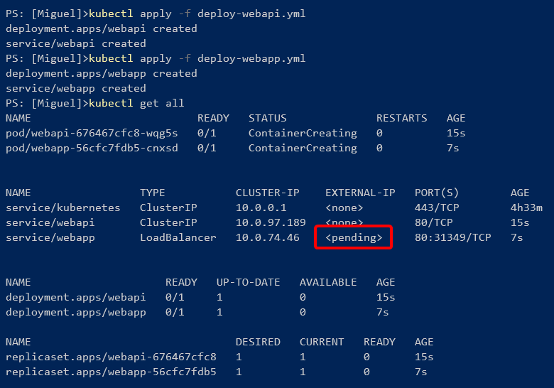

**Figure 4-52**. Deployment to Kubernetes

You'll have to wait a while until the load balancer gets the external IP, checking with `kubectl get services`, and then the application should be available at that address, as shown in the next image:

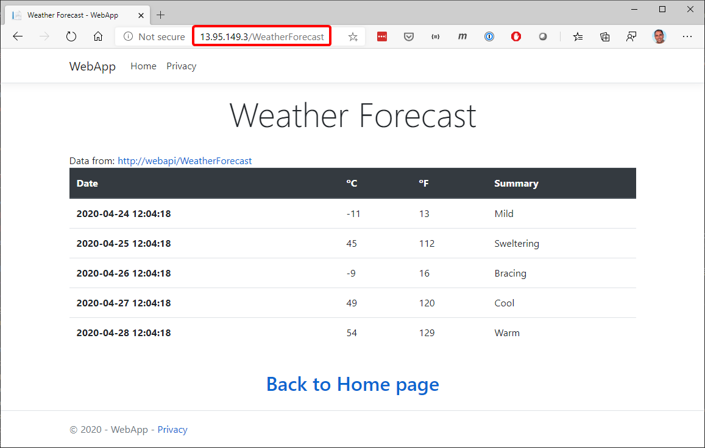

**Figure 4-53**. Deployment to Kubernetes

When the deployment completes, you can access the [Kubernetes Web UI](https://kubernetes.io/docs/tasks/access-application-cluster/web-ui-dashboard/) with a local proxy, using an ssh tunnel.

First you must create a ClusterRoleBinding with the following command:

```console
kubectl create clusterrolebinding kubernetes-dashboard --clusterrole=cluster-admin --serviceaccount=kube-system:kubernetes-dashboard
```

And then this command to start the proxy:

```console
az aks browse --resource-group exploredocker-aks-rg --name explore-docker-aks
```

A browser window should open at `http://127.0.0.1:8001` with a view similar to this one:

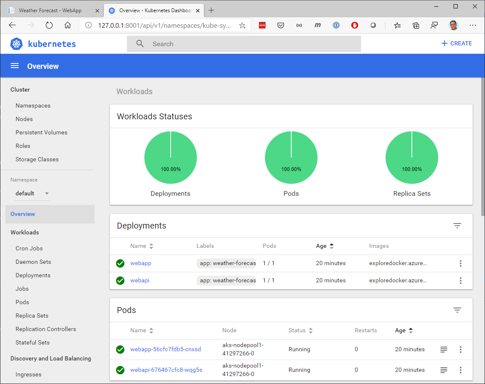

**Figure 4-54**. View Kubernetes cluster information

Now you have your ASP.NET Core application, running in Linux containers, and deployed to an AKS cluster on Azure.

> [!NOTE]
> For more information on deployment with Kubernetes see: <https://kubernetes.io/docs/reference/kubectl/cheatsheet/>

> [!div class="step-by-step"]
> [Previous](set-up-windows-containers-with-powershell.md)
> [Next](../docker-devops-workflow/index.md)
