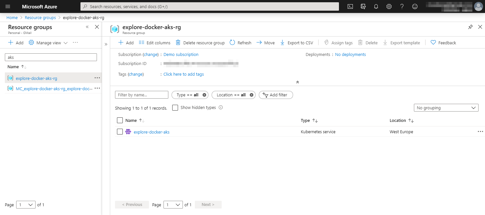
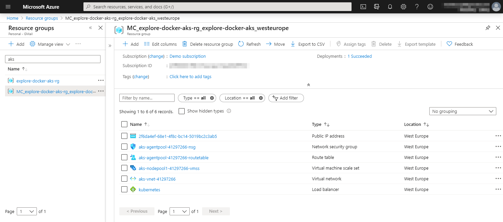
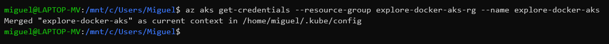
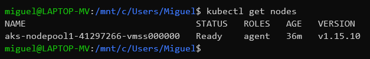

# Deploy to Azure Kubernetes Service (AKS)

You can interact with AKS using your preferred client operating system (Windows, macOS, or Linux) with Azure command-line interface (Azure CLI) installed. For more details, refer [Azure CLI documentation](/cli/azure/?view=azure-cli-latest&preserve-view=false) and [Installation guide](/cli/azure/install-azure-cli?view=azure-cli-latest&preserve-view=false) for the available environments.

## Create the AKS environment in Azure

There are several ways to create the AKS Environment. It can be done by using Azure CLI commands or by using the Azure portal.

Here you can explore some examples using the Azure CLI to create the cluster and the Azure portal to review the results. You also need to have Kubectl and Docker in your development machine.

## Create the AKS cluster

Create the AKS cluster using this command (the resource group must exist):

```console
az aks create --resource-group explore-docker-aks-rg --name explore-docker-aks --node-vm-size Standard_B2s --node-count 1 --generate-ssh-keys --location westeurope
```

> [!NOTE]
> The `--node-vm-size` and `--node-count` parameter values are good enough for a sample/dev application.

After the creation job finishes, you can see:

- The AKS cluster created in the initial resource group
- A new, related resource group, containing the resources related to the AKS cluster, as show in the following images.

The initial resource group, with the AKS cluster:



**Figure 4-17**. AKS Resource Group view from Azure.

The AKS cluster resource group:



**Figure 4-18**. AKS view from Azure.

> [!IMPORTANT]
> In general, you shouldn't need to modify the resources in the AKS cluster resource group. For example, the resource group is deleted when you delete the AKS cluster.

You can also view the node created using `Azure CLI` and `Kubectl`.

First, getting the credentials:

```console
az aks get-credentials --resource-group explore-docker-aks-rg --name explore-docker-aks
```



**Figure 4-19**. `aks get-credentials` command result.

And then, getting nodes from Kubectl:

```console
kubectl get nodes
```



**Figure 4-20**. `kubectl get nodes` command result.

> [!div class="step-by-step"]
> [Previous](orchestrate-high-scalability-availability.md)
> [Next](docker-apps-development-environment.md)
