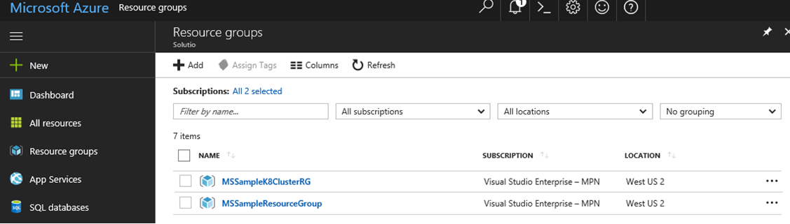
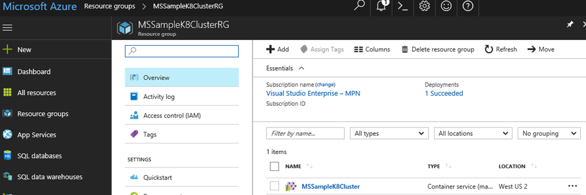

# Deploy to Azure Kubernetes Service (AKS)

You can interact with AKS using your preferred client operating system, here we show how to do it with Microsoft Windows and an embedded version of Ubuntu Linux in Windows, using Bash commands.

Prerequisites to have before using AKS are:

- Linux or Mac development machine
- Windows development machine
  - Developer Mode enabled on Windows
  - Windows Subsystem for Linux
- Azure-CLI installed on [Windows, Mac or Linux](https://docs.microsoft.com/cli/azure/install-azure-cli)

> [!NOTE]
> To find complete information about:
>
> Azure-CLI: <https://docs.microsoft.com/cli/azure/index>
>
> Windows Subsystem for Linux: <https://docs.microsoft.com/windows/wsl/about>

## Create the AKS environment in Azure

There are several ways to create the AKS Environment. It can be done by using Azure-CLI commands or by using the Azure portal.

Here you can explore some examples using the Azure-CLI to create the cluster and the Azure portal to review the results. You also need to have Kubectl and Docker in your development machine.  

## Create the AKS cluster

Create the AKS cluster using this command:

```console
az aks create --resource-group MSSampleResourceGroup --name MSSampleClusterK801 --agent-count 1 --generate-ssh-keys --location westus2
```

After the creation job finishes, you can see the AKS created in the Azure portal:

The resource group:



**Figure 4-17**. AKS Resource Group view from Azure.

The AKS cluster:



**Figure 4-18**. AKS view from Azure.

You can also view the node created using `Azure-CLI` and `Kubectl`.

First, getting the credentials:

```console
az aks get-credentials --resource-group MSSampleK8ClusterRG --name MSSampleK8Cluster
```


**Figure 4-19**. `aks get-credentials` command result.

And then, getting nodes from Kubectl:

```console
kubectl get nodes
```


**Figure 4-20**. `kubectl get nodes` command result.

>[!div class="step-by-step"]
>[Previous](orchestrate-high-scalability-availability.md)
>[Next](docker-apps-development-environment.md)
