# Orchestrating microservices and multi-container applications for high scalability and availability

Using orchestrators for production-ready applications is essential if your application is based on microservices or split across multiple containers. As introduced previously, in a microservice-based approach, each microservice owns its model and data so that it will be autonomous from a development and deployment point of view. But even if you have a more traditional application that's composed of multiple services (like SOA), you'll also have multiple containers or services comprising a single business application that need to be deployed as a distributed system. These kinds of systems are complex to scale out and manage; therefore, you absolutely need an orchestrator if you want to have a production-ready and scalable multi-container application.

Figure 4-6 illustrates deployment into a cluster of an application composed of multiple microservices (containers).

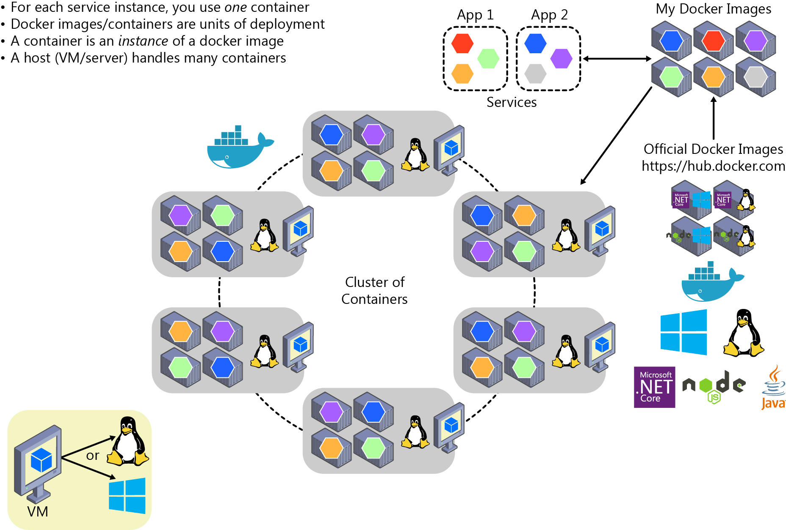

**Figure 4-6**. A cluster of containers

It looks like a logical approach. But how are you handling load balancing, routing, and orchestrating these composed applications?

The Docker CLI meets the needs of managing one container on one host, but it falls short when it comes to managing multiple containers deployed on multiple hosts for more complex distributed applications. In most cases, you need a management platform that will automatically start containers, scale out containers with multiple instances per image, suspend them, or shut them down when needed, and ideally also control how they access resources like the network and data storage.

To go beyond the management of individual containers or simple composed apps and move toward larger enterprise applications with microservices, you must turn to orchestration and clustering platforms.

From an architecture and development point of view, if you're building large, enterprise, microservices-based, applications, it's important to understand the following platforms and products that support advanced scenarios:

- **Clusters and orchestrators.** When you need to scale out applications across many Docker hosts, such as with a large microservices-based application, it's critical to be able to manage all of those hosts as a single cluster by abstracting the complexity of the underlying platform. That's what the container clusters and orchestrators provide. Examples of orchestrators are Azure Service Fabric and Kubernetes. Kubernetes is available in Azure through Azure Kubernetes Service.

- **Schedulers.** *Scheduling* means to have the capability for an administrator to launch containers in a cluster, so schedulers also provide a user interface for doing so. A cluster scheduler has several responsibilities: to use the cluster's resources efficiently, to set the constraints provided by the user, to efficiently load-balance containers across nodes or hosts, and to be robust against errors while providing high availability.

The concepts of a cluster and a scheduler are closely related, so the products provided by different vendors often provide both sets of capabilities. The section below shows the most important platform and software choices you have for clusters and schedulers. These orchestrators are widely offered in public clouds like Azure.

## Software platforms for container clustering, orchestration, and scheduling

| Platform | Comments |
|:---:|:---|
| **Kubernetes**    | [*Kubernetes*](https://kubernetes.io/) is an open-source product that provides functionality that ranges from cluster infrastructure and container scheduling to orchestrating capabilities. It lets you automate deployment, scaling, and operations of application containers across clusters of hosts.     *Kubernetes* provides a container-centric infrastructure that groups application containers into logical units for easy management and discovery.     *Kubernetes* is mature in Linux, less mature in Windows. |
| **Azure Kubernetes Service (AKS)**   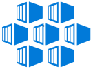 | [Azure Kubernetes Service (AKS)](https://azure.microsoft.com/services/kubernetes-service/) is a managed Kubernetes container orchestration service in Azure that simplifies Kubernetes cluster's management, deployment, and operations. |
| **Azure Service Fabric**    | [Service Fabric](/azure/service-fabric/service-fabric-overview) is a Microsoft microservices platform for building applications. It's an [orchestrator](/azure/service-fabric/service-fabric-cluster-resource-manager-introduction) of services and creates clusters of machines. Service Fabric can deploy services as containers or as plain processes. It can even mix services in processes with services in containers within the same application and cluster.     *Service Fabric* clusters can be deployed in Azure, on-premises or in any cloud. However, deployment in Azure is simplified with a managed approach.     *Service Fabric* provides additional and optional prescriptive [Service Fabric programming models](/azure/service-fabric/service-fabric-choose-framework) like [stateful services](/azure/service-fabric/service-fabric-reliable-services-introduction) and [Reliable Actors](/azure/service-fabric/service-fabric-reliable-actors-introduction).     *Service Fabric* is mature in Windows (years evolving in Windows), less mature in Linux.     Both Linux and Windows containers are supported in Service Fabric since 2017. |
| **Azure Service Fabric Mesh**    | [*Azure Service Fabric Mesh*](/azure/service-fabric-mesh/service-fabric-mesh-overview) offers the same reliability, mission-critical performance and scale as Service Fabric, but also offers a fully managed and serverless platform. You don't need to manage a cluster, VMs, storage or networking configuration. You just focus on your application's development.     *Service Fabric Mesh* supports both Windows and Linux containers, allowing you to develop with any programming language and framework of your choice.
| **Azure Container Apps**    | [Azure Container Apps](https://azure.microsoft.com/services/container-apps/) is a managed serverless container service for building and deploying modern apps at scale. |

## Using container-based orchestrators in Azure

Several cloud vendors offer Docker containers support plus Docker clusters and orchestration support, including Azure, Amazon EC2 Container Service, and Google Container Engine. Azure provides Docker cluster and orchestrator support through Azure Kubernetes Service (AKS), Azure Service Fabric, and Azure Service Fabric Mesh.

## Using Azure Kubernetes Service

A Kubernetes cluster pools several Docker hosts and exposes them as a single virtual Docker host, so you can deploy multiple containers into the cluster and scale-out with any number of container instances. The cluster will handle all the complex management plumbing, like scalability, health, and so forth.

AKS provides a way to simplify the creation, configuration, and management of a cluster of virtual machines in Azure that are preconfigured to run containerized applications. Using an optimized configuration of popular open-source scheduling and orchestration tools, AKS enables you to use your existing skills or draw on a large and growing body of community expertise to deploy and manage container-based applications on Microsoft Azure.

Azure Kubernetes Service optimizes the configuration of popular Docker clustering open-source tools and technologies specifically for Azure. You get an open solution that offers portability for both your containers and your application configuration. You select the size, the number of hosts, and the orchestrator tools, and AKS handles everything else.

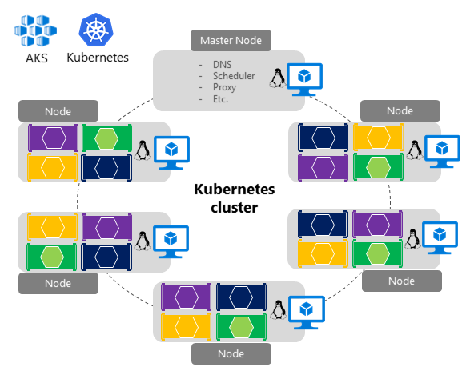

**Figure 4-7**. Kubernetes cluster's simplified structure and topology

Figure 4-7 shows the structure of a Kubernetes cluster where a master node (VM) controls most of the coordination of the cluster, and you can deploy containers to the rest of the nodes that are managed as a single pool from an application point of view. This allows you to scale to thousands or even tens of thousands of containers.

## Development environment for Kubernetes

In the development environment that [Docker announced in July 2018](https://blog.docker.com/2018/07/kubernetes-is-now-available-in-docker-desktop-stable-channel/), Kubernetes can also run in a single development machine (Windows 10 or macOS) by just installing [Docker Desktop](https://www.docker.com/products/docker-desktop). You can later deploy to the cloud (AKS) for further integration tests, as shown in figure 4-8.

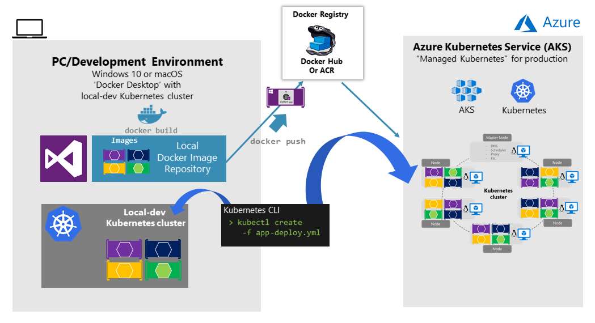

**Figure 4-8**. Running Kubernetes in dev machine and the cloud

## Get started with Azure Kubernetes Service (AKS)

To begin using AKS, you deploy an AKS cluster from the Azure portal or by using the CLI. For more information on deploying a Kubernetes cluster to Azure, see [Deploy an Azure Kubernetes Service (AKS) cluster](/azure/aks/kubernetes-walkthrough-portal).

There are no fees for any of the software installed by default as part of AKS. All default options are implemented with open-source software. AKS is available for multiple virtual machines in Azure. You're charged only for the compute instances you choose, as well as the other underlying infrastructure resources consumed, such as storage and networking. There are no incremental charges for AKS itself.

For further implementation information on deployment to Kubernetes based on `kubectl` and original `.yaml` files, see [Deploy to Azure Kubernetes Service (AKS)](https://github.com/dotnet-architecture/eShopOnContainers/wiki/Deploy-to-Azure-Kubernetes-Service-(AKS)).

## Deploy with Helm charts into Kubernetes clusters

When deploying an application to a Kubernetes cluster, you can use the original `kubectl.exe` CLI tool using deployment files based on the native format (`.yaml` files), as already mentioned in the previous section. However, for more complex Kubernetes applications such as when deploying complex microservice-based applications, it's recommended to use [Helm](https://helm.sh/).

Helm Charts helps you define, version, install, share, upgrade, or rollback even the most complex Kubernetes application. Helm is maintained by the [Cloud Native Computing Foundation (CNCF)](https://www.cncf.io/) in collaboration with Microsoft, Google, Bitnami, and the Helm contributor community.

For further implementation information on Helm charts and Kubernetes, see the section called [Install eShopOnContainers using Helm](https://github.com/dotnet-architecture/eShopOnContainers/wiki/Deploy-to-Azure-Kubernetes-Service-(AKS)#install-eshoponcontainers-using-helm).

## Additional resources

- **Getting started with Azure Kubernetes Service (AKS)** \
  [https://docs.microsoft.com/azure/aks/kubernetes-walkthrough-portal](/azure/aks/kubernetes-walkthrough-portal)

- **Kubernetes.** The official site. \
  <https://kubernetes.io/>

## Using Azure Service Fabric

Azure Service Fabric arose from Microsoft's transition from delivering "box" products, which were typically monolithic in style, to delivering services. The experience of building and operating large services at scale, such as Azure SQL Database, Azure Cosmos DB, Azure Service Bus, or Cortana's Backend, shaped Service Fabric. The platform evolved over time as more and more services adopted it. Importantly, Service Fabric had to run not only in Azure but also in standalone Windows Server deployments.

The aim of Service Fabric is to solve the hard problems of building and running a service and utilizing infrastructure resources efficiently, so that teams can solve business problems using a microservices approach.

Service Fabric provides two broad areas to help you build applications that use a microservices approach:

- A platform that provides system services to deploy, scale, upgrade, detect, and restart failed services, discover service location, manage state, and monitor health. These system services in effect enable many of the characteristics of microservices described previously.

- Programming APIs, or frameworks, to help you build applications as microservices: [reliable actors and reliable services](/azure/service-fabric/service-fabric-choose-framework). You can choose any code to build your microservice, but these APIs make the job more straightforward, and they integrate with the platform at a deeper level. This way you can get health and diagnostics information, or you can take advantage of reliable state management.

Service Fabric is agnostic with respect to how you build your service, and you can use any technology. However, it provides built-in programming APIs that make it easier to build microservices.

As shown in Figure 4-10, you can create and run microservices in Service Fabric either as simple processes or as Docker containers. It's also possible to mix container-based microservices with process-based microservices within the same Service Fabric cluster.

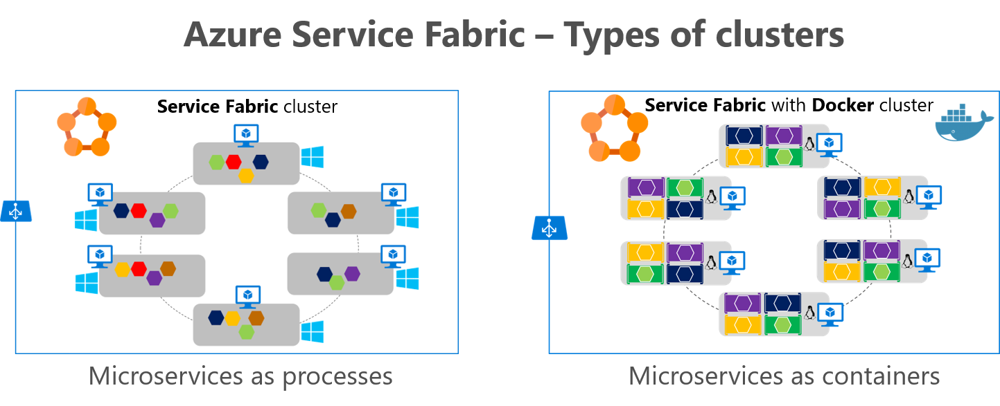

**Figure 4-10**. Deploying microservices as processes or as containers in Azure Service Fabric

In the first image, you see microservices as processes, where each node runs one process for each microservice. In the second image, you see microservices as containers, where each node runs Docker with several containers, one container per microservice. Service Fabric clusters based on Linux and Windows hosts can run Docker Linux containers and Windows Containers, respectively.

For up-to-date information about containers support in Azure Service Fabric, see [Service Fabric and containers](/azure/service-fabric/service-fabric-containers-overview).

Service Fabric is a good example of a platform where you can define a different logical architecture (business microservices or Bounded Contexts) than the physical implementation. For example, if you implement [Stateful Reliable Services](/azure/service-fabric/service-fabric-reliable-services-introduction) in [Azure Service Fabric](/azure/service-fabric/service-fabric-overview), which are introduced in the next section, "[Stateless versus stateful microservices](#stateless-versus-stateful-microservices)," you have a business microservice concept with multiple physical services.

As shown in Figure 4-10, and thinking from a logical/business microservice perspective, when implementing a Service Fabric Stateful Reliable Service, you usually will need to implement two tiers of services. The first is the back-end stateful reliable service, which handles multiple partitions (each partition is a stateful service). The second is the front-end service, or Gateway service, in charge of routing and data aggregation across multiple partitions or stateful service instances. That Gateway service also handles client-side communication with retry loops accessing the back-end service. It's called a Gateway service if you implement your custom service, or alternatively you can also use the out-of-the-box Service Fabric [reverse proxy](/azure/service-fabric/service-fabric-reverseproxy).

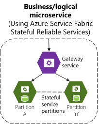

**Figure 4-11**. Business microservice with several stateful service instances and a custom gateway front end

In any case, when you use Service Fabric Stateful Reliable Services, you also have a logical or business microservice (Bounded Context) that's composed of multiple physical services. Each of them, the Gateway service, and Partition service could be implemented as ASP.NET Web API services, as shown in Figure 4-11. Service Fabric has prescription to support several stateful reliable services in containers.

In Service Fabric, you can group and deploy groups of services as a [Service Fabric Application](/azure/service-fabric/service-fabric-application-model), which is the unit of packaging and deployment for the orchestrator or cluster. Therefore, the Service Fabric Application could be mapped to this autonomous business and logical microservice boundary or Bounded Context, as well, so you could deploy these services autonomously.

### Service Fabric and containers

With regard to containers in Service Fabric, you can also deploy services in container images within a Service Fabric cluster. As Figure 4-12 shows, most of the time there will only be one container per service.

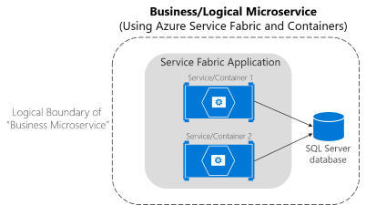

**Figure 4-12**. Business microservice with several services (containers) in Service Fabric

A Service Fabric application can run several containers accessing an external database and the whole set would be the logical boundary of a Business Microservice. However, so-called "sidecar" containers (two containers that must be deployed together as part of a logical service) are also possible in Service Fabric. The important thing is that a business microservice is the logical boundary around several cohesive elements. In many cases, it might be a single service with a single data model, but in some other cases you might have several physical services as well.

Note that you can mix services in processes, and services in containers, in the same Service Fabric application, as shown in Figure 4-13.

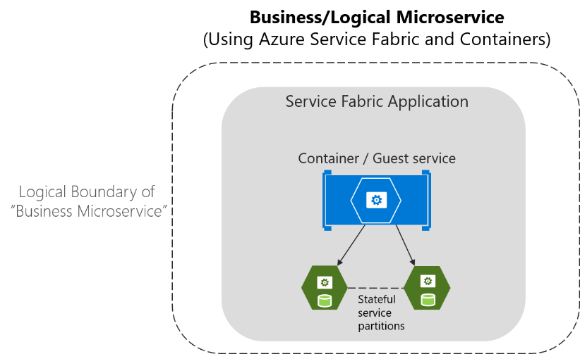

**Figure 4-13**. Business microservice mapped to a Service Fabric application with containers and stateful services

For more information about container support in Azure Service Fabric, see [Service Fabric and containers](/azure/service-fabric/service-fabric-containers-overview).

## Stateless versus stateful microservices

As mentioned earlier, each microservice (logical Bounded Context) must own its domain model (data and logic). In the case of stateless microservices, the databases will be external, employing relational options like SQL Server, or NoSQL options like Azure Cosmos DB or MongoDB.

But the services themselves can also be stateful in Service Fabric, which means that the data resides within the microservice. This data might exist not just on the same server, but within the microservice process, in memory and persisted on hard drives and replicated to other nodes. Figure 4-14 shows the different approaches.

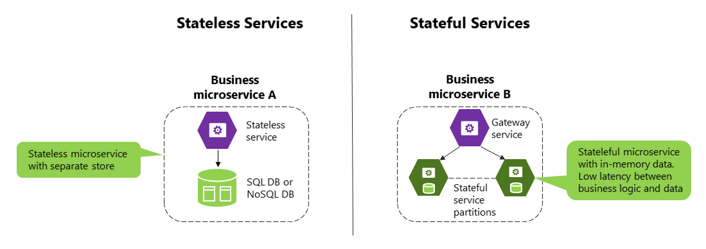

**Figure 4-14**. Stateless versus stateful microservices

In stateless services, the state (persistence, database) is kept out of the microservice. In stateful services, state is kept inside the microservice. A stateless approach is perfectly valid and is easier to implement than stateful microservices, since the approach is similar to traditional and well-known patterns. But stateless microservices impose latency between the process and data sources. They also involve more moving pieces when you're trying to improve performance with additional cache and queues. The result is that you can end up with complex architectures that have too many tiers.

In contrast, [stateful microservices](/azure/service-fabric/service-fabric-reliable-services-introduction#when-to-use-reliable-services-apis) can excel in advanced scenarios, because there's no latency between the domain logic and data. Heavy data processing, gaming back ends, databases as a service, and other low-latency scenarios all benefit from stateful services, which enable local state for faster access.

Stateless and stateful services are complementary. For instance, as you can see in the right diagram in Figure 4-14, a stateful service can be split into multiple partitions. To access those partitions, you might need a stateless service acting as a gateway service that knows how to address each partition based on partition keys.

Stateful services do have drawbacks. They impose a high complexity level to be scaled out. Functionality that would usually be implemented by external database systems must be addressed for tasks such as data replication across stateful microservices and data partitioning. However, this is one of the areas where an orchestrator like [Azure Service Fabric](/azure/service-fabric/service-fabric-reliable-services-platform-architecture) with its [stateful reliable services](/azure/service-fabric/service-fabric-reliable-services-introduction#when-to-use-reliable-services-apis) can help the most—by simplifying the development and lifecycle of stateful microservices using the [Reliable Services API](/azure/service-fabric/service-fabric-work-with-reliable-collections) and [Reliable Actors](/azure/service-fabric/service-fabric-reliable-actors-introduction).

Other microservice frameworks that allow stateful services, support the Actor pattern, and improve fault tolerance and latency between business logic and data are Microsoft [Orleans](https://github.com/dotnet/orleans), from Microsoft Research, and [Akka.NET](https://getakka.net/). Both frameworks are currently improving their support for Docker.

Remember that Docker containers are themselves stateless. If you want to implement a stateful service, you need one of the additional prescriptive and higher-level frameworks noted earlier.

## Using Azure Service Fabric Mesh

Azure Service Fabric Mesh is a fully managed service that enables developers to build and deploy mission critical applications without managing any infrastructure. Use Service Fabric Mesh to build and run secure, distributed microservices applications that scale on demand.

As shown in figure 4-15, applications hosted on Service Fabric Mesh run and scale without you worrying about the infrastructure powering it.

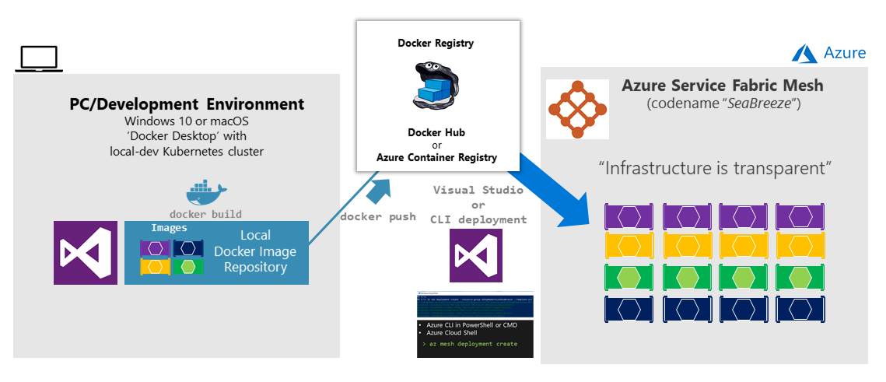

**Figure 4-15**. Deploying a microservice/containers application to Service Fabric Mesh

Under the covers, Service Fabric Mesh consists of clusters of thousands of machines. All cluster operations are hidden from the developer. You simply need to upload your containers and specify resources you need, availability requirements, and resource limits. Service Fabric Mesh automatically allocates the infrastructure requested by your application deployment and also handles infrastructure failures, making sure your applications are highly available. You only need to care about the health and responsiveness of your application, not the infrastructure.

For further information, see the [Service Fabric Mesh documentation](/azure/service-fabric-mesh/).

## Choosing orchestrators in Azure

The following table provides guidance on what orchestrator to use depending on workloads and OS focus.

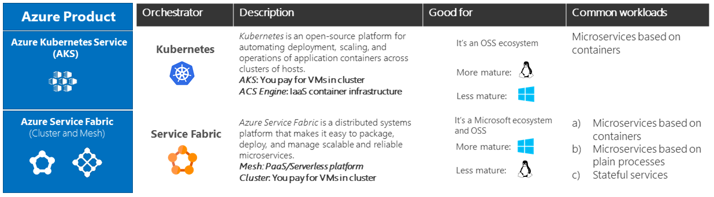

**Figure 4-16**. Orchestrator selection in Azure guidance

>[!div class="step-by-step"]
>[Previous](soa-applications.md)
>[Next](deploy-azure-kubernetes-service.md)
