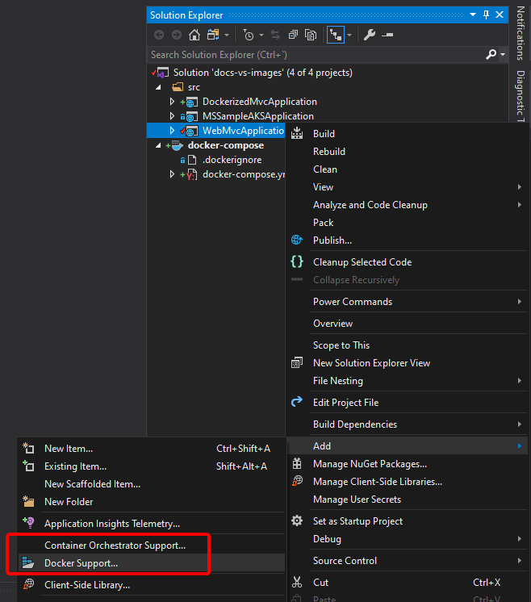
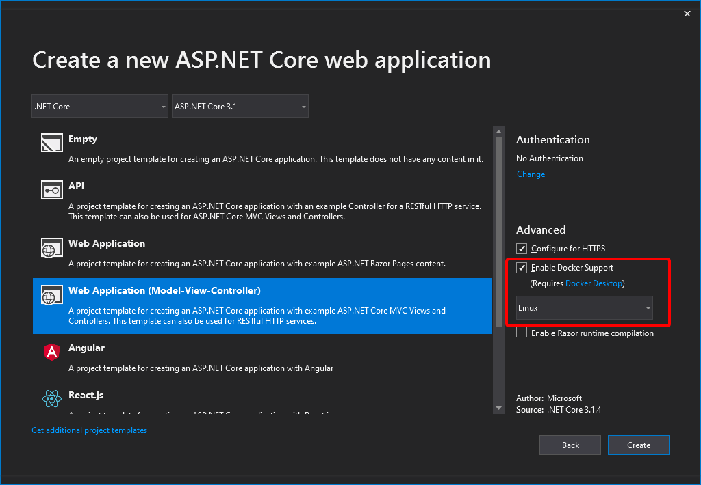
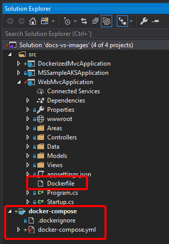
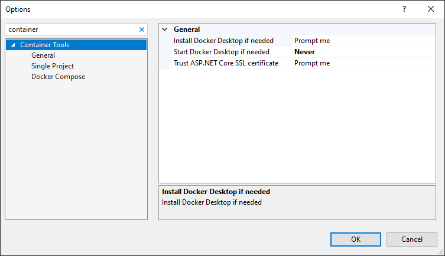

# Use Docker Tools in Visual Studio on Windows

The developer workflow when using the Docker Tools included in Visual Studio 2022 version 17.0 and later, is similar to using Visual Studio Code and Docker CLI (in fact, it's based on the same Docker CLI), but it's easier to get started, simplifies the process, and provides greater productivity for the build, run, and compose tasks. It can also run and debug your containers via the usual `F5` and `Ctrl+F5` keys from Visual Studio. You can even debug a whole solution if its containers are defined in the same `docker-compose.yml` file at the solution level.

## Configure your local environment

With the latest versions of Docker for Windows, it's easier than ever to develop Docker applications because the setup is straightforward, as explained in the following references.

> [!TIP]
> To learn more about installing Docker for Windows, go to (<https://docs.docker.com/docker-for-windows/>).

## Docker support in Visual Studio

There are two levels of Docker support you can add to a project. In ASP.NET Core projects, you can just add a `Dockerfile` file to the project by enabling Docker support. The next level is container orchestration support, which adds a `Dockerfile` to the project (if it doesn't already exist) and a `docker-compose.yml` file at the solution level. Container orchestration support, via Docker Compose, is available in Visual Studio 2022 versions 17.0. Container orchestration support is an opt-in feature in Visual Studio 2022 versions 17.0 or later. Visual Studio 2022 also supports **Kubernetes/Helm** deployment.

The **Add > Docker Support** and **Add > Container Orchestrator Support** commands are located on the right-click menu (or context menu) of the project node for an ASP.NET Core project in **Solution Explorer**, as shown in Figure 4-31:

**Figure 4-31**. Adding Docker support to a Visual Studio project

### Add Docker support

Besides the option to add Docker support to an existing application, as shown in the previous section, you can also enable Docker support during project creation by selecting **Enable Docker Support** in the **New ASP.NET Core Web Application** dialog box that opens after you click **OK** in the **New Project** dialog box, as shown in Figure 4-32.

**Figure 4-32**. Enable Docker support during project creation in Visual Studio

When you add or enable Docker support, Visual Studio adds a _Dockerfile_ file to the project, that includes references to all required project from the solution.

### Add container orchestration support

When you want to compose a multi-container solution, add container orchestration support to your projects. This lets you run and debug a group of containers (a whole solution) at the same time if they're defined in the same _docker-compose.yml_ file.

To add container orchestration support, right-click on the project node in **Solution Explorer**, and choose **Add > Container Orchestration Support**. Then choose **Docker Compose** to manage the containers.

After you add container orchestration support to your project, you see a Dockerfile added to the project and a **docker-compose** folder added to the solution in **Solution Explorer**, as shown in Figure 4-33:

**Figure 4-33**. Docker files in Solution Explorer in Visual Studio

If _docker-compose.yml_ already exists, Visual Studio just adds the required lines of configuration code to it.

## Configure Docker tools

From the main menu, choose **Tools > Options**, and expand **Container Tools > Settings**. The container tools settings appear.

**Figure 4-34**. Docker Tools Options

For more detailed configurations refer to [Container Tools settings](/visualstudio/containers/container-tools-configure#container-tools-settings)

> [!TIP]
> For further details on the services implementation and use of Visual Studio Tools for Docker, read the following articles:
>
> Use the Containers tool window to view container details such as the filesystem, logs, environment, ports, and more: [https://docs.microsoft.com/visualstudio/containers/view-and-diagnose-containers](/visualstudio/containers/view-and-diagnose-containers)
> Debug apps in a local Docker container: [https://docs.microsoft.com/visualstudio/containers/edit-and-refresh](/visualstudio/containers/edit-and-refresh)
>
> Deploy an ASP.NET container to a container registry using Visual Studio: [https://docs.microsoft.com/visualstudio/containers/hosting-web-apps-in-docker](/visualstudio/containers/hosting-web-apps-in-docker)

> [!div class="step-by-step"]
> [Previous](docker-apps-inner-loop-workflow.md)
> [Next](set-up-windows-containers-with-powershell.md)
