# Steps in the outer-loop DevOps workflow for a Docker application

Figure 5-1 presents an end-to-end depiction of the steps comprising the DevOps outer-loop workflow. It shows the "outer loop" of DevOps. When code is pushed to the repo, a CI pipeline is started, then begins the CD pipeline, where the application gets deployed. Metrics collected from deployed applications are fed back into the development workload, where the "inner loop" occurs, so development teams have actual data to respond to user and business needs.

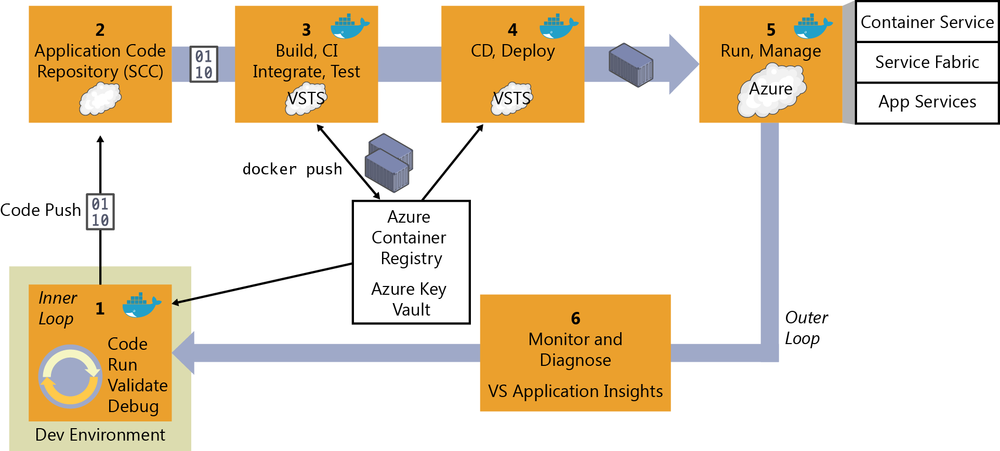

**Figure 5-1**. DevOps outer-loop workflow for Docker applications with Microsoft tools

Now, let's examine each of these steps in greater detail.

## Step 1: Inner-loop development workflow

This step is explained in detail in Chapter 4, but, to recap, here is where the outer-loop begins, the moment at which a developer pushes code to the source control management system (like Git) initiating CI pipeline actions.

## Step 2: Source-Code Control integration and management with Azure DevOps Services and Git

At this step, you need to have a version-control system to gather a consolidated version of all the code coming from the different developers in the team.

Even though source-code control (SCC) and source-code management might seem second-nature to most developers, when creating Docker applications in a DevOps life cycle, it's critical to emphasize that you must not submit the Docker images with the application directly to the global Docker Registry (like Azure Container Registry or Docker Hub) from the developer's machine. On the contrary, the Docker images to be released and deployed to production environments must be created solely on the source code that's being integrated in your global build or CI pipeline based on your source-code repository (like Git).

The local images, generated by developers, should just be used by them when testing within their own machines. That's why it's critical to have the DevOps pipeline activated from the SCC code.

Azure DevOps Services and Team Foundation Server support Git and Team Foundation Version Control. You can choose between them and use it for an end-to-end Microsoft experience. However, you can also manage your code in external repositories (like GitHub, on-premises Git repositories, or Subversion) and still be able to connect to it and get the code as the starting point for your DevOps CI pipeline. You can also use GitHub Actions for CI/CD pipelines.

## Step 3: Build, CI, Integrate, and Test with Azure DevOps Services/GitHub and Docker

CI has emerged as a standard for modern software testing and delivery. The Docker solution maintains a clear separation of concerns between the development and operations teams. The immutability of Docker images ensures a repeatable deployment between what's developed, tested through CI, and run in production. Docker Engine deployed across the developer laptops and test infrastructure makes the containers portable across environments.

At this point, after you have a version-control system with the correct code submitted, you need a *build service* to pick up the code and run the global build and tests.

The internal workflow for this step (CI, build, test) is about the construction of a CI pipeline consisting of your code repository (Git, etc.), your build server (Azure DevOps Services/GitHub), Docker Engine, and a Docker Registry.

You can use Azure DevOps Services as the foundation for building your applications and setting your CI pipeline, and for publishing the built "artifacts" to an "artifacts repository," which is explained in the next step. Alternatively, you can use GitHub to implement the same workflow.

When using Docker for the deployment, the "final artifacts" to be deployed are Docker images with your application or services embedded within them. Those images are pushed or published to a *Docker Registry* (a private repository like the ones you can have in Azure Container Registry, or a public one like Docker Hub Registry or GitHub Container Registry, which is commonly used for official base images).

Here is the basic concept: The CI pipeline will be kicked-off by a commit to an SCC repository like Git. The commit will cause Azure DevOps Services/GitHub to run a build job within a Docker container and, upon successful completion of that job, push a Docker image to the Docker Registry, as illustrated in Figure 5-2. The first part of the outer loop involves steps 1 to 3, from code, run, debug and validate, then the code repo up to the build and test CI step.

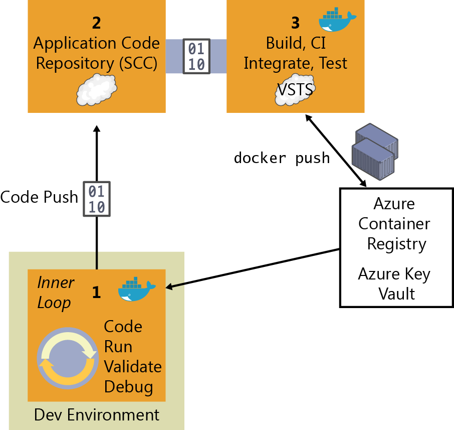

**Figure 5-2**. The steps involved in CI

Here are the basic CI workflow steps with Docker and Azure DevOps Services:

1. The developer pushes a commit to an SCC repository (Git/Azure DevOps Services, GitHub, etc.).

2. If you're using Azure DevOps Services or Git, CI is built in, which means that it's as simple as selecting a check box in Azure DevOps Services. If you're using an external SCC (like GitHub), a `webhook` will notify Azure DevOps Services of the update or push to Git/GitHub.

3. Azure DevOps Services pulls the SCC repository, including the Dockerfile describing the image, as well as the application and test code.

4. Azure DevOps Services builds a Docker image and labels it with a build number.

5. Azure DevOps Services instantiates the Docker container within the provisioned Docker Host, and runs the appropriate tests.

6. If the tests are successful, the image is first relabeled to a meaningful name so that you know it's a "blessed build" (like "/1.0.0" or any other label), and then pushed up to your Docker Registry (Docker Hub, Azure Container Registry, DTR, etc.)

Here are the basic CI workflow steps with Docker and GitHub:

1. The developer pushes a commit to a GitHub repo.
1. CI is built in, so Actions will trigger base on the event filters.
1. GitHub pulls the SCC repository, including the _Dockerfile_ describing the image, as well as the application and test code.
1. GitHub builds a Docker image and labels it with a build number.
1. GitHub instantiates the Docker container within the provisioned Docker Host, and runs the appropriate tests.
1. If the tests are successful, the image is first relabeled to a meaningful name so that you know it's a "blessed build" (like "/1.0.0" or any other label), and then pushed up to your Docker Registry (Docker Hub, Azure Container Registry, DTR, etc.)

### Implement a CI pipeline with Azure DevOps Services and the Docker extension for Azure DevOps Services

Visual Studio Azure DevOps Services contains Build & Release Templates that you can use in your CI/CD pipeline with which you can build Docker images, push Docker images to an authenticated Docker registry, run Docker images, or run other operations offered by the Docker CLI. It also adds a Docker Compose task that you can use to build, push, and run multi-container Docker applications, or run other operations offered by the Docker Compose CLI, as shown in Figure 5-3.

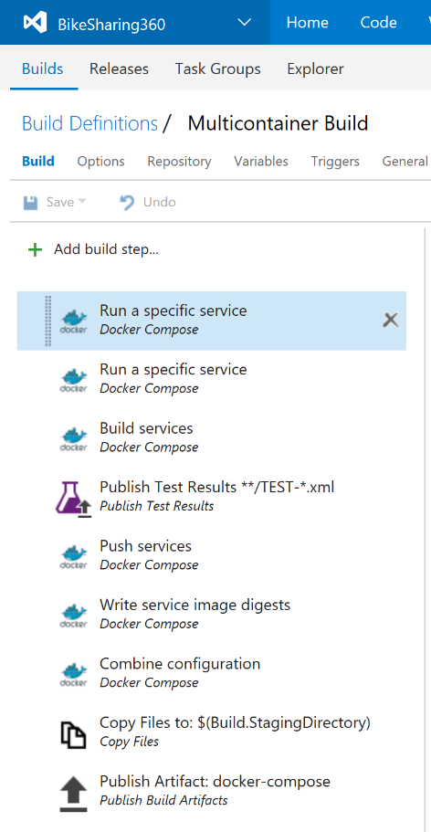

**Figure 5-3**. The Docker CI pipeline in Azure DevOps Services including Build & Release Templates and associated tasks.

You can use these templates and tasks to construct your CI/CD artifacts to Build / Test and Deploy in Azure Service Fabric, Azure Kubernetes Service, and similar offerings.

With these Visual Studio Team Services tasks, a build Linux-Docker Host/VM provisioned in Azure and your preferred Docker registry (Azure Container Registry, Docker Hub, private Docker DTR, or any other Docker registry) you can assemble your Docker CI pipeline in a very consistent way.

***Requirements:***

- Azure DevOps Services, or for on-premises installations, Team Foundation Server 2015 Update 3 or later.

- An Azure DevOps Services agent that has the Docker binaries.

  An easy way to create one of these agents is to use Docker to run a container based on the Azure DevOps Services agent Docker image.

> [!TIP]
> To read more about assembling an Azure DevOps Services Docker CI pipeline and view the walkthroughs, visit these sites:
>
> - Running a Visual Studio Team Services (Now Azure DevOps Services) agent as a Docker container: \
>   <https://hub.docker.com/_/microsoft-azure-pipelines-vsts-agent>
>
> - Building .NET Linux Docker images with Azure DevOps Services: \
>   [https://docs.microsoft.com/archive/blogs/stevelasker/building-net-core-linux-docker-images-with-visual-studio-team-services](/archive/blogs/stevelasker/building-net-core-linux-docker-images-with-visual-studio-team-services)
>
> - Building a Linux-based Visual Studio Team Service build machine with Docker support: \
>   <https://www.donovanbrown.com/post/Building-a-Linux-Based-Visual-Studio-Team-Service-Build-Machine-with-Docker-Support>

### Implement a CI pipeline with GitHub Actions

GitHub Actions allow you to create automation scripts that can build Docker images, push Docker images to an authenticated Docker registry, run Docker images, or run other operations offered by the Docker CLI.

You can use public Actions (such as [Azure Login](https://github.com/marketplace/actions/azure-login)) and `run` (shell) commands to construct your CI/CD artifacts to Build / Test and Deploy in Azure Service Fabric, Azure Kubernetes Service, and similar offerings.

With these Actions, a build Linux-Docker Host/VM provisioned in Azure and your preferred Docker registry (Azure Container Registry, Docker Hub, private Docker DTR, or any other Docker registry) you can assemble your Docker CI pipeline in a very consistent way.

### Integrate, test, and validate multi-container Docker applications

Typically, most Docker applications are composed of multiple containers rather than a single container. A good example is a microservices-oriented application for which you would have one container per microservice. But, even without strictly following the microservices approach patterns, it's probable that your Docker application would be composed of multiple containers or services.

Therefore, after building the application containers in the CI pipeline, you also need to deploy, integrate, and test the application as a whole with all of its containers within an integration Docker host or even into a test cluster to which your containers are distributed.

If you're using a single host, you can use Docker commands such as docker-compose to build and deploy related containers to test and validate the Docker environment in a single VM. But, if you're working with an orchestrator cluster like DC/OS, Kubernetes, or Docker Swarm, you need to deploy your containers through a different mechanism or orchestrator, depending on your selected cluster/scheduler.

The following are several types of tests that you can run against Docker containers:

- Unit tests for Docker containers

- Testing groups of interrelated applications or microservices

- Test in production and "canary" releases

The important point is that when running integration and functional tests, you must run those tests from outside of the containers. Tests are not contained or run in the containers you're deploying, because the containers are based on static images that should be exactly like the ones you'll be deploying to production.

A practical option when testing more advanced scenarios, like including several clusters (test cluster, staging cluster, and production cluster) is to publish the images to a registry, so it can be tested in various clusters.

### Push the custom application Docker image into your global Docker Registry

After the Docker images have been tested and validated, you'll want to tag and publish them to your Docker registry. The Docker registry is a critical piece in the Docker application life cycle because it's the central place where you store your custom test (also known as "blessed images") to be deployed into QA and production environments.

Similar to how the application code stored in your SCC repository (Git, etc.) is your "source of truth," the Docker registry is your "source of truth" for your binary application or bits to be deployed to the QA or production environments.

Typically, you might want to have your private repositories for your custom images either in a private repository in Azure Container Registry or in an on-premises registry like Docker Trusted Registry, or in a public-cloud registry with restricted access (like Docker Hub), although in this last case if your code is not open source, you must trust the vendor's security. Either way, the method you use is similar and is based on the `docker push` command, as shown in Figure 5-4.

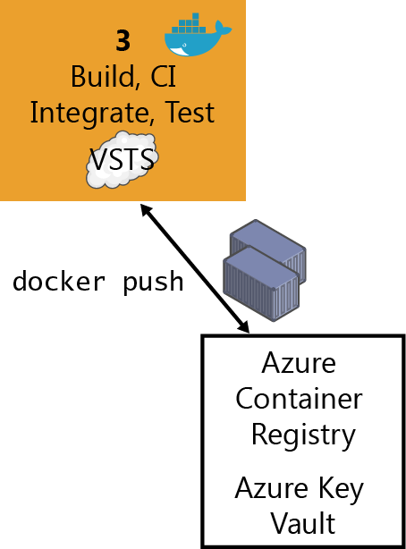

**Figure 5-4**. Publishing custom images to Docker Registry

In step 3, for building integration and testing (CI) you might publish the resulting docker images to a private or public registry. There are multiple offerings of Docker registries from cloud vendors like Azure Container Registry, Amazon Web Services Container Registry, Google Container Registry, GitHub Container Registry, Quay Registry, and so on.

Using the Docker tasks, you can push a set of service images defined by a `docker-compose.yml` file, with multiple tags, to an authenticated Docker registry (like Azure Container Registry), as shown in Figure 5-5.

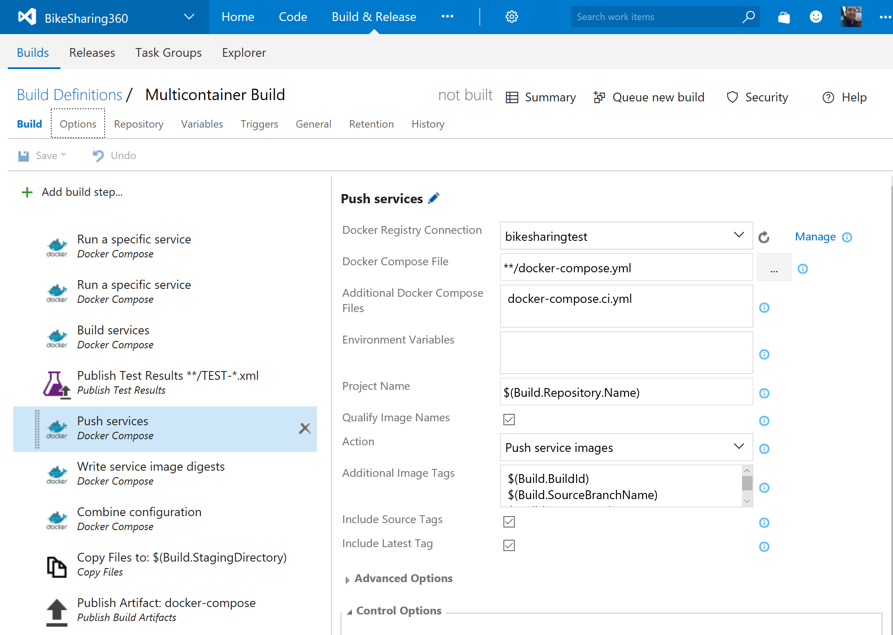

**Figure 5-5**. Using Azure DevOps Services to publishing custom images to a Docker Registry

> [!TIP]
> For more information about Azure Container Registry, see <https://aka.ms/azurecontainerregistry>.

## Step 4: CD, Deploy

The immutability of Docker images ensures a repeatable deployment with what's developed, tested through CI, and run in production. After you have the application Docker images published in your Docker registry (either private or public), you can deploy them to the several environments that you might have (production, QA, staging, etc.) from your CD pipeline by using Azure DevOps Services pipeline tasks, Azure DevOps Services Release Management or GitHub Actions.

However, at this point it depends on what kind of Docker application you're deploying. Deploying a simple application (from a composition and deployment point of view) like a monolithic application comprising a few containers or services and deployed to a few servers or VMs is different from deploying a more complex application like a microservices-oriented application with hyperscale capabilities. These two scenarios are explained in the following sections.

### Deploying composed Docker applications to multiple Docker environments

Let's look first at the less-complex scenario: deploying to simple Docker hosts (VMs or servers) in a single environment or multiple environments (QA, staging, and production). In this scenario, internally your CD pipeline can use docker-compose (from your Azure DevOps Services deployment tasks) to deploy the Docker applications with its related set of containers or services, as illustrated in Figure 5-6.

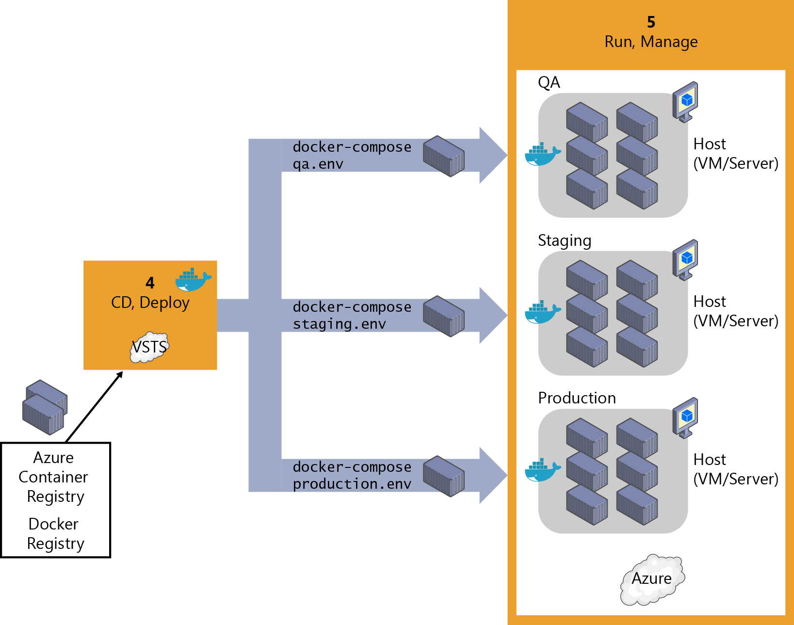

**Figure 5-6**. Deploying application containers to simple Docker host environments registry

Figure 5-7 highlights how you can connect your build CI to QA/test environments via Azure DevOps Services by clicking Docker Compose in the Add Task dialog box. However, when deploying to staging or production environments, you would usually use Release Management features handling multiple environments (like QA, staging, and production). If you're deploying to single Docker hosts, it is using the Azure DevOps Services "Docker Compose" task (which is invoking the `docker-compose up` command under the hood). If you're deploying to Azure Kubernetes Service (AKS), it uses the Docker Deployment task, as explained in the section that follows. Similar steps can be built for deployment using GitHub Actions.

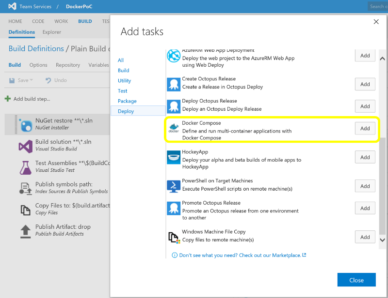

**Figure 5-7**. Adding a Docker Compose task in an Azure DevOps Services pipeline or GitHub workflow

When you create a release in Azure DevOps Services, it takes a set of input artifacts. These artifacts are intended to be immutable for the lifetime of the release, across all environments. When you introduce containers, the input artifacts identify images in a registry to deploy. Depending on how these images are identified, they are not guaranteed to remain the same throughout the duration of the release, the most obvious case being when you reference `myimage:latest` from a `docker-compose` file.

The Azure DevOps Services templates give you the ability to generate build artifacts that contain specific registry image digests that are guaranteed to uniquely identify the same image binary. These are what you really want to use as input to a release. You can invoke `docker-compose` in a `run` step inside GitHub Actions to accomplish the same goal.

### Managing releases to Docker environments by using Azure DevOps Services Release Management or GitHub Actions

Through the Azure DevOps Services templates, you can build a new image, publish it to a Docker registry, run it on Linux or Windows hosts, and use commands such as `docker-compose` to deploy multiple containers as an entire application, all through the Azure DevOps Services Release Management capabilities intended for multiple environments, as shown in Figure 5-8.

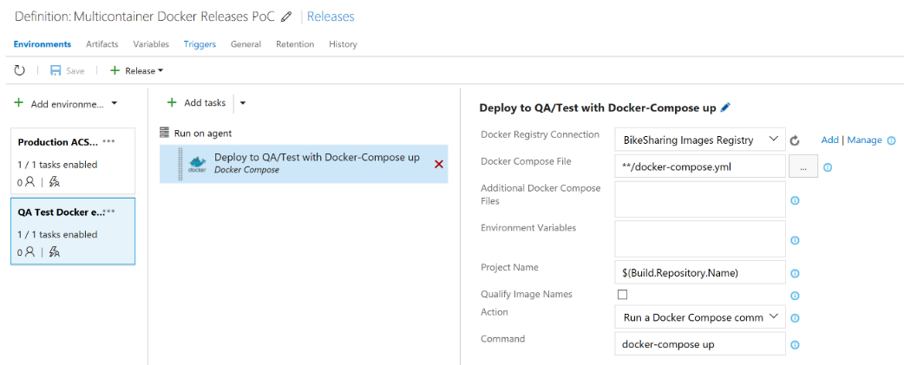

**Figure 5-8**. Configuring Azure DevOps Services Docker Compose tasks from Azure DevOps Services Release Management

However, keep in mind that the scenario shown in Figure 5-6 and implemented in Figure 5-8 is a simple one (it's deploying to single Docker hosts and VMs, and there will be a single container or instance per image) and probably should be used only for development or test scenarios. In most enterprise production scenarios, you would want to have High Availability (HA) and easy-to-manage scalability by load balancing across multiple nodes, servers, and VMs, plus "intelligent failovers" so if a server or node fails, its services and containers will be moved to another host server or VM. In that case, you need more advanced technologies such as container clusters, orchestrators, and schedulers. Thus, the way to deploy to those clusters is by handling the advanced scenarios explained in the next section.

GitHub Actions can be used in the same manner, including the use of [environments](https://docs.github.com/actions/reference/environments) for approvals.

### Deploying Docker applications to Docker clusters

The nature of distributed applications requires compute resources that are also distributed. To have production-scale capabilities, you need to have clustering capabilities that provide high scalability and high availability based on pooled resources.

You could deploy containers manually to those clusters from a CLI tool or a web UI, but you should reserve that kind of manual work to spot deployment testing or management purposes like scaling-out or monitoring.

From a CD point of view, you can use Azure DevOps Services or GitHub Actions to run specially made deployment tasks from your environments that will deploy your containerized applications to distributed clusters in Container Service, as illustrated in Figure 5-9.

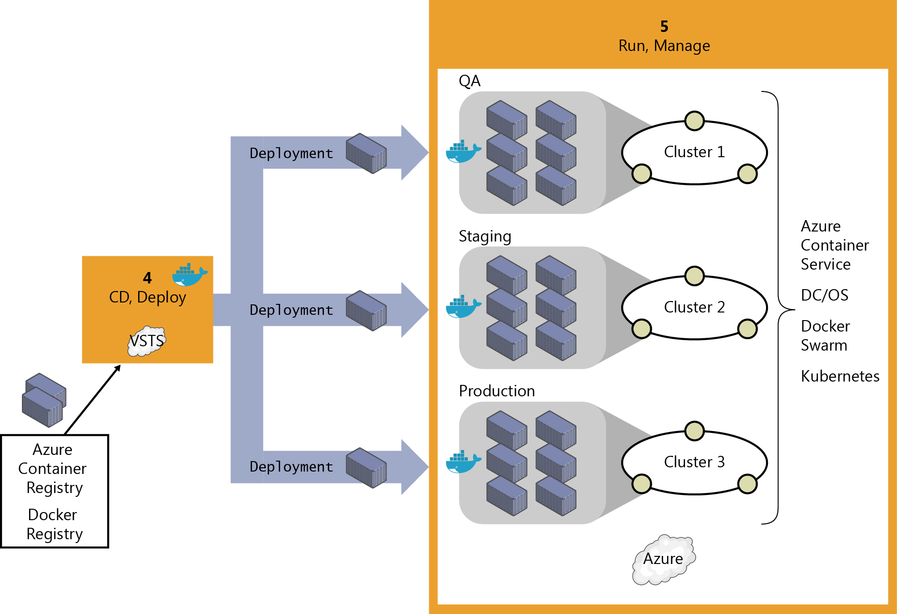

**Figure 5-9**. Deploying distributed applications to Container Service

Initially, when deploying to certain clusters or orchestrators, you would traditionally use specific deployment scripts and mechanisms per each orchestrator (that is, Kubernetes and Service Fabric have different deployment mechanisms) instead of the simpler and easy-to-use `docker-compose` tool based on the `docker-compose.yml` definition file. However, thanks to the Azure DevOps Services Docker Deploy task, shown in Figure 5-10, now you can also deploy to the supported orchestrators by just using your familiar `docker-compose.yml` file because the tool performs that "translation" for you (from your `docker-compose.yml` file to the format needed by the orchestrator).

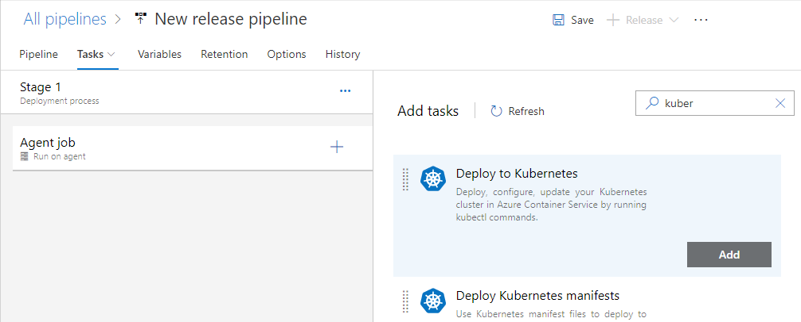

**Figure 5-10**. Adding the Deploy to Kubernetes task to your Environment

Figure 5-11 demonstrates how you can edit the Deploy to Kubernetes task with the sections available for configuration. This is the task that will retrieve your ready-to-use custom Docker images to be deployed as containers in the cluster.

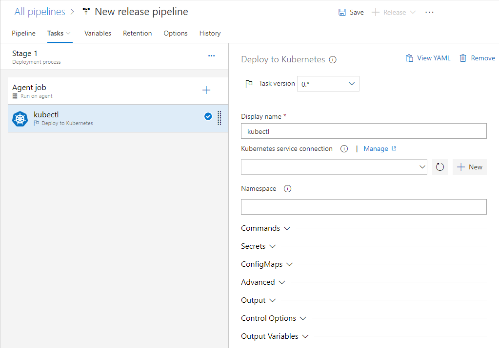

**Figure 5-11**. Docker Deploy task definition deploying to ACS DC/OS

> [!TIP]
> To read more about the CD pipeline with Azure DevOps Services and Docker, visit <https://azure.microsoft.com/services/devops/pipelines>

> [!TIP]
> To see GitHub Actions workflows for CI, visit <https://github.com/dotnet-architecture/eShopOnContainers/wiki/GitHub-Actions>. For a walkthrough of GitHub Actions performing deployment to an Azure Kubernetes environment, visit <https://github.com/dotnet-architecture/eShopOnContainers/wiki/Deployment-With-GitHub-Actions>.

## Step 5: Run and manage

Because running and managing applications at enterprise-production level is a major subject in and of itself, and due to the type of operations and people working at that level (IT operations) as well as the large scope of this area, the entire next chapter is devoted to explaining it.

## Step 6: Monitor and diagnose

This topic also is covered in the next chapter as part of the tasks that IT performs in production systems; however, is important to highlight that the insights obtained in this step must feed back to the development team so that the application is constantly improved. From that point of view, it's also part of DevOps, although the tasks and operations are commonly performed by IT.

Only when monitoring and diagnostics are 100% within the realm of DevOps are the monitoring processes and analytics performed by the development team against testing or beta environments. This is done either by performing load testing or by monitoring beta or QA environments, where beta testers are trying the new versions.

>[!div class="step-by-step"]
>[Previous](index.md)
>[Next](create-ci-cd-pipelines-azure-devops-services-aspnetcore-kubernetes.md)
