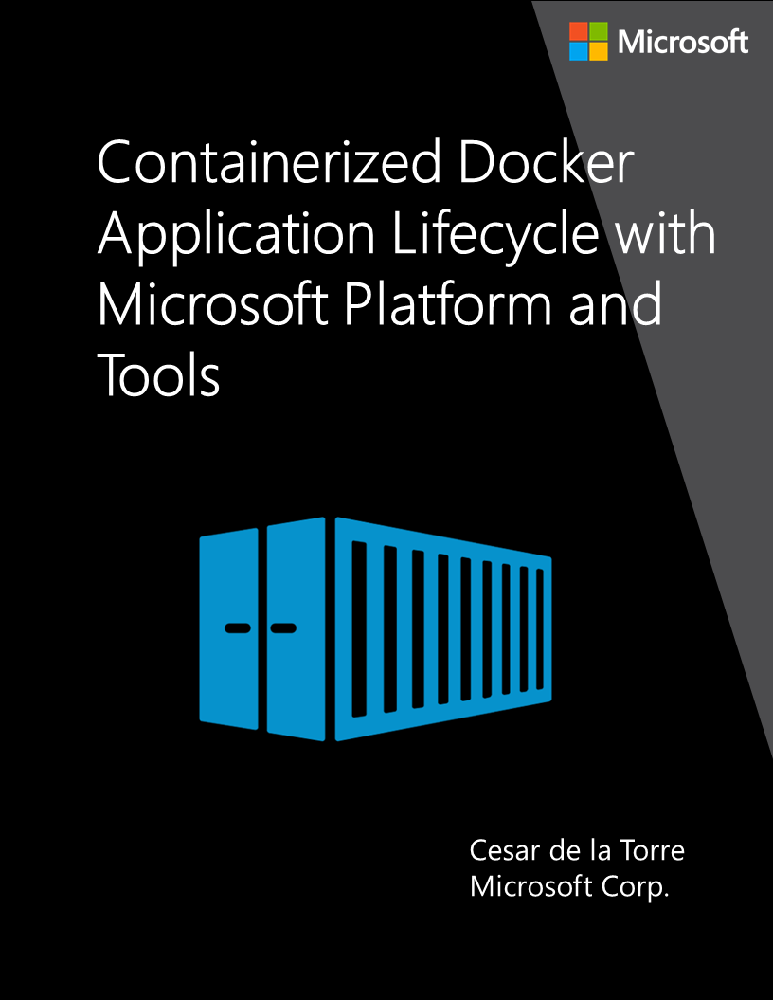

# Containerized Docker Application Lifecycle with Microsoft Platform and Tools

**EDITION v6.0.0** - Updated to ASP.NET Core 6.0

Refer [changelog](https://aka.ms/DockerLifecycleEbookChangelog) for the book updates and community contributions.

This guide is a general overview for developing and deploying containerized ASP.NET Core applications with Docker, using the Microsoft platform and tools. The guide includes a high-level introduction to Azure DevOps, for implementing CI/CD pipelines, as well as Azure Container Registry (ACR), and Azure Kubernetes Services AKS for deployment.

For low-level, development-related details you can see the [.NET Microservices: Architecture for Containerized .NET Applications](../microservices/index.md) guide and it related reference application [eShopOnContainers](https://github.com/dotnet-architecture/eShopOnContainers).

## Send us your feedback!

We wrote this guide to help you understand the architecture of containerized applications and microservices in .NET. The guide and related reference application will be evolving, so we welcome your feedback! If you have comments about how this guide can be improved, submit feedback at <https://aka.ms/ebookfeedback>.

## Credits

Author:

> **Cesar de la Torre**, Sr. PM, .NET product team, Microsoft Corp.

Acquisitions Editor:

> **Janine Patrick**

Developmental Editor:

> **Bob Russell**, Solutions Professional at Microsoft
>
> [**Octal Publishing, Inc.**](http://www.octalpub.com/)

Editorial Production:

> [Dianne Russell](http://www.octalpub.com/)
>
> **Octal Publishing, Inc.**

Copyeditor:

> **Bob Russell**, Solutions Professional at Microsoft

Participants and reviewers:

> **Nish Anil**, Sr. Program Manager, .NET team, Microsoft
>
> **Miguel Veloso**, Software Development Engineer at Plain Concepts
>
> **Sumit Ghosh**, Principal Consultant at Neudesic
>
> **Colin Dembovsky**, DevOps Practice Lead, Cognizant Microsoft Business Group

## Copyright

PUBLISHED BY

Microsoft Developer Division, .NET and Visual Studio product teams

A division of Microsoft Corporation

One Microsoft Way

Redmond, Washington 98052-6399

Copyright &copy; 2021 by Microsoft Corporation

All rights reserved. No part of the contents of this book may be reproduced or transmitted in any form or by any means without the written permission of the publisher.

This book is provided "as-is" and expresses the author's views and opinions. The views, opinions and information expressed in this book, including URL and other Internet website references, may change without notice.

Some examples depicted herein are provided for illustration only and are fictitious. No real association or connection is intended or should be inferred.

Microsoft and the trademarks listed at <https://www.microsoft.com> on the "Trademarks" webpage are trademarks of the Microsoft group of companies.

Mac and macOS are trademarks of Apple Inc.

The Docker whale logo is a registered trademark of Docker, Inc. Used by permission.

All other marks and logos are property of their respective owners.

>[!div class="step-by-step"]
>[Next](introduction-to-containers-and-docker.md)
