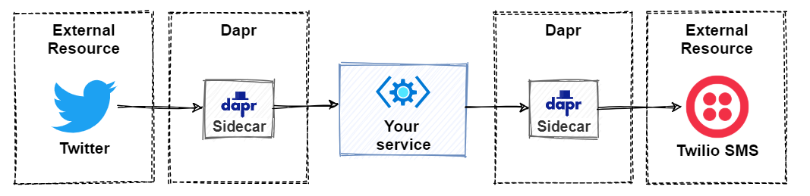
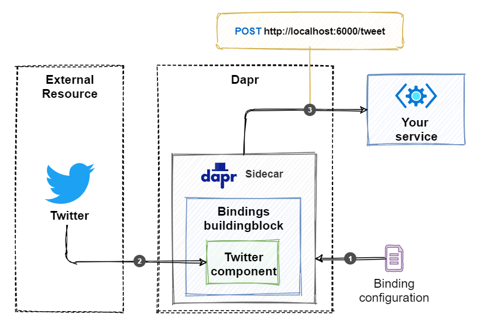
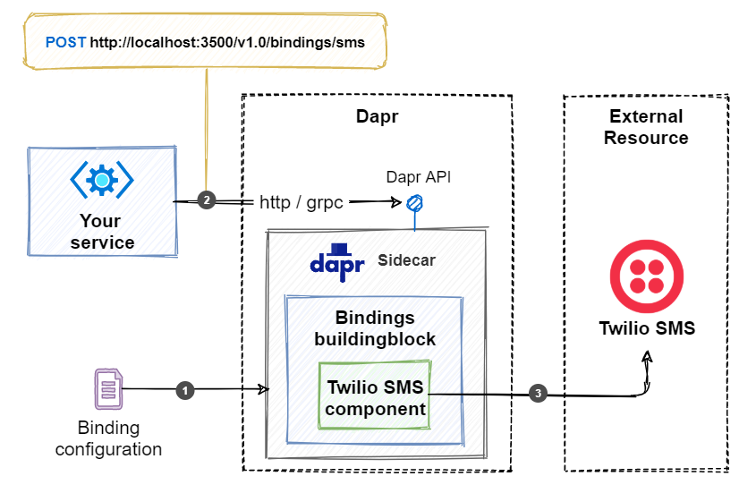

# The Dapr bindings building block

Cloud-based *serverless* offerings, such as Azure Functions and AWS Lambda, have gained wide adoption across the distributed architecture space. Among many benefits, they enable a microservice to *handle events from* or *invoke events in* an external system - abstracting away the underlying complexity and plumbing concerns. External resources are many: They include datastores, message systems, and web resources, across different platforms and vendors. The [Dapr bindings building block](https://docs.dapr.io/developing-applications/building-blocks/bindings/bindings-overview/) brings these same resource binding capabilities to the doorstep of your Dapr applications.

## What it solves

Dapr resource bindings enable your services to integrate business operations across external resources outside of the immediate application. An event from an external system could trigger an operation in your service passing in contextual information. Your service could then expand the operation by triggering an event in another external system, passing in contextual payload information. Your service communicates without coupling or awareness of the external resource. The plumbing is encapsulated inside pre-defined Dapr components. The Dapr component to use can be easily swapped at runtime without code changes.

Consider, for example, a Twitter account that triggers an event whenever a user tweets a keyword. Your service exposes an event handler that receives and processes the tweet. Once complete, your service triggers an event that invokes an external Twilio service. Twilio sends an SMS message that includes the tweet. Figure 8-1 show the conceptual architecture of this operation.



**Figure 8-1**. Conceptual architecture of a Dapr resource binding.

At first glance, resource binding behavior may appear similar to the [Publish/Subscribe pattern](publish-subscribe.md) described earlier in this book. While they share similarities, there are differences. Publish/subscribe focuses on asynchronous communication between Dapr services. Resource binding has a much wider scope. It focuses on system interoperability across software platforms. Exchanging information between disparate applications, datastores, and services outside your microservice application.

## How it works

Dapr resource binding starts with a component configuration file. This YAML file describes the type of resource to which you'll bind along with its configuration settings. Once configured, your service can receive events from the resource or trigger events on it.

> [!NOTE]
> Binding configurations are presented in detail later in the *Components* section.

### Input bindings

Input bindings trigger your code with incoming events from external resources. To receive events and data, you register a public endpoint from your service that becomes the *event handler*. Figure 8-2 shows the flow:



**Figure 8-2**. Dapr input binding flow.

Figure 8.2 describes the steps for receiving events from an external Twitter account:

1. The Dapr sidecar reads the binding configuration file and subscribes to the event specified for the external resource. In the example, the event source is a Twitter account.
1. When a matching Tweet is published on Twitter, the binding component running in the Dapr sidecar picks it up and triggers an event.
1. The Dapr sidecar invokes the endpoint (that is, event handler) configured for the binding. In the example, the service listens for an HTTP POST on the `/tweet` endpoint on port 6000. Because it's an HTTP POST operation, the JSON payload for the event is passed in the request body.
1. After handling the event, the service returns an HTTP status code `200 OK`.

The following ASP.NET Core controller provides an example of handling an event triggered by the Twitter binding:

```csharp
[ApiController]
public class SomeController : ControllerBase
{
    public class TwitterTweet
    {
        [JsonPropertyName("id_str")]
        public string ID {get; set; }

        [JsonPropertyName("text")]
        public string Text {get; set; }
    }

    [HttpPost("/tweet")]
    public ActionResult Post(TwitterTweet tweet)
    {
        // Handle tweet
        Console.WriteLine("Tweet received: {0}: {1}", tweet.ID, tweet.Text);

        // ...

        // Acknowledge message
        return Ok();
    }
}
```

If the operation should error, you would return the appropriate 400 or 500 level HTTP status code. For bindings that feature *at-least-once-delivery* guarantees, the Dapr sidecar will retry the trigger. Check out [Dapr documentation for resource bindings][1] to see whether they offer *at-least-once* or *exactly-once* delivery guarantees.

### Output bindings

Dapr also includes *output binding* capabilities. They enable your service to trigger an event that invokes an external resource. Again, you start by configuring a binding configuration YAML file that describes the output binding. Once in place, you trigger an event that invokes the bindings API on the Dapr sidecar of your application. Figure 8-3 shows the flow of an output binding:



**Figure 8-3**. Dapr output binding flow.

1. The Dapr sidecar reads the binding configuration file with the information on how to connect to the external resource. In the example, the external resource is a Twilio SMS account.
1. Your application invokes the `/v1.0/bindings/sms` endpoint on the Dapr sidecar. In this case, it uses an HTTP POST to invoke the API. It's also possible to use gRPC.
1. The binding component running in the Dapr sidecar calls the external messaging system to send the message. The message will contain the payload passed in the POST request.

As an example, you can invoke an output binding by invoking the Dapr API using curl:

```console
curl -X POST http://localhost:3500/v1.0/bindings/sms \
  -H "Content-Type: application/json" \
  -d '{
        "data": "Welcome to this awesome service",
        "metadata": {
          "toNumber": "555-3277"
        },
        "operation": "create"
      }'
```

Note that the HTTP port is the same as used by the Dapr sidecar (in this case, the default Dapr HTTP port `3500`).

The structure of the payload (that is, message sent) will vary per binding. In the example above, the payload contains a `data` element with a message. Bindings to other types of external resources can be different, especially for the metadata that is sent. Each payload must also contain an `operation` field, that defines the operation the binding will execute. The above example specifies a `create` operation that creates the SMS message. Common operations include:

- create
- get
- delete
- list

It's up to the author of the binding which operations the binding supports. The documentation for each binding describes the available operations and how to invoke them.

## Using the Dapr .NET SDK

The Dapr .NET SDK provides language-specific support for .NET Core developers. In the following example, the call to the `HttpClient.PostAsync()` is replaced with the `DaprClient.InvokeBindingAsync()` method. This specialized method simplifies invoking a configured output binding:

```csharp
private async Task SendSMSAsync([FromServices] DaprClient daprClient)
{
    var message = "Welcome to this awesome service";
    var metadata = new Dictionary<string, string>
    {
      { "toNumber", "555-3277" }
    };
    await daprClient.InvokeBindingAsync("sms", "create", message, metadata);
}
```

The method expects the `metadata` and `message` values.

When used to invoke a binding, the `DaprClient` uses gRPC to call the Dapr API on the Dapr sidecar.

## Binding components

Under the hood, resource bindings are implemented with Dapr binding components. They're contributed by the community and written in Go. If you need to integrate with an external resource for which no Dapr binding exists yet, you can create it yourself. Check out the [Dapr components-contrib repo](https://github.com/dapr/components-contrib) to see how you can contribute a binding.

> [!NOTE]
> Dapr and all of its components are written in the [Golang](https://golang.org/) (Go) language. Go is considered a modern, cloud-native programming platform.

You configure bindings using a YAML configuration file. Here's an example configuration for the Twitter binding:

```yaml
apiVersion: dapr.io/v1alpha1
kind: Component
metadata:
  name: twitter-mention
  namespace: default
spec:
  type: bindings.twitter
  version: v1
  metadata:
  - name: consumerKey
    value: "****" # twitter api consumer key, required
  - name: consumerSecret
    value: "****" # twitter api consumer secret, required
  - name: accessToken
    value: "****" # twitter api access token, required
  - name: accessSecret
    value: "****" # twitter api access secret, required
  - name: query
    value: "dapr" # your search query, required
```

Each binding configuration contains a general `metadata` element with a `name` and `namespace` field. Dapr will determine the endpoint to invoke your service based upon the configured `name` field. In the above example, Dapr will invoke the method annotated with `/twitter-mention` in your service when an event occurs.

In the `spec` element, you specify the `type` of the binding along with binding specific `metadata`. The example specifies credentials for accessing a Twitter account using its API. The metadata can differ between input and output bindings. For example, to use Twitter as an input binding, you need to specify the text to search for in tweets using the `query` field. Every time a matching tweet is sent, the Dapr sidecar will invoke the `/twitter-mention` endpoint on the service. It will also deliver the contents of the tweet.

A binding can be configured for input, output, or both. Interestingly, the binding doesn't explicitly specify input or output configuration. Instead, the direction is inferred by the usage of the binding along with configuration values.

The [Dapr documentation for resource bindings][1] provides a complete list of the available bindings and their specific configuration settings.

### Cron binding

Pay close attention to Dapr's Cron binding. It doesn't subscribe to events from an external system. Instead, this binding uses a configurable interval schedule to trigger your application. The binding provides a simple way to implement a background worker to wake up and do some work at a regular interval, without the need to implement an endless loop with a configurable delay. Here's an example of a Cron binding configuration:

```yaml
apiVersion: dapr.io/v1alpha1
kind: Component
metadata:
  name: checkOrderBacklog
  namespace: default
spec:
  type: bindings.cron
  version: v1
  metadata:
  - name: schedule
    value: "@every 30m"
```

In this example, Dapr triggers a service by invoking the `/checkOrderBacklog` endpoint every 30 minutes. There are several patterns available for specifying the `schedule` value. For more information, see the [Cron binding documentation](https://docs.dapr.io/operations/components/setup-bindings/supported-bindings/cron/).

## Reference application: eShopOnDapr

The accompanying eShopOnDapr reference application implements an output binding example. It triggers the Dapr [SendGrid](https://docs.dapr.io/operations/components/setup-bindings/supported-bindings/sendgrid/) binding to send a user an email when a new order is placed. You can find this binding in the `eshop-email.yaml` file in the components folder:

```yaml
apiVersion: dapr.io/v1alpha1
kind: Component
metadata:
  name: sendmail
  namespace: eshop
spec:
  type: bindings.twilio.sendgrid
  version: v1
  metadata:
  - name: apiKey
    secretKeyRef:
      name: sendGridAPIKey
auth:
  secretStore: eshop-secretstore
```

This configuration uses the [Twilio SendGrid](https://github.com/dapr/components-contrib/tree/master/bindings/twilio) binding component. Note how the API key for connecting to the service consumes a Dapr secret reference. This approach keeps secrets outside of the configuration file. Read the [secrets building block chapter](secrets.md) to learn more about Dapr secrets.

The binding configuration specifies a binding component that can be invoked using the `/sendmail` endpoint on the Dapr sidecar. Here's a code snippet in which an email is sent whenever an order is started:

```csharp
public Task Handle(OrderStartedDomainEvent notification, CancellationToken cancellationToken)
{
    var string message = CreateEmailBody(notification);
    var metadata = new Dictionary<string, string>
    {
        {"emailFrom", "eShopOn@dapr.io"},
        {"emailTo", notification.UserName},
        {"subject", $"Your eShopOnDapr order #{notification.Order.Id}"}
    };
    return _daprClient.InvokeBindingAsync("sendmail", "create", message, metadata, cancellationToken);
}
```

As you can see in this example, `message` contains the message body. The `CreateEmailBody` method simply formats a string with the body text. The `metadata` specifies the email sender, recipient, and the subject for the email message. If these values are static, they can also be included in the metadata fields in the configuration file. The name of the binding to invoke is `sendmail` and the operation is `create`.

## Summary

Dapr resource bindings enable you to integrate with different external resources and systems without taking dependencies on their libraries or SDKs. These external systems don't necessarily have to be messaging systems like a service bus or message broker. Bindings also exist for datastores and web resources like Twitter or SendGrid.

Input bindings (or triggers) react to events occurring in an external system. They invoke the public HTTP endpoints pre-configured in your application. Dapr uses the name of the binding in the configuration to determine the endpoint to call in your application.

Output bindings will send messages to an external system. You trigger an output binding by doing an HTTP POST on the `/v1.0/bindings/<binding-name>` endpoint on the Dapr sidecar. You can also use gRPC to invoke the binding. The .NET SDK offers a `InvokeBindingAsync` method to invoke Dapr bindings using gRPC.

You implement a binding with a Dapr component. These components are contributed by the community. Each binding component's configuration has metadata that is specific for the external system it abstracts. Also, the commands it supports and the structure of the payload will differ per binding component.

### References

- [Dapr documentation for resource bindings](https://docs.dapr.io/operations/components/setup-bindings/supported-bindings/)

>[!div class="step-by-step"]
>[Previous](publish-subscribe.md)
>[Next](observability.md)
