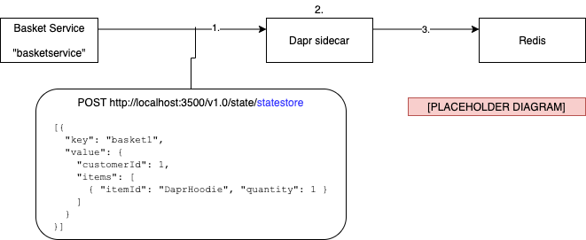

# The Dapr state management building block

Distributed applications are composed of many different services. For some of the services, keeping track of state is critical. For example, consider the shopping basket service in eShop. If the service wouldn't keep track of state, the customer would loose the content of the shopping basket each time he/she left the website. That's not really good for sales. To solve this, the shopping basket service needs to persist its state in a data store, such as a SQL Database. The [Dapr state management building block](https://docs.dapr.io/developing-applications/building-blocks/state-management/) makes it very easy to store state in a variety of external data stores.

> [!NOTE]
> By storing the state in an external data store instead of local memory, the service itself can still be considered to be **stateless**. Stateless services are preferred over **statefull** services because they don't require that all requests from a specific user are handled by the same service instance. This means that stateless services can be very easily scaled horizontally as the number of users grow.

To try out the state management building block yourself, have a look at the [counter application walkthrough in chapter 3](ch3-getting-started.md).

## What it solves

While keeping track of state is an important part of a distributed application, it also comes with additional challenges. For example:

- The application may require different types of data stores.
- The application may require different consistency levels for accessing and updating data.
- Multiple users may be accessing and updating data at the same time, requiring some sort of conflict resolution.
- Services must retry any short-lived [transient errors](https://docs.microsoft.com/aspnet/aspnet/overview/developing-apps-with-windows-azure/building-real-world-cloud-apps-with-windows-azure/transient-fault-handling) that may occur while interacting with the data store.

The Dapr state management building block directly addresses these challenges. It provides a flexible way to integrate with existing data stores without adding or learning any third-party SDKs.

> [!IMPORTANT]
> Dapr state management offers a key/value API. It is not optimized for other types of data such as large models of relational or graph data. For example, eShopOnDapr does not use Dapr state management to store all data in the application. Relational data used in the Catalog service is stored in SQL Server using Entity Framework Core. The Basket API does use Dapr state management to store the basket contents because that scenario is a good fit for a key/value store.

## How it works

The Dapr sidecar provides the API to store and retrieve key/value pairs. The actual persistence of the data is done by a configurable state store component. You can choose from a growing collection of [supported state stores](https://docs.dapr.io/operations/components/setup-state-store/supported-state-stores/), such as Azure Cosmos DB, SQL Server, and Cassandra.

The state management API supports both HTTP and gRPC. This is the base URL of the HTTP API:

```http
http://localhost:<daprPort>/v1.0/state/<state-store-name>/
```

- `<daprPort>`: the HTTP port that Dapr listens on.
- `<state-store-name>`: the name of the state store component to use.

In figure 5-1, a Dapr-enabled shopping basket service stores a key/value pair using the state store component named `statestore`.



**Figure 5-1**. Storing a key/value pair in a Dapr state store.

1. The service calls the state API on the sidecar. The JSON payload in the request body contains the data to store. Because this is a JSON array, you can store multiple key/value pairs with a single API call.
1. The sidecar uses the statestore component configuration to determine where to persist the data. The configuration of the state store is defined in a component configuration YAML file.
1. The sidecar persists the data in the Redis cache.

Retrieving the stored data is just another API call. In the example below, *curl* is used to retrieve the data by directly calling the sidecar API:

```
curl http://localhost:3500/v1.0/state/statestore/basket1
```

 Running the curl command returns the stored state in the response body:

```json
{
  "items": [
    {
      "itemId": "DaprHoodie",
      "quantity": 1
    }
  ],
  "customerId": 1
}
```

The following sections explain how to use more advanced features of the state management building block, such as setting consistency and concurrency requirements, retrying failed requests, and performing bulk operations.

### Consistency

The [CAP theorem](https://en.wikipedia.org/wiki/CAP_theorem) states that it's impossible to build a distributed application that satisfies more than two out of the following three properties: **(C)onsistency**, **(A)vailability**, and **(P)artition Tolerance**. All distributed applications need to be able to deal with "P", because they use networking and network disruptions will occur. Therefore, real world distributed applications can either be "AP" or "CP".

"AP" applications choose availability over consistency. This is supported in Dapr with the **eventual consistency** level, and is the default behavior of the state management building block. Consider an underlying data store, such as Azure CosmosDB, which uses multiple replicas to store data redundantly. With eventual consistency, the state store should asynchronously update the replicas *after* acknowledging the request. Read requests can return data from any of the replicas, including those that haven't received the latest updates yet.

"CP" applications choose consistency over availability. This is supported by using the **strong consistency** level. In this case, the state store should synchronously update all required replicas *before* completing the request. Read operations should return the most up-to-date data consistently across replicas.

The consistency level for a state operation is set by attaching a consistency hint to the operation. If no consistency hint is set, the default behavior is **eventual**. The following *curl* command shows how to write a `Hello=World` key/value pair to a state store using a strong consistency hint:

```bash
curl -X POST http://localhost:3500/v1.0/state/<store_name> \
  -H "Content-Type: application/json" \
  -d '[
        {
          "key": "Hello",
          "value": "World",
          "options": {
            "consistency": "strong"
          }
        }
      ]' 
```

> [!IMPORTANT]
> It is up to the state store component to try to fulfill the consistency hints attached to operations. Not all data stores  support the different consistency levels.

### Concurrency

In any application with more than one user, there's a chance of multiple users updating the same data concurrently (at the same time). Dapr support optimistic concurrency control (OCC) to resolve these kind of conflicts. OCC is based on the assumption that in real world scenarios, update conflicts do not happen that often because users typically work on different parts of the data. Therefore, it's better to assume that an update will succeed and retry if it doesn't, instead of using (often unnecessary) locks in the data store which may impact performance because of data contention.

Dapr uses **ETags** to implement OCC. An ETag is a value attached to a specific version of a stored key/value pair. Each time the key/value pair is updated, the ETag is changed as well. To update data in the data store, the client must attach the ETag of the version to update to the request. The state store component should only allow the update if the attached ETag matches with the latest ETag in the data store. If some other client has updated the data in the meantime, the ETags will not match and the request will fail. At this point, the client may refresh the data and retry the update. This strategy is called **first-write-wins**.

It is also possible to use a **last-write-wins** strategy. In this case, the client doesn't attach an ETag to the write request. The state store component will always allow the update to go through. Last-write-wins is useful for high-throughput write scenarios in which data contention is low or has no negative effects.

### Transactions

Dapr supports transactions to write multi-item changes to the data store as if it is a single operation. This functionality is only available for data stores that support [ACID](https://en.wikipedia.org/wiki/ACID) transactions, such as Redis, MongoDB, PostgreSQL, SQL Server, and Azure CosmosDB.

In the example below, multiple operations are sent to the state store in a single transaction. Either all operations will succeed and the transaction is committed, or one or more operations fail and the transaction is rolled back.

```bash
curl -X POST http://localhost:3500/v1.0/state/<store_name>/transaction \
  -H "Content-Type: application/json" \
  -d '{
        "operations": [
          {
            "operation": "upsert",
            "request": { "key": "Key1", "value": "Value1"
            }
          },
          {
            "operation": "delete",
            "request": { "key": "Key2" }
          }
        ]
      }'
```

For data stores that don't support transactions, you can still update multiple keys in a single request as shown in the example below:

```bash
curl -X POST http://localhost:3500/v1.0/state/<store_name> \
  -H "Content-Type: application/json" \
  -d '[
        { "key": "Key1", "value": "Value1" },
        { "key": "Key2", "value": "Value2" }
      ]' 
```

With this bulk operation, Dapr will submit each key/value pair update as a separate request to the data store.

## Using the .NET SDK

The Dapr .NET SDK provides language specific support for .NET Core developers. You can use the `DaprClient` class introduced in [chapter 3](ch3-getting-started.md) to read and write data. The following example demonstrates how to use the `GetStateAsync<TValue>` method to read data from the state store. The method takes the state store name `statestore` and the key `AMS` as parameters:

```c#
var weatherForecast = await daprClient.GetStateAsync<WeatherForecast>("statestore", "AMS");
```

If the state store does not contain any data for key `AMS`, the result will be `default(WeatherForecast)`.

To write data to the data store, use the `SaveStateAsync<TValue>` method:

```c#
daprClient.SaveStateAsync("statestore", "AMS", weatherForecast);
```

The example above uses the **last-write-wins** strategy because no ETag is passed to the state store component. To use OCC with a **first-write-wins** strategy, first retrieve the current ETag using the `GetStateAndETagAsync` method. Then write the updated value and pass along the retrieved ETag using the `TrySaveStateAsync` method.

```c#
var (weatherForecast, etag) = await daprClient.GetStateAndETagAsync<WeatherForecast>("statestore", city);

// ... make some changes to the retrieved weather forecast

var result = await daprClient.TrySaveStateAsync("statestore", city, weatherForecast, etag);
```

The`TrySaveStateAsync` method fails when the data (and the associated ETag) in the state store has been changed since it was last retrieved. The method returns a boolean value to indicate whether the call succeeded. One way to handle the failure scenario is to simply reload the updated data from the state store and try making the changes again. This should also include checking whether it's still useful to make the changes now that the original data has been changed. If you always want your writes to succeed, no matter what other changes have been made to the data, it's easier to use the **last-write-wins** strategy.

The SDK provides additional methods to retrieve data in bulk, delete data, and execute transactions. For more information, see the [Dapr .NET SDK repository](https://github.com/dapr/dotnet-sdk).

### ASP.NET Core integration

Dapr also provides ASP.NET Core integration for state management, allowing you to use ASP.NET Core model binding to load state. To configure the integration, be sure to call `IMVCBuilder.AddDapr` in your `Startup.cs`:

```c#
public void ConfigureServices(IServiceCollection services)
{
    services.AddControllers().AddDapr();
}
```

Once configured, the `FromState` attribute enables injecting a key/value pair directly into a controller action method without having to use `DaprClient` directly. The example below shows a Web API that returns the weather forecast for a given city:

```c#
[HttpGet("{city}")]
public ActionResult<WeatherForecast> Get([FromState("statestore", "city")] StateEntry<WeatherForecast> forecast)
{
    if (forecast.Value == null)
    {
      return NotFound();
    }

    return forecast.Value;
}
```

In the example, the controller loads the weather forecast from the state store named `statestore`. The second parameter of the `FromState` constructor is the name of the route template variable from which to get the state key. If you omit the second parameter, the name of the bound method parameter is used (which is `forecast` in this case) to look up the route template variable.

The `StateEntry` class contains properties for all the information that is retrieved for a single key/value pair: `StoreName`, `Key`, `Value`, and `ETag`. It's very useful because access to the ETag value is required for OCC. It also provides methods that allow you to delete or update the retrieved data without requiring a `DaprClient` instance. In the following example, the `TrySaveAsync` method is used to update the retrieved weather forecast using OCC.

```c#
[HttpPut("{city}")]
public async Task Put(WeatherForecast updatedForecast, [FromState("statestore", "city")] StateEntry<WeatherForecast> currentForecast)
{
    currentForecast.Value = updatedForecast;

    var succes = await currentForecast.TrySaveAsync();
    // ... check result
}
```

## State store components

At the time of writing, Dapr provides support for the following state stores including full transaction support:

- Azure CosmosDB
- Azure SQL Server
- MongoDB
- PostgreSQL
- Redis

The following state stores are also supported, but don't have built-in support for multi-item transactions. You can still use these components for all other CRUD operations:

- Aerospike
- Azure Blob Storage
- Azure Table Storage
- Cassandra
- Cloudstate
- Couchbase
- etcd
- Google Cloud Firestore
- Hashicorp Consul
- Hazelcast
- Memcached
- Zookeeper

### Configuration

When you initialize Dapr for local development in self hosted mode, Dapr automatically installs and configures Redis as a state store named `statestore`. As state stores are named, you can use multiple state store components per application. Here's an example of the default state store configuration:

```yaml
apiVersion: dapr.io/v1alpha1
kind: Component
metadata:
  name: statestore
spec:
  type: state.redis
  metadata:
  - name: redisHost
    value: localhost:6379
  - name: redisPassword
    value: ""
  - name: actorStateStore
    value: "true"
```

The Redis state store requires both `redisHost` and `redisPassword` metadata to be set to connect to the Redis instance. In the example above, the Redis password (which is an empty string by default) is stored as a plain string. It's recommended to use a secret reference instead. To learn more about secret management, see [chapter 10](ch10-secrets.md).

The other metadata field in the example, `actorStateStore`, indicates whether this state store can be used to store actor state. For more information on actors, see [chapter 11](ch11-actors.md).

### Key prefix strategies

State store components can use different strategies to store key/value pairs in the underlying data store. Consider the example from the beginning of this chapter where the shopping basket service stores the contents of a shopping basket for a customer:

```bash
curl -X POST http://localhost:3500/v1.0/state/statestore \
  -H "Content-Type: application/json" \
  -d '[{
        "key": "basket1",
        "value": {
          "customerId": 1,
          "items": [
            { "itemId": "DaprHoodie", "quantity": 1 }
          ]
        }
     }]' 
```

Let's have a look inside the Redis cache to see how the Redis state store component persisted the data:

```
127.0.0.1:6379> KEYS *
1) "basketservice||basket1"

127.0.0.1:6379> HGETALL basketservice||basket1
1) "data"
2) "{\"items\":[{\"itemId\":\"DaprHoodie\",\"quantity\":1}],\"customerId\":1}"
3) "version"
4) "1"
```

As you can see in the output above, the full Redis key for the data is `basketservice||basket1`. By default, Dapr uses the application id (`basketservice`) as a prefix for the key. This allows multiple Dapr instances to use the same data store without running into key collisions. It also means that it's critical to always specify an application id when running your application with Dapr. If you don't specify an application id, Dapr will generate a unique value when you run the application. Each time the application id changes, the application will no longer be able to access the state stored with the previous key prefix.

It is possible to change this behavior and configure a different strategy for selecting the key prefix. If you want to use a constant value for the prefix, set the `keyPrefix` metadata field in the configuration to the desired value:

```yaml
spec:
  metadata:
  - name: keyPrefix
  - value: MyPrefix
```

Having a constant key prefix allows you to access the state store from multiple Dapr applications. You can even omit the prefix completely by setting the value of `keyPrefix` to `none`.

## Reference architecture: eShopOnDapr

The original [eShopOnContainers](https://github.com/dotnet-architecture/eShopOnContainers) microservice reference architecture uses an `IBasketRepository` interface to read and write data in the Basket service. The `RedisBasketRepository` class provides the implementation using Redis as the underlying data store:

```c#
public class RedisBasketRepository : IBasketRepository
{
    private readonly ConnectionMultiplexer _redis;
    private readonly IDatabase _database;

    public RedisBasketRepository(ConnectionMultiplexer redis)
    {
        _redis = redis;
        _database = redis.GetDatabase();
    }

    public async Task<CustomerBasket> GetBasketAsync(string customerId)
    {
        var data = await _database.StringGetAsync(customerId);

        if (data.IsNullOrEmpty)
        {
            return null;
        }

        return JsonConvert.DeserializeObject<CustomerBasket>(data);
    }

    // ...
}
```

This code uses the third-party `StackExchange.Redis` NuGet package. The following steps are taken to load the basket for a given customer:

1. Inject a `ConnectionMultiplexer` into the constructor. The `ConnectionMultiplexer` is registered with the dependency injection framework in the `Startup.cs` file:

   ```c#
   services.AddSingleton<ConnectionMultiplexer>(sp =>
   {
       var settings = sp.GetRequiredService<IOptions<BasketSettings>>().Value;
       var configuration = ConfigurationOptions.Parse(settings.ConnectionString, true);
       configuration.ResolveDns = true;
       return ConnectionMultiplexer.Connect(configuration);
   });
   ```

1. Use the `ConnectionMultiplexer` to create an `IDatabase` instance.

1. Use the `IDatabase` instance to execute a Redis StringGet call using the given `customerId` as the key.

1. Check if data is loaded from Redis; if not, return `null`.

1. Deserialize the data from Redis to a `CustomerBasket` object and return the result.

In the updated [eShopOnDapr](https://github.com/dotnet-architecture/eShopOnDapr) implementation, a new `DaprBasketRepository` class replaces the `RedisBasketRepository` class:

```c#
public class DaprBasketRepository : IBasketRepository
{
    private const string StoreName = "eshop-basket-statestore";

    private readonly DaprClient _daprClient;

    public DaprBasketRepository(DaprClient daprClient)
    {
        _dapr = dapr;
    }

    public async Task<CustomerBasket> GetBasketAsync(string customerId)
    {
        return await _dapr.GetStateAsync<CustomerBasket>(StoreName, customerId);
    }

    // ...
}
```

The new code uses the Dapr .NET SDK to read and write data using the state management building block. The new steps to load the basket for a customer are:

1. Inject a `DaprClient` into the constructor. The `DaprClient` is registered with the dependency injection framework in the `Startup.cs` file.
1. Use the `DaprClient.GetStateAsync` method to load the customer's basket from the configured state store and return the result.

The new implementation still uses Redis as the underlying data store. But instead of having a direct reference on the `StackExchange.Redis` NuGet package, a Dapr configuration file is all that's needed:

```yaml
apiVersion: dapr.io/v1alpha1
kind: Component
metadata:
  name: eshop-basket-statestore
  namespace: default
spec:
  type: state.redis
  metadata:
  - name: redisHost
    value: redis:6379
  - name: redisPassword
    secretKeyRef:
      name: redisPassword
auth:
  secretStore: eshop-secretstore
```

Changing the underlying data store is now very easy. For example, switching to Azure Table Storage only requires changing the contents of the configuration file. No code changes are necessary.

## Summary

The Dapr state management building block offers an API for storing key/value data in a variety of data stores. The API provides support for bulk operations, strong and eventual consistency, optimistic concurrency control, and multi-item transactions.

The .NET SDK provides language specific support for .NET Core as well as integration with ASP.NET Core. Model bindings make it easy to access and update state from ASP.NET Core controller action methods.

In eShopOnDapr, the benefits of using Dapr state management instead of having a direct reference to the third-party `StackExchange.Redis` NuGet package are clear: 

1. The new implementation uses less lines of code. 
1. Replacing the underlying Redis cache with a different type of data store now only requires changes to the state store configuration file.

### References

- [Dapr supported state stores](https://docs.dapr.io/operations/components/setup-state-store/supported-state-stores/)

>[!div class="step-by-step"]
>[Previous](index.md)
>[Next](index.md)
