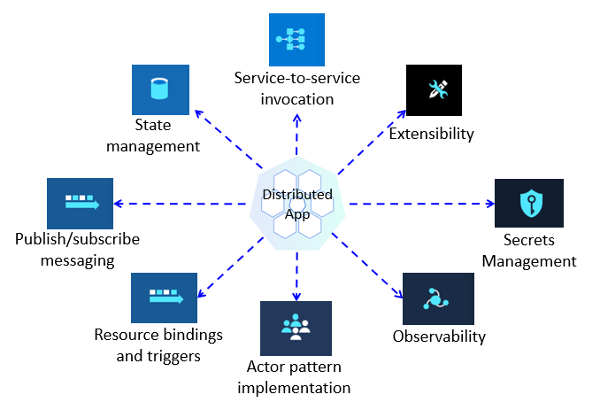
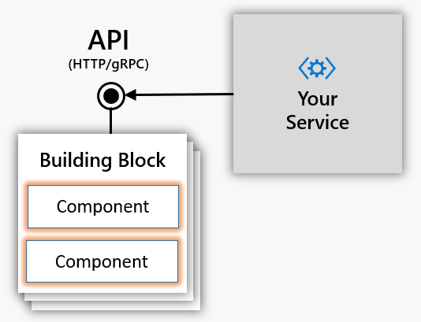
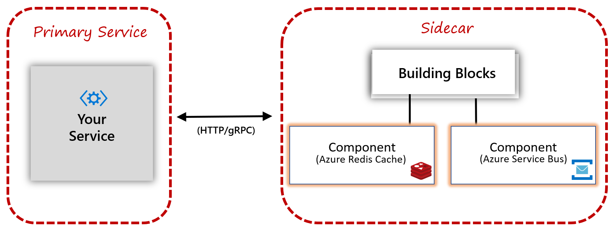
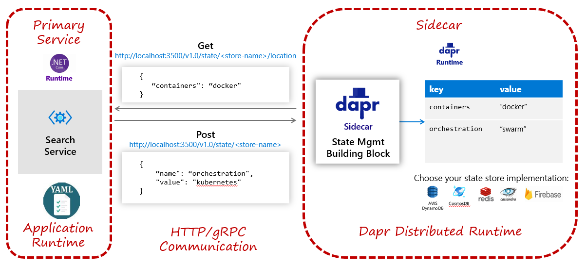
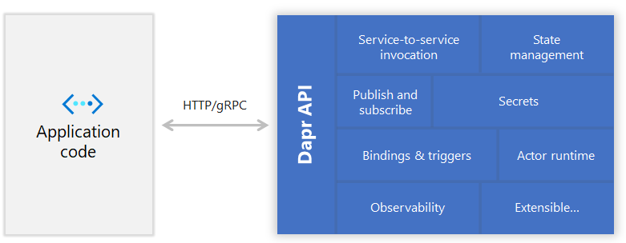
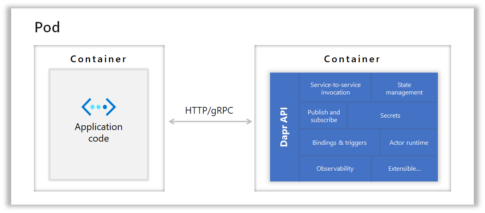
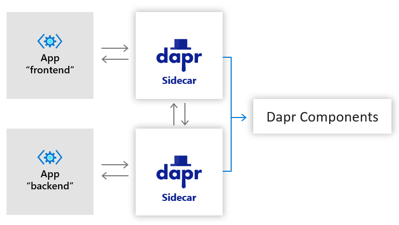
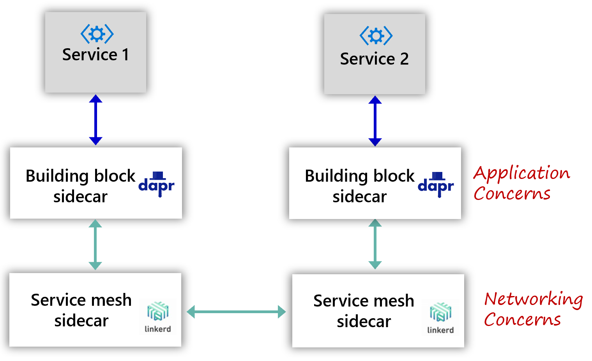

# Dapr @ 20,000 feet

In chapter 1, we discussed the appeal of distributed microservice applications. But, we also pointed out that they dramatically increase architectural and operational complexity. With that in mind, the question becomes, how can we "have our cake" and "eat it too?" That is, how can we take advantage of the agility, but minimize the complexity.

Ladies and Gentlemen, please stand and welcome.... `Dapr`.

Dapr, or *Distributed Application Runtime*, is a new way to build modern distributed applications.

What started as a prototype has evolved into a highly successful open-source project. Its sponsor, Microsoft, has closely partnered with customers and the open-source community to design and build Dapr. The Dapr project brings together developers from all backgrounds to solve some of the toughest challenges of developing distributed applications.     

This book looks at Dapr through the lens of the .NET Core platform. In this chapter, we help you build a solid conceptual understanding of Dapr and how it works. Later on, we present practical, hands-on instruction on how to use Dapr in your applications.

## What is Dapr?

Imagine flying in a jet at 20,000 feet. You look out the window and see the landscape from a wide perspective. Let's do the same for Dapr. Visualize yourself flying over at Dapr at 20,000 feet. What would you see?

At its core, Dapr is a `portable, event-driven runtime`. 

 - `Portable` - Your write your application code once and run it on public clouds and edge devices. With a configuration file, you specify distributed application capabilities that you wish to include in your environment. These capabilities include service-to-service invocation, state management, and pub/sub messaging. Later, should you move your app, you update the configuration with bindings for the new environment. Your service never holds direct references to distributed application capabilities - Dapr does that.

  - `Event-driven` - Dapr supports event-driven resource binding and pub-sub messaging services. You can receive events from or sends events to external resources, such as datastores, streaming services, or web hooks. You can also publish and subscribe to events from message brokers - with minimal code and, again, no direct reference to the external service. 

 - `Runtime` - Dapr exposes a runtime engine that runs your services - whatever the programming platform. For example, Dotnet Core is a runtime engine - you run services within it. Dapr is *also* a runtime engine. You invoke the Dapr runtime and instruct it to start the dotnet runtime. Under the hood, Dapr implements a `distributed runtime` by operating along side with your application using a `sidecar` architecture. More about *sidecars* coming up.

## What does Dapr solve?

Dapr addresses a large challenge inherent in modern distributed applications: `Complexity`. 

Through an architecture of pluggable components, Dapr helps simplify plumbing concerns. It enables your services to bind to distributed application capabilities. The runtime provides a `dynamic glue` that fuses together service component plumbing *without* tightly coupled references. For example, your application may require a state store. You could write custom code to wrap Azure Redis Cache and inject it into your service at runtime. However, Dapr greatly simplifies your experience. You instruct your  service to invoke a Dapr `building block` that dynamically binds to Redis Cache via a configuration. With this model, your service delegates the call to Dapr, which, calls Redis on your behalf. Your service has no SDK, library, or reference to Redis. You code against the common Dapr state management API, not the Redis Cache API.

Figure 2-1 shows Dapr from 20,000 feet.


**Figure 2-1**. Dapr at 20,000 feet.

In the top row of the figure, note how Dapr provides language-specific SDKs for popular development platforms. Dapr v 1.0 includes supports Go, Node.js, Python, .NET, Java, and JavaScript. This book will focus on the .NET Dapr SDK, which also provides direct support for ASP.NET Core services.

While language-specific SDKs enhance the developer experience, Dapr is  platform agnostic. Under the hood, Dapr's programming model exposes capabilities through standard HTTP/gRPC communication protocols. As the second row highlights, any programming platform can call Dapr via its native HTTP and gRPC APIs.  

The blue boxes across the center of the figure present the distributed building blocks. Each abstracts a distributed application capability that your application can consume.

The bottom row highlights the portability of Dapr and the diverse environments across which it can run. 

## Dapr architecture

At this point, our jet turns around and flies back over Dapr, descending in altitude, giving us a closer look at how Dapr works.

### Building blocks

From our new perspective, we see that Dapr is built on the concept of `building blocks`. 

A building block is an HTTP or gRPC API that encapsulates a distributed application capability. Figure 2-2 shows the available blocks for Dapr v 1.0.



**Figure 2-2**. Dapr building blocks.

The following table describes the services provided by each block.

| Building Block | Description |
| :-------- | :-------- |
| [Service-to-service communication](https://github.com/dapr/components-contrib/tree/master/nameresolution) | Invoke direct, secure service-to-service calls using platform agnostic protocols and well-known endpoints. |
| [Asynchronous messaging](https://github.com/dapr/components-contrib/tree/master/state) | Implement secure, scalable pub/sub messaging between services. |
| [State](https://github.com/dapr/components-contrib/tree/master/pubsub) | Support contextual information for long running stateful services. |
| [Observability](https://github.com/dapr/components-contrib/tree/master/bindings) | Monitor and measure message calls across networked services. |
| [Secrets](https://github.com/dapr/components-contrib/tree/master/middleware) | Securely access external secret stores. |
| [Actors](https://github.com/dapr/components-contrib/tree/master/secretstores) | Encapsulate logic and data in reusable actor objects. |
| [Resource bindings](https://github.com/dapr/components-contrib/tree/master/exporters) | Trigger code from events raised by external resources with bi-directional communication. |

Building blocks abstract the implementation of distributed application capabilities from your services. Figure 2-3 shows this interaction. 



**Figure 2-3**. Dapr building block integration.

Note how your service invokes a Dapr building block via HTTP or gRPC. Under the hood, the building block invokes pre-configured components that provide the concrete implementation for an external capability. Your code only knows about the building block. Your service takes no dependencies on external SDKs or libraries - Dapr handles the plumbing for you. Each building block is independent. You can use one, some, or all of them in your application. As a value-add, Dapr building blocks bake in industry best practices.

We provide detail explanation and code samples for each Dapr building block in the upcoming chapters. At this point, our jet descends even more. From our new perspective, we can now see the lower-level Dapr components layer.

### Components

While building blocks expose an API to invoke distributed application capabilities, Dapr components provide the concrete implementation to make it happen. 

Consider, the Dapr `state store` component. It provides a uniform way to manage state for CRUD operations. Without any change to your service code, you could implement any of the following Dapr state components:

- AWS DynamoDB
- Aerospike
- Azure Blob Storage
- Azure CosmosDB
- Azure Table Storage
- Cassandra
- Cloud Firestore (Datastore mode)
- CloudState
- Couchbase
- Etcd
- HashiCorp Consul
- Hazelcast
- Memcached
- MongoDB
- PostgreSQL
- Redis
- RethinkDB
- SQL Server
- Zookeeper 

Each component provides the necessary implementation through a common state management interface:

   ```go
   type Store interface {
	    Init(metadata Metadata) error
	    Delete(req *DeleteRequest) error
	    BulkDelete(req []DeleteRequest) error
	    Get(req *GetRequest) (*GetResponse, error)
	    Set(req *SetRequest) error
	    BulkSet(req []SetRequest) error
  }
   ```   

   > Note: The Dapr interface above along with all of Dapr has been written in the Golang, or Go, platform. Go is a popular language across the open source community and attests to cross-platform commitment of Dapr. 

Perhaps you start with Azure Redis Cache as your state store. You specify it with the following configuration:

   ```yaml
   apiVersion: dapr.io/v1alpha1
   kind: Component
   metadata:
     name: statestore
     namespace: default
   spec:
     type: state.redis
     metadata:
     - name: redisHost
       value: <HOST>
     - name: redisPassword
       value: <PASSWORD>
     - name: enableTLS
       value: <bool> # Optional. Allowed: true, false.
     - name: failover
       value: <bool> # Optional. Allowed: true, false.
   ```   
Note how the `spec` section specifies Azure Redis Cache. Dapr will send your state management calls to Redis Cache. Under the hood, Dapr binds to the Redis Cache component on your behalf.

If you're familiar with Kubernetes, you'll note how Dapr configuration files closely resemble Kubernetes manifest files. Essentially, they define a policy that affects how each Dapr instance behaves and the specific distributed application capabilities required. Configuration can be applied to Dapr instances dynamically.

At a later time, you may want to migrate your state management to Azure Table Storage. Azure Table Storage provides state management capabilities that are affordable and highly durable.

While your service code would remain the same, you would modify the definition of your state component, as follows:

   ```yaml   
   apiVersion: dapr.io/v1alpha1
   kind: Component
   metadata:
     name: <NAME>
     namespace: <NAMESPACE>
   spec:
     type: state.azure.tablestorage
     metadata:
       - name: accountName
         value: <REPLACE-WITH-ACCOUNT-NAME>
       - name: accountKey
         value: <REPLACE-WITH-ACCOUNT-KEY>
       - name: tableName
         value: <REPLACE-WITH-TABLE-NAME>
   ```   
Note how the `spec` section now specifies Azure Table Storage. Based on the new configuration, Dapr will bind state management calls to Azure Table Storage.

With this model, the developer is never exposed to the Redis or Azure Table Storage APIs. Dapr abstracts these APIs away in its component and binding. 

A building block can use a combination of components. For example, the Actor and the State Management building blocks both consume a State component. As another example, the Pub/Sub building block consumes a Pub/Sub component.

At the time of this writing, the following component types are provided by Dapr:

| Component | Description |
| :-------- | :-------- |
| [Service discovery](https://github.com/dapr/components-contrib/tree/master/nameresolution) | Used by the Service Invocation building block to integrate with the hosting environment to provide service-to-service discovery. |
| [State](https://github.com/dapr/components-contrib/tree/master/state) | Provides uniform interface to interact with wide variety of state store implementations. |
| [Pub/sub](https://github.com/dapr/components-contrib/tree/master/pubsub) | Provides uniform interface to interact with wide variety of message bus implementations. |
| [Bindings](https://github.com/dapr/components-contrib/tree/master/bindings) | Provides uniform interface to trigger application events from external systems and invoke external systems with optional data payloads. |
| [Middleware](https://github.com/dapr/components-contrib/tree/master/middleware) | Allows custom middleware to plug into the request processing pipeline and invoke additional actions on a request or response. |
| [Secret stores](https://github.com/dapr/components-contrib/tree/master/secretstores) | Provides uniform interface to interact with external secret stores, including cloud, edge, commercial, open-source services. |
| [Tracing exporters](https://github.com/dapr/components-contrib/tree/master/exporters) | Provides uniform interface to open telemetry wrappers. |

As our jet completes it fly over of Dapr, we look back once more and can see how it connects together.

### Sidecar Architecture

Dapr exposes its building blocks and components through a [sidecar architecture](https://docs.microsoft.com/azure/architecture/patterns/sidecar). A sidecar enables that Dapr to run in a separate memory process or separate container alongside your service. Sidecars provide isolation and encapsulation as they aren't part of the service, but connected to it. This separation enables each to have its own runtime environment and be built upon different programming platforms. Figure 2-4 shows a sidecar pattern.



**Figure 2-4**. Sidecar architecture.

This pattern is named Sidecar because it resembles a sidecar attached to a motorcycle. In the previous figure, note how the Dapr sidecar is attached to your service to provide distributed application capabilities. The Dapr sidecar shares the same lifecycle as your service. It's created and retired alongside the parent. 

Figure 2-5 shows an example of a Dapr sidecar for state management.



**Figure 2-5**. Sidecar architecture for state management.

In this scenario, the search service, on the left, needs to manage application state with a state store. Note how the search service runs within its own runtime. It contains a YAML-based configuration file specifying the state store implementation it wishes to consume from Dapr.

The Dapr runtime on the right exposes a State Management building block exposed as a side car. The YAML configuration specifies the exact state management component to use. 

In the middle, note how the search service and Dapr are decoupled and communicate via HTTP or gRPC.

It's important to understand that the search service has no direct dependencies to underlying state store. Instead it consumes the Dapr State Management building block, exposed as a stand-alone sidecar service. The building block is then responsible for calling into state store component. 

### Hosting Environments

Dapr can be hosted in multiple environments. It can self-host for local development. Dapr can also deploy to Kubernetes, a group of VMs, or edge environments such as Azure IoT Edge.

In [self-hosted mode](https://docs.dapr.io/concepts/overview/#self-hosted) Dapr runs as a separate sidecar, which your service code can invoke via HTTP or gRPC. Self-hosting modes allows for local development. Figure 2-6 shows an application and Dapr  hosted in two separate memory processes communicating via HTTP or gRPC.



**Figure 2-6**. Self-hosted Dapr sidecar

Dapr also runs in [containerized environments](https://docs.dapr.io/concepts/overview/#kubernetes-hosted), such as Kubernetes. Figure 2-7 shows Dapr running in a separate side-car container along with the application container in the same Kubernetes pod.



**Figure 2-7**. Kubernetes-hosted Dapr sidecar

## Dapr performance considerations

As you've seen, Dapr exposes a sidecar architecture to decouple your application from distributed application capabilities. Invoking a Dapr operation requires at least one out-of-process network call. Figure 2-7 presents an example of a Dapr traffic pattern.



**Figure 2-7**. Dapr traffic patterns

Looking at the previous figure, one might question the latency and overhead incurred for each call.  

The Dapr team has invested heavily in performance. A tremendous amount of engineering effort has gone into to making Dapr efficient. Calls between Dapr sidecars are always made with gRPC, which delivers high performance and small, binary payloads. In most cases, the additional overhead should be less than 1 millisecond. 

To increase performance, developers can implement calls to Dapr building blocks with gRPC. 

gRPC is a modern, high-performance framework that evolves the age-old [remote procedure call (RPC)](https://en.wikipedia.org/wiki/Remote_procedure_call) protocol. gRPC uses HTTP/2 for its transport protocol, which provides significant performance enhancements over HTTP RESTFul service, including:

- Multiplexing support for sending multiple parallel requests over the same connection - HTTP 1.1 limits processing to one request/response message at a time.
- Bidirectional full-duplex communication for sending both client requests and server responses simultaneously.
- Built-in streaming enabling requests and responses to asynchronously stream large data sets.

## Dapr and service meshes

Service mesh is another rapidly evolving technology for distributed applications. 

A service mesh is a configurable infrastructure layer with built-in capabilities to handle service-to-service communication, resiliency, load balancing, and telemetry capture. It moves the responsibility for these concerns out of the microservices and into service mesh layer. Like Dapr, a service mesh also exposes a sidecar architecture.

Figure 2-8 shows an application that implements service mesh technology.


**Figure 2-8**. Service mesh with a side car.

Note in the previous figure how messages are intercepted by a proxy that runs alongside each microservice. Each proxy can be configured with traffic rules specific to the microservice. It understands messages and can route them across your services and the outside world.

So the question becomes, "Is Dapr a service mesh?"

While both technologies use a sidecar architecture, each is different. Dapr provides distributed application features. A service mesh provides a dedicated network infrastructure layer.

As each technology works at a different level, both can work together in the same application. Connected together, application traffic would route to the Dapr sidecar first and then the service mesh sidecar and then out. On the other end, traffic would traverse the stack in reverse order: Service mesh to Dapr to application. 

Figure 2-9 shows an application that implements both Dapr and service mesh technology.



**Figure 2-9**. Dapr and service mesh together.

In the book, [Learning Dapr](https://www.amazon.com/Learning-Dapr-Building-Distributed-Applications/dp/1492072427/ref=sr_1_1?dchild=1&keywords=dapr&qid=1604794794&sr=8-1), authors Haishi Bai and Yaron Schneider, provided detailed coverage of Dapr and service mesh integration.

## Summary

This chapter introduced you to Dapr, a Distributed Application Runtime. 

Dapr is an open-source project sponsored by Microsoft with close collaboration from customers and the open-source community. 

At its core, Dapr helps reduce the inherent complexity of distributed microservice applications. It's built upon a concept of building block APIs. Dapr building blocks Expose common distributed application capabilities, such as state management, service-to-service invocation, and pub/sub messaging. Dapr components lie beneath the building blocks and provide the concrete implementation for each capability. Applications bind to various components through configuration files. 

In the next chapters, we present practical, hands-on instruction on how to use Dapr in your applications.

### References

- [Dapr documentation](https://dapr.io/)

- [Learning Dapr](https://www.amazon.com/Learning-Dapr-Building-Distributed-Applications/dp/1492072427/ref=sr_1_1?dchild=1&keywords=dapr&qid=1604794794&sr=8-1)

- [.NET Microservices: Architecture for Containerized .NET applications](https://dotnet.microsoft.com/download/thank-you/microservices-architecture-ebook)

- [Architecting Cloud-Native .NET Apps for Azure](https://dotnet.microsoft.com/download/e-book/cloud-native-azure/pdf)

>[!div class="step-by-step"]
>[Previous](the-world-is-distributed.md)
>[Next](index.md)


https://dotnet.microsoft.com/download/e-book/cloud-native-azure/pdf