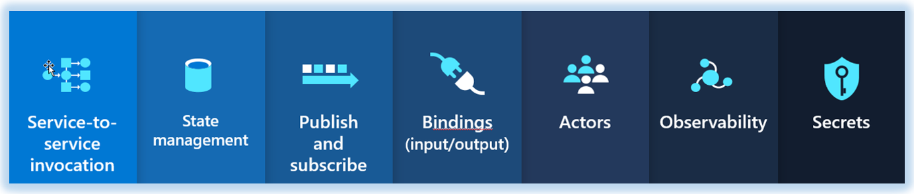

# Dapr @ 20,000 feet

In chapter 1, we discussed the appeal of distributed microservice applications. But, we also pointed out that they dramatically increase architectural and operational complexity. With that in mind, the question becomes, how can we "have our cake" and "eat it too?" That is, how can we take advantage of the agility, but minimize the complexity.

Ladies and Gentlemen, please welcome Dapr.

Dapr, or *Distributed Application Runtime* is a new way to build distributed applications.

What started as a prototype at Microsoft has evolved into a highly successful open-source project. As its sponsor, Microsoft has partnered with customers and the open-source community to build and extend Dapr. This concerted effort validates the willingness of developers from all backgrounds to solve some of the toughest challenges when developing distributed applications.     

In this book, we look at Dapr through the lens of the .NET Core platform. In this chapter, we help you build a solid conceptual understanding of Dapr and how it works.

## What is Dapr?

Imagine flying in a jet at 20,000 feet. You look out the window and see the landscape from a wide perspective. Let's do the same for Dapr. Visualize yourself flying over at Dapr at 20,000 feet. What would you see?

At its core, Dapr is a `portable, event-driven runtime`. 

 - `Portable` - Your write your application code once and run it on public clouds and edge devices. With a configuration file, you specify the external infrastructure services that you wish to include in your environment. These services might include pub-sub messaging, state management, or service-to-service invocation. Later, if you move your app to another environment, you swap out the configuration file with one that specifies bindings to service components in the new environment. Your service doesn't hold direct references to the external services - Dapr does that.

 - `Event-driven` - Dapr supports event-driven resource binding and pub-sub messaging services. You can receive events from external resources, such as datastores, streaming services, or web hooks. You can also publish and subscribe to events from message brokers - with minimal code and, again, no direct reference to the external service. 

 - `Runtime` - Dapr exposes a runtime engine that runs your services - regardless of programming platform. For example, Dotnet Core is a runtime engine - you run services within it. Dapr is *also* a runtime engine. You invoke the Dapr runtime and instruct it to start the dotnet runtime. Under the hood, Dapr implements a `distributed runtime` by operating along side with your application using a `sidecar` architecture. More about *sidecars* coming up.

## What does Dapr solve?

Dapr addresses a large challenge in modern distributed applications: `Complexity`. 

Through an architecture of pluggable components, Dapr helps simplify plumbing concerns. It enables your services to `dynamically bind` to infrastructure backing services and other microservices. The runtime provides a `dynamic glue` that fuses together service component plumbing *without* tightly coupled references. For example, your application may require a state store. You could write custom code to wrap Azure Redis Cache and inject it into your service at runtime. However, Dapr makes it easy. Your services invoke a Dapr `building block` that dynamically binds to Redis Cache via a configuration. With this model, your service delegates the call to Dapr, which, calls Redis on your behalf. Your service has no SDK, library, or reference to Redis.

Figure 2-x shows Dapr from 20,000 feet.


**Figure 2-x**. Dapr at 20,000 feet.

At the top of the figure, note how Dapr provides language-specific SDKs for most popular development platforms, including Go, Node.js, Python, .NET, Java, and JavaScript. This book will focus on the .NET Dapr SDK that also provides direct support for ASP.NET Core services.

While language-specific SDKs are available, Dapr is language and platform agnostic. The second row shows how any programming platform can call Dapr via its HTTP and gRPC APIs.  

The blue boxes across the center of the figure present the distributed building blocks. Each abstracts an infrastructure  service that your application can consume.

The bottom row highlights the portability of Dapr and the diverse environments across which it can run. Note that Dapr is supported across all public clouds.

## Dapr architecture

At this point, our jet turns around and flies back over Dapr, descending in altitude, giving us a closer look at how Dapr works.

### Building blocks

From our new perspective, we see that Dapr is built on the concept of `building blocks`. 

A building block is an HTTP or gRPC API that encapsulates an infrastructure service. Figure 2-x shows the available blocks for Dapr v 1.0.



**Figure 2-x**. Dapr building blocks.

The following table describes the infrastructure service contained in each block.

| Building Block | Description |
| :-------- | :-------- |
| [Service-to-service communication](https://github.com/dapr/components-contrib/tree/master/nameresolution) | Invoke direct, secure service-to-service calls using platform agnostic protocols and well-known endpoints. |
| [Asynchronous messaging](https://github.com/dapr/components-contrib/tree/master/state) | Implement secure, scalable pub/sub messaging between services. |
| [State](https://github.com/dapr/components-contrib/tree/master/pubsub) | Support contextual information for long running stateful services. |
| [Observability](https://github.com/dapr/components-contrib/tree/master/bindings) | Monitor and measure message calls across networked services. |
| [Secrets](https://github.com/dapr/components-contrib/tree/master/middleware) | Securely access external secret stores. |
| [Actors](https://github.com/dapr/components-contrib/tree/master/secretstores) | Encapsulate logic and data in reusable actor objects. |
| [Resource bindings](https://github.com/dapr/components-contrib/tree/master/exporters) | Trigger code from events raised by external resources with bi-directional communication. |

Building blocks treat infrastructure services as a black box. When your code requires access to an infrastructure service, it calls a building block API. Figure 2-x shows this interaction. 


**Figure 2-x**. Dapr building block integration.

Note how your service invokes the building block via HTTP or gRPC. Under the hood, the building block invokes pre-configured components that provide the concrete implementation for an external infrastructure service. Your code knows about the building block, but not the underlying infrastructure components. Your service takes no dependencies on external SDKs or libraries - Dapr takes care of that. Each building block is independent. You can use one, some, or all of them in your application.

We provide detail explanation and code samples for each Dapr building block in chapter x. Now, our jet descends even more to give us a close look at the lower-level Dapr components layer.

### Components

While building blocks expose an API to invoke infrastructure services, Dapr components provide the concrete implementation to make it happen. 

Consider, the Dapr `state store` component. It provides a uniform way to manage state for CRUD operations. Without any change to your service code, you could implement any of the following state components:

 - AWS DynamoDB
 - Aerospike
 - Azure Blob Storage
 - Azure CosmosDB
 - Azure Table Storage
 - Cassandra
 - Cloud Firestore (Datastore mode)
 - CloudState
 - Couchbase
 - Etcd
 - HashiCorp Consul
 - Hazelcast
 - Memcached
 - MongoDB
 - PostgreSQL
 - Redis
 - RethinkDB
 - SQL Server
 - Zookeeper 

Each is a Dapr component that provides the necessary implementation for a common interface:

   ```go
   type Store interface {
	    Init(metadata Metadata) error
	    Delete(req *DeleteRequest) error
	    BulkDelete(req []DeleteRequest) error
	    Get(req *GetRequest) (*GetResponse, error)
	    Set(req *SetRequest) error
	    BulkSet(req []SetRequest) error
  }
   ```   
Perhaps you start with Azure Redis Cache as your state store. You specify it with the following configuration:

   ```yaml
   apiVersion: dapr.io/v1alpha1
   kind: Component
   metadata:
     name: statestore
     namespace: default
   spec:
     type: state.redis
     metadata:
     - name: redisHost
       value: <HOST>
     - name: redisPassword
       value: <PASSWORD>
     - name: enableTLS
       value: <bool> # Optional. Allowed: true, false.
     - name: failover
       value: <bool> # Optional. Allowed: true, false.
   ```   
Note how the `spec` section specifies Azure Redis Cache. Dapr will bind your state management calls to Redis Cache.

If you are familiar with Kubernetes, you'll note how Dapr configuration files closely resemble Kubernetes manifest files. Essentially, they define a policy that affects how each Dapr instance behaves and the specific infrastructure service implementation, or component. Configuration can be applied to Dapr instances dynamically.

At a later time, you may want to migrate your state management to Azure Table Storage. Azure Table Storage provides state management capabilities that are affordable and highly durable.

While your service code would remain the same. you would modify definition of your state component, as follows:

   ```yaml   
   apiVersion: dapr.io/v1alpha1
   kind: Component
   metadata:
     name: <NAME>
     namespace: <NAMESPACE>
   spec:
     type: state.azure.tablestorage
     metadata:
       - name: accountName
         value: <REPLACE-WITH-ACCOUNT-NAME>
       - name: accountKey
         value: <REPLACE-WITH-ACCOUNT-KEY>
       - name: tableName
         value: <REPLACE-WITH-TABLE-NAME>
   ```   
Note how the `spec` section now specifies Azure Table Storage. Based on the new configuration, Dapr will bind subsequent state management calls to Azure Table Storage.

A building block can use a combination of components. For example, the Actor and the State Management building blocks both consume a State component. As another example, the Pub/Sub building block consumes a Pub/Sub component.

At the time, of this writing, the following component types are provided by Dapr:

| Component | Description |
| :-------- | :-------- |
| [Service discovery](https://github.com/dapr/components-contrib/tree/master/nameresolution) | Used by the Service Invocation building block to integrate with the hosting environment to provide service-to-service discovery. |
| [State](https://github.com/dapr/components-contrib/tree/master/state) | Provides uniform interface to interact with wide variety of state store implementations. |
| [Pub/sub](https://github.com/dapr/components-contrib/tree/master/pubsub) | Provides uniform interface to interact with wide variety of message bus implementations. |
| [Bindings](https://github.com/dapr/components-contrib/tree/master/bindings) | Provides uniform interface to trigger application events from external systems and invoke external systems with optional data payloads. |
| [Middleware](https://github.com/dapr/components-contrib/tree/master/middleware) | Allows custom middleware to plug into the request processing pipeline to perform additional actions on a request or response. |
| [Secret stores](https://github.com/dapr/components-contrib/tree/master/secretstores) | Provides uniform interface to interact with external secret stores, including cloud, edge, commercial, open source. |
| [Tracing exporters](https://github.com/dapr/components-contrib/tree/master/exporters) | Provides uniform interface to open telemetry wrappers. |

### Sidecar Architecture

Dapr exposes its building blocks and components as a `sidecar architecture`, either as a separate container or process, not requiring your service to include any Dapr runtime code. This makes integration with Dapr easy from other runtimes. It also  provides separation of the application logic for improved supportability.

Figure 2-x shows an example of a Dapr sidecar for state management.


**Figure 2-x**. Sidecar architecture for state management.

In this scenario, the search service, on the left, needs to store application state in a state store. Note how the service runs within its own runtime and contains a YAML-based configuration file specifying the state store implementation it wishes to consume from Dapr.

The Dapr runtime on the right exposes a State Management building block exposed as a side car. The YAML configuration specifies the exact implementation component to use. 

In the middle, note how the app and Dapr are decoupled and communicate across either HTTP or gRPC using a sidecar architecture.

Importantly, the search has no direct dependencies to underlying state store. Instead it invokes the Dapr State Management building block, exposed as a stand-alone sidecar service. It's  the sidecar API that is responsible for calling into state store component on your behalf. Note too the variety of state store service implementations that are available.


## Dapr considerations

Dapr is not without challenges. Consider the following:

 - When consuming a service component from Dapr, you're communicating with it through an abstraction. The abstraction can expose common functionality that all such components would expose. Some components may have custom features that are not exposed by the Dapr common interfaces. In these scenarios, you may need to reference the component directly.
 - Overhead. With its sidecar architecture, Dapr invokes multiple hops per call. Figure 2-x contrasts the differences.  It's important to keep in mind that a tremendous amount of engineering effort has gone into to making Dapr efficient. As well, calls between Dapr sidecars are always made with gRPC, which delivers high performance and small, binary payloads. In most cases, the additional overhead should be in milliseconds. 

 
**Figure 2-x**. Dapr at 20,000 feet.


- Sidecar architecture adds latency. Number might be less than 2 milliseconds
- Abstracts underlying service -- not all features exposed - Least Common Denominator
	- You may need features not exposed by DAPR
	- Does not stop you from using DAPR in your app for other services
  
   
- Finally, while Dapr covers the gamut of distributed component services, it does not provide support for database interaction. 


## Dapr, service meshes, and Orleans

 > See Dapr-runtime3.pdf and Dapr-runtime4.pdf
 > Orleans -- see pros-cons.pdf

Dapr can be used alongside any service mesh such as Istio and
Linkerd. A service mesh is a dedicated network infrastructure layer
designed to connect services to one another and provide insightful
telemetry. A service mesh doesn’t introduce new functionality to an
application.
Dapr introduces new functionality to an app’s runtime. Both service
meshes and Dapr run as side-car services to your application, one
giving network features and the other distributed application
capabilities.
1 dapr init --slim
Istio is not a programming model and does not focus on application
level features such as state management, pub-sub, bindings etc. That
is where Dapr comes in.
So, there are some similarities between the two. But, as suggested by the dapr
documentation we can use them together as well. Dapr will not focus on network
concerns like traffic routing, A/B testing etc. This is where service mesh like Istio will
provide value. Dapr will be more application centric


## Potential content?


Dapr reduces the complexity of constructing microservice and evevnt-driven applications. Companies can implement interservice-communication, state, resource binding, and asynchronous pub/sub messaging with open APIs and extensible components that are community-driven.

provides the *glue* that fuses decoupled service components with your business application b. At the same time, it greatly abstracts the complexity of distributed components and provides baked-in industry best practices. Figure 2-x provides a shot of Dapr from 20,000 feet.

*Dapr is a portable, event-driven runtime that reduces the complexity of building resilient, microservice stateless and stateful applications that run on the cloud and edge and embraces the diversity of languages and developer frameworks.*


 Dapr implements a sidecar architecture so that 
 
  > dotnet core is a runtime engine - you run programs within it
 > dapr is also a runtime engine - you run the dotnet program within the dapr runtime -- you tell dapr to start the service and that is with the dotnet runtime (dotnet run). So, the Dapr runtime encapsulates the .NET core runtime.


Dapr is a “runtime” — what does that mean?
I thought about this as well, when I first started exploring Dapr. In my specific case (Java middleware background), “runtime” was an application server that provided a “managed environment” (concurrency, security etc.) to my code (WAR, EAR etc.)
That’s not the case with Dapr. It is a “Runtime” that operates along with your application using a sidecar architecture — your application does not run “inside it”. In standalone mode, Dapr simply runs as a different process and in Kubernetes, it runs as a (sidecar) container in the same Pod as your application
Image for post

 > stop


## Extra content for sidecar and runtimes

> Extra...

While your application makes calls to the Dapr API, it does not include any Dapr runtime code. Instead, Dapr exposes its building block APIs using a sidecar architecture. 

, not requiring the application code to include any Dapr runtime code. This makes integration with Dapr easy from other runtimes, as well as providing separation of the application logic for improved supportability.

you encapsulate and expose Dapr functionality via a side car architecture - your application does not include any Dapr runtime code.


, either as a container or as a process, not requiring the application code to include any Dapr runtime code. This makes integration with Dapr easy from other runtimes, as well as providing separation of the application logic for improved supportability.

Dapr architecture follows the sidecar pattern, meaning its components can be deployed either as independent processes or as containers to provide isolation and encapsulation and do not require to include a runtime in the application code. This makes it easy to integrate Dapr with other runtimes and to use it in a Kubernetes environment.


It is a “Runtime” that operates along with your application using a sidecar architecture — your application does not run “inside it”. In standalone mode, Dapr simply runs as a different process and in Kubernetes, it runs as a (sidecar) container in the same Pod as your application

you encapsulate and expose Dapr functionality via a side car architecture - your application does not include any Dapr runtime code.

  > Specfically, you're running the dot net service in a dapr sidecar. Now, other service can use dapr to call this service.

That’s not the case with Dapr. It is a “Runtime” that operates along with
your application using a sidecar architecture—your application
does not run “inside it”. In standalone mode, Dapr simply runs as a
different process and in Kubernetes, it runs as a (sidecar) container in
the same Pod as your application

Dapr is a “runtime” — what does that mean?
I thought about this as well, when I first started exploring Dapr. In my specific case (Java middleware background), “runtime” was an application server that provided a “managed environment” (concurrency, security etc.) to my code (WAR, EAR etc.)
That’s not the case with Dapr. It is a “Runtime” that operates along with your application using a sidecar architecture — your application does not run “inside it”. In standalone mode, Dapr simply runs as a different process and in Kubernetes, it runs as a (sidecar) container in the same Pod as your application
Image for post

It should be clear from the above picture that Dapr is a higher abstraction than
Kubernetes. Kubernetes does not have any concept of application.
You can use Dapr as a sidecar container with your application containers running in
Kubernetes. You can also use Dapr as a process for traditional deployments as well.


of distributed microservice applications. 
abstracts external service components from the business logic of your application.

Dapr reduces inherent complexity of distributed microservice applications by abstracting complex plumbing. 

Dapr provides a *dynamic glue* that fuses together service component plumbing without tightly coupled references.

With Dapr, you can `dynamically` bind to other microservices and infrastructure backing services. Through an architecture of pluggable components, Dapr abstracts external service components from the business logic of your application.


Simplifying the inherent complexity of distributed microservice applications is a key design goal of Dapr. Through an architecture of pluggable components, Dapr abstracts external service components from the business logic of your application.

For example, most applications or services that you create will require ancillary services: A database, cache, message broker, etc. These servcies are commonly referred to as `backing services.` Figure x shows backing services.

Envision that your service requires a distributed cache. Without a great of effort, you could install the Azure Redis Cache .NET libraries, write some quick code, and consume Redis Cache as a backing service. The problem here is you're now `tightly coupled` to Redis Cache. A key tentant of the `12 Factor App` calls for all backing services to be `attached services`.

You might then write a generic caching wrapper (interface) and a class that implements the wrapper with concrete Redis code. At startup, you regsiter the wrapper with your dependency injection container and inject an instance of the concrete Redis class. Now, you've decoupled your service from the caching backing service.


Dapr provides a *dynamic glue* that fuses together service component plumbing without tightly coupled references. For example, your application may require a state store. You could add a reference to the Azure Redis Cache library by installing the and You could write  custom code to wrap Azure Redis Cache, register it with your dependency injection container, and inject an instance into your system. However, with Dapr, you configure and call a Dapr state building block. That block dynamically binds to Redis Cache via a configuration. Your service delegates the call to Dapr, which, in turns,  calls Redis on your behalf.  Your code has no SDK, library, or reference to Redis.

 > Extra end


Template for bullet points:

In the example, we saw some clear benefits:

- Each microservice has an autonomous lifecycle and can evolve independently and deploy frequently.

- Each microservice can scale independently. 


Template for link:

Consider the widely accepted DevOps concept of [Pets vs. Cattle](https://medium.com/@Joachim8675309/devops-concepts-pets-vs-cattle-2380b5aab313). 


Template for three column table:

|    |  Factor | Explanation  |
| :-------- | :-------- | :-------- |
| 1 | Code Base | A single code base for each microservice, stored in its own repository. Tracked with version control, it can deploy to multiple environments (QA, Staging, Production). |
| 2 | Dependencies | Each microservice isolates and packages its own dependencies, embracing changes without impacting the entire system. |
| 3 | Configurations  | Configuration information is moved out of the microservice and externalized through a configuration management tool outside of the code. The same deployment can propagate across environments with the correct configuration applied.  |


Template for a figure:


**Figure 2-5**. The eShopOnContainers Architecture.

Template for italiczed indented text:

The Cloud Native Computing Foundation provides an [official definition](https://github.com/cncf/foundation/blob/master/charter.md):

> *Cloud-native technologies empower organizations to build and run scalable applications in modern, dynamic environments such as public, private, and hybrid clouds. Containers, service meshes, microservices, immutable infrastructure, and declarative APIs exemplify this approach.*


## Summary

In this chapter, we introduced cloud-native computing. We provided a definition along with the key capabilities that drive a cloud-native application. We looked at the types of applications that might justify this investment and effort.

### References

- [Cloud Native Computing Foundation](https://www.cncf.io/)

- [.NET Microservices: Architecture for Containerized .NET applications](https://dotnet.microsoft.com/download/thank-you/microservices-architecture-ebook)


>[!div class="step-by-step"]
>[Previous](index.md)
>[Next](index.md)
