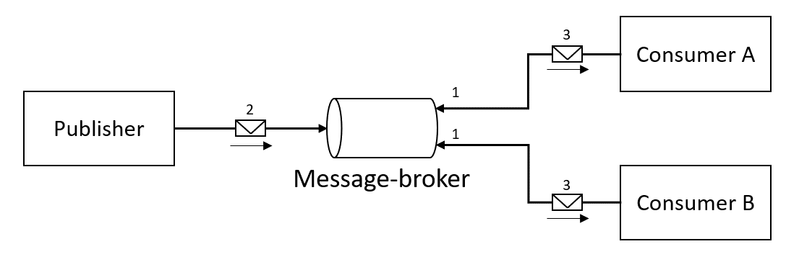
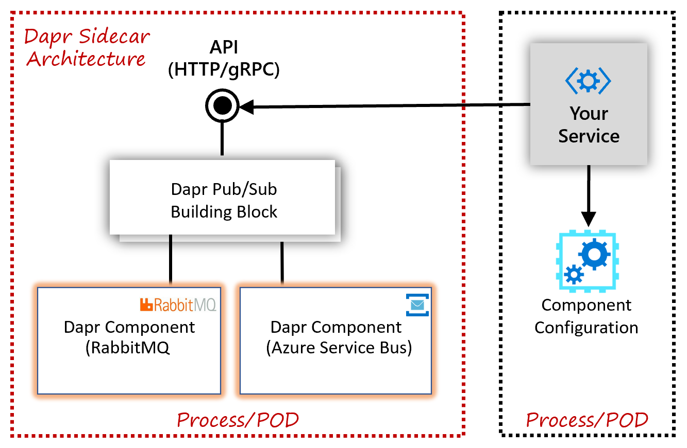
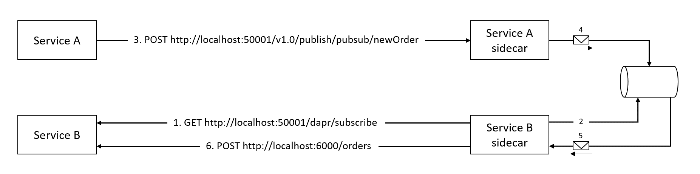

# The Publish/Subscribe building block

The [Publish-Subscribe pattern](https://docs.microsoft.com/azure/architecture/patterns/publisher-subscriber) (often referred to as "pub/sub") is a well-known and widely used messaging pattern. Architects commonly embrace it in distributed applications. However, the plumbing to implement it can be complex. There are often subtle feature differences across different messaging products. Dapr offers a building block that significantly simplifies implementing pub/sub functionality.

## What it solves

The primary advantage of the Publish-Subscribe pattern is **loose coupling**, sometimes referred to as [temporal decoupling](https://docs.microsoft.com/azure/architecture/guide/technology-choices/messaging#decoupling). The pattern decouples services that send messages (the **publishers**) from services that consume messages (the **subscribers**). Both publishers and subscribers are unaware of each other - both are dependent on a centralized **message broker** that distributes the messages.

Figure 7-1 shows the high-level architecture of the pub/sub pattern.



**Figure 7-1**. The pub/sub pattern.

From the previous figure, note the steps of the pattern:

1. Publishers send messages to the message broker.
1. Subscribers bind to a subscription on the message broker.
1. The message broker forwards a copy of the message to interested subscriptions.
1. Subscribers consume messages from their subscriptions.

Most message brokers encapsulate a queueing mechanism that can persist messages once received. With it, the message broker guarantees **durability** by storing the message. Subscribers don't need to be immediately available or even online when a publisher sends a message. Once available, the subscriber receives and processes the message.  Dapr guarantees **At-Least-Once** semantics for message delivery. Once a message is published, it will be delivered at least once to any interested subscriber.

 > If your service can only process a message once, you'll need to provide an [idempotency check](https://docs.microsoft.com/azure/architecture/microservices/design/api-design#idempotent-operations) to ensure that the same message is not processed multiple times. While such logic can be coded, some message brokers, such as Azure Service Bus, provide built-in *duplicate detection* messaging capabilities.

There are several message broker products available - both commercially and open-source. Each has advantages and drawbacks. Your job is to match your system requirements to the appropriate broker. Once selected, it's a best practice to decouple your application from message broker plumbing. You achieve this functionality by wrapping the broker inside an *abstraction*. The abstraction encapsulates the message plumbing and exposes generic pub/sub operations to your code. Your code communicates with the abstraction, not the actual message broker. While a wise decision, you'll have to write and maintain the abstraction and its underlying implementation. This approach requires custom code that can be complex, repetitive, and error-prone.

The Dapr pub/sub building block provides the messaging abstraction and implementation out-of-the-box. The custom code you would have had to write is prebuilt and encapsulated inside the Dapr building block. You bind to it and consume it. Instead of writing messaging plumbing code, you and your team focus on creating business functionality that adds value to your customers.

## How it works

The Dapr pub/sub building block provides a platform-agnostic API framework to send and receive messages. Your services publish messages to a named [topic](https://docs.microsoft.com/azure/service-bus-messaging/service-bus-queues-topics-subscriptions#topics-and-subscriptions). Your services subscribe to a topic to consume messages.

The service makes a network call to a Dapr pub/sub building block, exposed as a [sidecar](https://docs.microsoft.com/azure/architecture/patterns/sidecar). This building block then makes calls into a pre-defined Dapr component that encapsulates a specific message broker product. Figure 7-2 shows the Dapr pub/sub messaging stack.



**Figure 7-2**. The Dapr pub/sub stack.

The Dapr pub/sub building block can be invoked in many ways.

At the lowest level, any programming platform can invoke the building block over HTTP or gRPC using the **Dapr native API**. To publish a message, you make the following API call:

``` http
http://localhost:<daprPort>/v1.0/publish/<pubsubname>/<topic>
```

There are several Dapr specific URL segments in the above call:

- `<daprPort>` provides the port number upon which the Dapr sidecar is listening.
- `<pubsubname>` provides the name of the selected Dapr pub/sub component.
- `<topic>` provides the name of the topic to which the message is published.

Using the *curl* command-line tool to publish a message, you can try it out:

``` curl
curl -X POST http://localhost:3500/v1.0/publish/pubsub/newOrder \
  -H "Content-Type: application/json" \
  -d '{ "orderId": "1234", "productId": "5678", "amount": 2 }'
```

You receive messages by subscribing to a topic. At startup, the Dapr runtime will call the application on a well-known endpoint to identify and create the required subscriptions:

``` http
http://localhost:<appPort>/dapr/subscribe
```

- `<appPort>` informs the Dapr sidecar of the port upon which the application is listening.

You can implement this endpoint yourself. But Dapr provides more intuitive ways of implementing it. We'll address this functionality later in this chapter.

The response from the call contains a list of topics to which the applications will subscribe. Each includes an endpoint to call when the topic receives a message. Here's an example of a response:

```json
[
  {
    "pubsubname": "pubsub",
    "topic": "newOrder",
    "route": "/orders"
  },
  {
    "pubsubname": "pubsub",
    "topic": "newProduct",
    "route": "/productCatalog/products"
  }
]
```

In the JSON response, you can see the application wants to subscribe to topics `newOrder` and `newProduct`. It registers the endpoints `/orders` and `/productCatalog/products` for each, respectively. For both subscriptions, the application is binding to the Dapr component named `pubsub`.

Figure 7-3 presents the flow of the example.



**Figure 7-3**. pub/sub flow with Dapr.

From the previous figure, note the flow:

1. The Dapr sidecar for Service B calls the `/dapr/subscribe` endpoint from Service B (the consumer). The service responds with the subscriptions it wants to create.
1. The Dapr sidecar for Service B creates the requested subscriptions on the message broker.
1. Service A publishes a message at the `/v1.0/publish/<pubsubname>/<topic>` endpoint on the Dapr Service A sidecar.
1. The Service A sidecar publishes the message to the message broker.
1. The message broker sends a copy of the message to the Service B sidecar.
1. The Service B sidecar calls the endpoint corresponding to the subscription (in this case `/orders`) on Service B.

Making HTTP calls to the native Dapr APIs is time-consuming and abstract. Your calls are crafted at the HTTP level, and you'll need to handle plumbing concerns such as serialization and HTTP response codes. Fortunately, there's a more intuitive way. Dapr provides several language-specific SDKs for popular development platforms. At the time of this writing, Go, Node.js, Python, .NET, Java, and JavaScript are available.

### Using the Dapr .NET SDK

For .NET Developers, the [Dapr .NET SDK](https://www.nuget.org/packages/Dapr.Client) provides a more productive way of working with Dapr. The SDK exposes a `DaprClient` class through which you can directly invoke Dapr functionality. It's intuitive and easy to use.

To publish a message, the `DaprClient` exposes a `PublishEventAsync` method.

```csharp
var data = new OrderData
{
  id = "123456",
  productId = "67890",
  amount = 2
}

DaprClient daprClient = new DaprClientBuilder().Build();

await daprClient.PublishEventAsync<OrderData>("pubsub", "newOrder", data);
```

- The first argument `pubsub` is the name of the Dapr component that provides the message broker implementation. We'll address components later in this chapter.
- The second argument `neworder` provides the name of the topic to send the message.
- The third argument is the payload of the message.
- You can specify the .NET type of the message using the generic type parameter of the method.

To receive messages, you bind an endpoint to a subscription for a registered topic. The AspNetCore library for Dapr makes this trivial. Assume, for example, that you have an existing ASP.NET WebAPI action method entitled `CreateOrder`:

```csharp
[HttpPost("/orders")]
public async Task<ActionResult> CreateOrder(Order order)
```

 > You must add a reference to the [Dapr.AspNetCore](https://www.nuget.org/packages/Dapr.AspNetCore) NuGet package in your project to consume the Dapr ASP.NET Core integration.

To bind this action method to a topic, you decorate it with the `Topic` attribute:

```csharp
[Topic("pubsub", "newOrder")]
[HttpPost("/orders")]
public async Task<ActionResult> CreateOrder(Order order)
```

You specify two key elements with this attribute:

- The Dapr pub/sub component to target (in this case `pubsub`).
- The topic to subscribe to (in this case `newOrder`).

Dapr then invokes that action method as it receives messages for that topic.

You'll also need to enable ASP.NET Core to use Dapr. The Dapr .NET SDK provides several extension methods that can be invoked in the `Startup` class.

In the `ConfigureServices` method, you must add the following extension method:

```csharp
public void ConfigureServices(IServiceCollection services)
{
    // ...
    services.AddControllers().AddDapr();
}
```

Appending the `AddDapr` extension-method to the `AddControllers` extension-method registers the necessary services to integrate Dapr into the MVC pipeline. It also registers a `DaprClient` instance into the dependency injection container, which then can be injected anywhere into your service.

In the `Configure` method, you must add the following middleware components to enable Dapr:

```csharp
public void Configure(IApplicationBuilder app, IWebHostEnvironment env)
{
    // ...
    app.UseCloudEvents();

    app.UseEndpoints(endpoints =>
    {
        endpoints.MapSubscribeHandler();
        // ...
    });
}
```

The call to `UseCloudEvents` adds **CloudEvents** middleware into to the ASP.NET Core middleware pipeline. This middleware will unwrap requests that use the CloudEvents structured format, so the receiving method can read the event payload directly.

> [CloudEvents](https://cloudevents.io/) is a standardized messaging format, providing a common way to describe event information across platforms. Dapr embraces CloudEvents. For more about CloudEvents, see the [cloudevents specification](https://github.com/cloudevents/spec/tree/v1.0).

The call to `MapSubscribeHandler` in the endpoint routing configuration will add a Dapr subscribe endpoint to the application. This endpoint will respond to requests on `/dapr/subscribe`. When this endpoint is called, it will automatically find all WebAPI action methods decorated with the `Topic` attribute and instruct Dapr to create subscriptions for them.

### Pub/sub components

Dapr [pub/sub components](https://github.com/dapr/components-contrib/tree/master/pubsub) handle the actual transport of the messages. Several are available. Each encapsulates a specific message broker product to implement the pub/sub building block functionalities. At the time of writing, the following pub/sub components were available:

- Azure Event Hubs
- Azure Service Bus
- GCP Pub/Sub
- Hazelcast
- Kafka
- MQTT
- NATS
- RabbitMQ
- Redis Streams

> [!NOTE]
> The Azure cloud stack has both messaging functionality (Azure Service Bus) and event streaming (Azure Event Hub) availability.

These components are created by the community in a [component-contrib repository on GitHub](https://github.com/dapr/components-contrib/tree/master/pubsub). You're encouraged to write your own Dapr component for a message broker that isn't yet supported.

### Configuring pub/sub components

Using a Dapr configuration file, you can specify the pub/sub component(s) to use. This configuration contains several fields. The `name` field specifies the pub/sub component that you want to use. When sending or receiving a message, you need to specify this name (as you saw earlier in the `PublishEventAsync` method signature).

Below you see an example of a Dapr configuration file for configuring a RabbitMQ message broker component:

```yaml
apiVersion: dapr.io/v1alpha1
kind: Component
metadata:
  name: pubsub-rq
spec:
  type: pubsub.rabbitmq
  metadata:
  - name: host
    value: "amqp://localhost:5672"
  - name: durable
    value: true
```

In this example, you can see that you can specify any message broker-specific configuration in the `metadata` block. In this case, RabbitMQ is configured to create durable queues. Each of the components' configuration will have its own set of possible fields. You can read which fields are available in the documentation of each [pub/sub component](https://github.com/dapr/components-contrib/tree/master/pubsub).

The pub/sub building block also provides a declarative way of subscribing to a topic. Below you see an example of a Dapr configuration file for configuring a subscription:

```yaml
apiVersion: dapr.io/v1alpha1
kind: Subscription
metadata:
  name: newOrder-subscription
spec:
  pubsubname: pubsub
  topic: newOrder
  route: /orders
scopes:
- ServiceB
- ServiceC
```

You have to specify several elements with every subscription:

- The name of the Dapr pub/sub component you want to use (in this case `pubsub`).
- The name of the topic to subscribe to (in this case `newOrder`).
- The API operation that needs to be called for this topic (in this case `/orders`).
- The [scope](https://docs.dapr.io/developing-applications/building-blocks/pubsub/pubsub-scopes/) can specify which services can publish and subscribe to a topic.

## Reference architecture: eShopOnDapr

The accompanying [eShopOnDapr](https://github.com/dotnet-architecture/eShopOnDapr) app provides an end-to-end reference architecture for constructing a microservices application implementing Dapr. eShopOnDapr is an evolution of the widely popular [eShopOnContainers](https://github.com/dotnet-architecture/eShopOnContainer) app, created several years ago. Both versions use the pub/sub pattern for communicating [integration events](https://devblogs.microsoft.com/cesardelatorre/domain-events-vs-integration-events-in-domain-driven-design-and-microservices-architectures/#integration-events) across microservices. Integration events include:

- When a user checks-out a shopping basket.
- When a payment for an order has succeeded.
- When the grace-period of a purchase has expired.

Eventing in eShopOnContainers is based on the following `IEventBus` interface:

```csharp
public interface IEventBus
{
    void Publish(IntegrationEvent integrationEvent);

    void Subscribe<T, THandler>()
        where TEvent : IntegrationEvent
        where THandler : IIntegrationEventHandler<T>;
}
```

Concrete implementations of this interface exist in eShopOnContainers for both RabbitMQ and Azure Service Bus. Each implementation included a great deal of custom plumbing code that was complex to understand and difficult to maintain.

The newer eShopOnDapr significantly simplifies pub/sub behavior by using Dapr. For example, the `IEventBus` interface was reduced to a single method:

```csharp
public interface IEventBus
{
    Task PublishAsync(IntegrationEvent integrationEvent);
}
```

### Publishing events

In the updated eShopOnDapr, a single `DaprEventBus` implementation can support any Dapr-supported message broker. The following code block shows the simplified Publish method. Note how the `PublishAsync` method uses the Dapr client to publish an event:

```csharp
public class DaprEventBus : IEventBus
{
    private const string DAPR_PUBSUB_NAME = "pubsub";

    private readonly DaprClient _dapr;
    private readonly ILogger<DaprEventBus> _logger;

    public DaprEventBus(DaprClient dapr, ILogger<DaprEventBus> logger)
    {
        _dapr = dapr;
        _logger = logger;
    }

    public async Task PublishAsync<TIntegrationEvent>(TIntegrationEvent integrationEvent)
        where TIntegrationEvent : IntegrationEvent
    {
        var topicName = integrationEvent.GetType().Name;

        _logger.LogInformation("Publishing event {Event} to {PubsubName}.{TopicName}", integrationEvent, DAPR_PUBSUB_NAME, topicName);

        // Make sure to pass the concrete event type to PublishEventAsync,
        // which can be accomplished by casting the event to dynamic. This ensures
        // that all event fields are properly serialized.
        await _dapr.PublishEventAsync(DAPR_PUBSUB_NAME, topicName, (dynamic)integrationEvent);
    }
}
```

As you can see in the code snippet, the topic name is derived from event type's name. Because all eShop services use the `IEventBus` abstraction, retrofitting Dapr required *absolutely no change* to the mainline application code.

> [!IMPORTANT]
> There is a cast on the event parameter to a C# `dynamic` type. This workaround is necessary because in .NET 3.1 the `System.Text.Json` serializer does not support polymorphism yet. The Dapr SDK uses `System.Text.Json` to serialize/deserialize messages. In the eShop code, an event is sometimes explicitly declared as an `IntegrationEvent`, the base-class for integration events. This is done because the specific event-type is determined dynamically at runtime based on business-logic. As a result, the event is serialized using the type information of the base-class and not the derived class. The message payload won't contain all the fields of the event, but only those declared on the base-class. Our workaround circumvents this and all the fields are correctly serialized.

With Dapr, the infrastructure code is **dramatically simplified**. It doesn't need to distinguish between the different message brokers. Dapr provides this abstraction for you. And if needed, you can easily swap out message brokers or configure multiple message broker components.

### Subscribing to events

The earlier eShopOnContainers app contains *SubscriptionManagers* to handle the subscription implementation for each message broker. Each manager contains complex message broker-specific code for handling subscription events. To receive events, each service has to explicitly register a handler for each event-type.

eShopOnDapr streamlines the plumbing for event subscriptions by using Dapr ASP.NET Core libraries. Each event is handled by an action method in the controller. A `Topic` attribute decorates the action method with the name of the corresponding topic to subscribe to. Here's a code snippet taken from the `PaymentService`:

```csharp
[Route("api/v1/[controller]")]
[ApiController]
public class IntegrationEventController : ControllerBase
{
    private const string DAPR_PUBSUB_NAME = "pubsub";

    private readonly IServiceProvider _serviceProvider;

    public IntegrationEventController(IServiceProvider serviceProvider)
    {
        _serviceProvider = serviceProvider;
    }

    [HttpPost("OrderStatusChangedToValidated")]
    [Topic(DAPR_PUBSUB_NAME, "OrderStatusChangedToValidatedIntegrationEvent")]
    public async Task OrderStarted(OrderStatusChangedToValidatedIntegrationEvent integrationEvent)
    {
        var handler = _serviceProvider.GetRequiredService<OrderStatusChangedToValidatedIntegrationEventHandler>();
        await handler.Handle(integrationEvent);
    }
}
```

In the `Topic` attribute, the name of the .NET type of the event is used as the topic name. For handling the event, an event handler that already existed in the earlier eShopOnContainers code base is invoked. In the previous example, messages received from the `OrderStatusChangedToValidatedIntegrationEvent` topic invoke the existing `OrderStatusChangedToValidatedIntegrationEventHandler` event-handler. Because Dapr implements the underlying plumbing for subscriptions and message brokers, a large amount of original code became obsolete and was removed from the code-base. Much of this code was complex to understand and challenging to maintain.

### Using pub/sub components

Within the eShopOnDapr repository, a `deployment` folder contains files for deploying the application using different deployment modes: `Docker Compose` and `Kubernetes`. A `dapr` folder exists within each of these folders that holds a `components` folder. This folder holds a file `eshop-pubsub.yaml` containing the configuration of the Dapr pub/sub component that the application will use for pub/sub behavior. As you saw in the earlier code snippets, the name of the pub/sub component used is `pubsub`. Here's the content of the `eshop-pubsub.yaml` file in the `deployment/compose/dapr/components` folder:

```yaml
apiVersion: dapr.io/v1alpha1
kind: Component
metadata:
  name: pubsub
  namespace: default
spec:
  type: pubsub.nats
  metadata:
  - name: natsURL
    value: nats://demo.nats.io:4222
```

The preceding configuration specifies the desired [NATS message broker](https://nats.io/) for this example. To change message brokers, you need only to configure a different message broker, such as RabbitMQ or Azure Service Bus and update the yaml file. With Dapr, there are no changes to your mainline service code when switching message brokers.

Finally, you might ask, "Why would I need multiple message brokers in an application?". Many times a system will handle workloads with different characteristics. One event may occur 10 times a day, but another event occurs 5,000 times per second. You may benefit by partitioning messaging traffic to different message brokers. With Dapr, you can add multiple pub/sub component configurations, each with a different name.

## Summary

The pub/sub pattern helps you decouple services in a distributed application. The Dapr pub/sub building block simplifies implementing this behavior in your application.

Through the Dapr pub/sub building block, you can publish messages to a specific *topic*. As well, the building block will query your service to determine which topic(s) to subscribe to.

You can use the pub/sub building block natively over HTTP or by using one of the language-specific SDKs, such as the .NET SDK for Dapr. The .NET SDK tightly integrates with the ASP.NET core platform.

With Dapr, you can plug a supported message broker product into your application. You can then swap message brokers without requiring code changes to your application.

> [!div class="step-by-step"]
> [Previous](serviceinvocation.md)
> [Next](bindings-buildingblock.md)
