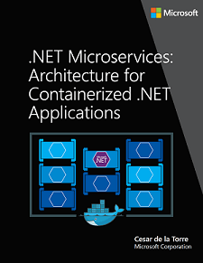
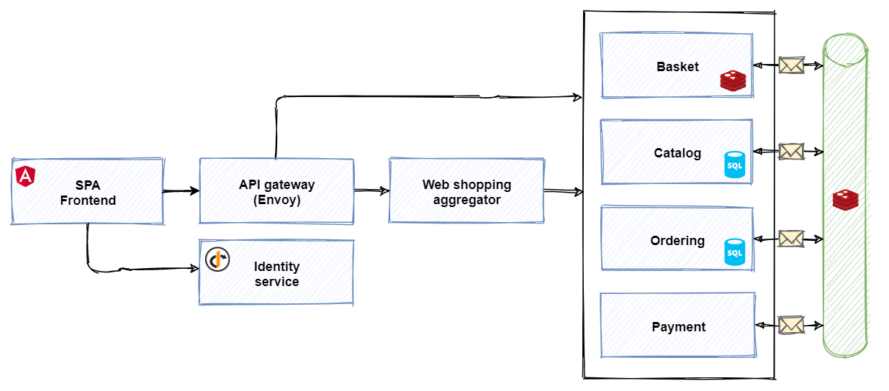
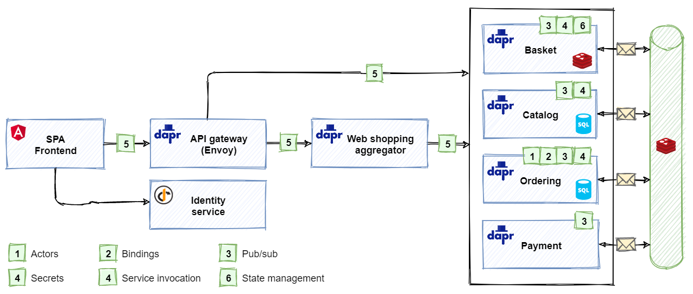

# Dapr reference application

Earlier in the book, you've learned about the foundational benefits of Dapr. You saw how Dapr can help your team construct distributed applications while reducing architectural and operational complexity. Along the way, you've had the opportunity to build some small Dapr apps. Now, it's time to explore an end-to-end microservice application that demonstrates Dapr building blocks and components.

But, first a little history.

## eShop on containers

Several years ago, Microsoft, in partnership with leading community experts, released a popular guidance book, entitled [.NET Microservices for Containerized .NET Applications](https://dotnet.microsoft.com/download/e-book/microservices-architecture/pdf). Figure 3-1 shows the book:

**Figure 3-1**. .NET Microservices: Architecture for Containerized .NET Applications.

The book dove deep into the principles, patterns, and best practices for building distributed applications. It included a full-featured microservice reference application that showcased the architectural concepts. Entitled, [eShopOnContainers](https://github.com/dotnet-architecture/eShopOnContainers), the application shows an e-Commerce storefront that sells various .NET items, including clothing and coffee mugs.  Built in .NET Core, the application is cross-platform and can run in either Linux or Windows containers. Figure 3-2 shows the original eShop architecture.

**Figure 3-2**. Original `ShopOnContainers` reference application.

As you can see, eShopOnContainers includes many moving parts:

1. Three different front-end clients.
1. An application gateway to abstract the back end from the front end.
1. Several back-end core microservices.
1. An event bus component that enables asynchronous pub/sub messaging.

The eShopOnContainers reference application has been widely accepted across the .NET community and used to model many large commercial microservice applications.

## eShop on Dapr

An alternative version of the eShop application accompanies this book. It's called [eShopOnDapr](https://github.com/dotnet-architecture/eShopOnDapr). The updated version evolves the earlier eShopOnContainers application by integrating Dapr building blocks and components. Figure 3-3 shows the new streamlined solution architecture:  

**Figure 3-3**. eShopOnDapr reference application architecture.

As focus of the eShopOnDapr reference application is on Dapr, the original application has been updated. The architecture consists of:

1. A [Single Page Application](/archive/msdn-magazine/2013/november/asp-net-single-page-applications-build-modern-responsive-web-apps-with-asp-net) front end written in the popular Angular SPA framework. It sends user requests to an API gateway microservice.

1. The API gateway abstracts the back-end core microservices from the front-end client. It's implemented using [Envoy](https://www.envoyproxy.io/), a high performant, open-source service proxy. Envoy routes  incoming requests to various back-end microservices. Most requests are simple CRUD operations (for example, get the list of brands from the catalog) and handled by a direct call to a back-end microservice.

1. Other requests are logically more complex and require multiple microservices to work together. For these cases, eShopOnDapr implements an [aggregator microservice](../cloud-native/service-to-service-communication.md#service-aggregator-pattern) that orchestrates a workflow across the microservices needed to complete the operation.

1. The set of core back-end microservices includes functionality required for an e-Commerce store. Each is self-contained and independent of the others. Following widely accepted domain decomposing patterns, each microservice isolates a specific *business capability*:

   - The basket service manages the customer's shopping basket experience.
   - The catalog service manages product items available for sale.
   - The identity service manages authentication and identity.
   - The ordering service handles all aspects of placing and managing orders.
   - The payment service transacts the customer's payment.

   Each service has its own persistent storage. Adhering to microservice [best practices](../cloud-native/distributed-data.md#database-per-microservice-why), there's not a shared datastore with which all services interact.

   The design of each microservice is based on its individual requirements. The simple services use basic CRUD operations to access to their underlying data stores. Advanced services, like Ordering, use a  Domain-Driven Design approach to manage business complexity. If necessary, services could be built across different technology stacks, such as .NET Core, Java, Go, NodeJS, and more.

1. Finally, the event bus wraps the Dapr publish/subscribe components. It enables asynchronous publish/subscribe messaging across microservices. Developers can plug in any Dapr-supported message broker.

### Application of Dapr building blocks

The eShopOnDapr codebase is more streamlined than the eShopOnContainers codebase. Dapr building blocks replace a large amount of error-prone plumbing code.

Figure 3-4 shows the Dapr integration in the eShop reference application.

**Figure 3-4**. Dapr integration in eShopOnDapr.

In the previous figure, you can see which services use which Dapr building blocks.

1. The original eShopOnContainers application demonstrates DDD concepts and patterns in the ordering service. In the updated eShopOnDapr, the ordering service uses the *actor building block* as an alternative implementation. The turn-based access model of actors makes it easy to implement a stateful ordering process with support for cancellation.
1. The ordering service sends order confirmation e-mails using the [bindings building block](bindings.md).
1. The back-end services communicate asynchronously using the [publish & subscribe building block](publish-subscribe.md).
1. Secret management is done by the [secrets building block](secrets.md).
1. The API gateway and web shopping aggregator services use the [service invocation building block](service-invocation.md) to invoke methods on the back-end services.
1. The basket service uses the [state management building block](state-management.md) to store the state of the customer's shopping basket.

### Benefits of applying Dapr to eShop

In general, the use of Dapr building blocks add observability and flexibility to the application:

1. Observability: By using the Dapr building blocks, you gain rich distributed tracing for both calls between services and to Dapr components without having to write any code. In eShopOnContainers, a large amount of custom logging is used to provide insight.
1. Flexibility: You can now *swap out* infrastructure simply by changing a component configuration file. No code changes are necessary.

Here are some more examples of benefits offered by specific building blocks:

- **Service Invocation**
  - With Dapr's support for [mTLS](https://blog.cloudflare.com/introducing-tls-client-auth/), services now communicate through encrypted channels.
  - When transient errors occur, service calls are automatically retried.
  - Automatic service discovery reduces the amount of configuration needed for services to find each other.

- **Publish/Subscribe**
  - eShopOnContainer included a large amount of custom code to support both Azure Service Bus and RabbitMQ. Developers used Azure Service Bus for production and RabbitMQ for local development and testing. An `IEventBus` abstraction layer was created to enable swapping between these message brokers. This layer consisted of approximately *700 lines of error-prone code*. The updated implementation with Dapr requires only *35 lines of code*. That's **5%** of the original lines of code! More importantly, the implementation is straightforward and easy to understand.
  - eShopOnDapr uses Dapr's rich ASP.NET Core integration to use pub/sub. You add `Topic` attributes to ASP.NET Core controller methods to subscribe to messages. Therefore, there's no need to write a separate message handler loop for each message broker.
  - Messages routed to the service as HTTP calls enable the use of ASP.NET Core middleware to add functionality, without introducing new concepts or SDKs to learn.

- **Bindings**
  - The eShopOnContainers solution contained a *to-do* item for e-mailing an order confirmation to the customer. The thought was to eventually implement a third-party email API such as SendGrid. With Dapr, implementing email notification was as easy as configuring a resource binding. There wasn't any need to learn external APIs or SDKs.

> [!NOTE]
> The Actors building block isn't covered in the first version of this book. An extensive chapter on the Actor building block and its integration with eShopOnDapr will be included in the 1.1 update.

## Summary

In this chapter, you're introduced to the eShopOnDapr reference application. It's an evolution of the widely popular eShopOnContainers microservice reference application. eShopOnDapr replaces a large amount of custom functionality with Dapr building blocks and components, dramatically simplifying the complexities required to build a microservices application.

### References

- [eShopOnDapr on GitHub](https://github.com/dotnet-architecture/eShopOnDapr)

- [eShopOnContainers on GitHub](https://github.com/dotnet-architecture/eShopOnContainers)

- [.NET Microservices for Containerized .NET Applications](https://dotnet.microsoft.com/download/e-book/microservices-architecture/pdf)

- [Architecting Cloud-Native .NET Apps for Azure](https://dotnet.microsoft.com/download/e-book/cloud-native-azure/pdf)

> [!div class="step-by-step"]
> [Previous](getting-started.md)
> [Next](state-management.md)
