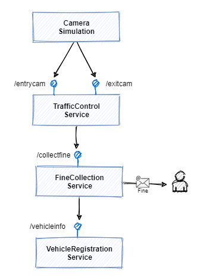
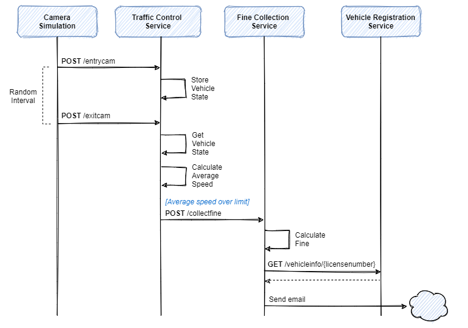
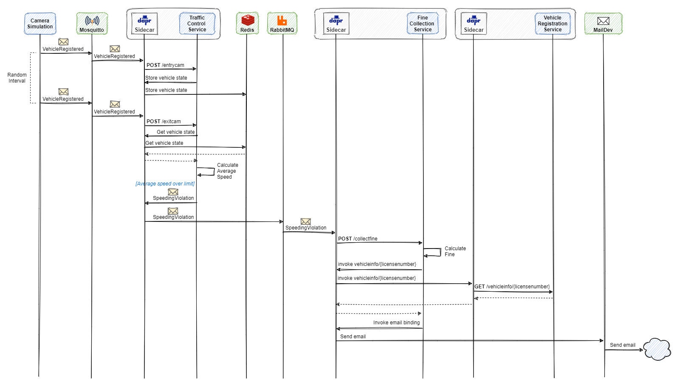

# Traffic Control sample application

Earlier in the book, you've learned about the foundational benefits of Dapr. You saw how Dapr can help your team construct distributed applications while reducing architectural and operational complexity. Along the way, you've had the opportunity to build some small Dapr apps. Now, it's time to explore an end-to-end microservice application that demonstrates Dapr building blocks and components. In order to keep the focus on applying Dapr, the sample application used throughout this book is kept relatively simple.

The Traffic Control sample application simulates a highway traffic control system. Its purpose is to detect speeding vehicles and send the driver of each speeding vehicle a fine. These systems actually exist in real life and this is how they work. A set of cameras (one above each lane) is placed at the beginning and at the end of a stretch of highway without on- or off-ramps of a certain length (say 10 kilometers). When a vehicle passes under one of the cameras, it takes a photograph of the vehicle. Using Optical Character Recognition (OCR) software, is extracts the license number of the vehicle from the photo. Using the entry- and exit-timestamp of each vehicle, the system calculates the average speed of that vehicle. If the average speed is above the maximum speed limit on this stretch of highway, the system retrieves the contact information of the driver of the vehicle and automatically sends him or her a fine.

Although the simulation is quite simple, responsibilities within the system are separated into several microservices. In figure 4.1 you see an overview of the services that are part of the application:

**Figure 4-1**. The services in the sample application.

\- The **Camera Simulation** is a .NET Core console application that will simulate passing cars by sending messages to the TrafficControl service. For every simulated car it invokes one of the TrafficContriol service's endpoints.

\- The **TrafficControl service** is an ASP.NET Core WebAPI application that offers 2 endpoints: `/entrycam` and `/exitcam`. Invoking one of the endpoints simulates a car passing under one of the entry- or exit-cameras respectively. Because this is a simulation, the payload of the request simply contains the license plate of the car (so there is no actual OCR going on).

\- The **FineCollection service** is an ASP.NET Core WebAPI application that offers 1 endpoint: `/collectfine`. Invoking this endpoint will start the process of sending a fine to the driver of a speeding vehicle. The payload of the request contains all the information about the speeding violation.

\- The **VehicleRegistration service** is an ASP.NET Core WebAPI application that offers 1 endpoint: `/vehicleinfo/{licensenumber}` for getting the vehicle- and owner-information of a speeding vehicle by specifying its license number on the URL (e.g. `/vehicleinfo/RV-752-S`). 

The flow of the simulation is depicted in the sequence diagram in figure 4.2:

**Figure 4-2**. Sequence diagram of the simulation flow.

As shown in the sequence diagram, the services communicate by directly invoking each other's APIs. This design works fine, but it has some drawbacks. 

The biggest drawback is that a call-chain could be broken when one of the services is off-line. Making sure the services are temporally decoupled by replacing the direct calls with asynchronous messaging would solve this issue. Asynchronous messaging is typically implemented with a message broker like RabbitMQ for instance. 

Another drawback is that the vehicle state for every vehicle is stored in memory in the TrafficControl service. This state is lost when the service is restarted after an update or a crash. It would be better to store the state somewhere outside the service so it survives service restarts.

## Using Dapr building blocks

One of the goals of Dapr is to provide cloud-native capabilities for microservices applications. The Traffic Control application uses Dapr building blocks to make it more robust and deal with the drawbacks of the design as described in the previous paragraph. In Figure 4.3 you see the traffic control application and the Dapr building blocks it uses:

**Figure 4-3**. Traffic Control application with Dapr building blocks.

1. **Service invocation**
   The Dapr service invocation building block handles request/response type communication between the FineCollectionService and the VehicleRegistrationService. Because this call is a query to directly retrieve necessary data, a synchronous invocation is fine here. The service invocation building block offers the advantage that the FineCollection service no longer has to know where the VehicleRegistration service lives. It also implements automatic retries when the VehicleRegistration service is off-line.
1. **Publish & subscribe**
   The publish and subscribe building block handles the asynchronous messaging for sending speeding violations from the TrafficControl service to the FineCollectionService. This temporally decouples the TrafficControl service and FineCollection service. RabbitMQ is the message broker that transports the messages from the message producers to the message consumers. Because the Dapr pub/sub building block abstracts the specific broker product, the developers of the services don't need to learn the specifics of the RabbitMQ client library. And switching to another message broker in the future will not require any code changes whatsoever.  
1. **State management**
   The TrafficControl service leverages the state management building block to store vehicle state data outside of the service in a Redis cache. As with pub/sub, the developers of the services don't need to learn any Redis specific APIs and switching to another storage product in the future will require no code changes. 
1. **Output binding**
   The FineCollection service sents fines to the owners of speeding vehicles by email. The Dapr output binding for SMTP abstracts the actual sending of the email using the SMTP protocol.
1. **Input binding**
   The CameraSimulation sends messages with simulated car info to the TrafficControl service using the MQTT protocol. It uses a .NET MQTT library for sending these messages to Mosquitto - a lightweight MQTT broker. The TrafficControl service leverages the Dapr input binding for MQTT to subscribe to the MQTT broker and receive messages. 
1. **Secrets management**
   The FineCollectionService needs credentials for connecting to the smtp server and a license-key for a fine calculator component it uses internally. It uses the secrets management building block to get the credentials and the license-key.
1. **Actors**
   The TrafficControlService has an alternative implementation based on Dapr actors. In this implementation, the TrafficControl service creates a new actor for every vehicle that is registered by the entry camera. The license number of the vehicle forms the unique actor Id. The actor encapsulates the vehicle state, which it persists in the Redis cache. When the exit camera registers a vehicle, it will send invoke the actor (identified by the license number). The actor will then calculate the average speed and handle a possible speeding violations. 

Figure 4.4 shows a sequence diagram of the flow of the simulation with all the Dapr building blocks in place:

**Figure 4-4**. Sequence diagram of simulation flow with Dapr building blocks.

The remainder of this book features a separate chapter for each of the building blocks. Each chapter explains in detail how a building block works and how to configure and use it. Finally, each chapter will explain how the Traffic Control sample application uses the building block.

You can get the code for the sample application from the following GitHub repo: [https://github.com/EdwinVW/dapr-traffic-control](https://github.com/EdwinVW/dapr-traffic-control).

## Summary

The Traffic Control sample application is a microservices application that simulates a highway speed trap. 

The application uses several Dapr building blocks to make it robust and cloud-native. The domain is kept relatively simple to keep the focus on Dapr.

The application will be used in subsequent chapters that focus on a specific building block.

### References

- [Dapr Traffic Control Sample](https://github.com/EdwinVW/dapr-traffic-control)

> [!div class="step-by-step"]
> [Previous](getting-started.md)
> [Next](state-management.md)

[dapr-traffic-control-sample]: 