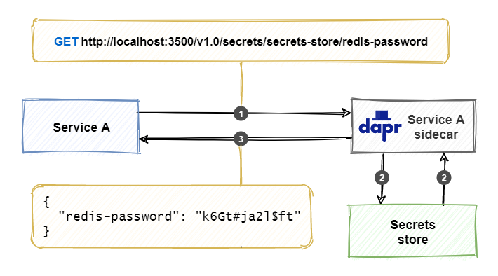

# The Dapr secrets management building block

Enterprise applications require secrets. Common examples include:

- A database connection string that contains a username and password.
- An API key for calling an external web API.
- A client certificate for authenticating to an external system.

Secrets must be carefully managed so that they're never disclosed outside of the application.

Not long ago, it was popular to store application secrets in a configuration file inside the application codebase. .NET developers will fondly recall the *web.config* file. While simple to implement, integrating secrets to along with code was far from secure. A common misstep was to include the file when pushing to a public GIT repository, exposing the secrets to the world.

A widely accepted methodology for constructing modern distributed applications is [The Twelve-Factor App](https://12factor.net/). It describes a set of principles and best practices. Its third factor prescribes that *configuration and secrets be externalized outside of the code base.*

To address this concern, the .NET Core platform includes a [Secret Manager](/aspnet/core/security/app-secrets#secret-manager) feature that stores sensitive data in a physical folder outside of the project tree. While secrets are outside of source control, this feature doesn't encrypt data. It's designed for **development purposes** only.

A more modern and secure practice is to isolate secrets in a secrets management tool like **Hashicorp Vault** or **Azure Key Vault**.  These tools enable you to store secrets externally, vary credentials across environments, and reference them from application code. However, each tool has its complexities and learning curve.

Dapr offers a building block that simplifies managing secrets.

## What it solves

The Dapr [secrets management building block](https://docs.dapr.io/developing-applications/building-blocks/secrets/secrets-overview/) abstracts away the complexity of working with secrets and secret management tools.

- It hides the underlying plumbing through a unified interface.
- It supports various *pluggable* secret store components, which can vary between development and production.
- Applications don't require direct dependencies on secret store libraries.
- Developers don't require detailed knowledge of each secret store.

Dapr handles all of the above concerns.

Access to the secrets is secured through authentication and authorization. Only an application with sufficient rights can access secrets. Applications running in Kubernetes can also use its built-in secrets management mechanism.

## How it works

Applications use the secrets management building block in two ways:

- Retrieve a secret directly from the building block.
- Reference a secret indirectly from a Dapr component configuration.

Retrieving secrets directly is covered first. Referencing a secret from a Dapr component configuration file is addressed in a later section.

The application interacts with a Dapr sidecar when using the secrets management building block. The sidecar exposes the secrets API. The API can be called with either HTTP or gRPC. Use the following URL to call the HTTP API:

```http
http://localhost:<dapr-port>/v1.0/secrets/<store-name>/<name>?<metadata>
```

The URL contains the following segments:

- `<dapr-port>` specifies the port number upon which the Dapr sidecar is listening.
- `<store-name>` specifies the name of the Dapr secret store.
- `<name>` specifies  the name of the secret to retrieve.
- `<metadata>` provides additional information for the secret. This segment is optional and metadata properties differ per secret store. For more information on metadata properties, see the [secrets API reference]([Secrets API reference | Dapr Docs](https://docs.dapr.io/reference/api/secrets_api/)).

 > [!NOTE]
 > The above URL represents the native Dapr API call available to any development platform that supports HTTP or gRPC. Popular platforms like .NET, Java, and Go have their own custom APIs.

The JSON response contains the key and value of the secret.

Figure 11-1 shows how Dapr handles a request for the secrets API:



**Figure 11-1**. Retrieving a secret with the Dapr secrets API.

1. The service calls the Dapr secrets API, along with the name of the secret store, and secret to retrieve.
1. The Dapr sidecar retrieves the specified secret from the secret store.
1. The Dapr sidecar returns the secret information back to the service.

Some secret stores support storing multiple key/value pairs in a single secret. For those scenarios, the response would contain multiple key/value pairs in a single JSON response as in the following example:

```http
GET http://localhost:3500/v1.0/secrets/secret-store/interestRates?metadata.version_id=3
```

```json
{
  "tier1-percentage": "2.5",
  "tier2-percentage": "3.8",
  "tier3-percentage": "5.1"
}
```

The Dapr secrets API also offers an operation to retrieve all the secrets the application has access to:

```http
http://localhost:<dapr-port>/v1.0/secrets/<store-name>/bulk
```

## Use the Dapr .NET SDK

For .NET developers, the Dapr .NET SDK streamlines Dapr secret management. Consider the `DaprClient.GetSecretAsync` method. It enables you to retrieve a secret directly from any Dapr secret store with minimal effort. Here's an example of fetching a connection string secret for a SQL Server database:

```csharp
var metadata = new Dictionary<string, string> { ["version_id"] = "3" };
Dictionary<string, string> secrets = await daprClient.GetSecretAsync("secret-store", "eshopsecrets", metadata);
string connectionString = secrets["customerdb"];
```

Arguments for the `GetSecretAsync` method include:

- The name of the Dapr secret store component ('secret-store')
- The secret to retrieve ('eshopsecrets')
- Optional metadata key/value pairs ('version_id=3')

The method responds with a dictionary object as a secret can contain multiple key/value pairs. In the example above, the secret named `customerdb` is referenced from the collection to return a connection string.

The Dapr .NET SDK also features a .NET configuration provider. It loads specified secrets into the underlying [.NET Core configuration API](../../core/extensions/configuration.md). The running application can then reference secrets from the `IConfiguration` dictionary that is registered in ASP.NET Core dependency injection.

The secrets configuration provider is available from the [Dapr.Extensions.Configuration](https://www.nuget.org/packages/Dapr.Extensions.Configuration) NuGet package. The provider can be registered in the `Program.cs` of an ASP.NET Web API application:  

```csharp
public static IHostBuilder CreateHostBuilder(string[] args) =>
    Host.CreateDefaultBuilder(args)
        .ConfigureAppConfiguration(config =>
        {
            var daprClient = new DaprClientBuilder().Build();
            var secretDescriptors = new List<DaprSecretDescriptor>
            {
                new DaprSecretDescriptor("eshopsecrets")
            };
            config.AddDaprSecretStore("secret-store", secretDescriptors, daprClient);
        })
        .ConfigureWebHostDefaults(webBuilder =>
        {
            webBuilder.UseStartup<Startup>();
        });
```

The above example loads the `eshopsecrets` secrets collection into the .NET configuration system at startup. Registering the provider requires an instance of `DaprClient` to invoke the secrets API on the Dapr sidecar. The other arguments include the name of the secret store and a `DaprSecretDescriptor` object with the name of the secret.

Once loaded, you can retrieve secrets directly from application code:

```csharp
public void GetCustomer(IConfiguration config)
{
    var connectionString = config["eshopsecrets"]["customerdb"];
}
```

## Secret store components

The secrets management building block supports several secret store components. At the time of writing, the following secret stores are available:

- Environment Variables
- Local file
- Kubernetes secrets
- AWS Secrets Manager
- Azure Key Vault
- GCP Secret Manager
- HashiCorp Vault

> [!IMPORTANT]
> The environment variables and local file components are designed for development workloads only.

The following sections show how to configure a secret store.

### Configuration

You configure a secret store using a Dapr component configuration file. The typical structure of the file is shown below:

```yaml
apiVersion: dapr.io/v1alpha1
kind: Component
metadata:
  name: [component name]
  namespace: [namespace]
spec:
  type: secretstores.[secret store type]
  version: [secret store version]
  metadata:
  - name: [property name]
    value: [property value]
```

All Dapr component configuration files require a `name` along with an optional `namespace` value. Additionally, the `type` field in the `spec` section specifies the type of secret store component. The properties in the `metadata` section differ per secret store.

### Indirectly consume Dapr secrets

As mentioned earlier in this chapter, applications can also consume secrets by referencing them in component configuration files. Consider a [state management component](state-management.md) that uses Redis cache for storing state:

```yaml
apiVersion: dapr.io/v1alpha1
kind: Component
metadata:
  name: eshop-basket-statestore
  namespace: eshop
spec:
  type: state.redis
  version: v1
  metadata:
  - name: redisHost
    value: localhost:6379
  - name: redisPassword
    value: e$h0p0nD@pr
```

The above configuration file contains a **clear-text** password for connecting to the Redis server. **Hardcoded** passwords are always a bad idea. Pushing this configuration file to a public repository would expose the password. Storing the password in a secret store would dramatically improve this scenario.

The following examples demonstrate this using several different secret stores.

### Local file

The local file component is designed for development scenarios. It stores secrets on the local filesystem inside a JSON file. Here's an example named `eshop-secrets.json`. It contains a single secret - a password for Redis:

```json
{
  "eShopRedisPassword": "e$h0p0nD@pr"
}
```

You place this file in a `components` folder that you specify when running the Dapr application.

The following secret store configuration file consumes the JSON file as a secret store. It's also placed in the `components` folder:

```yaml
apiVersion: dapr.io/v1alpha1
kind: Component
metadata:
  name: eshop-local-secret-store
  namespace: eshop
spec:
  type: secretstores.local.file
  version: v1
  metadata:
  - name: secretsFile
    value: ./components/eshop-secrets.json
  - name: nestedSeparator
    value: ":"
```

The component type is `secretstore.local.file`. The `secretsFile` metadata element specifies the path to the secrets file.

> [!IMPORTANT]
> The path to a secrets file can be a absolute or relative path. The relative path is based on the folder in which the application starts. In the example, the `components` folder is a sub-folder of the directory that contains the .NET application.

From the application folder, start the Dapr application specifying the `components` path as a command-line argument:

```console
dapr run --app-id basket-api --components-path ./components dotnet run
```

> [!NOTE]
> This above example applies to running Dapr in self-hosted mode. For Kubernetes hosting, consider using volume mounts.

The `nestedSeparator` in a Dapr configuration file specifies a character to *flatten* a JSON hierarchy. Consider the following snippet:

```json
{
    "redisPassword": "some password",
    "connectionStrings": {
        "customerdb": "some connection string",
        "productdb": "some connection string"
    }
}
```

Using a colon as a separator, you can retrieve the `customerdb` connection-string using the key `connectionStrings:customerdb`.

> [!NOTE]
> The colon `:` is the default separator value.

In the next example, a state management configuration file references the local secret store component to obtain the password for connecting to the Redis server:

```yaml
apiVersion: dapr.io/v1alpha1
kind: Component
metadata:
  name: eshop-basket-statestore
  namespace: eshop
spec:
  type: state.redis
  version: v1
  metadata:
  - name: redisHost
    value: localhost:6379
  - name: redisPassword
    secretKeyRef:
      name: eShopRedisPassword
      key: eShopRedisPassword
auth:
  secretStore: eshop-local-secret-store
```

The `secretKeyRef` element references the secret containing the password. It replaces the earlier *clear-text* value. The secret name and the key name, `eShopRedisPassword`, reference the secret. The name of the secret management component `eshop-local-secret-store` is found in the `auth` metadata element.

You might wonder why `eShopRedisPassword` is identical for both the name and key in the secret reference. In the local file secret store, secrets aren't identified with a separate name. The scenario will be different in the next example using Kubernetes secrets.

### Kubernetes secret

This second example focuses on a Dapr application running in Kubernetes. It uses the standard secrets mechanism that Kubernetes offers. Use the Kubernetes CLI (`kubectl`) to create a secret named `eshop-redis-secret` that contains the password:

```console
kubectl create secret generic eshopsecrets --from-literal=redisPassword=e$h0p0nD@pr -n eshop
```

Once created, you can reference the secret in the component configuration file for state management:

```yaml
apiVersion: dapr.io/v1alpha1
kind: Component
metadata:
  name: eshop-basket-statestore
  namespace: eshop
spec:
  type: state.redis
  version: v1
  metadata:
  - name: redisHost
    value: redis:6379
  - name: redisPassword
    secretKeyRef:
      name: eshopsecrets
      key: redisPassword
auth:
  secretStore: kubernetes
```

The `secretKeyRef` element specifies the name of the Kubernetes secret and the secret's key, `eshopsecrets`, and `redisPassword` respectively. The `auth` metadata section instructs Dapr to use the Kubernetes secrets management component.

> [!NOTE]
> Auth is the default value when using Kubernetes secrets and can be omitted.

In a production setting, secrets are typically created as part of an automated CI/CD pipeline. Doing so ensures only people with sufficient permissions can access and change the secrets. Developers create configuration files without knowing the actual value of the secrets.

### Azure Key Vault

The next example is geared toward a real-world production scenario. It uses **Azure Key Vault** as the secret store. Azure Key Vault is a managed Azure service that enables secrets to be stored securely in the cloud.

For this example to work, the following prerequisites must be satisfied:

- You've secured administrative access to an Azure subscription.
- You've provisioned an Azure Key Vault named `eshopkv` that holds a secret named `redisPassword` that contains the password for connecting to the Redis server.
- You've created [service principal](/azure/active-directory/develop/howto-create-service-principal-portal) in Azure Active Directory.
- You've installed an X509 certificate for this service principal (containing both the public and private key) on the local filesystem.

> [!NOTE]
> A service principal is an identity that can be used by an application to authenticate an Azure service. The service principal uses a X509 certificate. The application uses this certificate as a credential to authenticate itself.

The [Dapr Azure Key Vault secret store documentation](https://docs.dapr.io/operations/components/setup-secret-store/supported-secret-stores/azure-keyvault/) provides step-by-step instructions to create and configure a Key Vault environment.

#### Use Key Vault when running in self-hosted mode

Using Azure Key Vault in Dapr self-hosted mode requires the following component configuration file:

```yaml
apiVersion: dapr.io/v1alpha1
kind: Component
metadata:
  name: eshop-azurekv-secret-store
  namespace: eshop
spec:
  type: secretstores.azure.keyvault
  version: v1
  metadata:
  - name: vaultName
    value: eshopkv
  - name: spnTenantId
    value: "619926af-a7c3-4e95-93ed-4ecc4e3e652b"
  - name: spnClientId
    value: "6cf48032-6c38-43be-9d6f-2a43ce736b09"
  - name: spnCertificateFile
    value : "azurekv-spn-cert.pfx"
```

The secret store type is `secretstores.azure.keyvault`. The `metadata` element provides access to the Key Vault with the following properties:

- The `vaultName` contains the name of the Azure Key Vault.
- The `spnTenantId` contains the *tenant ID* of the service principal used to authenticate against the Key Vault.
- The `spnClientId` contains the *app ID* of the service principal used to authenticate against the Key Vault.
- The `spnCertificateFile` contains the path to the certificate file for the service principal to authenticate against the Key Vault.

> [!TIP]
> You can copy the service principal information from the Azure portal or Azure CLI .

Now the application can retrieve the Redis password from the Azure Key Vault.

#### Use Key Vault when running on Kubernetes

Consuming Azure Key Vault with Dapr and Kubernetes also requires a service principal to authenticate against the Azure Key Vault.

First, create a *Kubernetes secret* that contains a certificate file using the kubectl CLI tool:

```console
kubectl create secret generic [k8s_spn_secret_name] --from-file=[pfx_certificate_file_local_path] -n eshop
```

The command requires two command-line arguments:

- `[k8s_spn_secret_name]` is the secret name in Kubernetes secret store.
- `[pfx_certificate_file_local_path]` is the path of X509 certificate file.

Once created, you can reference the Kubernetes secret in the secret store component configuration file:

```yaml
apiVersion: dapr.io/v1alpha1
kind: Component
metadata:
  name: eshop-azurekv-secret-store
  namespace: eshop
spec:
  type: secretstores.azure.keyvault
  version: v1
  metadata:
  - name: vaultName
    value: [your_keyvault_name]
  - name: spnTenantId
    value: "619926af-a7c3-4e95-93ed-4ecc4e3e652b"
  - name: spnClientId
    value: "6cf48032-6c38-43be-9d6f-2a43ce736b09"
  - name: spnCertificate
    secretKeyRef:
      name: [k8s_spn_secret_name]
      key: [pfx_certificate_file_local_name]
auth:
    secretStore: kubernetes
```

At this point, an application running in Kubernetes can retrieve the Redis password from the Azure Key Vault.

> [!IMPORTANT]
> It's critical to keep the X509 certificate file for the service principal in a safe place. It's best to place it in a well-known folder outside the source-code repository. The configuration file can then reference the certificate file from this well-known folder. On a local development machine, you're responsible for copying the certificate to the folder. For automated deployments, the pipeline will copy the certificate to the machine where the application is deployed. It's a best practice to use a different service principal per environment. Doing so prevents the service principal from a DEVELOPMENT environment to access secrets in a PRODUCTION environment.

When running in  Azure Kubernetes Service (AKS), it's preferable to use an [Azure Managed Identity](/azure/active-directory/managed-identities-azure-resources/overview) for authenticating against Azure Key Vault. Managed identities are outside of the scope of this book, but explained in the [Azure Key Vault with managed identities](https://docs.dapr.io/operations/components/setup-secret-store/supported-secret-stores/azure-keyvault-managed-identity/) documentation.

### Scope secrets

Secret scopes allow you to control which secrets your application can access. You configure scopes in a Dapr sidecar configuration file. The [Dapr configuration documentation](https://docs.dapr.io/operations/configuration/configuration-overview/) provides instructions for scoping secrets.

Here's an example of a Dapr sidecar configuration file that contains secret scopes:

```yml
apiVersion: dapr.io/v1alpha1
kind: Configuration
metadata:
  name: dapr-config
  namespace: eshop
spec:
  tracing:
    samplingRate: "1"
  secrets:
    scopes:
      - storeName: eshop-azurekv-secret-store
        defaultAccess: allow
        deniedSecrets: ["redisPassword", "apiKey"]
```

You specify scopes per secret store. In the above example, the secret store is named `eshop-azurekv-secret-store`. You configure access to secrets using the following properties:

| Property         | Value               | Description                                                                                                                       |
|------------------|---------------------|-----------------------------------------------------------------------------------------------------------------------------------|
| `defaultAccess`  | `allow` or `deny`   | Allows or denies access to *all* secrets in the specified secret store. This property is optional with a default value of `allow`. |
| `allowedSecrets` | List of secret keys | Secrets specified in the array will be accessible. This property is optional.                                                     |
| `deniedSecrets`  | List of secret keys | Secrets specified in the array will NOT be accessible. This property is optional.                                                 |

The `allowedSecrets` and `deniedSecrets` properties take precedence over the `defaultAccess` property. Imagine specifying `defaultAccess: allowed` and an `allowedSecrets` list. In this case, only the secrets in the `allowedSecrets` list would be accessible by the application.

## Sample application: Dapr Traffic Control

In Dapr Traffic Control sample app, the secrets management building block is used in several places. Secrets are retrieved from code and referenced by Dapr component configuration files. Figure 10-2 shows the conceptual architecture of the Dapr Traffic Control sample application. The Dapr secrets management building block is used in flows marked with number 6 in the diagram:

:::image type="content" source="./media/secrets/dapr-solution-secrets-management.png" alt-text="Conceptual architecture of the Dapr Traffic Control sample application.":::

**Figure 10-2**. Conceptual architecture of the Dapr Traffic Control sample application.

The FineCollection service uses an SMTP output binding for sending emails (see the [Bindings](bindings.md) chapter). The email component file consumes the secrets management building block to retrieve credentials to connect to the SMTP server. To calculate the fine for a speeding violation, the service uses a fictitious FineCalculator component that requires a license key. It retrieves this license key from the secrets management building block.

The TrafficControl service stores vehicle information in a Redis state store (see the [State management](state-management.md) chapter). It uses the secrets management building block for retrieving credentials to connect to the Redis server.

Because the Traffic Control sample application can run in self-hosted mode or in Kubernetes, there are two ways for specifying secrets:

- A local JSON file
- A Kubernetes secret

### Secrets

Examine the `secrets-file.yaml` component configuration file in the `dapr/components` folder:

```yaml
apiVersion: dapr.io/v1alpha1
kind: Component
metadata:
  name: trafficcontrol-secrets
  namespace: dapr-trafficcontrol
spec:
  type: secretstores.local.file
  version: v1
  metadata:
  - name: secretsFile
    value: ../dapr/components/secrets.json
  - name: nestedSeparator
    value: "."
scopes:
  - trafficcontrolservice
  - finecollectionservice
```

The file describes a secrets management component entitled `trafficcontrol-secrets`. The `type` element is set to `local.file` and the `secretsFile` to `../dapr/components/secrets.json`. For self-hosted mode, use a [Local file](#local-file) component. The path must be relatively specified from the folder from which the service starts. The secrets file contains a JSON representation of the secrets:

```json
{
    "state":{
        "redisPassword": ""
    },
    "smtp":{
        "user": "_username",
        "password": "_password"
    },
    "finecalculator":{
        "licensekey": "HX783-K2L7V-CRJ4A-5PN1G"
    }
}
```

In the sample application the Redis server is used without a password. To connect to the SMTP server, the credentials are `_username` and `_password`. The license key for the FineCalculator license key is a randomly generated string.

While secrets are stored at nested levels, the secrets management building block flattens this hierarchy when the file is read. It uses a period as a level separator (as specified in the `nestedSeparator` field in the component configuration file). This construct enables you to reference secrets with a flattened name, for example: `smtp.user`.

When running in Kubernetes, the secrets are specified using the built-in Kubernetes secrets store. Examine the following `secrets.yaml` Kubernetes manifest file in the `k8s` folder:

```yaml
apiVersion: v1
kind: Secret
metadata:
  name: trafficcontrol-secrets
  namespace: dapr-trafficcontrol
type: Opaque
data:
  smtp.user: X3VzZXJuYW1l
  smtp.password: X3Bhc3N3b3Jk
  finecalculator.licensekey: SFg3ODMtSzJMN1YtQ1JKNEEtNVBOMUc=
```

The component is also named `trafficcontrol-secrets`. Secrets are stored as Base64 encoded strings.

> [!IMPORTANT]
> Base64 representations *encode*, but do not *encrypt* data. Base64 isn't secure for production scenarios.

The following paragraphs describe how secrets are used in the Traffic Control sample application.

### SMTP server credentials

Examine the `email.yaml` component configuration file located in the `dapr/components` folder:

```yaml
apiVersion: dapr.io/v1alpha1
kind: Component
metadata:
  name: sendmail
  namespace: dapr-trafficcontrol
spec:
  type: bindings.smtp
  version: v1
  metadata:
  - name: host
    value: localhost
  - name: port
    value: 4025
  - name: user
    secretKeyRef:
      name: smtp.user
      key: smtp.user
  - name: password
    secretKeyRef:
      name: smtp.password
      key: smtp.password
  - name: skipTLSVerify
    value: true
auth:
  secretStore: trafficcontrol-secrets
scopes:
  - finecollectionservice
```

The `auth` section references the secrets management component named `trafficcontrol-secrets`. The `user` and `password` entries in the binding metadata reference the secrets: `smtp.user` and `smtp.password` respectively.

When running in Kubernetes, the built-in Kubernetes secrets store is used. The `email.yaml` manifest file found in the `k8s` folder references the Kubernetes secret for retrieving the credentials for connecting to the smtp server:

```yaml
apiVersion: dapr.io/v1alpha1
kind: Component
metadata:
  name: sendmail
  namespace: dapr-trafficcontrol
spec:
  type: bindings.smtp
  version: v1
  metadata:
  - name: host
    value: mailserver
  - name: port
    value: 25
  - name: user
    secretKeyRef:
      name: trafficcontrol-secrets
      key: smtp.user
  - name: password
    secretKeyRef:
      name: trafficcontrol-secrets
      key: smtp.password
  - name: skipTLSVerify
    value: true
scopes:
  - finecollectionservice
```

Unlike the local secrets store, the Kubernetes store doesn't explicitly specify a secrets management component to use with the `auth` section. Instead, the default is the built-in Kubernetes secrets store.

### Redis server credentials

Next, examine the `statestore.yaml` component configuration file in the `dapr/components` folder:

```yaml
apiVersion: dapr.io/v1alpha1
kind: Component
metadata:
  name: statestore
  namespace: dapr-trafficcontrol
spec:
  type: state.redis
  version: v1
  metadata:
  - name: redisHost
    value: localhost:6379
  - name: redisPassword
    secretKeyRef:
      name: state.redisPassword
      key: state.redisPassword
  - name: actorStateStore
    value: "true"
auth:
  secretStore: trafficcontrol-secrets
scopes:
  - trafficcontrolservice
```

Once again, the `auth` section references the secrets management component named `trafficcontrol-secrets`. The `redisPassword` entries in the binding metadata reference the secret `state.redisPassword`.

### FineCalculator component license key

The FineCollection service uses a component that calculates the fine based on the information of a speeding violation. This component is implemented as a domain service and is abstracted by the `IFineCalculator` interface:

```csharp
public interface IFineCalculator
{
    public int CalculateFine(string licenseKey, int violationInKmh);
}
```

The `CalculateFine` method expects a string containing a `licenseKey` as its first argument. This key unlocks the third-party component used by the implementation. To keep the example simple, the implementation hard-codes a series of `if` statements. You can find the implementation in the `HardCodedFineCalculator` class in the `DomainsServices` folder:

```csharp
    public class HardCodedFineCalculator : IFineCalculator
    {
        public int CalculateFine(string licenseKey, int violationInKmh)
        {
            if (licenseKey != "HX783-K2L7V-CRJ4A-5PN1G")
            {
                throw new InvalidOperationException("Invalid license-key specified.");
            }

            int fine = 9; // default administration fee
            if (violationInKmh < 5 )
            {
                fine += 18;
            }
            else if (violationInKmh >= 5 && violationInKmh < 10 )
            {
                fine += 31;
            }

            // ...

            else if (violationInKmh == 35)
            {
                fine += 372;
            }
            else
            {
                // violation above 35 KMh will be determined by the prosecutor
                return 0;
            }

            return fine;
        }
    }
```

The implementation simulates a check on the `licenseKey` that is passed in. The `CollectionController` of the FineCollection service must pass in the correct license key argument when calling the `CalculateFine` method. It retrieves the license key from the Dapr secrets management building block that is exposed by the Dapr client in the Dapr SDK for .NET. If you examine the constructor of the `CollectionController`, you can see the call:

```c#
// set finecalculator component license-key
if (_fineCalculatorLicenseKey == null)
{
    bool runningInK8s = Convert.ToBoolean(Environment.GetEnvironmentVariable("DOTNET_RUNNING_IN_CONTAINER") ?? "false");
    var metadata = new Dictionary<string, string> { { "namespace", "dapr-trafficcontrol" } };
    if (runningInK8s)
    {
        var k8sSecrets = daprClient.GetSecretAsync(
            "kubernetes", "trafficcontrol-secrets", metadata).Result;
        _fineCalculatorLicenseKey = k8sSecrets["finecalculator.licensekey"];
    }
    else
    {
        var secrets = daprClient.GetSecretAsync(
            "trafficcontrol-secrets", "finecalculator.licensekey", metadata).Result;
        _fineCalculatorLicenseKey = secrets["finecalculator.licensekey"];
    }
}
```

The code determines whether the service is running in Kubernetes or self-hosted mode. This check is necessary because a different secrets management component must be used for each situation. The first argument of the `GetSecretAsync` method is the name of the Dapr component. The second argument is the name of the secret. The `metadata` passed in as the third argument specifies the namespace that contains the secret. The value of the `finecalculator.licensekey` secret is stored in a private field for later use.

Using Dapr secrets management offers several benefits:

1. No sensitive information is stored in code or application configuration files.
2. No need to learn any new API for interacting with a secrets store.

## Summary

The Dapr secrets management building block provides capabilities for storing and retrieving sensitive configuration settings like passwords and connection-strings. It keeps secrets private and prevents them from being accidentally disclosed.

The building block supports several different secret stores and hides their complexity with the Dapr secrets API.

The Dapr .NET SDK provides a `DaprClient` object to retrieve secrets. It also includes a .NET configuration provider that adds secrets to the .NET Core configuration system. Once loaded, you can consume these secrets in your .NET code.

You can use secret scopes to control access to specific secrets.

## References

- [Beyond the Twelve-Factor Application](https://tanzu.vmware.com/content/blog/beyond-the-twelve-factor-app)

>[!div class="step-by-step"]
>[Previous](observability.md)
>[Next](reference-application.md
