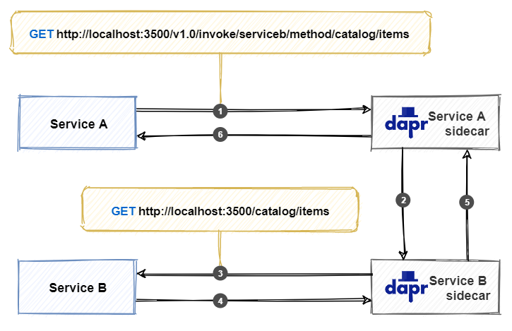

# The Dapr service invocation building block

Across a distributed system, one service often needs to communicate with another to complete a business operation. The [Dapr service invocation building block](https://docs.dapr.io/developing-applications/building-blocks/service-invocation/service-invocation-overview/) can help streamline the communication between services.

## What it solves

Making calls between services in a distributed application may appear easy, but there are many challenges involved. For example:

- Where the other services are located.
- How to call a service securely, given the service address.
- How to handle retries when short-lived [transient errors](/aspnet/aspnet/overview/developing-apps-with-windows-azure/building-real-world-cloud-apps-with-windows-azure/transient-fault-handling) occur.

Lastly, as distributed applications compose many different services, capturing insights across service call graphs are critical to diagnosing production issues.

The service invocation building block addresses these challenges by using a Dapr sidecar as a [reverse proxy](https://kemptechnologies.com/reverse-proxy/reverse-proxy/) for your service.

## How it works

Let's start with an example. Consider two services, "Service A" and "Service B". Service A needs to call the `catalog/items` API on Service B. While Service A could take a dependency on Service B and make a direct call to it, Service A instead invokes the service invocation API on the Dapr sidecar. Figure 6-1 shows the operation.



**Figure 6-1**. How Dapr service invocation works.

Note the steps from the previous figure:

1. Service A makes a call to the `catalog/items` endpoint in Service B by invoking the service invocation API on the Service A sidecar.

    > [!NOTE]
    > The sidecar uses a pluggable name resolution component to resolve the address of Service B. In self-hosted mode, Dapr uses [mDNS](https://www.ionos.com/digitalguide/server/know-how/multicast-dns/) to find it. When running in Kubernetes mode, the Kubernetes DNS service determines the address.

1. The Service A sidecar forwards the request to the Service B sidecar.

1. The Service B sidecar makes the actual `catalog/items` request against the Service B API.

1. Service B executes the request and returns a response back to its sidecar.

1. The Service B sidecar forwards the response back to the Service A sidecar.

1. The Service A sidecar returns the response back to Service A.

Because the calls flow through sidecars, Dapr can inject some useful cross-cutting behaviors:

- Automatically retry calls upon failure.
- Make calls between services secure with mutual (mTLS) authentication, including automatic certificate rollover.
- Control what operations clients can do using access control policies.
- Capture traces and metrics for all calls between services to provide insights and diagnostics.

Any application can invoke a Dapr sidecar by using the native **invoke** API built into Dapr. The API can be called with either HTTP or gRPC. Use the following URL to call the HTTP API:

``` http
http://localhost:<dapr-port>/v1.0/invoke/<application-id>/method/<method-name>
```

- `<dapr-port>` the HTTP port that Dapr is listening on.
- `<application-id>` application ID of the service to call.
- `<method-name>` name of the method to invoke on the remote service.

In the following example, a *curl* call is made to the `catalog/items` 'GET' endpoint of `Service B`:

```console
curl http://localhost:3500/v1.0/invoke/serviceb/method/catalog/items
```

> [!NOTE]
> The Dapr APIs enable any application stack that supports HTTP or gRPC to use Dapr building blocks. Therefore, the service invocation building block can act as a bridge between protocols. Services can communicate with each other using HTTP, gRPC or a combination of both.

In the next section, you'll learn how to use the .NET SDK to simplify service invocation calls.

## Use the Dapr .NET SDK

The Dapr [.NET SDK](https://github.com/dapr/dotnet-sdk) provides .NET developers with an intuitive and language-specific way to interact with Dapr. The SDK offers developers three ways of making remote service invocation calls:

1. Invoke HTTP services using HttpClient
1. Invoke HTTP services using DaprClient
1. Invoke gRPC services using DaprClient

### Invoke HTTP services using HttpClient

The preferred way to call an HTTP endpoint is to use Dapr's rich integration with `HttpClient`. The following example submits an order by calling the `submit` method of the `orderservice` application:

```csharp
var httpClient = DaprClient.CreateInvokeHttpClient();
await httpClient.PostAsJsonAsync("http://orderservice/submit", order);
```

In the example, `DaprClient.CreateInvokeHttpClient` returns an `HttpClient` instance that is used to perform Dapr service invocation. The returned `HttpClient` uses a special Dapr message handler that rewrites URIs of outgoing requests. The host name is interpreted as the application ID of the service to call. The rewritten request that's actually being called is:

```http
http://127.0.0.1:3500/v1/invoke/orderservice/method/submit
```

This example uses the default value for the Dapr HTTP endpoint, which is `http://127.0.0.1:<dapr-http-port>/`. The value of `dapr-http-port` is taken from the `DAPR_HTTP_PORT` environment variable. If it's not set, the default port number `3500` is used.

Alternatively, you can configure a custom endpoint in the call to `DaprClient.CreateInvokeHttpClient`:

```csharp
var httpClient = DaprClient.CreateInvokeHttpClient(daprEndpoint = "localhost:4000");
```

You can also directly set the base address by specifying the application ID. Doing so enables relative URIs when making a call:

```csharp
var httpClient = DaprClient.CreateInvokeHttpClient("orderservice");
await httpClient.PostAsJsonAsync("/submit");
```

The `HttpClient` object is intended to be long-lived. A single `HttpClient` instance can be reused for the lifetime of the application. The next scenario demonstrates how an `OrderServiceClient` class reuses a Dapr `HttpClient` instance:  

```csharp
public void ConfigureServices(IServiceCollection services)
{
    // ...
    services.AddSingleton<IOrderServiceClient, OrderServiceClient>(
        _ => new OrderServiceClient(DaprClient.CreateInvokeHttpClient("orderservice")));
}
```

In the snippet above, the `OrderServiceClient` is registered as a singleton with the ASP.NET Core dependency injection system. An implementation factory creates a new `HttpClient` instance by calling `DaprClient.CreateInvokeHttpClient`. It then uses the newly created `HttpClient` to instantiate the `OrderServiceClient` object. By registering the `OrderServiceClient` as a singleton, it will be reused for the lifetime of the application.

The `OrderServiceClient` itself has no Dapr-specific code. Even though Dapr service invocation is used under the hood, you can treat the Dapr HttpClient like any other HttpClient:

```csharp
public class OrderServiceClient : IOrderServiceClient
{
    private readonly HttpClient _httpClient;

    public OrderServiceClient(HttpClient httpClient)
    {
        _httpClient = httpClient ?? throw new ArgumentNullException(nameof(httpClient));
    }

    public async Task SubmitOrder(Order order)
    {
        var response = await _httpClient.PostAsJsonAsync("submit", order);
        response.EnsureSuccessStatusCode();
    }
}
```

Using the HttpClient class with Dapr service invocation has many benefits:

- HttpClient is a well-known class that many developers already use in their code. Using HttpClient for Dapr service invocation allows developers to reuse their existing skills.
- HttpClient supports advanced scenarios, such as custom headers, and full control over request and response messages.
- In .NET 5, HttpClient supports automatic serialization and deserialization using System.Text.Json.
- HttpClient integrates with many existing frameworks and libraries, such as [Refit](https://github.com/reactiveui/refit), [RestSharp](https://restsharp.dev/getting-started/getting-started.html#basic-usage), and [Polly](https://github.com/App-vNext/Polly).

### Invoke HTTP services using DaprClient

While HttpClient is the preferred way to invoke services using HTTP semantics, you can also use the `DaprClient.InvokeMethodAsync` family of methods. The following example submits an order by calling the `submit` method of the `orderservice` application:

``` csharp
var daprClient = new DaprClientBuilder().Build();
try
{
    var confirmation =
        await daprClient.InvokeMethodAsync<Order, OrderConfirmation>(
            "orderservice", "submit", order);
}
catch (InvocationException ex)
{
    // Handle error
}
```

The third argument, an `order` object, is serialized internally (with `System.Text.JsonSerializer`) and sent as the request payload. The .NET SDK takes care of the call to the sidecar. It also deserializes the response to an `OrderConfirmation` object. Because no HTTP method is specified, the request is executed as an HTTP POST.

The next example demonstrates how you can make an HTTP GET request by specifying the `HttpMethod`:

```csharp
var catalogItems = await daprClient.InvokeMethodAsync<IEnumerable<CatalogItem>>(HttpMethod.Get, "catalogservice", "items");
```

For some scenarios, you may require more control over the request message. For example, when you need to specify request headers, or you want to use a custom serializer for the payload. `DaprClient.CreateInvokeMethodRequest` creates an `HttpRequestMessage`. The following example demonstrates how to add an HTTP authorization header to a request message:

```csharp
var request = daprClient.CreateInvokeMethodRequest("orderservice", "submit", order);
request.Headers.Authorization = new AuthenticationHeaderValue("bearer", token);
```

The `HttpRequestMessage` now has the following properties set:

- Url = `http://127.0.0.1:3500/v1.0/invoke/orderservice/method/submit`
- HttpMethod = POST
- Content =  `JsonContent` object containing the JSON-serialized `order`
- Headers.Authorization = "bearer \<token>"

Once you've got the request set up the way you want, use `DaprClient.InvokeMethodAsync` to send it:

```csharp
var orderConfirmation = await daprClient.InvokeMethodAsync<OrderConfirmation>(request);
```

`DaprClient.InvokeMethodAsync` deserializes the response to an `OrderConfirmation` object if the request is successful. Alternatively, you can use `DaprClient.InvokeMethodWithResponseAsync` to get full access to the underlying `HttpResponseMessage`:

```csharp
var response = await daprClient.InvokeMethodWithResponseAsync(request);
response.EnsureSuccessStatusCode();

var orderConfirmation = response.Content.ReadFromJsonAsync<OrderConfirmation>();
```

> [!NOTE]
> For service invocation calls using HTTP, it's worth considering using the Dapr HttpClient integration presented in the previous section. Using HttpClient gives you additional benefits such as integration with existing frameworks and libraries.

### Invoke gRPC services using DaprClient

DaprClient provides a family of `InvokeMethodGrpcAsync` methods for calling gRPC endpoints. The main difference with the HTTP methods is the use of a Protobuf serializer instead of JSON. The following example invokes the `submitOrder` method of the `orderservice` over gRPC.

```csharp
var daprClient = new DaprClientBuilder().Build();
try
{
    var confirmation = await daprClient.InvokeMethodGrpcAsync<Order, OrderConfirmation>("orderservice", "submitOrder", order);
}
catch (InvocationException ex)
{
    // Handle error
}
```

In the example above, DaprClient serializes the given `order` object using [Protobuf](https://developers.google.com/protocol-buffers) and uses the result as the gRPC request body. Likewise, the response body is Protobuf deserialized and returned to the caller. Protobuf typically provides better performance than the JSON payloads used in HTTP service invocation.

## Name resolution components

At the time of writing, Dapr provides support for the following name resolution components:

- mDNS (default when running self-hosted)
- Kubernetes Name Resolution (default when running in Kubernetes)
- HashiCorp Consul

### Configuration

To use a non-default name resolution component, add a `nameResolution` spec to the application's Dapr configuration file. Here's an example of a Dapr configuration file that enables HashiCorp Consul name resolution:

```yaml
apiVersion: dapr.io/v1alpha1
kind: Configuration
metadata:
  name: dapr-config
spec:
  nameResolution:
    component: "consul"
    configuration:
      selfRegister: true
```

## Sample application: Dapr Traffic Control

In Dapr Traffic Control sample app, the FineCollection service uses the Dapr service invocation building block to retrieve vehicle and owner information from the VehicleRegistration service. Figure 6-2 shows the conceptual architecture of the Dapr Traffic Control sample application. The Dapr service invocation building block is used in flows marked with number 1 in the diagram:

:::image type="content" source="./media/service-invocation/dapr-solution-service-invocation.png" alt-text="Conceptual architecture of the Dapr Traffic Control sample application.":::

**Figure 6-2**. Conceptual architecture of the Dapr Traffic Control sample application.

Information is retrieved by the ASP.NET `CollectionController` class in the FineCollection service. The `CollectFine` method expects an incoming `SpeedingViolation` parameter. It invokes a Dapr service invocation building block to call to the VehicleRegistration service. The code snippet is presented below.

 ```csharp
 [Topic("pubsub", "speedingviolations")]
 [Route("collectfine")]
 [HttpPost]
 public async Task<ActionResult> CollectFine(SpeedingViolation speedingViolation, [FromServices] DaprClient daprClient)
 {
    // ...

    // get owner info (Dapr service invocation)
    var vehicleInfo = _vehicleRegistrationService.GetVehicleInfo(speedingViolation.VehicleId).Result;

    // ...
 }
 ```

The code uses a proxy of type `VehicleRegistrationService` to call the VehicleRegistration service. ASP.NET Core injects an instance of the service proxy using constructor injection:

 ```csharp
 public CollectionController(
     ILogger<CollectionController> logger,
     IFineCalculator fineCalculator,
     VehicleRegistrationService vehicleRegistrationService,
     DaprClient daprClient)
 {
     // ...
 }
 ```

The `VehicleRegistrationService` class contains a single method: `GetVehicleInfo`. It uses the ASP.NET Core `HttpClient` to call the VehicleRegistration service:

 ```csharp
 public class VehicleRegistrationService
 {
     private HttpClient _httpClient;
     public VehicleRegistrationService(HttpClient httpClient)
     {
         _httpClient = httpClient;
     }

     public async Task<VehicleInfo> GetVehicleInfo(string licenseNumber)
     {
         return await _httpClient.GetFromJsonAsync<VehicleInfo>(
             $"vehicleinfo/{licenseNumber}");
     }
 }
 ```

The code doesn't depend on any Dapr classes directly. It instead leverages the Dapr ASP.NET Core integration as described in the [Invoke HTTP services using HttpClient](#invoke-http-services-using-httpclient) section of this module. The following code in the `ConfigureService` method of the `Startup` class registers the `VehicleRegistrationService` proxy:

```csharp
// ...

services.AddSingleton<VehicleRegistrationService>(_ =>
    new VehicleRegistrationService(DaprClient.CreateInvokeHttpClient(
        "vehicleregistrationservice", $"http://localhost:{daprHttpPort}"
    )));

// ...
```

The `DaprClient.CreateInvokeHttpClient` creates an `HttpClient` instance that calls the VehicleRegistration service using the service invocation building block under the covers. It expects both the Dapr `app-id` of the target service and the URL of its Dapr sidecar. At start time, the `daprHttpPort` argument contains the port number used for HTTP communication with the Dapr sidecar.

Using Dapr service invocation in the Traffic Control sample application provides several benefits:

 1. Decouples the location of the target service.
 1. Adds resiliency with automatic retry features.
 1. Ability to reuse an existing `HttpClient` based proxy (offered by the ASP.NET Core integration).

## Summary

In this chapter, you learned about the service invocation building block. You saw how to invoke remote methods both by making direct HTTP calls to the Dapr sidecar, and by using the Dapr .NET SDK.

The Dapr .NET SDK provides multiple ways to invoke remote methods. HttpClient support is great for developers wanting to reuse existing skills and is compatible with many existing frameworks and libraries. DaprClient offers support for directly using the Dapr service invocation API using either HTTP or gRPC semantics.

### References

- [Dapr service invocation building block](https://docs.dapr.io/developing-applications/building-blocks/service-invocation/)

- [Monitoring distributed cloud-native applications](../cloud-native/observability-patterns.md)

> [!div class="step-by-step"]
> [Previous](state-management.md)
> [Next](publish-subscribe.md)
