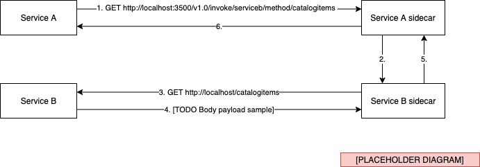

TODO
- [ ] When to use instance vs sidecar
- [ ] Boilerplate intro in .NET SDK section
- [ ] Writing the .NET SDK introduction will make this easier

# The Service Invocation building block

Many services need to communicate with each other in a distributed system. The Service Invocation building block enables you to quickly set up communication between services using either gRPC or HTTP protocols while providing additional benefits.

## What it solves

Making calls between services may sound easy, but there are some challenges involved. In a distributed system, how do you even know where the other services are? Once you've got the address, how do you call that service securely? And what about if that call fails? How do you handle retries to transient errors? Lastly, since distributed systems can consist of many different services, it is also necessary to get insights into the system and the service call graphs to diagnose issues that may pop up in production.

The Dapr Service Invocation building block helps you solve these challenges by using a Dapr instance as a reverse proxy for your service.

## How it works

Let's start with an example. There are two services, service A and service B, and service A needs to call the `catalogitems` method on service B. Instead of making a direct call from service A to service B, service A calls the invoke API of a Dapr instance. This example uses a sidecar architecture, in which each application talks to its own instance of Dapr.



The sidecar takes care of the rest. It will first use the pluggable service discovery mechanism to resolve the address of service B. An implementation using mDNS is provided for standalone hosting. When running in Kubernetes, the Kubernetes DNS service is used to resolve the address.

Once the sidecar has resolved the address, it will forward the request to the service B sidecar. The service B sidecar will then make the actual `catalogitems` request on the service B API. The response returned by service B will flow back through the sidecars to service A.

Calls to and from the sidecars can be done using either gRPC or HTTP protocols. Communication between sidecars is done using gRPC.


Because the call is now routed through sidecars, Dapr can add additional features:
- [TODO]


There are multiple ways to send the request to the sidecar. For example, you can use the Dapr CLI tool:
```
dapr invokeGet --app-id serviceb --method catalogitems
```
Or you can directly send a request to the HTTP listening port of the sidecar using `curl`:
```
curl http://localhost:3500/v1.0/invoke/serviceb/method/catalogitems
```

In the next section, we'll look at using the native .NET SDK to make service invocation calls.

### Using the .NET SDK

The Dapr .NET SDK provides .NET developers with a native way to interact with Dapr. Most interaction with Dapr instances is done through the `DaprClient` class.

Use the `InvokeMethodAsync` method of the `DaprClient` class to invoke a remote method. The application ID and the name of the method to call are passed as parameters. For example:

``` c#
var result = await daprClient.InvokeMethodAsync<Order, SubmitOrderResult>("orderservice", "submitorder", order);
```

In the example a call is made to the `submitorder` method of the `orderservice` service. The `order` object is serialized (using `System.Text.JsonSerializer`) and sent as the request payload. The response of the method call is deserialized to a `SubmitOrderResult` object.

Calls from the application to the sidecar are done using gRPC. The same is true for communication between the local and remote sidecar. Only the call from the remote sidecar to the remote application is done over either gRPC or HTTP, depending on the type of application. So even in the case where you're calling an HTTP endpoint of a remote application, you still get gRPC performance benefits for the calls between the sidecars. In a real-world scenario, those calls matter the most for performance because the sidecars may be located on different machines.

When calling an application that is listening on HTTP, you can use the `HttpExtension` class to configure the details of the HTTP call. The `HttpExtension` class provides access to the following properties:

- Verb: the HTTP verb (e.g. `POST`, `GET`, `PUT`, `PATCH`, and `DELETE`). The default verb used is `POST`.
- ContentType: The content-type of the HTTP request, such as `application/json`.
- QueryString: A collection of query string parameters.
- Headers: A collection of HTTP request headers.

As an example, consider the following HTTP request:
``` http
GET http://<serviceb-address>/catalogitems?pagesize=10
```

Using the `HttpExtension` class we can provide all necessary settings for this call to the `DaprClient`:
``` c#
var result = await daprClient.InvokeMethodAsync<IEnumerable<CatalogItem>>(
    "serviceb",
    "catalogitems",
    new HTTPExtension
    {
        Verb = HTTPVerb.Get,
        QueryString = new Dictionary<string, string>
        {
            ["pagesize"] = "10"
        }
    });
``` 

## Reference case: eShopOnDapr

[Really quick intro on specific <BuildingBlock> stuff in eShop]

### Service Invocation in eShopOnDapr


``` c#
var result = await daprClient.InvokeMethodAsync<>(
    "",
    "",
    new HTTPExtension
    {
        Verb = HTTPVerb.Get,
        Headers = new Dictionary<string, string>
        {
            [HeaderNames.Authorization] = accessToken
        }
    });
``` 


TODO Sequence diagram of update basket flow

…


### Compared to eShopOnContainers

…

## Summary

### References

https://github.com/dapr/docs/tree/master/concepts/service-invocation


>[!div class=“step-by-step”]
>[Previous](~index.md~)
>[Next](~index.md~)
