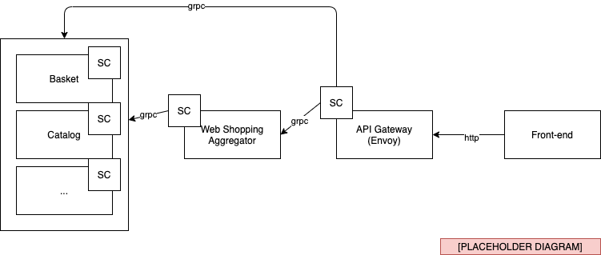
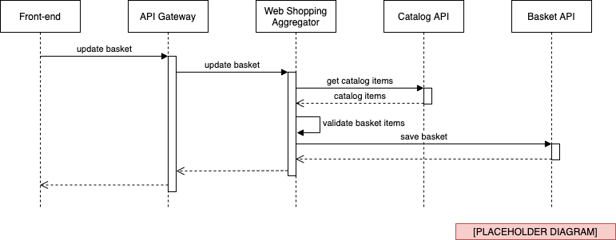

# The Service Invocation building block

Many services need to communicate with each other in a distributed system. The Service Invocation building block enables you to quickly set up communication between services using either gRPC or HTTP protocols while providing additional benefits.

## What it solves

Making calls between services in a distributed application may sound easy, but there are some challenges involved. In a distributed application, how do you even know where the other services are? Once you've got the address, how do you call that service securely? And what about if that call fails? How do you handle retries to transient errors? Lastly, since distributed applications can consist of many different services, it is also necessary to get insights into the application and the service call graphs to diagnose issues that may pop up in production.

The Dapr Service Invocation building block helps you solve these challenges by using a Dapr sidecar as a reverse proxy for your service.

## How it works

Let's start with an example. There are two services, service A and service B, and service A needs to call the `catalog/items` API on service B. Instead of making a direct call from service A to service B, service A uses the invoke API of its Dapr sidecar.


The sidecar takes care of the rest. It first uses the pluggable service discovery mechanism to resolve the address of service B. Standalone hosting uses mDNS to achieve this. When running in Kubernetes, Dapr uses the Kubernetes DNS service to determine the address.

After the sidecar has resolved the address, it forwards the request to the service B sidecar. The service B sidecar then makes the actual `catalog/items` request on the service B API. The response returned by service B will flow back through the sidecars to service A.

Because the calls flow through sidecars, Dapr can inject some handy functionality:
- automatic retries in case of failures
- traffic encryption using automatic mutual TLS
- control what operations clients can perform using access control policies
- gather traces and metrics for all calls between services to provide insights and diagnostics

To invoke a service using Dapr, use the `invoke` API on the Dapr sidecar:

```
http://localhost:<daprPort>/v1.0/invoke/<applicationid>/method/<methodname>
```

In the following example, we use *curl* to call the `catalog/items` 'GET' endpoint of `serviceb`:

```
curl http://localhost:3500/v1.0/invoke/serviceb/method/catalog/items
```

In the next section, we'll use the native .NET SDK to make service invocation calls.

### Using the .NET SDK

The Dapr .NET SDK provides .NET developers with a native way to interact with Dapr. For most interaction with Dapr instances, you can use the `DaprClient` class.

Use the `InvokeMethodAsync` method of the `DaprClient` class to invoke a remote method. In the following example, we submit an order by calling the `order/submit` method of the `orderservice` application:

``` csharp
var result = await daprClient.InvokeMethodAsync<Order, SubmitOrderResult>(
    "orderservice", "order/submit", order);
```

The `order` object is serialized (the SDK uses `System.Text.JsonSerializer` internally) and sent as the request payload. The SDK takes care of the call to the sidecar and deserializes the method call response to a `SubmitOrderResult` object.

Using the .NET SDK, you can call services that provide either a gRPC or HTTP/REST API. When calling a service listening on HTTP, you can use the `HttpExtension` class to configure the HTTP call details. The `HttpExtension` class provides access to the following properties:

- Verb: the HTTP verb (e.g. `POST`, `GET`, `PUT`, `PATCH`, and `DELETE`). The default verb used is `POST`.
- ContentType: The content-type of the HTTP request, such as `application/json`.
- QueryString: A collection of query string parameters.
- Headers: A collection of HTTP request headers.

As an example, consider the following HTTP endpoint:
```
http://<serviceb-address>/catalog/items?pagesize=10
```

Using the `HttpExtension` class, you can provide all the necessary settings for this call to the `DaprClient`:

``` csharp
var result = await daprClient.InvokeMethodAsync<IEnumerable<CatalogItem>>(
    "serviceb",
    "catalog/items",
    new HTTPExtension
    {
        Verb = HTTPVerb.Get,
        QueryString = new Dictionary<string, string>
        {
            ["pagesize"] = "10"
        }
    });
``` 

## Reference case: eShopOnDapr

The original eShopOnContainers implementation uses a mix of HTTP/REST and gRPC services. The use of gRPC is limited to the communication between aggregator services and back-end services:


1. The front-end uses HTTP/REST to call the API Gateway.
2. For simple CRUD requests that can be handled by a single back-end service, the API Gateway forwards the request using HTTP/REST.
3. An aggregator service handles more complex requests that involve various coordinated calls to back-end services.
4. The Web Shopping Aggregator service uses gRPC to call back-end services.

In the eShopOnDapr implementation, the services, as well as the API Gateway, have been *Daprized* by adding Dapr sidecar containers:



1. The front-end still uses HTTP/REST to call the API Gateway.
2. The Envoy API Gateway forwards requests to the `invoke` API of its sidecar to use Dapr service invocation to make calls to the HTTP/REST APIs of the aggregator and back-end services.
3. The Web Shopping Aggregator service uses the Dapr .NET SDK to call the HTTP/REST APIs of the back-end services. 

All calls between sidecars are gRPC calls. So even in the case where you're invoking an HTTP/REST API of a remote service, you still get gRPC performance benefits for the calls between the sidecars. Those calls matter the most for performance in a real-world scenario because sidecars often are located on different machines.

> Note that the Service Invocation building block acts as a bridge between protocols. Calls to and from the sidecars use either gRPC or HTTP protocols. Therefore, services can communicate using HTTP to HTTP, HTTP to gRPC, gRPC to HTTP, or gRPC to gRPC. 

By using Dapr sidecars, eShopOnDapr now benefits from the features offered by the Service Invocation building block such as service discovery, automatic mTLS, and observability.

### Forward HTTP requests using Envoy and Dapr

In the original eShopOnContainers implementation, Envoy forwards incoming HTTP requests from the front-ends directly to the appropriate back-end service. In eShopOnDapr, a Dapr sidecar is added to the Envoy proxy to get Dapr Service Invocation benefits such as mTLS and observability.

We first added a `dapr` cluster to the Envoy configuration to make it possible for Envoy to forward HTTP requests to a Dapr sidecar container. The cluster configuration contains a host that points to the HTTP listening port of the Dapr sidecar:

``` yaml
clusters:
- name: dapr
  connect_timeout: 0.25s
  type: strict_dns
  hosts:
  - socket_address:
    address: 127.0.0.1
    port_value: 3500
```

We then updated the Envoy routes configuration to rewrite incoming requests as calls to the Dapr sidecar:

``` yaml
- name: "c-short"
  match:
    prefix: "/c/"
  route:
    auto_host_rewrite: true
    prefix_rewrite: "/v1.0/invoke/catalog-api/method/"
    cluster: dapr
```

For example, consider the scenario where the front-end wants to retrieve a list of catalog items. The Catalog API provides an endpoint for getting the catalog items:

``` csharp
[Route("api/v1/[controller]")]
[ApiController]
public class CatalogController : ControllerBase
{
    ...

    [HttpGet]
    [Route("items")]
    public async Task<IActionResult> ItemsAsync(
        [FromQuery]int pageSize = 10,
        [FromQuery]int pageIndex = 0)
    {
        ...
    }
```

First, the front-end makes a direct HTTP call to the Envoy API gateway. This behavior hasn't changed in eShopOnDapr compared to eShopOnContainers.

```
GET http://<api-gateway>/c/api/v1/catalog/items?pageSize=20
```

Envoy matches the route, rewrites the HTTP request, and forwards it to the `invoke` API of its Dapr sidecar:

```
GET http://127.0.0.1:3500/v1.0/invoke/catalog-api/method/api/v1/catalog/items?pageSize=20
```

The sidecar takes care of service discovery and sends the request to the Catalog API sidecar. Finally, the Catalog API sidecar will call the Catalog API to get the catalog items and return the response:

```
GET http://127.0.0.1/api/v1/catalog/items?pageSize=20
```

### Make aggregated service calls using the .NET SDK

Most calls from the eShop front-end can be forwarded to a single back-end service by the API gateway. However, some scenarios require multiple back-end services to work together to complete a request from the front-end. In these cases, eShop uses the Web Shopping Aggregator service to mediate the work across different services. For example, when you add an item to your shopping basket:



In this example, the Web Shopping Aggregator service first retrieves the catalog items from the Catalog API to ensure that the updated basket items are still available from the catalog and contain the correct price. After the validation has succeeded, the Web Shopping Aggregator service saves the updated shopping basket by calling the Basket API.

Let's look at some code. The Web Shopping Aggregator service contains a `BasketController` that provides an endpoint for updating the shopping basket:

``` csharp
[Route("api/v1/[controller]")]
[Authorize]
[ApiController]
public class BasketController : ControllerBase
{
    private readonly ICatalogService _catalog;
    private readonly IBasketService _basket;

    ...

    [HttpPost]
    [HttpPut]
    public async Task<ActionResult<BasketData>> UpdateAllBasketAsync(
        [FromBody] UpdateBasketRequest data, [FromHeader] string authorization)
    {
        // Get the item details from the catalog API.
        var catalogItems = await _catalog.GetCatalogItemsAsync(
            data.Items.Select(x => x.ProductId));

        // Check item availability and prices; store results in basket object.
        var basket = CreateValidatedBasket(data, catalogItems);

        // Save the shopping basket.
        await _basket.UpdateAsync(basket, authorization);

        return basket;
    }

    ...
```

Note that the `UpdateAllBasketAsync` method gets the *Authorization* header of the incoming request using a `FromHeader` attribute. The *Authorization* header contains the access token that is needed to call protected back-end services.

After receiving a request to update the basket, the Web Shopping Aggregator service calls the Catalog API to get the item details. The service uses an injected `ICatalogService` object to communicate with the Catalog API. The original implementation of the interface used gRPC to make the call. We changed the implementation to use Dapr service invocation:

``` csharp
public class CatalogService : ICatalogService
{
    private const string DaprAppId = "catalog-api";

    private readonly DaprClient _daprClient;

    public CatalogService(DaprClient daprClient)
    {
        _daprClient = daprClient;
    }

    public async Task<IEnumerable<CatalogItem>> GetCatalogItemsAsync(
        IEnumerable<int> ids)
    {
        return await _daprClient.InvokeMethodAsync<IEnumerable<CatalogItem>>(
            DaprAppId,
            "api/v1/catalog/items",
            new HTTPExtension
            { 
                QueryString = new Dictionary<string, string>
                {
                    ["ids"] = string.Join(",", ids),
                },
                Verb = HTTPVerb.Get 
            });
    }

    ...
}
```

Note how we use the `HTTPExtension` object to pass the query string and HTTP verb details to the Catalog API.

The other call made by the Web Shopping Aggregator service is to the Basket API, which only allows authorized requests. We pass the access token along in an *Authorization* request header to ensure the call succeeds:

``` csharp
public class BasketService : IBasketService
{
    private const string DaprAppId = "basket-api";

    ...

    public Task UpdateAsync(BasketData currentBasket, string accessToken)
    {
        return _daprClient.InvokeMethodAsync(
            DaprAppId,
            "api/v1/basket",
            currentBasket,
            new HTTPExtension
            {
                Headers = new Dictionary<string, string>
                {
                    [HeaderNames.Authorization] = accessToken
                }
            });
    }

    ...
}
```

Note that we don't need to explicitly specify the HTTP verb for this POST call because `POST` is the default value of `HTTPExtension.Verb`.

## Summary

In this chapter, we introduced the Service Invocation building block. We showed how to invoke remote methods by making direct HTTP calls to the Dapr sidecar and using the Dapr .NET SDK. 

The eShopOnDapr reference case shows how we improved the original eShopOnContainers solution by using Dapr service invocation. Adding Dapr to eShop provides benefits such as automatic retries, message encryption using mTLS, and improved observability.

### References

https://github.com/dapr/docs/blob/master/concepts/service-invocation/README.md


>[!div class=“step-by-step”]
>[Previous](~index.md~)
>[Next](~index.md~)
