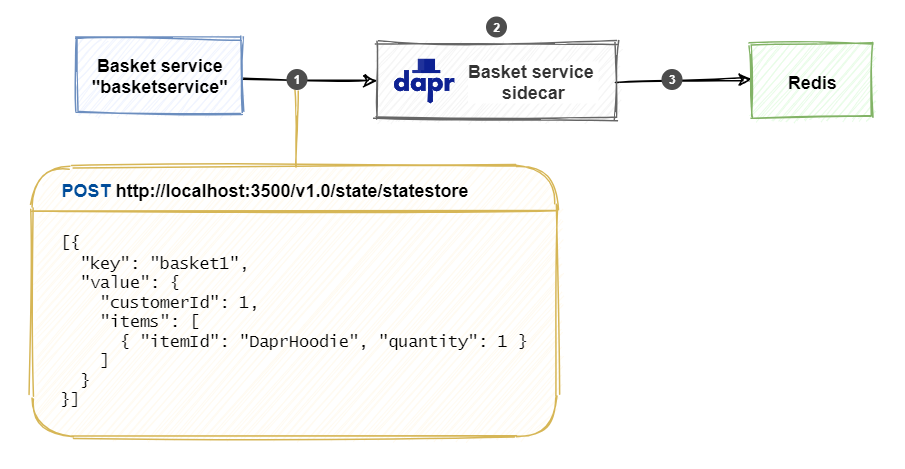
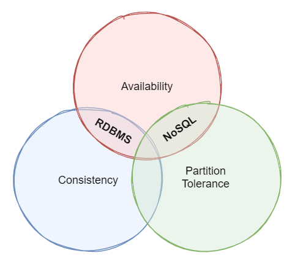

# The Dapr state management building block

Distributed applications are composed of independent services. While each service should be stateless, some services must track state to complete business operations. Consider a shopping basket service for an e-Commerce site. If the service can't track state, the customer could loose the shopping basket content by leaving the website, resulting in a lost sale and an unhappy customer experience. For these scenarios, state needs to be persisted to a distributed state store. The [Dapr state management building block](https://docs.dapr.io/developing-applications/building-blocks/state-management/) simplifies state tracking and offers advanced features across various data stores.

To try out the state management building block, have a look at the [counter application sample in chapter 3](getting-started.md).

## What it solves

Tracking state in a distributed application can be challenging. For example:

- The application may require different types of data stores.
- Different consistency levels may be required for accessing and updating data.
- Multiple users may update data at the same time, requiring  conflict resolution.
- Services must retry any short-lived [transient errors](/aspnet/aspnet/overview/developing-apps-with-windows-azure/building-real-world-cloud-apps-with-windows-azure/transient-fault-handling) that  occur while interacting with the data store.

The Dapr state management building block addresses these challenges. It streamlines tracking state without dependencies or a learning curve on third-party storage SDKs.

> [!IMPORTANT]
> Dapr state management offers a [key/value](/azure/architecture/guide/technology-choices/data-store-overview#keyvalue-stores) API. The feature doesn't support relational or graph data storage.

## How it works

The application interacts with a Dapr sidecar to store and retrieve key/value data. Under the hood, the sidecar API consumes a configurable state store component to persist data. Developers can choose from a growing collection of [supported state stores](https://docs.dapr.io/operations/components/setup-state-store/supported-state-stores/) that include Azure Cosmos DB, SQL Server, and Cassandra.

The API can be called with either HTTP or gRPC. Use the following URL to call the HTTP API:

```http
http://localhost:<dapr-port>/v1.0/state/<store-name>/
```

- `<dapr-port>`: the HTTP port that Dapr listens on.
- `<store-name>`: the name of the state store component to use.

Figure 5-1 shows how a Dapr-enabled shopping basket service stores a key/value pair using the Dapr state store component named `statestore`.



**Figure 5-1**. Storing a key/value pair in a Dapr state store.

Note the steps in the previous figure:

1. The basket service calls the state management API on the Dapr sidecar. The body of the request encloses a JSON array that can contain multiple key/value pairs.
1. The Dapr sidecar determines the state store based on the component configuration file. In this case, it's a Redis cache state store.
1. The sidecar persists the data to the Redis cache.

Retrieving the stored data is a similar API call. In the example below, a *curl* command retrieves the data by calling the Dapr sidecar API:

```console
curl http://localhost:3500/v1.0/state/statestore/basket1
```

The command returns the stored state in the response body:

```json
{
  "items": [
    {
      "itemId": "DaprHoodie",
      "quantity": 1
    }
  ],
  "customerId": 1
}
```

The following sections explain how to use the more advanced features of the state management building block.

### Consistency

The [CAP theorem](https://en.wikipedia.org/wiki/CAP_theorem) is a set of principles that apply to distributed systems that store state. Figure 5-2 shows the three properties of the CAP theorem.



**Figure 5-2**. The CAP theorem.

The theorem states that distributed data systems offer a trade-off between consistency, availability, and partition tolerance. And, that any datastore can only *guarantee two of the three properties*:

- *Consistency* (**C**). Every node in the cluster responds with the most recent data, even if the system must block the request until all replicas update. If you query a "consistent system" for an item that is currently updating, you won't get a response until all replicas successfully update. However, you'll always receive the most current data.

- *Availability* (**A**). Every node returns an immediate response, even if that response isn't the most recent data. If you query an "available system" for an item that is updating, you'll get the best possible answer the service can provide at that moment.

- *Partition Tolerance* (**P**). Guarantees the system continues to operate even if a replicated data node fails or loses connectivity with other replicated data nodes.

Distributed applications must handle the **P** property. As services communicate among each other with network calls, network disruptions (**P**) will occur. With that in mind, distributed applications must either be **AP** or **CP**.

**AP** applications choose availability over consistency. Dapr supports this choice with its **eventual consistency** strategy. Consider an underlying data store, such as Azure CosmosDB, which stores redundant data on multiple replicas. With eventual consistency, the state store writes the update to one replica and completes the write request with the client. After this time, the store will asynchronously update its replicas. Read requests can return data from any of the replicas, including those replicas that haven't yet received the latest update.

**CP** applications choose consistency over availability. Dapr supports this choice with its **strong consistency** strategy. In this scenario, the state store will synchronously update *all* (or, in some cases, a *quorum* of) required replicas *before* completing the write request. Read operations will return the most up-to-date data consistently across replicas.

The consistency level for a state operation is specified by attaching a *consistency hint* to the operation. The following *curl* command writes a `Hello=World` key/value pair to a state store using a strong consistency hint:

```console
curl -X POST http://localhost:3500/v1.0/state/<store-name> \
  -H "Content-Type: application/json" \
  -d '[
        {
          "key": "Hello",
          "value": "World",
          "options": {
            "consistency": "strong"
          }
        }
      ]'
```

> [!IMPORTANT]
> It is up to the Dapr state store component to fulfill the consistency hint attached to the operation. Not all data stores support both consistency levels. If no consistency hint is set, the default behavior is **eventual**.

### Concurrency

In a multi-user application, there's a chance that multiple users will update the same data concurrently (at the same time). Dapr supports optimistic concurrency control (OCC) to manage conflicts. OCC is based on an assumption that update conflicts are uncommon because users work on different parts of the data. It's more efficient to assume an update will succeed and retry if it doesn't. The alternative, implementing pessimistic locking, can affect performance with long-running locking causing data contention.

Dapr supports optimistic concurrency control (OCC) using ETags. An ETag is a value associated with a specific version of a stored key/value pair. Each time a key/value pair updates, the ETag value updates as well. When a client retrieves a key/value pair, the response includes the current ETag value. When a client updates or deletes a key/value pair, it must send that ETag value back in the request body. If another client has updated the data in the meantime, the ETags won't match and the request will fail. At this point, the client must retrieve the updated data, make the change again, and resubmit the update. This strategy is called **first-write-wins**.

Dapr also supports a **last-write-wins** strategy. With this approach, the client doesn't attach an ETag to the write request. The state store component will always allow the update, even if the underlying value has changed during the session. Last-write-wins is useful for high-throughput write scenarios with low data contention. As well, overwriting an occasional user update can be tolerated.

### Transactions

Dapr can write *multi-item changes* to a data store as a single operation implemented as a transaction. This functionality is only available for data stores that support [ACID](https://en.wikipedia.org/wiki/ACID) transactions. At the time of this writing, these stores include Redis, MongoDB, PostgreSQL, SQL Server, and Azure CosmosDB.

In the example below, a multi-item operation is sent to the state store in a single transaction. All operations must succeed for the transaction to commit. If one or more of the operations fail, the entire transaction rolls back.

```console
curl -X POST http://localhost:3500/v1.0/state/<store-name>/transaction \
  -H "Content-Type: application/json" \
  -d '{
        "operations": [
          {
            "operation": "upsert",
            "request": { "key": "Key1", "value": "Value1"
            }
          },
          {
            "operation": "delete",
            "request": { "key": "Key2" }
          }
        ]
      }'
```

For data stores that don't support transactions, multiple keys can still be sent as a single request. The following example shows a **bulk** write operation:

```console
curl -X POST http://localhost:3500/v1.0/state/<store-name> \
  -H "Content-Type: application/json" \
  -d '[
        { "key": "Key1", "value": "Value1" },
        { "key": "Key2", "value": "Value2" }
      ]'
```

For bulk operations, Dapr will submit each key/value pair update as a separate request to the data store.

## Use the Dapr .NET SDK

The Dapr .NET SDK provides language-specific support for .NET Core platform. Developers can use the `DaprClient` class introduced in [chapter 3](getting-started.md) to read and write data. The following example shows how to use the `DaprClient.GetStateAsync<TValue>` method to read data from a state store. The method expects the store name, `statestore`, and key, `AMS`, as parameters:

```csharp
var weatherForecast = await daprClient.GetStateAsync<WeatherForecast>("statestore", "AMS");
```

If the state store contains no data for key `AMS`, the result will be `default(WeatherForecast)`.

To write data to the data store, use the `DaprClient.SaveStateAsync<TValue>` method:

```csharp
daprClient.SaveStateAsync("statestore", "AMS", weatherForecast);
```

The example uses the **last-write-wins** strategy as an ETag value isn't passed to the state store component. To use optimistic concurrency control (OCC) with a **first-write-wins** strategy, first retrieve the current ETag using the `DaprClient.GetStateAndETagAsync` method. Then write the updated value and pass along the retrieved ETag using the `DaprClient.TrySaveStateAsync` method.

```csharp
var (weatherForecast, etag) = await daprClient.GetStateAndETagAsync<WeatherForecast>("statestore", city);

// ... make some changes to the retrieved weather forecast

var result = await daprClient.TrySaveStateAsync("statestore", city, weatherForecast, etag);
```

The `DaprClient.TrySaveStateAsync` method fails when the data (and associated ETag) has been changed in the state store after the data was retrieved. The method returns a boolean value to indicate whether the call succeeded. A strategy to handle the failure is to simply reload the updated data from the state store, make the change again, and resubmit the update.

If you always want a write to succeed regardless of other changes to the data, use the **last-write-wins** strategy.

The SDK provides other methods to retrieve data in bulk, delete data, and execute transactions. For more information, see the [Dapr .NET SDK repository](https://github.com/dapr/dotnet-sdk).

### ASP.NET Core integration

Dapr also supports ASP.NET Core, a cross-platform framework for building modern cloud-based web applications. The Dapr SDK integrates state management capabilities directly into the [ASP.NET Core model binding](/aspnet/core/mvc/models/model-binding) capabilities. Configuration is simple. Add the `IMVCBuilder.AddDapr` by appending the `.AddDapr` extension method in your `Startup.cs` class as shown in the next example:

```csharp
public void ConfigureServices(IServiceCollection services)
{
    services.AddControllers().AddDapr();
}
```

Once configured, Dapr can inject a key/value pair directly into a controller action using the ASP.NET Core `FromState` attribute. Referencing the `DaprClient` object is no longer necessary. The next example shows a Web API that returns the weather forecast for a given city:

```csharp
[HttpGet("{city}")]
public ActionResult<WeatherForecast> Get([FromState("statestore", "city")] StateEntry<WeatherForecast> forecast)
{
    if (forecast.Value == null)
    {
      return NotFound();
    }

    return forecast.Value;
}
```

In the example, the controller loads the weather forecast using the `FromState` attribute. The first attribute parameter is the state store, `statestore`. The second attribute parameter, `city`, is the name of the [route template](/aspnet/core/mvc/controllers/routing#route-templates) variable to get the state key. If you omit the second parameter, the name of the bound method parameter (`forecast`) is used to look up the route template variable.

The `StateEntry` class contains properties for all the information that is retrieved for a single key/value pair: `StoreName`, `Key`, `Value`, and `ETag`. The ETag is useful for implementing optimistic concurrency control (OCC) strategy. The class also provides methods to delete or update retrieved key/value data without requiring a `DaprClient` instance. In the next example, the `TrySaveAsync` method is used to update the retrieved weather forecast using OCC.

```csharp
[HttpPut("{city}")]
public async Task Put(WeatherForecast updatedForecast, [FromState("statestore", "city")] StateEntry<WeatherForecast> currentForecast)
{
    // update cached current forecast with updated forecast passed into service endpoint
    currentForecast.Value = updatedForecast;

    // update state store
    var success = await currentForecast.TrySaveAsync();

    // ... check result
}
```

## State store components

At the time of this writing, Dapr provides support for the following transactional state stores:

- Azure CosmosDB
- Azure SQL Server
- MongoDB
- PostgreSQL
- Redis

Dapr also includes support for state stores that support CRUD operations, but not transactional capabilities:

- Aerospike
- Azure Blob Storage
- Azure Table Storage
- Cassandra
- Cloudstate
- Couchbase
- etcd
- Google Cloud Firestore
- Hashicorp Consul
- Hazelcast
- Memcached
- Zookeeper

### Configuration

When initialized for local, self-hosted development, Dapr registers Redis as the default state store. Here's an example of the default state store configuration. Note the default name, `statestore`:

```yaml
apiVersion: dapr.io/v1alpha1
kind: Component
metadata:
  name: statestore
spec:
  type: state.redis
  version: v1
  metadata:
  - name: redisHost
    value: localhost:6379
  - name: redisPassword
    value: ""
  - name: actorStateStore
    value: "true"
```

 > [!NOTE]
 > Many state stores can be registered to a single application each with a different name.

The Redis state store requires `redisHost` and `redisPassword` metadata to connect to the Redis instance. In the example above, the Redis password (which is an empty string by default) is stored as a plain string. The best practice is to avoid clear-text strings and always use secret references. To learn more about secret management, see [chapter 10](secrets.md).

The other metadata field, `actorStateStore`, indicates whether the state store can be consumed by the actors building block.

### Key prefix strategies

State store components enable different strategies to store key/value pairs in the underlying store. Recall the earlier example of a shopping basket service storing items a customer wishes to purchase:

```console
curl -X POST http://localhost:3500/v1.0/state/statestore \
  -H "Content-Type: application/json" \
  -d '[{
        "key": "basket1",
        "value": {
          "customerId": 1,
          "items": [
            { "itemId": "DaprHoodie", "quantity": 1 }
          ]
        }
     }]'
```

Using the Redis Console tool, look inside the Redis cache to see how the Redis state store component persisted the data:

```
127.0.0.1:6379> KEYS *
1) "basketservice||basket1"

127.0.0.1:6379> HGETALL basketservice||basket1
1) "data"
2) "{\"items\":[{\"itemId\":\"DaprHoodie\",\"quantity\":1}],\"customerId\":1}"
3) "version"
4) "1"
```

The output shows the full Redis **key** for the data as `basketservice||basket1`. By default, Dapr uses the `application id` of the Dapr instance (`basketservice`) as a prefix for the key. This naming convention enables multiple Dapr instances to share the same data store without key name collisions. For the developer, it's critical always to specify the same `application id` when running the application with Dapr. If omitted, Dapr will generate a unique application ID. If the `application id` changes, the application can no longer access the state stored with the previous key prefix.

That said, it's possible to configure a *constant value* for the key prefix in the `keyPrefix` metadata field in the state store component file. Consider the following example:

```yaml
spec:
  metadata:
  - name: keyPrefix
  - value: MyPrefix
```

A constant key prefix enables the state store to be accessed across multiple Dapr applications. What's more, setting the `keyPrefix` to `none` omits the prefix completely.

## Reference application: eShopOnDapr

This book includes a reference application entitled `eShopOnDapr`. It's modeled from an earlier Microsoft microservices reference application, `eShopOnContainers`.

The original [eShopOnContainers](https://github.com/dotnet-architecture/eShopOnContainers) architecture used an `IBasketRepository` interface to read and write data for the basket service. The `RedisBasketRepository` class provided the implementation using Redis as the underlying data store:

```csharp
public class RedisBasketRepository : IBasketRepository
{
    private readonly ConnectionMultiplexer _redis;
    private readonly IDatabase _database;

    public RedisBasketRepository(ConnectionMultiplexer redis)
    {
        _redis = redis;
        _database = redis.GetDatabase();
    }

    public async Task<CustomerBasket> GetBasketAsync(string customerId)
    {
        var data = await _database.StringGetAsync(customerId);

        if (data.IsNullOrEmpty)
        {
            return null;
        }

        return JsonConvert.DeserializeObject<CustomerBasket>(data);
    }

    // ...
}
```

This code uses the third-party `StackExchange.Redis` NuGet package. The following steps are required to load the shopping basket for a given customer:

1. Inject a `ConnectionMultiplexer` into the constructor. The `ConnectionMultiplexer` is registered with the dependency injection framework in the `Startup.cs` file:

   ```csharp
   services.AddSingleton<ConnectionMultiplexer>(sp =>
   {
       var settings = sp.GetRequiredService<IOptions<BasketSettings>>().Value;
       var configuration = ConfigurationOptions.Parse(settings.ConnectionString, true);
       configuration.ResolveDns = true;
       return ConnectionMultiplexer.Connect(configuration);
   });
   ```

1. Use the `ConnectionMultiplexer` to create an `IDatabase` instance in each consuming class.

1. Use the `IDatabase` instance to execute a Redis StringGet call using the given `customerId` as the key.

1. Check if data is loaded from Redis; if not, return `null`.

1. Deserialize the data from Redis to a `CustomerBasket` object and return the result.

In the updated [eShopOnDapr](https://github.com/dotnet-architecture/eShopOnDapr) reference application, a new `DaprBasketRepository` class replaces the `RedisBasketRepository` class:

```csharp
public class DaprBasketRepository : IBasketRepository
{
    private const string StoreName = "eshop-basket-statestore";

    private readonly DaprClient _daprClient;

    public DaprBasketRepository(DaprClient daprClient)
    {
        _daprClient = daprClient ?? throw new ArgumentNullException(nameof(daprClient));;
    }

    public async Task<CustomerBasket> GetBasketAsync(string customerId)
    {
        return await _daprClient.GetStateAsync<CustomerBasket>(StoreName, customerId);
    }

    // ...
}
```

The updated code uses the Dapr .NET SDK to read and write data using the state management building block. The new steps to load the basket for a customer are dramatically simplified:

1. Inject a `DaprClient` into the constructor. The `DaprClient` is registered with the dependency injection framework in the `Startup.cs` file.
1. Use the `DaprClient.GetStateAsync` method to load the customer's shopping basket items from the configured state store and return the result.

The updated implementation still uses Redis as the underlying data store. But, Dapr abstracts the `StackExchange.Redis` references and complexity from the application. A Dapr configuration file is all that's needed:

```yaml
apiVersion: dapr.io/v1alpha1
kind: Component
metadata:
  name: eshop-basket-statestore
  namespace: eshop
spec:
  type: state.redis
  version: v1
  metadata:
  - name: redisHost
    value: redis:6379
  - name: redisPassword
    secretKeyRef:
      name: redisPassword
auth:
  secretStore: eshop-secretstore
```

The Dapr implementation also simplifies changing the underlying data store. For example, switching to Azure Table Storage requires only changing the contents of the configuration file. No code changes are necessary.

## Summary

The Dapr state management building block offers an API for storing key/value data across various data stores. The API provides support for:

- Bulk operations
- Strong and eventual consistency
- Optimistic concurrency control
- Multi-item transactions

The .NET SDK provides language-specific support for .NET Core and ASP.NET Core. Model binding integration simplifies accessing and updating state from ASP.NET Core controller action methods.

In the eShopOnDapr reference application, the benefits to moving to Dapr state management are clear:

1. The new implementation uses fewer lines of code.
1. It abstracts away the complexity of the third-party `StackExchange.Redis` API.
1. Replacing the underlying Redis cache with a different type of data store now only requires changes to the state store configuration file.

### References

- [Dapr supported state stores](https://docs.dapr.io/operations/components/setup-state-store/supported-state-stores/)

> [!div class="step-by-step"]
> [Previous](reference-application.md)
> [Next](service-invocation.md)
