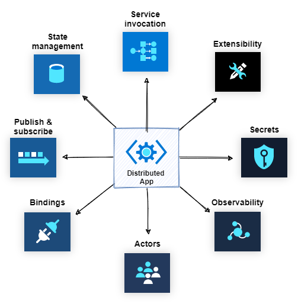
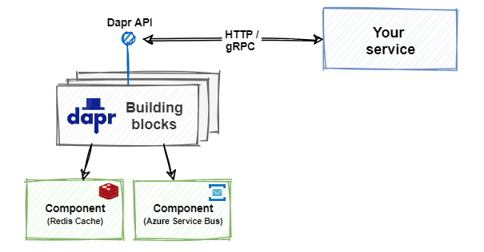
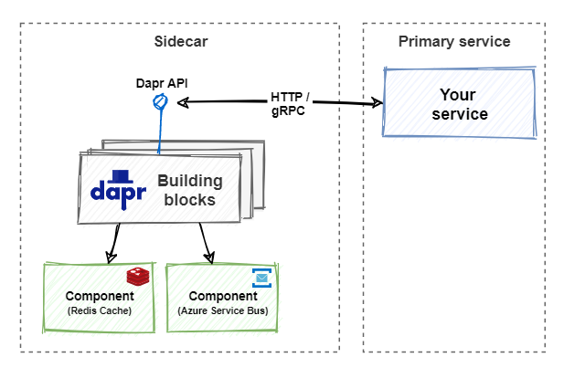

# Summary and the road ahead

We're at the end of our Dapr flight. The jet plane flying at 20,000 feet from [chapter 2](dapr-at-20000-feet.md) is on final approach and about to land.

As the plane taxis to the gate, let's take a minute to review some important conclusions from this guide:

- **Dapr** - Dapr is a *Distributed Application Runtime* that streamlines how you build distributed applications. It exposes an architecture of building blocks and pluggable components. Dapr provides a **dynamic glue** that binds your application with infrastructure capabilities that exist in the Dapr runtime. Instead of building infrastructure plumbing, you and your team focus on delivering business features to customers.

- **Open source and cross-platform** - The native Dapr API can be consumed by *any platform* that supports HTTP or gRPC. Dapr also provides language-specific SDKs for popular development platforms. Dapr v1.0 supports Go, Python, .NET, Java, PHP, and JavaScript.

- **Building blocks** - Dapr building blocks encapsulate distributed application functionality. At the time of this writing, Dapr supports the seven building blocks shown in figure 13-1.

**Figure 13-1**. Dapr building blocks.

- **Components** - Dapr components provide the concrete implementation for each Dapr building block capability. They expose a common interface that enables developers to swap out component implementations without changing application code. Figure 13-2 shows the relationship among components, building blocks, and your service.

**Figure 13-2**. Dapr building block integration.

- **Sidecars** - Dapr runs alongside your application in a sidecar architecture, either as a separate process of a container. Your application communicates with the Dapr APIs over HTTP and gRPC. Sidecars provide isolation and encapsulation as they aren't part of the service, but connected to it. Figure 13-3 shows a sidecar architecture.

**Figure 13-3**. Sidecar architecture.

- **Hosting environments** Dapr has cross-platform support and can run in multiple environments. At the time of this writing, the environments include a local self-hosted mode and Kubernetes.

- **eShopOnDapr** - This book includes an accompanying reference application entitled [eShopOnDapr](https://github.com/dotnet-architecture/eShopOnDapr). Using a popular e-commerce application domain, the reference application demonstrates the usage of each building block. It's an evolution of the widely popular [eShopOnContainers](https://github.com/dotnet-architecture/eShopOnContainers), released several years ago.

## The road ahead

Looking forward, Dapr has the potential to have a profound impact on distributed application development. What can you expect from the Dapr team and its open-source contributors?

At the time of writing, the list of proposed enhancements for Dapr include:

- Feature enhancements to existing building blocks:
  - Query capabilities in state management enabling you to retrieve multiple values.
  - Topic filtering in pub/sub enabling you to filter topics based on their content.
  - An application tracing API in observability that provides tracing in the application directly without having to bind to specific libraries.
  - Binding and pub/sub support for actors providing event driven capabilities to the actor programming model. Bound components will trigger events and messages invoke methods in the actor.

- New building blocks:
  - Configuration API building block for reading and writing configuration data. The block will bind to providers that include Azure Configuration Manager or GCP Configuration Management.
  - Http scale-to-zero autoscale.
  - Leader election building block to provide singleton instances and locking semantic capabilities.
  - Transparent proxying building block for service invocation, enabling you to route messages based on URLs or DNS addresses at the network level.
  - Resiliency building block (circuit breakers, bulkheads & timeouts).

- Integration with frameworks and cloud native technologies. Some examples include:
  - Django
  - Nodejs
  - Express
  - Kyma
  - Midway

- New language SDKs:
  - JavaScript
  - RUST
  - C++

- New hosting platforms:
  - VMs
  - Azure IoT Edge
  - Azure Stack Edge
  - Azure Service Fabric

- Developer and operator productivity tooling:
  - VS Code extension.
  - Remote Dev Containers for local debugging a DevOps pipeline development.
  - Dapr operational dashboard enhancements that will provide deeper visibility into the operational concerns of managing Dapr applications.

Dapr version 1.0 provides developers with a compelling toolbox for building distributed applications. As the proposed enhancement list shows, Dapr is under active development with many new capabilities to come. Stay tuned to the [Dapr site](https://dapr.io/) and [Dapr announcement blog](https://cloudblogs.microsoft.com/opensource/2019/10/16/announcing-dapr-open-source-project-build-microservice-applications/) for future updates.

>[!div class="step-by-step"]
>[Previous](reference-application.md)
