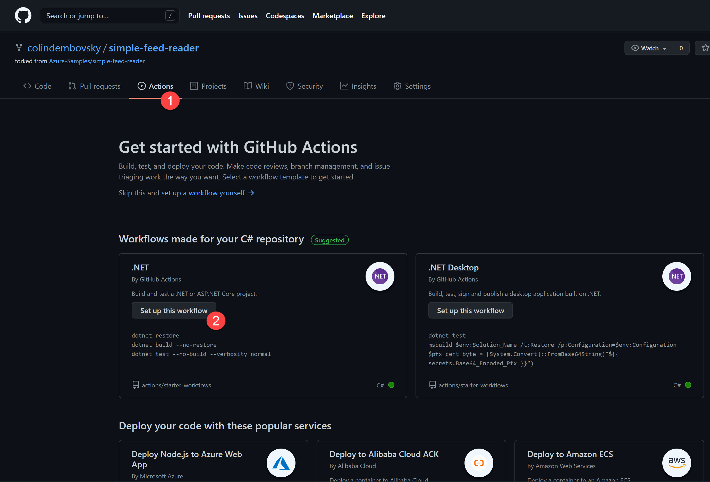
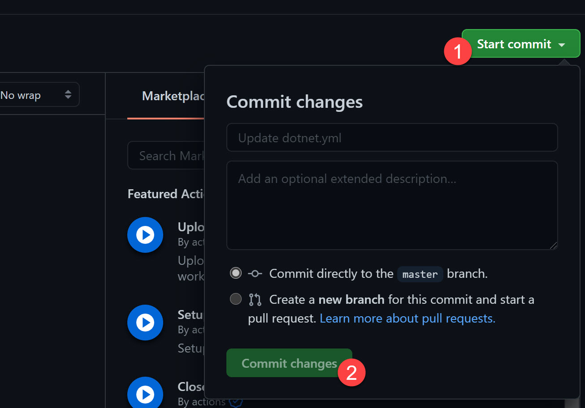
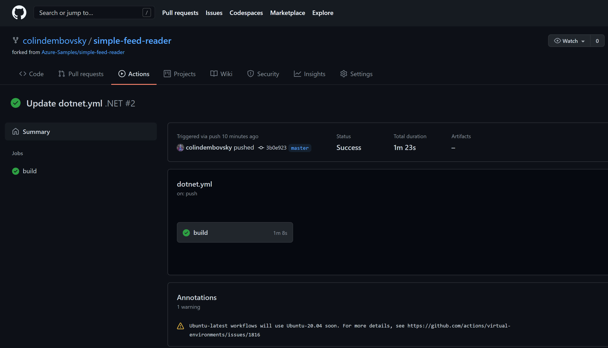
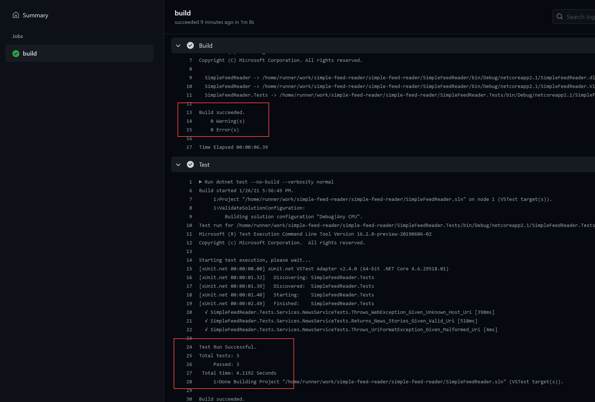
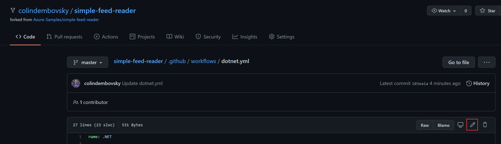
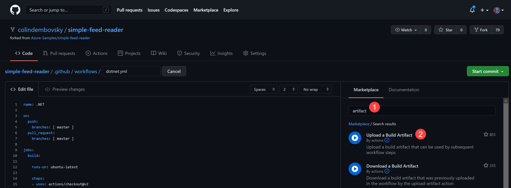
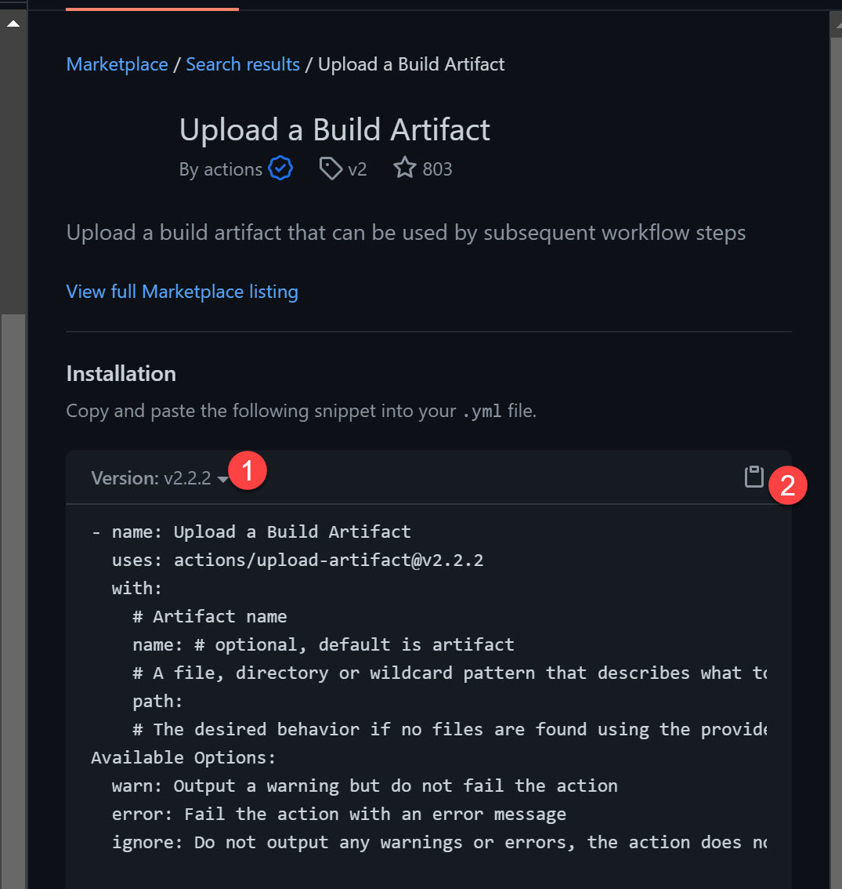
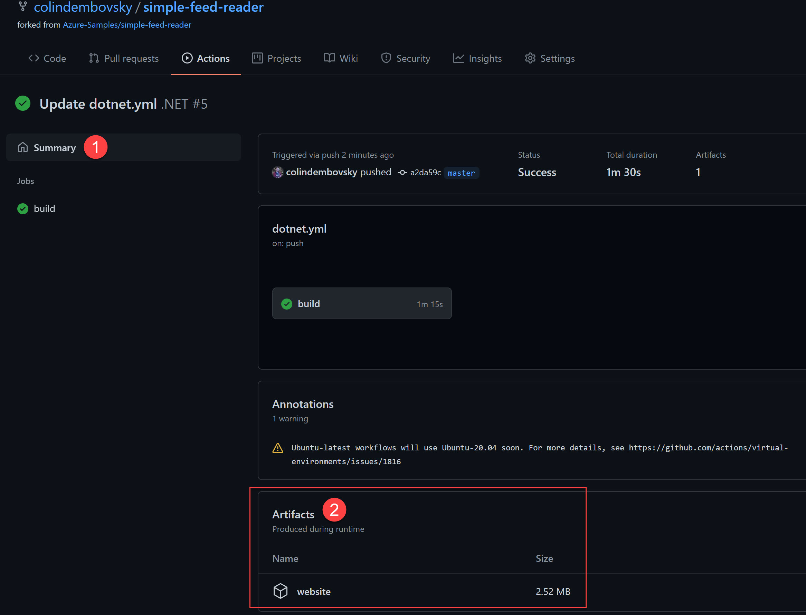

# Build a .NET web app using GitHub Actions

[GitHub Actions](https://github.com/features/actions) allow you to automate workflows in response to events that are triggered in GitHub. A common workflow is Continuous Integration (CI), but Actions can automate other processes. For example, sending welcome emails when people join a repository.

To explore moving code to the cloud, you'll build a GitHub Actions workflow file. The workflow file will be used for the Simple Feed Reader app you've already deployed to Azure App Service.

In this article, you will:
> [!div class="checklist"]
>
> * Learn the basic structure of a GitHub Action workflow YAML file.
> * Use a template to create a basic build workflow that builds the .NET app and executes unit tests.
> * Publish the compiled app so that it's ready for deployment.

## Workflow structure

Workflows are defined in YAML files, and contain several common nodes:

- a `name`
- a trigger, defined by an `on` section
- one or more `job` sections composed of one or more `steps`
- optional attributes such as `environment` variables

Jobs are run on *runners*. You can use *hosted runners*, which are spun up by GitHub during the workflow and then thrown away. Hosted runners are great because you don't have to maintain your own build infrastructure. For workflows that require a specific build environment, or for running workflows on a private network, you can also use *private* runners. To create a private runner, install the runner on any machine that supports .NET.

Each `job` will specify what runner GitHub should use to execute the `steps`. You can also specify dependencies between jobs using the `needs` attribute. Deployment jobs can also specify an `environment` to target.

The `steps` node can be as easy as inline commands, or they can be actions. Most CI workflows will have a combination of `run` steps (for executing scripts) and actions. Individual actions are pulled into the workflow by referencing the GitHub Action repository (and optionally a tag or commit hash for specific versions) and specifying any parameters using the `with` keyword.

> [!TIP]
> For more information, see [GitHub Actions YAML syntax](https://docs.github.com/actions/reference/workflow-syntax-for-github-actions).

From a workflow file, you're able to `run` any of the available [.NET CLI commands](../../core/tools/index.md). For example, if you're required to build, test, and deploy an ASP.NET Core Blazor WebAssembly app with Ahead-of-Time (AoT) compilation, you'd use the following commands:

- [dotnet workload install](../../core/tools/dotnet-workload-install.md)
- [dotnet restore](../../core/tools/dotnet-restore.md)
- [dotnet build](../../core/tools/dotnet-build.md)
- [dotnet test](../../core/tools/dotnet-test.md)
- [dotnet publish](../../core/tools/dotnet-publish.md)

### The .NET SDK is a workflow necessity

All .NET workflows require the .NET SDK, and this can be set up by the [`actions/setup-dotnet` GitHub Action](https://github.com/actions/setup-dotnet). This action sets up a [.NET CLI](../../core/tools/index.md) environment for use in actions. Some [GitHub hosted runners](https://docs.github.com/actions/using-github-hosted-runners/about-github-hosted-runners#supported-software) have the .NET SDK preinstalled, but that's subject to change. As a best practice, use the `actions/setup-dotnet` action to ensure the proper version is available.

## Create a basic build workflow

A primary principle of effective DevOps is to "build once, and deploy many times". You'll start by creating a workflow to build a basic .NET app. In the next step, you'll publish the output to prepare for deployment.

1. Navigate to your GitHub repository and select the **Actions** tab.
1. GitHub detects that there's .NET code in the repository and suggests a .NET workflow template. Select **Set up this workflow** to create a new YAML workflow file:

    

    **Figure 1**: Creating a new workflow.

1. Commit the file onto the `main` branch. Since you've defined a trigger condition for *commits to main*, this commit should trigger the workflow to run.

    

    **Figure 2**: Commit the YAML file.

1. Select the **Actions** tab again. You should see a running workflow. Once the workflow has completed, you should see a successful run.

    

    **Figure 3**: Successful build view.

1. Opening the logs, you can see that the .NET build succeeded and the tests ran and passed.

    

    **Figure 4**: Checking the logs.

> [!NOTE]
> If any of the tests fail, the workflow will fail.

## Dissect the workflow file

Let's examine the workflow YAML file you have so far:

```yml
name: .NET

on:
  push:
    branches: [ main ]
  pull_request:
    branches: [ main ]

jobs:
  build:

    runs-on: ubuntu-latest

    steps:
    - uses: actions/checkout@v2
    - name: Setup .NET
      uses: actions/setup-dotnet@v1
      with:
        dotnet-version: 5.0.x
    - name: Restore dependencies
      run: dotnet restore
    - name: Build
      run: dotnet build --no-restore
    - name: Test
      run: dotnet test --no-build --verbosity normal
```

Notice the following things:

1. There's a `name` that names the workflow.
1. The `on` object specifies when this workflow should run. This workflow has two events that trigger it: `push` to `main` and `pull_request` to `main`. Each time someone commits to `main` or creates a pull request (PR) to `main`, this workflow will execute.
1. There's a single `job` called `build`. This build should run on a hosted agent. `ubuntu_latest` specifies the most recent Ubuntu hosted agent.
1. There are five steps:
    1. `actions/checkout@v2` is an action that checks out the code in the repository onto the runner.
    1. `actions/setup-dotnet@v1` is an action that sets up the .NET CLI. This step also specifies a `name` attribute for the logs and the `dotnet-version` parameter within the `with` object.
    1. Three `run` steps that execute `dotnet restore`, `dotnet build`, and `dotnet test`. `name` attributes are also specified for these `run` steps to make the logs look pretty.

## Publish the output

Now that you've successfully built and tested the code, add steps that publish the output so you can deploy the web app.

1. Navigate to the *.github/workflows/dotnet.yml* file and select the pencil icon to edit it.

    

    **Figure 5**: Edit the YAML file.

1. Add the following `Publish` step below the `Test` step. The step runs the `dotnet publish` command to publish the web app:

    ```yml
      - name: Test
        run: dotnet test --no-build --verbosity normal # <-- this is the current bottom line

      - name: Publish
        run: dotnet publish SimpleFeedReader/SimpleFeedReader.csproj -c Release -o website
    ```

1. This publishes the web app to a folder on the hosted agent. Now you'll want to *upload* the site as a build artifact that can be deployed to Azure. To complete this activity, you'll use an existing action.
1. On the list of actions in the **Actions Helper** pane on the right, search for `artifact`. Select on the `Upload a Build Artifact (By actions)` action.

    

    **Figure 6**: Accessing the snippet helper.

1. Edit the version to `v2.2.2` to display a sample snippet. Select the clipboard icon to copy the snippet and paste it into the workflow below the publish step.

    

    **Figure 7**: Copying a snippet.

1. Edit the YAML for this step to look as follows:

    ```yml
      - name: Upload a Build Artifact
        uses: actions/upload-artifact@v2.2.2
        with:
          name: website
          path: SimpleFeedReader/website/**
          if-no-files-found: error
    ```

1. Commit the file.
1. Once the workflow completes, you'll see the artifact from the **Home** tab:

    

    **Figure 8**: Viewing artifacts in the summary page.

### Final workflow file

The final workflow file should look something like this:
  
```yml
name: .NET

on:
  push:
    branches: [ main ]
  pull_request:
    branches: [ main ]

jobs:
  build:

    runs-on: ubuntu-latest

    steps:
    - uses: actions/checkout@v2
    - name: Setup .NET
      uses: actions/setup-dotnet@v1
      with:
        dotnet-version: 5.0.x
    - name: Restore dependencies
      run: dotnet restore
    - name: Build
      run: dotnet build --no-restore
    - name: Test
      run: dotnet test --no-build --verbosity normal
    - name: Publish
      run: dotnet publish SimpleFeedReader/SimpleFeedReader.csproj -c Release -o website
    - name: Upload a Build Artifact
      uses: actions/upload-artifact@v2.2.2
      with:
        name: website
        path: SimpleFeedReader/website/**
        if-no-files-found: error
```

>[!div class="step-by-step"]
>[Previous](actions-vs-pipelines.md)
>[Next](actions-deploy.md)
