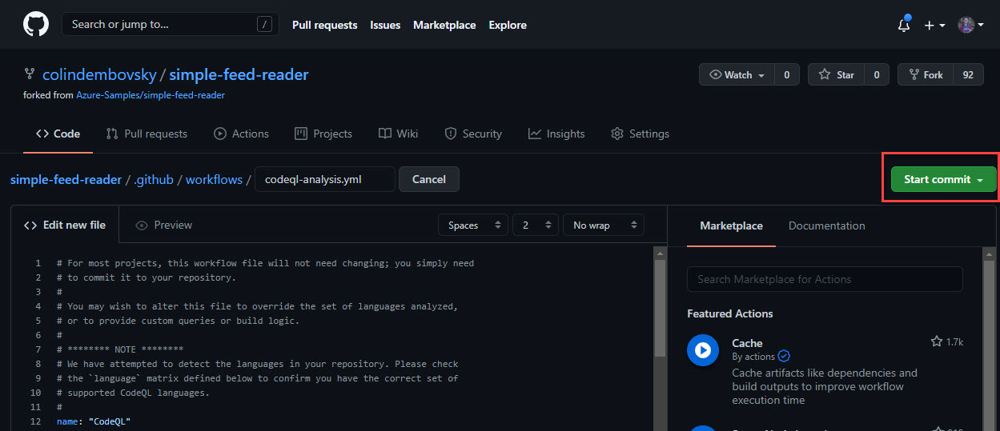
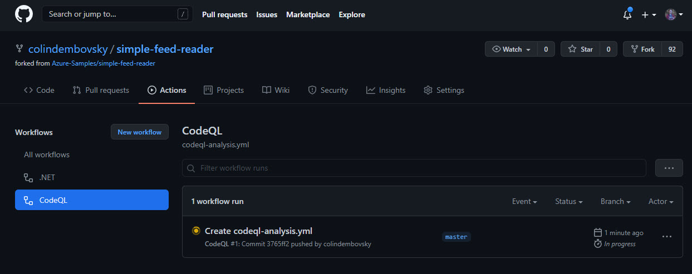
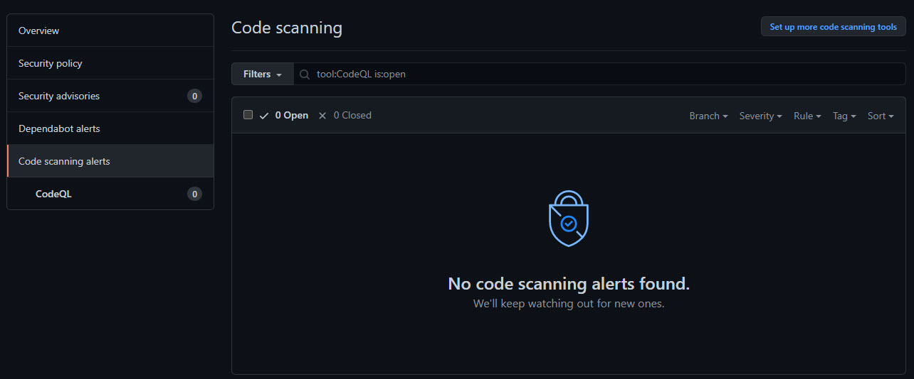
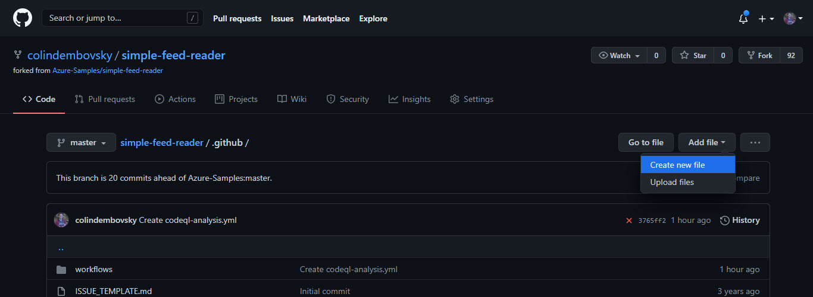
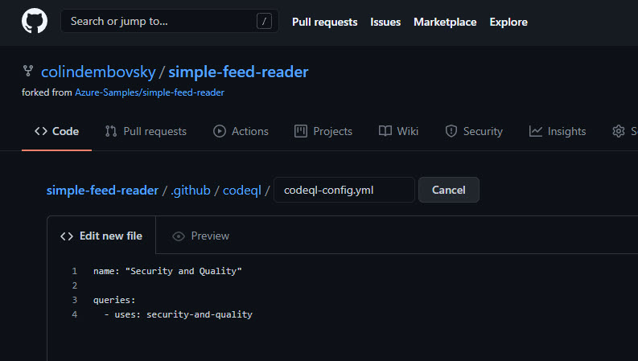
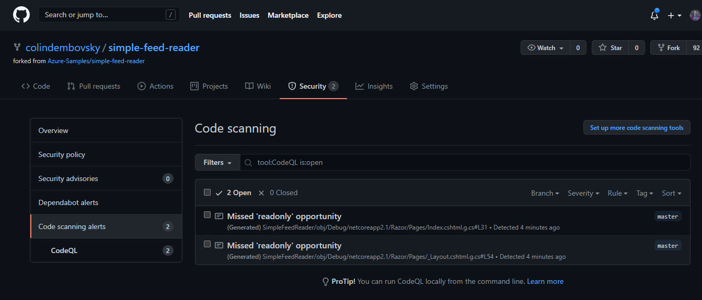
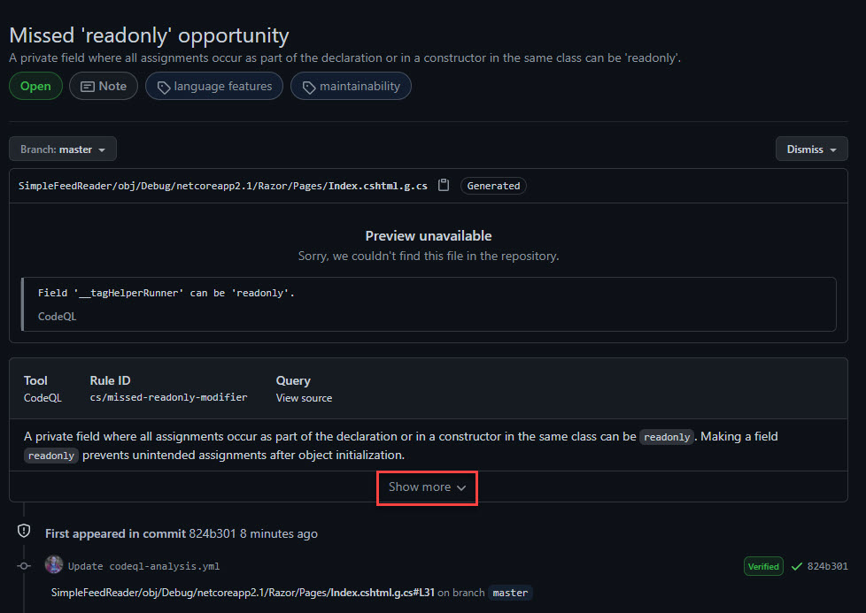
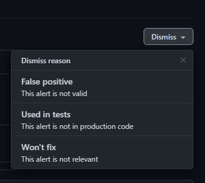

# Secure .NET Code with CodeQL and GitHub Actions

[CodeQL](https://codeql.github.com/docs/codeql-overview/about-codeql/) is a static code analysis engine that can automate security and quality checks. With CodeQL, you can perform *variant analysis*, which uses known vulnerabilities as seeds to find similar issues. CodeQL is part of [GitHub Advanced Security](https://docs.github.com/github/getting-started-with-github/about-github-advanced-security) that includes:

> [!div class="checklist"]
>
> * Code scanning&mdash;find potential security vulnerabilities in your code.
> * Secret scanning&mdash;detect secrets and tokens that are committed.
> * Dependency scanning&mdash;detect vulnerabilities in packages that you consume.

CodeQL [supports some of the most popular programming languages and compilers](https://codeql.github.com/docs/codeql-overview/supported-languages-and-frameworks/):

- C/C++
- Java
- C#
- Python
- Go
- JavaScript
- TypeScript

CodeQL is a powerful language and security professionals can create custom queries using CodeQL. However, teams can benefit immensely from the large open-source collection of queries that the security community has created without having to write any custom CodeQL.

In this article, you'll set up a GitHub workflow that will scan code in your repository using CodeQL. You will:

> [!div class="checklist"]
>
> * Create a code scanning action.
> * Edit the workflow file to include custom scan settings.
> * See scanning results.

> [!NOTE]
> To see security alerts for your repository, you must be a repository owner.

## Create the code scanning workflow

You can use a starter workflow for code scanning by navigating to the **Security** tab of your repository.

1. Navigate to your GitHub repository and select the **Security** > **Code Scanning Alerts**. The top recommended workflow should be CodeQL Analysis. Select **Set up this workflow**.

    

    **Figure 1:** Create a new code scanning workflow.

1. A new workflow file is created in your *.github/workflows* folder.
1. Select **Start Commit** on the upper right to save the default workflow. You can commit to the `main` branch.

    

    **Figure 2:** Commit the file.

1. Select the **Actions** tab. In the left-hand tree, you'll see a **CodeQL** node. Select this node to filter for CodeQL workflow runs.

    

    **Figure 3:** View the CodeQL workflow runs.

Take a look at the workflow file while it runs. If you remove the comments from the file, you'll see the following YAML:

```yml
name: "CodeQL"

on:
  push:
    branches: [ main ]
  pull_request:
    branches: [ main ]
  schedule:
    - cron: '40 14 * * 6'

jobs:
  analyze:
    name: Analyze
    runs-on: ubuntu-latest

    strategy:
      fail-fast: false
      matrix:
        language: [ 'csharp' ]

    steps:
    - name: Checkout repository
      uses: actions/checkout@v2

    - name: Initialize CodeQL
      uses: github/codeql-action/init@v1
      with:
        languages: ${{ matrix.language }}

    - name: Autobuild
      uses: github/codeql-action/autobuild@v1

    - name: Perform CodeQL Analysis
      uses: github/codeql-action/analyze@v1
```

Notice the following things:

1. The workflow `name` is `CodeQL`.
1. This workflow triggers on `push` and `pull_request` events to the `main` branch. There's also a `cron` trigger. The `cron` trigger lets you define a schedule for triggering this workflow and is randomly generated for you. In this case, this workflow will run at 14:40 UTC every Saturday.

    > [!TIP]
    > If you edit the workflow file and hover over the cron expression, a tooltip will show you the English text for the cron expression.

1. There's a single job called `analyze` that runs on the `ubuntu-latest` hosted agent.
1. This workflow defines a `strategy` with a `matrix` on the array of `language`. In this case, there's only `csharp`. If the repository contained other languages, you could add them to this array. This causes the job to "fan out" and create an instance per value of the matrix.
1. There are four steps, starting with `checkout`.
1. The second step initializes the CodeQL scanner for the `language` this job is going to scan. CodeQL intercepts calls to the compiler to build a database of the code while the code is being built.
1. The `Autobuild` step will attempt to automatically build the source code using common conventions. If this step fails, you can replace it with your own custom build steps.
1. After building, the CodeQL analysis is performed, where suites of queries are run against the code database.
1. The run should complete successfully. However, there appear to be no issues.

    

    **Figure 4:** No results to the initial scan.

## Customize CodeQL settings

The CodeQL scan isn't reporting any security issues. That's expected with this basic sample. CodeQL can also scan for *quality* issues. The current workflow is using the default `security-extended` suite. You can add quality scanning in by adding a configuration file to customize the scanning suites. In this step, you'll configure CodeQL to use the `security-and-quality` suites.

> [!INFORMATION]
> For other CodeQL configuration options, see [Configuring CodeQL code scanning in your CI system](https://docs.github.com/github/finding-security-vulnerabilities-and-errors-in-your-code/configuring-codeql-code-scanning-in-your-ci-system).

1. Navigate to the *.github* folder in the **Code** tab and select **Add File**:

    

    **Figure 5:** Create a new file.

1. Enter *codeql/codeql-config.yml* as the name. This creates the file in a folder. Paste in the following code:

    ```yml
    name: "Security and Quality"

    queries:
      - uses: security-and-quality
    ```

    

    **Figure 6:** Create the CodeQL configuration file.

1. Select **Commit to main** at bottom of the editor to commit the file.
1. Edit the CodeQL workflow to use the new configuration file. Navigate to *.github/workflows/codeql-analysis.yml* and select the pencil icon. Add a new property to the `with` section as shown below:

  ```yml
  - name: Initialize CodeQL
    uses: github/codeql-action/init@v1
    with:
      languages: ${{ matrix.language }}
      config-file: ./.github/codeql/codeql-config.yml  # <-- add this line
  ```

1. Select **Start Commit** and commit to the `main` branch.

## Review the security alerts

> [!IMPORTANT]
> You must be a repository owner to view security alerts.
>
> This sample repository is small. As such, it doesn't contain any major security or quality issues. However, "real world" repositories will likely have some issues.

When the last CodeQL workflow run completes, you should see two issues in the **Security** tab:



**Figure 7:** View security alerts.

1. Select the first alert to open it.
1. In this case, the alert is for a generated file that isn't committed to the repository. For that reason, the preview is unavailable.
1. Notice the tags that are applied. These tags can be used for filtering issues.
1. Select **Show more** under the rule information to show help and recommendations.

    

    **Figure 8:** Open an alert.

1. Selecting **Dismiss** will open options for dismissing this issue:

    

    **Figure 9:** Dismiss an alert.

>[!div class="step-by-step"]
>[Previous](actions-deploy.md)
>[Next](monitoring.md)
