# Continuous integration and deployment with Azure DevOps

> [!NOTE]
> This section details continuous integration and deployment with Azure DevOps. You can achieve that with GitHub Actions as well. GitHub Actions is a workflow engine built into GitHub that can also be used for continuous integration and deployment. To follow the guide for building and deploying to Azure using GitHub, complete the **Publish the app's code to GitHub** and **Disconnect local Git deployment** sections below and then proceed to the [GitHub Actions section](actions-index.md).

In the previous chapter, you created a local Git repository for the Simple Feed Reader app. In this chapter, you'll publish that code to a GitHub repository and construct an Azure DevOps Services pipeline using Azure Pipelines. The pipeline enables continuous builds and deployments of the app. Any commit to the GitHub repository triggers a build and a deployment to the Azure Web App's staging slot.

In this section, you'll complete the following tasks:

> [!div class="checklist"]
>
> * Publish the app's code to GitHub
> * Disconnect local Git deployment
> * Create an Azure DevOps organization
> * Create a team project in Azure DevOps organization
> * Configure a self-hosted agent if necessary
> * Create a build definition
> * Create a release pipeline
> * Commit changes to GitHub and automatically deploy to Azure
> * Examine the Azure Pipelines pipeline

## Publish the app's code to GitHub

1. Open a browser window, and navigate to `https://github.com`.
1. Click the **+** drop-down in the header, and select **New repository**:

    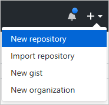

1. Select your account in the **Owner** drop-down, and enter *simple-feed-reader* in the **Repository name** textbox.
1. Click the **Create repository** button.
1. Open your local machine's command shell. Navigate to the directory in which the *simple-feed-reader* Git repository is stored.
1. Rename the existing *origin* remote to *upstream*. Execute the following command:

    ```console
    git remote rename origin upstream
    ```

1. Add a new *origin* remote pointing to your copy of the repository on GitHub. Execute the following command:

    ```console
    git remote add origin https://github.com/<GitHub_username>/simple-feed-reader/
    ```

1. Publish your local Git repository to the newly created GitHub repository. Execute the following command:

    ```console
    git push -u origin main
    ```

1. Open a browser window, and navigate to `https://github.com/<GitHub_username>/simple-feed-reader/`. Validate that your code appears in the GitHub repository.

## Disconnect local Git deployment

Remove the local Git deployment with the following steps. Azure Pipelines (an Azure DevOps service) both replaces and augments that functionality.

1. Open the [Azure portal](https://portal.azure.com/), and navigate to the *staging (mywebapp\<unique_number\>/staging)* Web App. The Web App can be quickly located by entering *staging* in the portal's search box:

    

1. Click **Deployment Center**. A new panel appears. Click **Disconnect** to remove the local Git source control configuration that was added in the previous chapter. Confirm the removal operation by clicking the **Yes** button.
1. Navigate to the *mywebapp<unique_number>* App Service. As a reminder, the portal's search box can be used to quickly locate the App Service.
1. Click **Deployment Center**. A new panel appears. Click **Disconnect** to remove the local Git source control configuration that was added in the previous chapter. Confirm the removal operation by clicking the **Yes** button.

## Create an Azure DevOps organization

1. Open a browser, and navigate to the [Azure DevOps organization creation page](https://go.microsoft.com/fwlink/?LinkId=307137).
1. Select **New organization**
1. Confirm the information, and then select **Continue**.
1. Sign in to your organization at any time, `https://dev.azure.com/{yourorganization}`

## Create a team project in Azure DevOps organization

1. Choose the organization, and then select **New project**.
1. Enter the project name as *MyFirstProject* and select the **Visibility** as *Private*
1. Select **Create project**.

For more information, see [Create a project](/azure/devops/organizations/projects/create-project?view=azure-devops&tabs=preview-page&preserve-view=true#create-a-project)

## Configure a self-hosted agent if necessary

To build your code or deploy your software using Azure Pipelines, you need at least one agent. In Azure Pipelines, you can run parallel jobs on either **Microsoft-hosted** or **self-hosted** agent. But with the recent change in Azure Pipelines free grant of parallel jobs is temporarily disable for the public projects.For more details, refer [Configure and pay for parallel jobs](/azure/devops/pipelines/licensing/concurrent-jobs?view=azure-devops&tabs=ms-hosted&preserve-view=true).

Go to **Organization Settings** and then **Pipelines** > **Parallel jobs**. If you see value **0** under **Microsoft-hosted** that means you need a **Self-hosted** agent to run your pipeline.

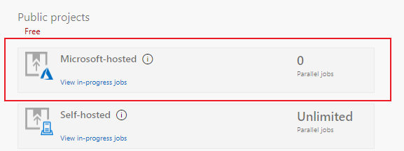

You can create that by following details mentioned in [Self-hosted agents](/azure/devops/pipelines/agents/agents?view=azure-devops&tabs=browser&preserve-view=true#install). After successful configuration, you'll be able to see available agent under **Organization Settings** > **Agent pools** > **{youragentname}**

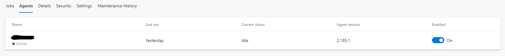

## Configure the Azure Pipelines pipeline

There are three distinct steps to complete. Completing the steps in the following three sections results in an operational DevOps pipeline.

### Grant Azure DevOps access to the GitHub repository

1. In your project, navigate to the **Pipelines** page. Then choose the action to create a new pipeline:

    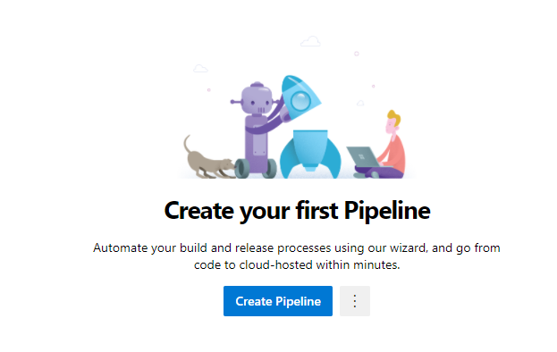

1. Use `Use the classic editor` to create the pipeline.

    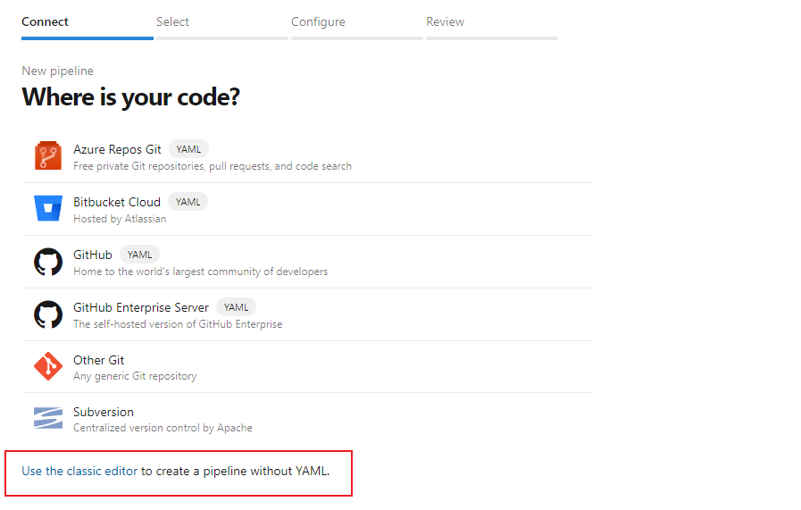

1. Select the **GitHub** option from the **Select a source** section::

    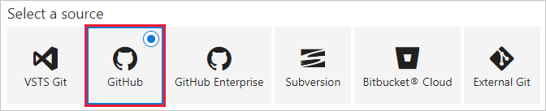

1. Authorization is required before Azure DevOps can access your GitHub repository. Enter *<GitHub_username> GitHub connection* in the **Connection name** textbox. For example:

    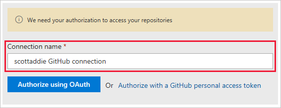

1. If two-factor authentication is enabled on your GitHub account, a personal access token is required. In that case, click the **Authorize with a GitHub personal access token** link. See the [official GitHub personal access token creation instructions](https://help.github.com/articles/creating-a-personal-access-token-for-the-command-line/) for help. Only the *repo* scope of permissions is needed. Otherwise, click the **Authorize using OAuth** button.
1. When prompted, sign in to your GitHub account. Then select Authorize to grant access to your Azure DevOps organization. If successful, a new service endpoint is created.
1. Click the ellipsis button next to the **Repository** button. Select the *<GitHub_username>/simple-feed-reader* repository from the list. Click the **Select** button.
1. Select the default branch (*main*) from the **Default branch for manual and scheduled builds** drop-down. Click the **Continue** button. The template selection page appears.

### Create the build definition

1. From the template selection page, enter *ASP.NET Core* in the search box:

    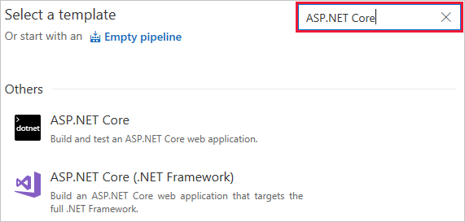

1. The template search results appear. Hover over the **ASP.NET Core** template, and click the **Apply** button.
1. The **Tasks** tab of the build definition appears. Select the self-hosted **Agent pool** if you have created that in the earlier step.

    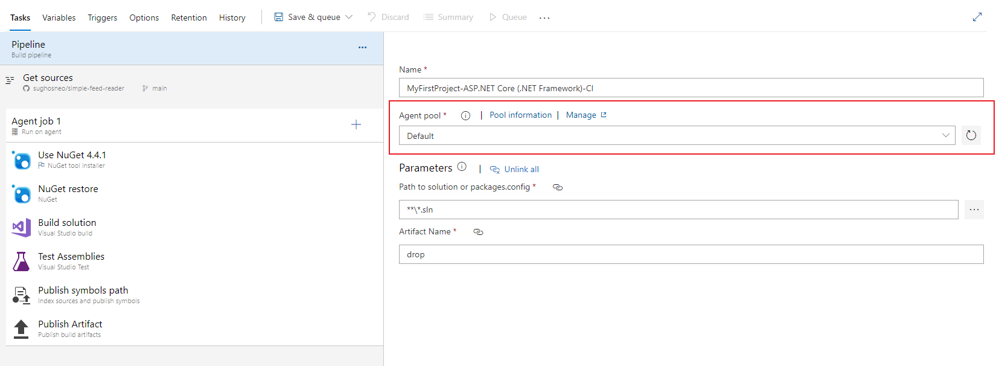

    > [!NOTE]
    > If you are using MS-hosted agent then select the *Hosted > Azure Pipelines* from drop down.

1. Click the **Triggers** tab.
1. Check the **Enable continuous integration** box. Under the **Branch filters** section, confirm that the **Type** drop-down is set to *Include*. Set the **Branch specification** drop-down to *main*.

    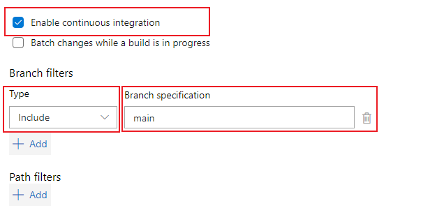

    These settings cause a build to trigger when any change is pushed to the default branch (*main*) of the GitHub repository. Continuous integration is tested in the [Commit changes to GitHub and automatically deploy to Azure](#commit-changes-to-github-and-automatically-deploy-to-azure) section.

1. Click the **Save & queue** button, and select the **Save** option:

    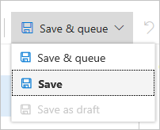

1. The following modal dialog appears:

    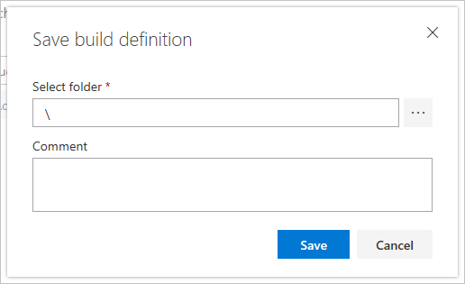

    Use the default folder of *\\*, and click the **Save** button.

### Create the release pipeline

1. Click the **Releases** tab of your team project. Click the **New pipeline** button.

    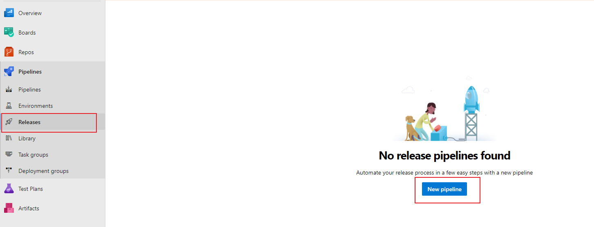

    The template selection pane appears.

1. From the template selection page, enter *App Service Deployment* in the search box:

    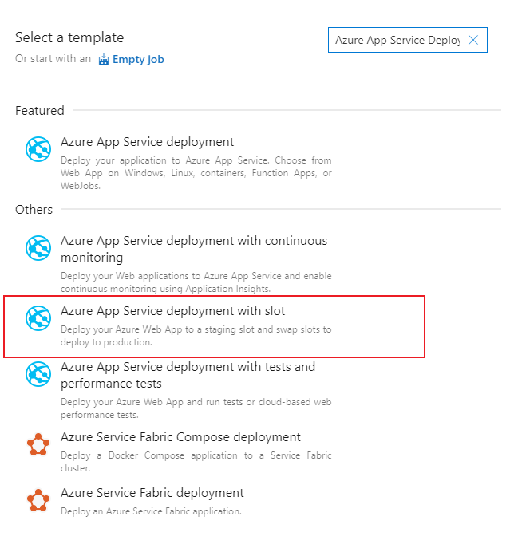

1. The template search results appear. Hover over the **Azure App Service Deployment with Slot** template, and click the **Apply** button. The **Pipeline** tab of the release pipeline appears.

    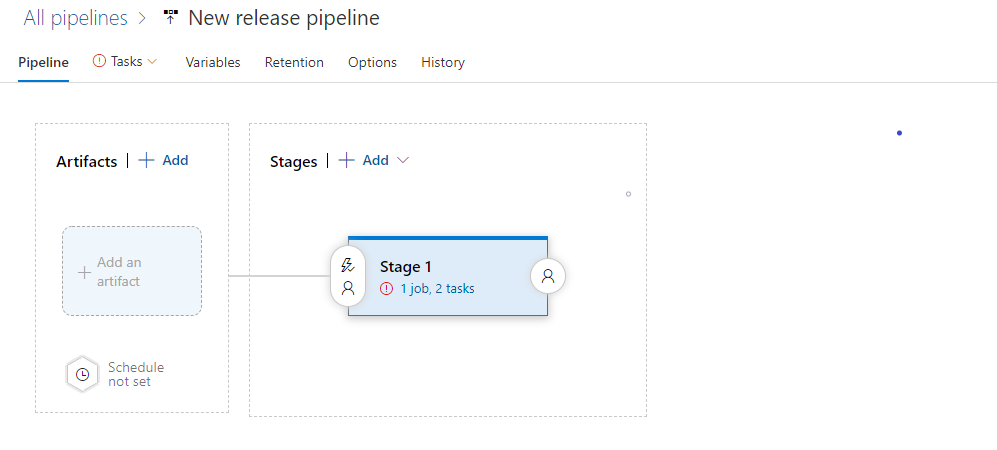

1. Click the **Add** button in the **Artifacts** box. The **Add artifact** panel appears:

    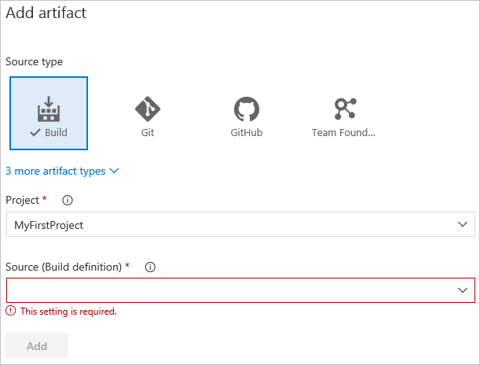

1. Select the **Build** tile from the **Source type** section. This type allows for the linking of the release pipeline to the build definition.
1. Select *MyFirstProject* from the **Project** drop-down.
1. Select the build definition name, *MyFirstProject-ASP.NET Core-CI*, from the **Source (Build definition)** drop-down.
1. Select *Latest* from the **Default version** drop-down. This option builds the artifacts produced by the latest run of the build definition.
1. Replace the text in the **Source alias** textbox with *Drop*.
1. Click the **Add** button. The **Artifacts** section updates to display the changes.
1. Click the lightning bolt icon to enable continuous deployments:

    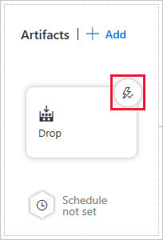

    With this option enabled, a deployment occurs each time a new build is available.
1. A **Continuous deployment trigger** panel appears to the right. Click the toggle button to enable the feature. It isn't necessary to enable the **Pull request trigger**.
1. Click the **Add** drop-down in the **Build branch filters** section. Choose the **Build Definition's default branch** option. This filter causes the release to trigger only for a build from the GitHub repository's default branch (*main*).
1. Click the **Save** button. Click the **OK** button in the resulting **Save** modal dialog.
1. Click the **Stage 1** box. An **Stage** panel appears to the right. Change the *Stage 1* text in the **Stage name** textbox to *Production*.

   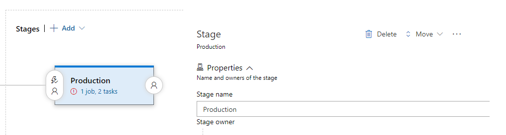

1. Click the **1 phase, 2 tasks** link in the **Production** box:

    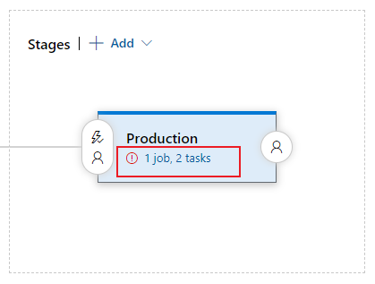

    The **Tasks** tab of the environment appears.
1. Click the **Deploy Azure App Service to Slot** task. Its settings appear in a panel to the right.
1. Select the Azure subscription associated with the App Service from the **Azure subscription** drop-down. Once selected, click the **Authorize** button.
1. Select *Web App* from the **App type** drop-down.
1. Select *mywebapp/<unique_number/>* from the **App service name** drop-down.
1. Select *AzureTutorial* from the **Resource group** drop-down.
1. Select *staging* from the **Slot** drop-down.
1. Select **Run on agent*** under **Tasks**. On the right pane, you'll see **Agent Job**.
1. Select the self-hosted **Agent pool** if you have created that in the earlier step.

    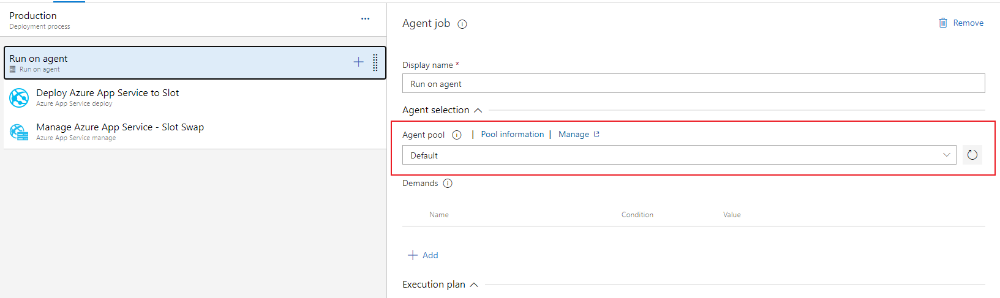

    > [!NOTE]
    > If you are using MS-hosted agent then select the *Hosted > Azure Pipelines* from drop down.

1. Click the **Save** button.
1. Hover over the default release pipeline name. Click the pencil icon to edit it. Use *MyFirstProject-ASP.NET Core-CD* as the name.

    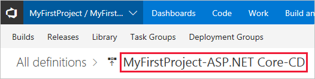

1. Click the **Save** button.

## Commit changes to GitHub and automatically deploy to Azure

1. Open *SimpleFeedReader.sln* in Visual Studio.
1. In Solution Explorer, open *Pages\Index.cshtml*. Change `<h2>Simple Feed Reader - V3</h2>` to `<h2>Simple Feed Reader - V4</h2>`.
1. Press **Ctrl**+**Shift**+**B** to build the app.
1. Commit the file to the GitHub repository. Use either the **Changes** page in Visual Studio's *Team Explorer* tab, or execute the following using the local machine's command shell:

    ```console
    git commit -a -m "upgraded to V4"
    ```

1. Push the change in the default branch (*main*) to the *origin* remote of your GitHub repository. In the following command, replace the placeholder `{BRANCH}` with the default branch (use `main`):

    ```console
    git push origin {BRANCH}
    ```

    The commit appears in the GitHub repository's default branch (*main*). You'll be able to see the commit history in `https://github.com/<GitHub_username>/simple-feed-reader/commits/main`.

    The build is triggered, since continuous integration is enabled in the build definition's **Triggers** tab:

    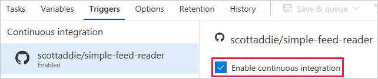

1. Navigate to the **Pipelines**. You'll see the CI pipeline details and monitor each steps if you drill down **Jobs** details.

    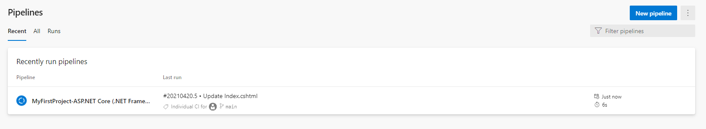

1. Similarly, go to the **Releases** tab to see the details of CD pipeline. You can always drill down further to see more details of each step.

    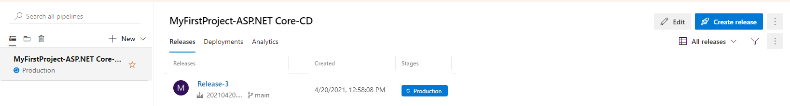

1. Once the build succeeds, a deployment to Azure occurs. Navigate to the app in the browser. Notice that the "V4" text appears in the heading:

    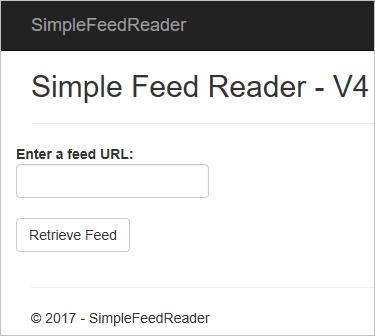

## Examine the Azure Pipelines pipeline

### Build definition

A build definition was created with the name *MyFirstProject-ASP.NET Core-CI*. Upon completion, the build produces a *.zip* file including the assets to be published. The release pipeline deploys those assets to Azure.

The build definition's **Tasks** tab lists the individual steps being used. There are five build tasks.

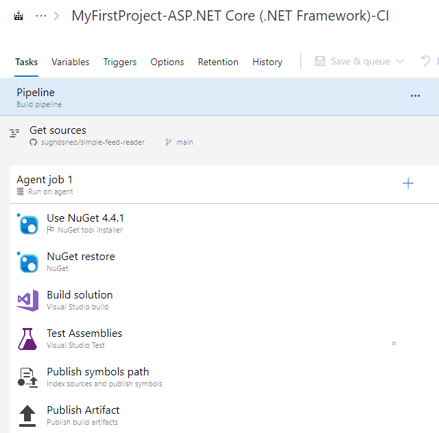

1. **Restore** &mdash; Executes the `dotnet restore` command to restore the app's NuGet packages. The default package feed used is nuget.org.
1. **Build** &mdash; Executes the `dotnet build --configuration release` command to compile the app's code. This `--configuration` option is used to produce an optimized version of the code, which is suitable for deployment to a production environment. Modify the *BuildConfiguration* variable on the build definition's **Variables** tab if, for example, a debug configuration is needed.
1. **Test** &mdash; Executes the `dotnet test --configuration release --logger trx --results-directory <local_path_on_build_agent>` command to run the app's unit tests. Unit tests are executed within any C# project matching the ***/*Tests/*.csproj* glob pattern. Test results are saved in a *.trx* file at the location specified by the `--results-directory` option. If any tests fail, the build fails and isn't deployed.

    > [!NOTE]
    > To verify the unit tests work, modify *SimpleFeedReader.Tests\Services\NewsServiceTests.cs* to purposefully break one of the tests. For example, change `Assert.True(result.Count > 0);` to `Assert.False(result.Count > 0);` in the `Returns_News_Stories_Given_Valid_Uri` method. Commit and push the change to GitHub. The build is triggered and fails. The build pipeline status changes to **failed**. Revert the change, commit, and push again. The build succeeds.

1. **Publish** &mdash; Executes the `dotnet publish --configuration release --output <local_path_on_build_agent>` command to produce a *.zip* file with the artifacts to be deployed. The `--output` option specifies the publish location of the *.zip* file. That location is specified by passing a [predefined variable](/azure/devops/pipelines/build/variables) named `$(build.artifactstagingdirectory)`. That variable expands to a local path, such as *c:\agent\_work\1\a*, on the build agent.
1. **Publish Artifact** &mdash; Publishes the *.zip* file produced by the **Publish** task. The task accepts the *.zip* file location as a parameter, which is the predefined variable `$(build.artifactstagingdirectory)`. The *.zip* file is published as a folder named *drop*.

Click the build definition's **Summary** link to view a history of builds with the definition:

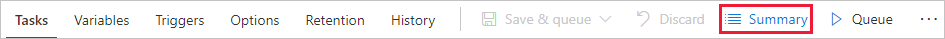

On the resulting page, click the individual build for more details.

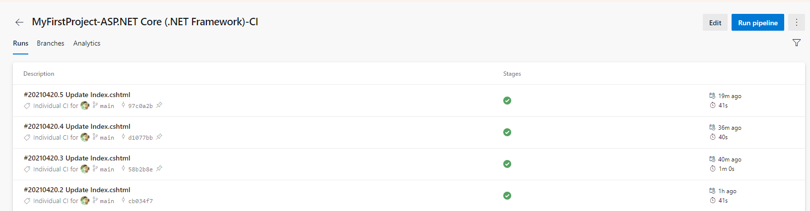

A summary of this specific build is displayed. Click the **published** link, and notice the *drop* folder produced by the build is listed:

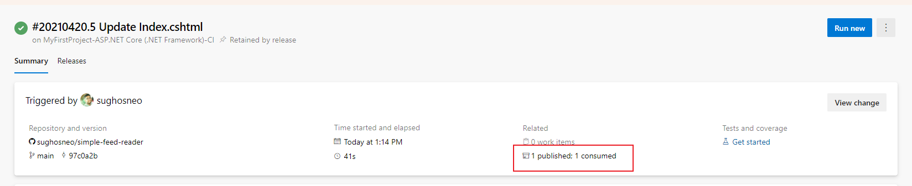

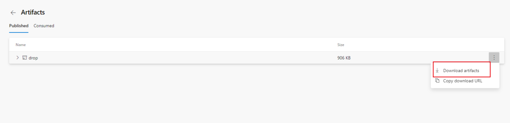

Use the ellipsis and click on **Downloads artifacts** links to inspect the published artifacts.

### Release pipeline

A release pipeline was created with the name *MyFirstProject-ASP.NET Core-CD*:

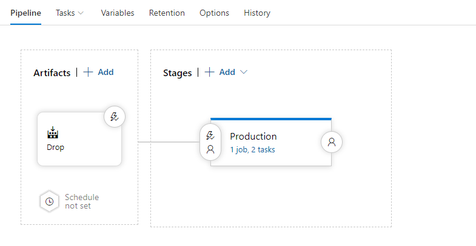

The two major components of the release pipeline are the **Artifacts** and the **Stages**. Clicking the box in the **Artifacts** section reveals the following panel:

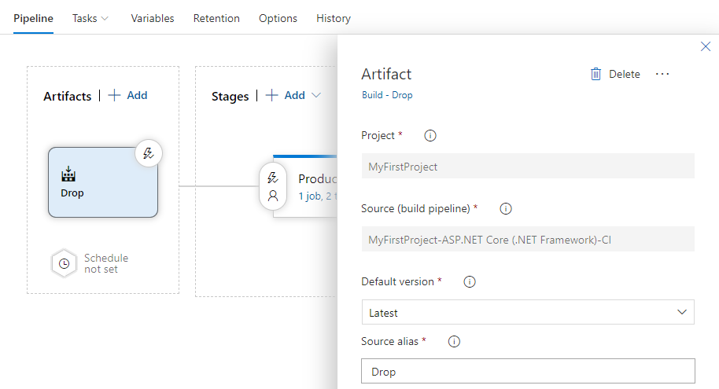

The **Source (Build definition)** value represents the build definition to which this release pipeline is linked. The *.zip* file produced by a successful run of the build definition is provided to the *Production* environment for deployment to Azure. Click the *1 phase, 2 tasks* link in the *Production* environment box to view the release pipeline tasks:

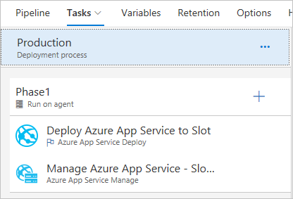

The release pipeline consists of two tasks: *Deploy Azure App Service to Slot* and *Manage Azure App Service - Slot Swap*. Clicking the first task reveals the following task configuration:


The Azure subscription, service type, web app name, resource group, and deployment slot are defined in the deployment task. The **Package or folder** textbox holds the *.zip* file path to be extracted and deployed to the *staging* slot of the *mywebapp\<unique_number\>* web app.

Clicking the slot swap task reveals the following task configuration:

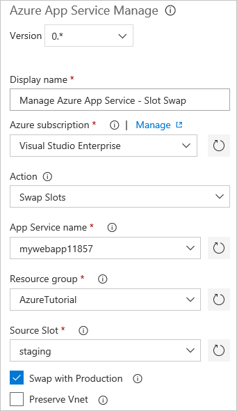

The subscription, resource group, service type, web app name, and deployment slot details are provided. The **Swap with Production** check box is checked. Consequently, the bits deployed to the *staging* slot are swapped into the production environment.

## Additional reading

* [Create your first pipeline with Azure Pipelines](/azure/devops/pipelines/get-started-yaml)
* [Build and .NET Core project](/azure/devops/pipelines/languages/dotnet-core)
* [Deploy a web app with Azure Pipelines](/azure/devops/pipelines/targets/webapp)

>[!div class="step-by-step"]
>[Previous](deploying-to-app-service.md)
>[Next](actions-index.md)
