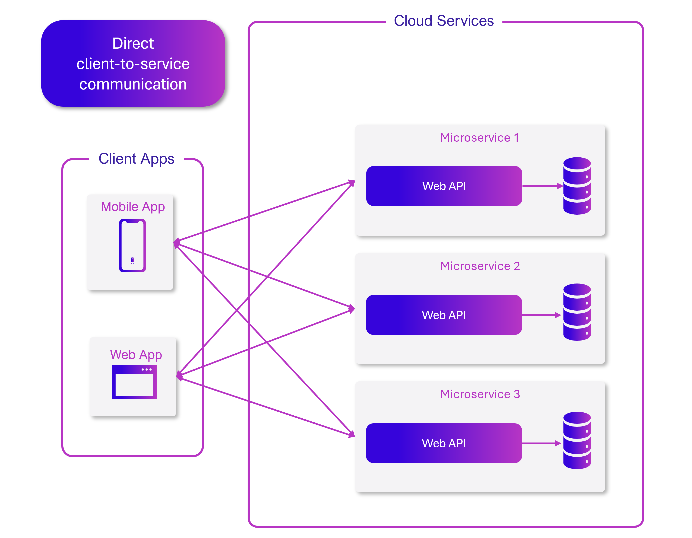
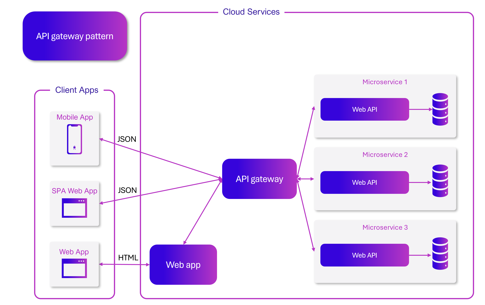
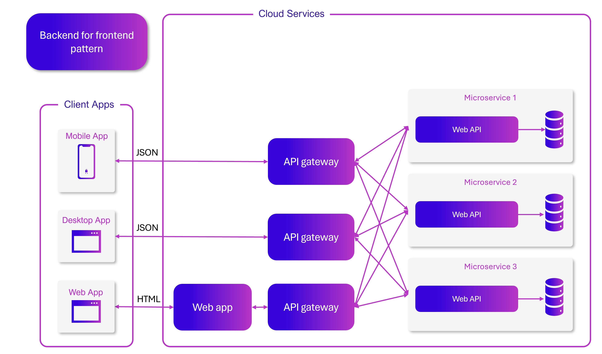
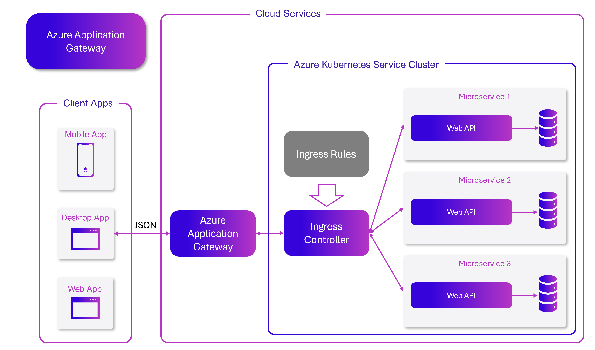
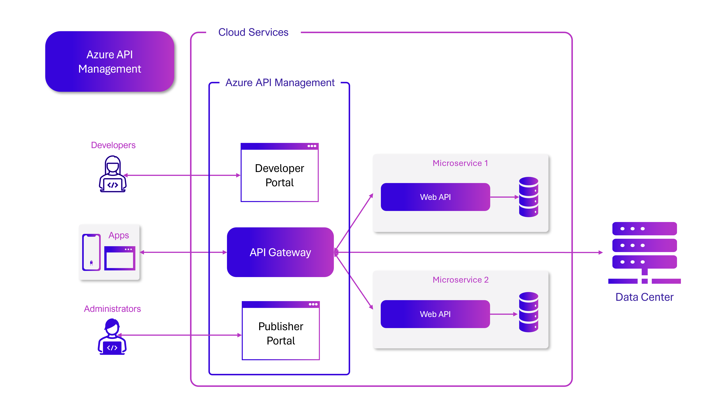
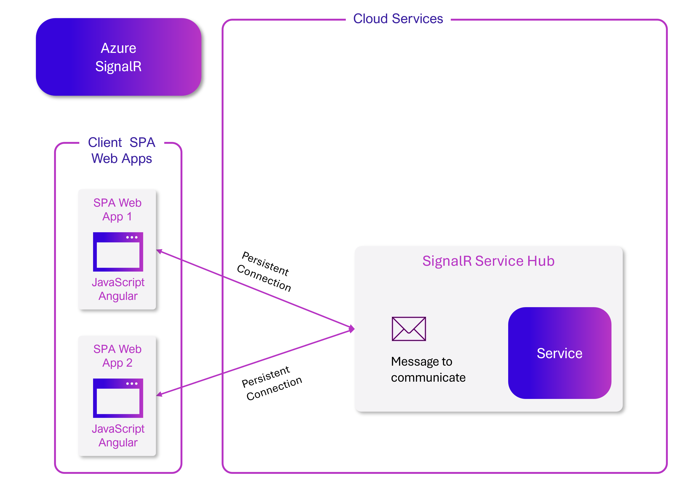

# Gateway patterns

[!INCLUDE [download-alert](../includes/download-alert.md)]

In a cloud-native system, front-end clients (mobile, web, and desktop applications) require a communication channel to interact with independent back-end microservices.

How can you satisfy this need?

To keep things simple, a front-end client could *directly communicate* with the back-end microservices.

**Figure 13-1**. Direct client to service communication

With this approach, each microservice has a public endpoint that is accessible by front-end clients. In a production environment, you'd place a load balancer in front of the microservices, routing traffic proportionately.

While simple to implement, direct client communication would be acceptable only for simple microservice applications. This pattern tightly couples front-end clients to core back-end services, opening the door for many problems, including:

- Client susceptibility to back-end service refactoring.
- A wider attack surface as core back-end services are directly exposed.
- Duplication of cross-cutting concerns across each microservice.
- Overly complex client code. Clients must keep track of multiple endpoints and handle failures in a resilient way.

Instead, a widely accepted cloud design pattern is to implement an [API Gateway Service](../microservices/architect-microservice-container-applications/direct-client-to-microservice-communication-versus-the-api-gateway-pattern.md) between the front-end applications and back-end services.

**Figure 13-2**. API gateway pattern

In the previous figure, note how the API Gateway service abstracts the back-end core microservices. Implemented as a web API, it acts as a *reverse proxy*, routing incoming traffic to the internal microservices.

The gateway insulates the client from internal service partitioning and refactoring. If you change a back-end service, you accommodate it in the gateway without breaking the client. It's also your first line of defense for cross-cutting concerns, such as identity, caching, resiliency, metering, and throttling. Many of these cross-cutting concerns can be off-loaded from the back-end core services to the gateway, simplifying the back-end services.

Care must be taken to keep the API Gateway simple and fast. Typically, business logic is kept out of the gateway. A complex gateway risks becoming a bottleneck and eventually a monolith itself. Larger systems often expose multiple API Gateways segmented by client type (mobile, web, desktop) or back-end functionality. The [Backends for Frontends](/azure/architecture/patterns/backends-for-frontends) pattern provides direction for implementing multiple gateways.

**Figure 13-3**. Backends for frontends pattern

Note in the previous figure how incoming traffic is sent to a specific API gateway, based upon client type: web, mobile, or desktop app. This approach makes sense as the capabilities of each device differ significantly across form factor, performance, and display limitations. Typically mobile applications expose less functionality than a browser or desktop applications. Each gateway can be optimized to match the capabilities and functionality of the corresponding device.

The backends for frontends pattern can be extended to be platform-specific. For example, an iOS and Android gateway could be created to expose platform-specific functionality. Or if you have specific third parties that need to access your services, you could create a gateway specifically for each of them.

## Simple gateways

To start, you could build your own API Gateway service. A quick search of GitHub will provide many examples.

For simple .NET cloud-native applications, you might consider the [Ocelot Gateway](https://github.com/ThreeMammals/Ocelot). Open source and created for .NET microservices, it's lightweight, fast, and scalable. Like any API Gateway, its primary functionality is to forward incoming HTTP requests to downstream services. Additionally, it supports a wide variety of capabilities that are configurable in a .NET middleware pipeline.

[YARP](https://github.com/microsoft/reverse-proxy) is another open source reverse proxy project, led by a group of Microsoft product teams. Downloadable as a NuGet package, YARP plugs into the ASP.NET framework as middleware and is highly customizable. You'll find YARP [well-documented](https://microsoft.github.io/reverse-proxy/articles/getting-started.html) with various usage examples. You'll see some examples of how to use YARP in the next section.

For enterprise cloud-native applications, there are several managed Azure services that can help jump-start your efforts.

## Azure Application Gateway

For simple gateway requirements, you may consider [Azure Application Gateway](/azure/application-gateway/overview). Available as an Azure [PaaS service](https://azure.microsoft.com/overview/what-is-paas/), it includes basic gateway features such as URL routing, SSL termination, and a Web Application Firewall. The service supports [Layer-7 load balancing](https://www.f5.com/glossary/layer-7-load-balancing) capabilities. With Layer 7, you can route requests based on the actual content of an HTTP message, not just low-level TCP network packets.

Throughout this book, we evangelize hosting cloud-native systems in [Kubernetes](https://www.infoworld.com/article/3268073/what-is-kubernetes-your-next-application-platform.html). A container orchestrator, Kubernetes automates the deployment, scaling, and operational concerns of containerized workloads. Azure Application Gateway can be configured as an API gateway for an [Azure Kubernetes Service](https://azure.microsoft.com/services/kubernetes-service/) cluster.

The [Application Gateway Ingress Controller](https://azure.github.io/application-gateway-kubernetes-ingress/) enables Azure Application Gateway to work directly with Azure Kubernetes Service.

**Figure 13-4**. Application Gateway Ingress Controller

Kubernetes includes a built-in feature that supports HTTP (Level 7) load balancing, called [Ingress](https://kubernetes.io/docs/concepts/services-networking/ingress/). Ingress defines a set of rules for how microservice instances inside AKS can be exposed to the outside world. In the previous image, the ingress controller interprets the ingress rules configured for the cluster and automatically configures the Azure Application Gateway. Based on those rules, the Application Gateway routes traffic to microservices running inside AKS. The ingress controller listens for changes to ingress rules and makes the appropriate changes to the Azure Application Gateway.

## Azure API Management

For moderate to large-scale cloud-native systems, you may consider [Azure API Management](https://azure.microsoft.com/services/api-management/). It's a cloud-based service that not only solves your API Gateway needs, but provides a full-featured developer and administrative experience.

**Figure 13-5**. Azure API Management

To start, API Management exposes a gateway server that allows controlled access to back-end services based upon configurable rules and policies. These services can be in the Azure cloud, your on-premises data center, or other public clouds. API keys and JWT tokens determine who can do what. All traffic is logged for analytical purposes.

For developers, API Management offers a developer portal that provides access to services, documentation, and sample code for invoking them. Developers can use Swagger or Open API to inspect service endpoints and analyze their usage. The service works across the major development platforms: .NET, Java, Golang, and more.

The publisher portal includes a management dashboard where administrators expose APIs and manage their behavior. Service access can be granted, service health monitored, and service telemetry gathered. Administrators apply *policies* to each endpoint to affect behavior. [Policies](/azure/api-management/api-management-howto-policies) are pre-built statements that execute sequentially for each service call. Policies are configured for an inbound call, outbound call, or invoked upon an error. Policies can be applied at different service scopes to enable deterministic ordering when combining policies. The product ships with a large number of prebuilt [policies](/azure/api-management/api-management-policies).

For your cloud-native services, you can use Azure API Management policies to:

- Restrict service access.
- Enforce authentication.
- Throttle calls from a single source, if necessary.
- Enable caching.
- Block calls from specific IP addresses.
- Control the flow of the service.
- Convert requests from SOAP to REST or between different data formats, such as from XML to JSON.

Azure API Management can expose back-end services that are hosted anywhere – in the cloud or your data center. For legacy services that you may expose in your cloud-native systems, it supports both REST and SOAP APIs. Even other Azure services can be exposed through API Management. You could place a managed API on top of an Azure backing service like [Azure Service Bus](https://azure.microsoft.com/services/service-bus/) or [Azure Logic Apps](https://azure.microsoft.com/services/logic-apps/). Azure API Management doesn't include built-in load-balancing support and should be used in conjunction with a load-balancing service.

Azure API Management is available across [six different tiers](https://azure.microsoft.com/pricing/details/api-management/):

- Consumption
- Developer
- Basic
- Standard
- Premium
- Isolated

The Developer tier is meant for non-production workloads and evaluation. The other tiers offer progressively more power, features, and higher service level agreements (SLAs). 

The Premium tier provides [Azure Virtual Network](/azure/virtual-network/virtual-networks-overview) and [multi-region support](/azure/api-management/api-management-howto-deploy-multi-region). All tiers have a fixed price per hour.

The Azure cloud also offers a [serverless tier](https://azure.microsoft.com/blog/announcing-azure-api-management-for-serverless-architectures/) for Azure API Management. Referred to as the *consumption pricing tier*, the service is a variant of API Management designed around the serverless computing model. Unlike the "pre-allocated" pricing tiers previously shown, the consumption tier provides  instant provisioning and pay-per-action pricing.

It enables API Gateway features for the following use cases:

- Microservices implemented using serverless technologies such as [Azure Functions](/azure/azure-functions/functions-overview) and [Azure Logic Apps](https://azure.microsoft.com/services/logic-apps/).
- Azure backing service resources such as Service Bus queues and topics, Azure Storage, and others.
- Microservices where traffic has occasional large spikes but remains low most the time.

The consumption tier uses the same underlying service API Management components, but employs an entirely different architecture based on dynamically allocated resources. It aligns perfectly with the serverless computing model:

- No infrastructure to manage.
- No idle capacity.
- High-availability.
- Automatic scaling.
- Cost is based on actual usage.
  
The new consumption tier is a great choice for cloud-native systems that expose serverless resources as APIs.

## Real-time communication

Real-time, or push, communication is another option for front-end applications that communicate with back-end cloud-native systems over HTTP. Applications, such as financial-tickers, online education, gaming, and job-progress updates, require instantaneous, real-time responses from the back-end. With normal HTTP communication, there's no way for the client to know when new data is available. The client must continually *poll* or send requests to the server. With *real-time* communication, the server can push new data to the client at any time.

Real-time systems are often characterized by high-frequency data flows and large numbers of concurrent client connections. Manually implementing real-time connectivity can quickly become complex, requiring non-trivial infrastructure to ensure scalability and reliable messaging to connected clients. You could find yourself managing an instance of Azure Redis Cache and a set of load balancers configured with sticky sessions for client affinity.

[Azure SignalR Service](https://azure.microsoft.com/services/signalr-service/) is a fully managed Azure service that simplifies real-time communication for your cloud-native applications. Technical implementation details like capacity provisioning, scaling, and persistent connections are abstracted away. They're handled for you with a 99.9% service-level agreement. You focus on application features, not infrastructure plumbing.

Once enabled, a cloud-based HTTP service can push content updates directly to connected clients, including browser, mobile and desktop applications. Clients are updated without the need to poll the server. Azure SignalR abstracts the transport technologies that create real-time connectivity, including WebSockets, Server-Side Events, and Long Polling. Developers focus on sending messages to all or specific subsets of connected clients.

**Figure 13-6**. HTTP Clients connecting to a cloud-native application with Azure SignalR

Another advantage of the Azure SignalR Service comes with implementing serverless cloud-native services. Perhaps your code is executed on demand with Azure Functions triggers. This scenario can be tricky because your code doesn't maintain long connections with clients. Azure SignalR Service can handle this situation since the service already manages connections for you.

Azure SignalR Service closely integrates with other Azure services, such as Azure SQL Database, Service Bus, or Azure Redis Cache, opening up many possibilities for your cloud-native applications.

If you're using the .NET Aspire stack to build your cloud-native app, you have a built-in .NET Aspire component that helps you call the Azure SignalR Service. This component takes care of creating the connection and makes it easy for microservices to locate it. You can easily add connections from microservices and use them to send and receive information.

## Drawbacks of the API Gateway pattern

- The most important drawback is that when you implement an API Gateway, you're coupling that tier with the internal microservices. Coupling like this might introduce serious difficulties for your application.

- A microservices API Gateway is an additional possible single point of failure.

- An API Gateway can introduce increased response time due to the additional network call. However, this extra call usually has less impact than having a client interface that's too chatty directly calling the internal microservices.

- If not scaled out properly, the API Gateway can become a bottleneck.

- An API Gateway requires additional development cost and future maintenance if it includes custom logic and data aggregation. Developers must update the API Gateway in order to expose each microservice's endpoints. Moreover, implementation changes in the internal microservices might cause code changes at the API Gateway level. However, if the API Gateway is just applying security, logging, and versioning (as when using Azure API Management), this additional development cost might not apply.

- If the API Gateway is developed by a single team, there can be a development bottleneck. This aspect is another reason why a better approach is to have several fined-grained API Gateways that respond to different client needs. You could also segregate the API Gateway internally into multiple areas or layers that are owned by the different teams working on the internal microservices.

>[!div class="step-by-step"]
>[Previous](..TODO..)
>[Next](reverse-proxies-with-yarp.md)
