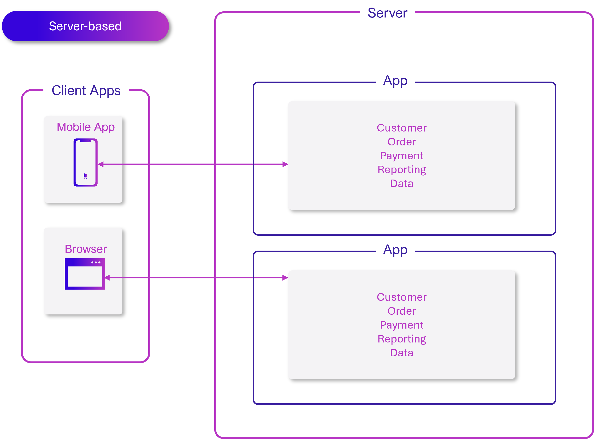
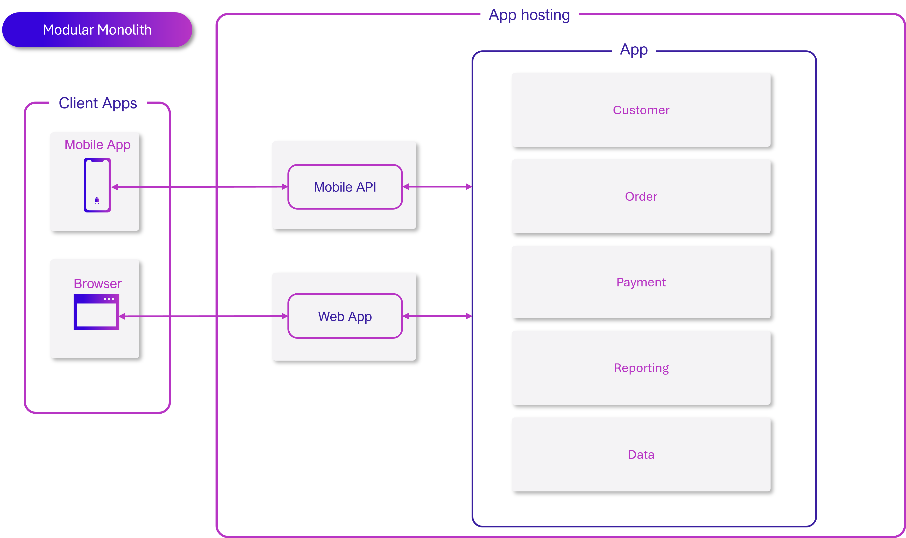
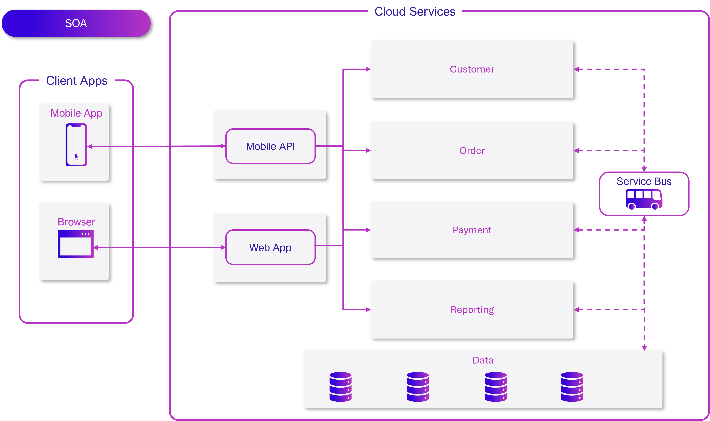
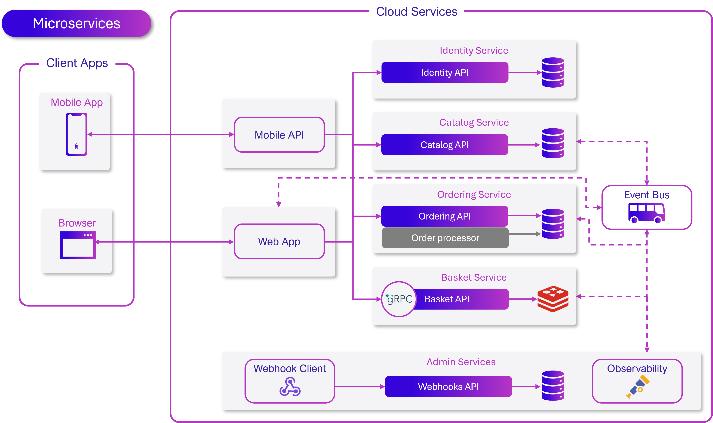

# Different ways to architect distributed applications

[!INCLUDE [download-alert](../includes/download-alert.md)]

In the ever-evolving landscape of software development, architects and developers are continually seeking efficient ways to design and build distributed applications. Let's explore some of the current architectural approaches. We'll delve into the characteristics, advantages, and challenges of each approach. As we navigate through these different paradigms, we'll discuss crucial aspects such as containerization, data sovereignty, scalability, and communication patterns. 

Understanding these architectural styles will allow you to make informed decisions when designing robust, scalable, and maintainable distributed systems in today's cloud-native environment.

## Server-based architecture

This is the traditional model where client machines connect to a server for processing and data storage. The server is responsible for all the processing, managing business logic, and data persistence. In this architecture, state and data management is centralized, typically using a single database. This approach simplifies data consistency but the database can become a bottleneck as the system scales. As all data is stored centrally there's no separation of data ownership among different components or services, which leads to tight coupling and makes it difficult to evolve different parts of the system independently.

While not originally designed for containers, monolithic server applications can be containerized. This process provides benefits like consistent environments and easier deployment, but it doesn't address the underlying architectural limitations of a monolithic system. Containerization in this context primarily aids in deployment and environment consistency, rather than in scalability or modularity.

In a server-based architecture, the logical and physical architectures often closely align, with most components residing on a single server or cluster. This simplicity can be an advantage for smaller applications but may limit flexibility as the application grows. The centralized nature of this architecture provides high security as all data is stored in one place, but it also creates a single point of failure and can become a performance bottleneck under high load.

## Modular monoliths

In this architecture, the application is divided into modules. Each module is responsible for a specific feature or functionality. However, unlike microservices, these modules run in the same process and communicate directly with each other. Modular monoliths can be containerized as a single unit, which helps with deployment and scaling of the entire application, but doesn't allow for independent scaling of individual modules. In short they suffer from the same limitations as traditional monolithic server-based architectures.

While modules are separate, they typically share a common database, simplifying data management but also create a tight coupling between modules. This shared database approach makes it easier to maintain data consistency across the application but can lead to challenges as the application grows and modules become more complex. Also this means modules don't have true data sovereignty, as they don't exclusively own or control their data. This can lead to interdependencies between modules and make it challenging to evolve or replace individual modules without affecting others.

Although not as critical as in microservices, clearly defined boundaries between modules are important for maintainability in modular monoliths. These boundaries help in organizing code, reducing dependencies between modules, and making the system easier to understand and modify. However, because all modules run in the same process, there's still a risk that changes in one module can affect others, and the technology diversity is limited compared to more distributed architectures.

## Service-oriented architecture

In Service-Oriented Architecture (SOA), services are the main components. Each service encompasses an entire business process or function. For example, a customer order service would include functionality to manage not only orders but also customer information, shipping, and billing. Services communicate with each other to perform their tasks, typically using a messaging broker or a central enterprise bus.

Data management in SOA can be challenging. Traditionally, services often share databases, which can lead to tight coupling. Moving towards data sovereignty, where each service owns its data, can improve service independence but introduces challenges in maintaining data consistency across services. This shift improves service independence but introduces new challenges in maintaining data consistency across services. SOA implementations must balance the benefits of data sovereignty with the need for data sharing and consistency across business processes.

Communication is a crucial aspect of SOA. While not as granular as microservices, SOA relies heavily on inter-service communication, often through a centralized bus. This central communication mechanism can provide benefits in terms of standardization and ease of management, but it can also become a performance bottleneck and single point of failure if not designed carefully.

## Microservices

Microservices architecture breaks down the application into smaller, independent services that perform specific tasks. These services can be developed, deployed, and scaled independently. Microservices are well-suited for containerization, and allow each service to be deployed and scaled independently, which aligns well with cloud-native development practices.

In microservices, each service typically adheres to the principle of data sovereignty. Each microservice owns and manages its own data store, which can be a database, cache, or any other form of data storage. This sovereignty ensures that a service has complete control over its data model, storage technology, and data access patterns. It reduces coupling between services, as no service can directly access or modify another service's data. Instead, data exchange happens through well-defined APIs or messaging systems. This approach supports the independence and autonomy of each microservice, allowing teams to make decisions about data storage and management that are optimal for their specific service without affecting others. However, it also introduces challenges in maintaining data consistency across the system. Solutions to these challenges include using event-driven architectures, implementing the Saga pattern for distributed transactions, and designing for eventual consistency where appropriate.

The logical architecture of a microservices system, that us how services are conceptually organized, can be quite different from its physical architecture, that is how they're deployed. This separation allows for optimal resource utilization and adaptation to changing infrastructure requirements.

Identifying correct domain-model boundaries for each microservice is crucial to ensure each service has a well-defined responsibility and to reduce inter-service dependencies. This process often involves careful analysis of the business domain and can significantly impact the overall system design.

Communication patterns in microservices architectures are diverse. They can involve direct client-to-microservice communication or use an API Gateway pattern. Direct communication can offer lower latency but increases complexity for clients, while an API Gateway can simplify the client experience but may introduce a potential single point of failure. Additionally, microservices can communicate with each other using both synchronous (HTTP/gRPC) and asynchronous (message queues) methods, each with its own implications on system design and behavior.

### .NET Aspire and microservices

Although a microservices architecture is well suited to large apps with complex scaling needs and continuous development, you've seen that they're not always easy to manage. For example, sometimes it's hard to determine exactly which microservices and other components make up your entire app. Also, because each microservice might be written by a different team, common concerns like observability and resiliency may be implemented inconsistently or not at all. 

This is where .NET Aspire comes in - it's a stack that helps you create manageable and consistent microservices, and assemble them into large apps. You can build .NET microservices without .NET Aspire, but if you do you'll have to work harder to solve common problems. For example, .NET Aspire:

- Makes it clear which microservices and other components are part of your app. You can see them in the App Host project code, and in the dashboard that appears whenever you debug your app.
- Implements observability for you using OpenTelemetry, so you can easily get data on the performance and behavior of all your microservices without requiring your development teams to build it.
- Makes it easy to use common backing services, such as databases and service buses, by providing out-of-the-box components for each one.
- Implements resiliency in these components to prevent and recover from failures, without requiring your development teams to build it.

If you've already started building and deploying microservices apps, then .NET Aspire may not help you, because it's opinionated about how they should be built and that might not match your design. However, if you're new to microservices and cloud-native design, or if you're starting an app from scratch, it can help to make the project easier and reduce development time. 

>[!div class="step-by-step"]
>[Previous](why-choose-distributed-architecture.md)
>[Next](../communication-patterns/communication-patterns.md)
