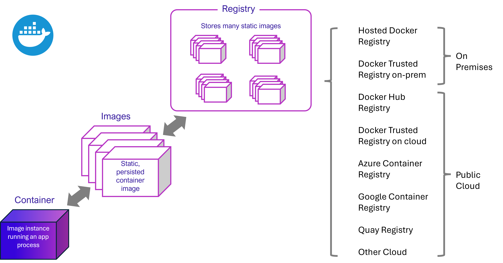

# Containers, images, repositories, and registries

[!INCLUDE [download-alert](../includes/download-alert.md)]

When using Docker, a developer creates an app or service and packages it and its dependencies into a container image. An image is a static representation of the app or service and its configuration and dependencies.

To run the app or service, the app's image is instantiated to create a container, which will be running on the Docker host. Containers are initially tested in a development environment or PC.

Developers should store images in a registry, which acts as a library of images and is needed when deploying to production orchestrators. Docker maintains a public registry via [Docker Hub](https://hub.docker.com/); other vendors provide registries for different collections of images, including [Azure Container Registry](https://azure.microsoft.com/services/container-registry/). Alternatively, enterprises can have a private registry on-premises for their own Docker images.

Figure 2-4 shows how images and registries in Docker relate to other components. It also shows the multiple registry offerings from vendors.



**Figure 2-5**. Taxonomy of Docker terms and concepts

The registry is like a bookshelf where images are stored and available to be pulled for building containers to run services or web apps. There are private Docker registries on-premises and on the public cloud. Docker Hub is a public registry maintained by Docker, along the Docker Trusted Registry an enterprise-grade solution, Azure offers the Azure Container Registry. AWS, Google, and others also have container registries.

Putting images in a registry lets you store static and immutable application bits, including all their dependencies at a framework level. Those images can then be versioned and deployed in multiple environments and therefore provide a consistent deployment unit.

Private image registries, either hosted on-premises or in the cloud, are recommended when:

- Your images must not be shared publicly due to confidentiality.

- You want to have minimum network latency between your images and your chosen deployment environment. For example, if your production environment is Azure cloud, you probably want to store your images in [Azure Container Registry](https://azure.microsoft.com/services/container-registry/) so that network latency will be minimal. In a similar way, if your production environment is on-premises, you might want to have an on-premises Docker Trusted Registry available within the same local network.

# Container terminology

This section lists terms and definitions you should be familiar with before getting deeper into containers. For further definitions, see the extensive glossary provided by Docker.

**Container image**: A package with all the dependencies and information needed to create a container. An image includes all the dependencies (such as frameworks) plus deployment and execution configuration to be used by a container runtime. Usually, an image derives from multiple base images that are layers stacked on top of each other to form the container's filesystem. An image is immutable once it has been created.

**Dockerfile**: A text file that contains instructions for building a Docker image. It's like a batch script, the first line states the base image to begin with and then follow the instructions to install required programs, copy files, and so on, until you get the working environment you need.

**Build**: The action of building a container image based on the information and context provided by its Dockerfile, plus additional files in the folder where the image is built. You can build images with the following Docker command:

```Bash
docker build
```

**Container**: An instance of a Docker image. A container represents the execution of a single application, process, or service. It consists of the contents of a Docker image, an execution environment, and a standard set of instructions. When scaling a service, you create multiple instances of a container from the same image. Or a batch job can create multiple containers from the same image, passing different parameters to each instance.

**Volumes**: Offer a writable filesystem that the container can use. Since images are read-only but most programs need to write to the filesystem, volumes add a writable layer, on top of the container image, so the programs have access to a writable filesystem. The program doesn't know it's accessing a layered filesystem, it's just the filesystem as usual. Volumes live in the host system and are managed by Docker.

**Tag**: A mark or label you can apply to images so that different images or versions of the same image (depending on the version number or the target environment) can be identified.

**Multi-stage Build**: Is a feature, since Docker 17.05 or higher, that helps to reduce the size of the final images. For example, a large base image, containing the SDK can be used for compiling and publishing and then a small runtime-only base image can be used to host the application.

**Repository (repo)**: A collection of related Docker images, labeled with a tag that indicates the image version. Some repos contain multiple variants of a specific image, such as an image containing SDKs (heavier), an image containing only runtimes (lighter), etc. Those variants can be marked with tags. A single repo can contain platform variants, such as a Linux image and a Windows image.

**Registry**: A service that provides access to repositories. The default registry for most public images is Docker Hub (owned by Docker as an organization). A registry usually contains repositories from multiple teams. Companies often have private registries to store and manage images they've created. Azure Container Registry is another example.

**Multi-arch image**: For multi-architecture (or multi-platform), it's a Docker feature that simplifies the selection of the appropriate image, according to the platform where Docker is running. For example, when a Dockerfile requests a base image FROM mcr.microsoft.com/dotnet/sdk:8.0 from the registry, it actually gets 8.0-nanoserver-ltsc2022, 8.0-nanoserver-1809 or 8.0-bullseye-slim, depending on the operating system and version where Docker is running.

**Docker Hub**: A public registry to upload images and work with them. Docker Hub provides Docker image hosting, public or private registries, build triggers and web hooks, and integration with GitHub and Bitbucket.

**Azure Container Registry**: A public resource for working with Docker images and its components in Azure. This provides a registry that's close to your deployments in Azure and that gives you control over access, making it possible to use your Azure Active Directory groups and permissions.

**Docker Trusted Registry (DTR)**: A Docker registry service (from Docker) that can be installed on-premises so it lives within the organization's datacenter and network. It's convenient for private images that should be managed within the enterprise. Docker Trusted Registry is included as part of the Docker Datacenter product.

**Docker Desktop**: Development tools for Windows and macOS for building, running, and testing containers locally. Docker Desktop for Windows provides development environments for both Linux and Windows Containers. The Linux Docker host on Windows is based on a Hyper-V virtual machine. The host for Windows Containers is directly based on Windows. Docker Desktop for Mac is based on the Apple Hypervisor framework and the xhyve hypervisor, which provides a Linux Docker host virtual machine on macOS. Docker Desktop for Windows and for Mac replaces Docker Toolbox, which was based on Oracle VirtualBox.

**Compose**: A command-line tool and YAML file format with metadata for defining and running multi-container applications. You define a single application based on multiple images with one or more .yml files that can override values depending on the environment. After you've created the definitions, you can deploy the whole multi-container application with a single command (docker-compose up) that creates a container per image on the Docker host.

**Cluster:** A collection of Docker hosts exposed as if it were a single virtual Docker host, so that the application can scale to multiple instances of the services spread across multiple hosts within the cluster. Docker clusters can be created with Kubernetes, Azure Service Fabric, Docker Swarm and Mesosphere DC/OS.

**Orchestrator**: A tool that simplifies the management of clusters and Docker hosts. Orchestrators enable you to manage their images, containers, and hosts through a command-line interface (CLI) or a graphical UI. You can manage container networking, configurations, load balancing, service discovery, high availability, Docker host configuration, and more. An orchestrator is responsible for running, distributing, scaling, and healing workloads across a collection of nodes. Typically, orchestrator products are the same products that provide cluster infrastructure, like Kubernetes and Azure Service Fabric, among other offerings in the market.

>[!div class="step-by-step"]
>[Previous](container-terminology.md)
>[Next](official-container-images-tooling.md)