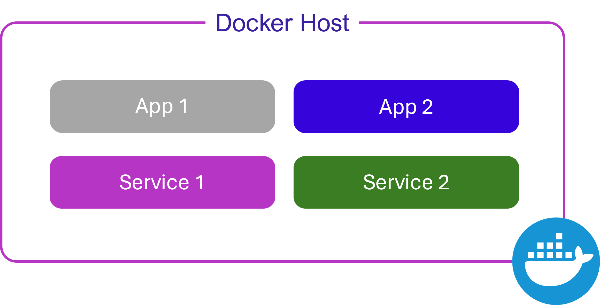

# What are containers?

[!INCLUDE [download-alert](../includes/download-alert.md)]

Containerization is an approach to software development in which an application or service, its dependencies, and its configuration (abstracted as deployment manifest files) are packaged together as a container image. Each container can be run as a unit and deployed to a container host. Docker is often used to host containers, or you can choose more scalable and flexible container orchestrators like Kubernetes.

Just as shipping containers allow goods to be transported by ship, train, or truck regardless of the cargo inside, software containers act as a standard unit of software deployment that can contain different code and dependencies. Containerizing software this way enables developers and IT professionals to deploy them across environments with little or no modification.

Containers also isolate applications from each other on a shared OS. Containerized applications run on top of a container host that in turn runs on the OS, usually Linux or Windows. Containers therefore have a significantly smaller footprint than virtual machine (VM) images because they don't include and entirely separate instance of the operating system.

Each container can run a whole web application or a service, as shown in Figure 2-1. In this example, Docker is the container host, and App1, App2, Service 1, and Service 2 are containerized applications or services.

**Figure 2-1**. Multiple containers running on a container host

Another benefit of containerization is scalability. You can scale out quickly by creating new containers for short-term tasks. From an application point of view, creating a container is analogous to instantiating a process like a service or a web app. For reliability, however, when you run multiple instances of the same image across multiple host servers, you typically want each container to run in a different host server or VM in different fault domains.

In short, containers offer the benefits of isolation, portability, agility, scalability, and control throughout the whole application lifecycle. The most important benefit is the environment's isolation provided between Dev and Ops.

>[!div class="step-by-step"]
>[Previous](../introduction-to-cloud-native-development/candidate-apps-for-cloud-native.md)
>[Next](what-is-docker.md)
