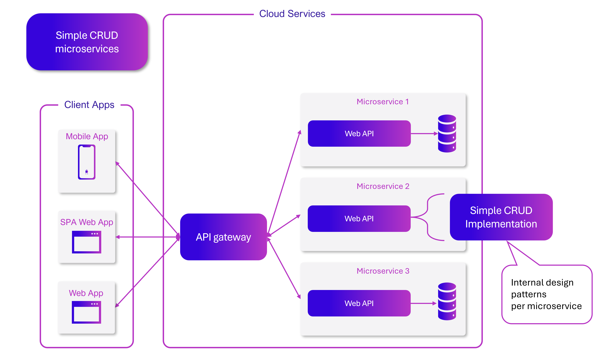
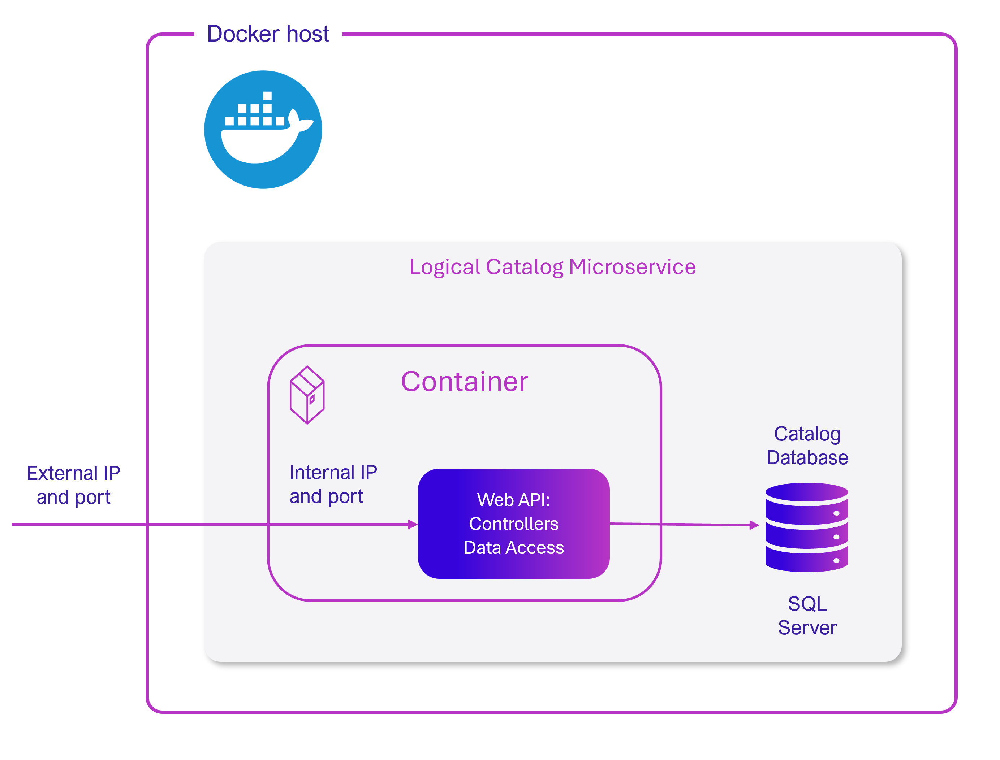
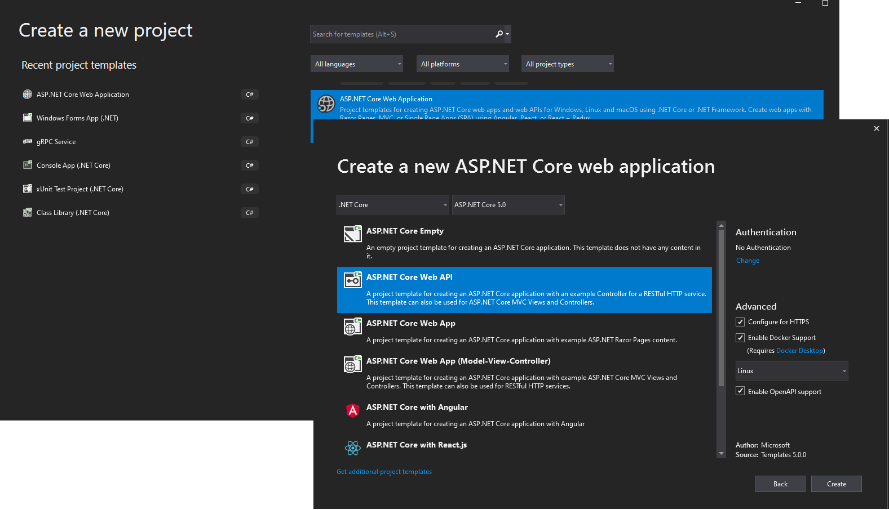
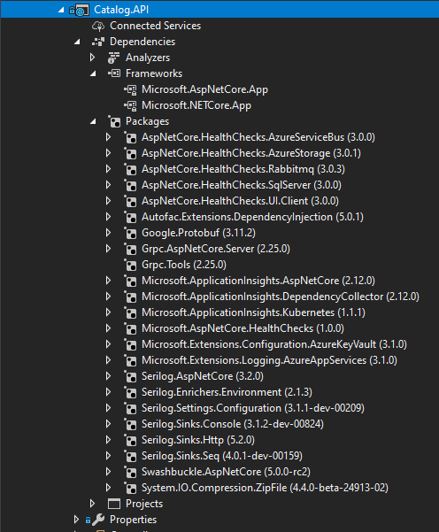

# Creating a simple data-driven CRUD microservice

[!INCLUDE [download-alert](../includes/download-alert.md)]

This section outlines how to create a simple microservice that performs create, read, update, and delete (CRUD) operations on a data source.

## Designing a simple CRUD microservice

From a design point of view, this type of containerized microservice is very simple. Perhaps the problem to solve is simple, or perhaps the implementation is only a proof of concept.



**Figure 6-4**. Internal design for simple CRUD microservices

An example of this kind of simple data-drive service is the catalog microservice from the eShop Reference Architecture sample application. This type of service implements all its functionality in a single ASP.NET Core Web API project that includes classes for its data model, its business logic, and its data access code. It also stores its related data in a database running in SQL Server (as another container for dev/test purposes), but could also be any regular SQL Server host:



**Figure 6-5**. Simple data-driven/CRUD microservice design

This diagram shows the logical Catalog microservice, that includes its Catalog database, which can be or not in the same Docker host. Having the database in the same Docker host might be good for development, but not for production. When you are developing this kind of service, you only need [ASP.NET Core](/aspnet/core/) and a data-access API or ORM like [Entity Framework Core](/ef/core/index).

For a production environment in Azure, it is recommended that you use Azure SQL DB or any other database technology that can provide high availability and high scalability. For example, for a NoSQL approach, you might choose CosmosDB.

Finally, by editing the Dockerfile and docker-compose.yml metadata files, you can configure how the image of this container will be created—what base image it will use, plus design settings such as internal and external names and TCP ports.

## Implementing a simple CRUD microservice with ASP.NET Core

To implement a simple CRUD microservice using .NET and Visual Studio, you start by creating a simple ASP.NET Core Web API project (running on .NET so it can run on a Linux Docker host):



**Figure 6-6**. Creating an ASP.NET Core Web API project in Visual Studio 2019

To create an ASP.NET Core Web API Project, first select an ASP.NET Core Web Application and then select the API type. After creating the project, you can implement your MVC controllers as you would in any other Web API project, using the Entity Framework API or other API. In a new Web API project, you can see that the only dependency you have in that microservice is on ASP.NET Core itself.



**Figure 6-7**. Dependencies in a simple CRUD Web API microservice

The API project includes references to Microsoft.AspNetCore.App NuGet package, that includes references to all essential packages. It could include some other packages as well.

### Implementing CRUD Web API services with Entity Framework Core

Entity Framework (EF) Core is a lightweight, extensible, and cross-platform version of the popular Entity Framework data access technology. EF Core is an object-relational mapper (ORM) that enables .NET developers to work with a database using .NET objects.

#### The data model

With EF Core, data access is performed by using a model. A model is made up of (domain model) entity classes and a derived context (DbContext) that represents a session with the database, allowing you to query and save data. You can generate a model from an existing database, manually code a model to match your database, or use EF migrations technique to create a database from your model, using the code-first approach (that makes it easy to evolve the database as your model changes over time). For the catalog microservice, the last approach has been used. You can see an example of the CatalogItem entity class in the following code example:

```csharp
public class CatalogItem
{
    public int Id { get; set; }
    public string Name { get; set; }
    public string Description { get; set; }
    public decimal Price { get; set; }
    public string PictureFileName { get; set; }
    public string PictureUri { get; set; }
    public int CatalogTypeId { get; set; }
    public CatalogType CatalogType { get; set; }
    public int CatalogBrandId { get; set; }
    public CatalogBrand CatalogBrand { get; set; }
    public int AvailableStock { get; set; }
    public int RestockThreshold { get; set; }
    public int MaxStockThreshold { get; set; }

    public bool OnReorder { get; set; }
    public CatalogItem() { }

    // Additional code ...
}
```

You also need a DbContext that represents a session with the database. For the catalog microservice, the CatalogContext class derives from the DbContext base class, as shown in the following example:

```csharp
public class CatalogContext : DbContext
{
    public CatalogContext(DbContextOptions<CatalogContext> options) : base(options)
    { }
    public DbSet<CatalogItem> CatalogItems { get; set; }
    public DbSet<CatalogBrand> CatalogBrands { get; set; }
    public DbSet<CatalogType> CatalogTypes { get; set; }

    // Additional code ...
}
```

You can have additional `DbContext` implementations. For example, in the sample Catalog.API microservice, there's a second `DbContext` named `CatalogContextSeed` where it automatically populates the sample data the first time it tries to access the database. This method is useful for demo data and for automated testing scenarios, as well.

Within the `DbContext`, you use the `OnModelCreating` method to customize object/database entity mappings and other [EF extensibility points](https://devblogs.microsoft.com/dotnet/implementing-seeding-custom-conventions-and-interceptors-in-ef-core-1-0/).

##### Querying data from Web API controllers

Instances of your entity classes are typically retrieved from the database using [Language-Integrated Query (LINQ)](/dotnet/csharp/linq/)

##### Saving data

Data is created, deleted, and modified in the database using instances of your entity classes. You could add code like the following hard-coded example (mock data, in this case) to your Web API controllers.

```csharp
var catalogItem = new CatalogItem() {CatalogTypeId=2, CatalogBrandId=2,
                                     Name="Roslyn T-Shirt", Price = 12};
_context.Catalog.Add(catalogItem);
_context.SaveChanges();
```

##### Dependency Injection in ASP.NET Core and Web API controllers

In ASP.NET Core, you can use Dependency Injection (DI) out of the box. You do not need to set up a third-party Inversion of Control (IoC) container.

In the `CatalogController` class mentioned earlier, `CatalogContext` (which inherits from `DbContext`) type is injected along with the other required objects in the `CatalogController()` constructor.

An important configuration to set up in the Web API project is the DbContext class registration into the service's IoC container. You typically do so in the _Program.cs_ file by calling the `builder.Services.AddDbContext<CatalogContext>()` method, as shown in the following **simplified** example:

```csharp
// Additional code...

builder.Services.AddDbContext<CatalogContext>(options =>
{
    options.UseSqlServer(builder.Configuration["ConnectionString"],
    sqlServerOptionsAction: sqlOptions =>
    {
        sqlOptions.MigrationsAssembly(
            typeof(Program).GetTypeInfo().Assembly.GetName().Name);

        //Configuring Connection Resiliency:
        sqlOptions.
            EnableRetryOnFailure(maxRetryCount: 5,
            maxRetryDelay: TimeSpan.FromSeconds(30),
            errorNumbersToAdd: null);
    });

    // Changing default behavior when client evaluation occurs to throw.
    // Default in EFCore would be to log warning when client evaluation is done.
    options.ConfigureWarnings(warnings => warnings.Throw(
        RelationalEventId.QueryClientEvaluationWarning));
});
```

## The DB connection string and environment variables used by Docker containers

You can use the ASP.NET Core settings and add a ConnectionString property to your settings.json file as shown in the following example:

```json
{
    "ConnectionString": "Server=tcp:127.0.0.1,5433;Initial Catalog=Microsoft.eShop.Services.CatalogDb;User Id=sa;Password=[PLACEHOLDER]",
    "ExternalCatalogBaseUrl": "http://host.docker.internal:5101",
    "Logging": {
        "IncludeScopes": false,
        "LogLevel": {
            "Default": "Debug",
            "System": "Information",
            "Microsoft": "Information"
        }
    }
}
```

The settings.json file can have default values for the ConnectionString property or for any other property. However, those properties will be overridden by the values of environment variables that you specify in the docker-compose.override.yml file, when using Docker.

From your docker-compose.yml or docker-compose.override.yml files, you can initialize those environment variables so that Docker will set them up as OS environment variables for you, as shown in the following docker-compose.override.yml file (the connection string and other lines wrap in this example, but it would not wrap in your own file).

```yml
# docker-compose.override.yml

#
catalog-api:
  environment:
    - ConnectionString=Server=sqldata;Database=Microsoft.eShop.Services.CatalogDb;User Id=sa;Password=[PLACEHOLDER]
    # Additional environment variables for this service
  ports:
    - "5101:80"
```

Finally, you can get that value from your code by using `builder.Configuration\["ConnectionString"\]`, as shown in an earlier code example.

However, for production environments, you might want to explore additional ways on how to store secrets like the connection strings. An excellent way to manage application secrets is using [Azure Key Vault](https://azure.microsoft.com/services/key-vault/).

### Implementing versioning in ASP.NET Web APIs

As business requirements change, new collections of resources may be added, the relationships between resources might change, and the structure of the data in resources might be amended. Updating a Web API to handle new requirements is a relatively straightforward process, but you must consider the effects that such changes will have on client applications consuming the Web API.

Versioning enables a Web API to indicate the features and resources that it exposes. A client application can then submit requests to a specific version of a feature or resource. There are several approaches to implement versioning:

- URI versioning

- Query string versioning

- Header versioning

With URI versioning, as in the eShop sample application, each time you modify the Web API or change the schema of resources, you add a version number to the URI for each resource. Existing URIs should continue to operate as before, returning resources that conform to the schema that matches the requested version.

As shown in the following code example, the version can be set by using the Route attribute in the Web API controller, which makes the version explicit in the URI (v1 in this case).

```csharp
[Route("api/v1/[controller]")]
public class CatalogController : ControllerBase
{
    // Implementation ...
```

For a more sophisticated versioning and the best method when using REST, see [HATEOAS (Hypertext as the Engine of Application State)](/azure/architecture/best-practices/api-design#use-hateoas-to-enable-navigation-to-related-resources).

## Generating Swagger description metadata from your ASP.NET Core Web API

[Swagger](https://swagger.io/) is a commonly used open source framework backed by a large ecosystem of tools that helps you design, build, document, and consume your RESTful APIs. You should include Swagger description metadata with any kind of microservice.

The heart of Swagger is the Swagger specification, which is API description metadata in a JSON or YAML file. The specification creates the RESTful contract for your API, detailing all its resources and operations in both a human- and machine-readable format for easy development, discovery, and integration.

For more information, including a web editor and examples of Swagger specifications from companies like Spotify, Uber, Slack, and Microsoft, see the Swagger site (<https://swagger.io>).

### Why use Swagger?

The main reasons to generate Swagger metadata for your APIs are the following.

**Ability for other products to automatically consume and integrate your APIs**.

Dozens of products and [commercial tools](https://swagger.io/commercial-tools/) and many [libraries and frameworks](https://swagger.io/open-source-integrations/) support Swagger. Microsoft has high-level products and tools that can automatically consume Swagger-based APIs, such as the following:

- [AutoRest](https://github.com/Azure/AutoRest). You can automatically generate .NET client classes for calling Swagger. This tool can be used from the CLI and it also integrates with Visual Studio for easy use through the GUI.

- [Microsoft PowerApps](https://powerapps.microsoft.com/). You can automatically consume your API from [PowerApps mobile apps](https://powerapps.microsoft.com/blog/register-and-use-custom-apis-in-powerapps/) built with [PowerApps Studio](https://powerapps.microsoft.com/build-powerapps/), with no programming skills required.

**Ability to automatically generate API documentation**.

There are several options to automate Swagger metadata generation for ASP.NET Core REST API applications, in the form of functional API help pages, based on *swagger-ui*.

Probably the best known is [Swashbuckle](https://github.com/domaindrivendev/Swashbuckle.AspNetCore) which we'll cover in some detail in this guide.

### How to automate API Swagger metadata generation with the Swashbuckle NuGet package

Generating Swagger metadata manually (in a JSON or YAML file) can be tedious work. However, you can automate API discovery of ASP.NET Web API services by using the [Swashbuckle NuGet package](https://aka.ms/swashbuckledotnetcore) to dynamically generate Swagger API metadata.

Swashbuckle automatically generates Swagger metadata for your ASP.NET Web API projects.

Swashbuckle combines API Explorer and Swagger or [swagger-ui](https://github.com/swagger-api/swagger-ui) to provide a rich discovery and documentation experience for your API consumers.

This means you can complement your API with a nice discovery UI to help developers to use your API:


**Figure 6-8**. Swashbuckle API Explorer based on Swagger metadata—eShopOnContainers catalog microservice

The Swashbuckle generated Swagger UI API documentation includes all published actions. The API explorer is not the most important thing here. You can use tools like [swagger-codegen](https://github.com/swagger-api/swagger-codegen) which allow code generation of API client libraries, server stubs, and documentation automatically.

After you have installed the NuGet packages under the high-level metapackage [Swashbuckle.AspNetCore](https://www.nuget.org/packages/Swashbuckle.AspNetCore) in your Web API project, you configure Swagger in the _Program.cs_ class, as in the following **simplified** code:

```csharp

// Add framework services.

builder.Services.AddSwaggerGen(options =>
{
    options.DescribeAllEnumsAsStrings();
    options.SwaggerDoc("v1", new OpenApiInfo
    {
        Title = "eShopOnContainers - Catalog HTTP API",
        Version = "v1",
        Description = "The Catalog Microservice HTTP API. This is a Data-Driven/CRUD microservice sample"
    });
});

// Other startup code...

app.UseSwagger()
    .UseSwaggerUI(c =>
    {
        c.SwaggerEndpoint("/swagger/v1/swagger.json", "My API V1");
    });
    ```

Once this is done, you can start your application and browse the following Swagger JSON and UI endpoints using URLs like these:

```console
  http://<your-root-url>/swagger/v1/swagger.json

  http://<your-root-url>/swagger/
```

You previously saw the generated UI created by Swashbuckle for a URL like `http://<your-root-url>/swagger`. In Figure 6-9, you can also see how you can test any API method.


**Figure 6-9**. Swashbuckle UI testing the Catalog/Items API method

The Swagger UI API detail shows a sample of the response and can be used to execute the real API, which is great for developer discovery.

### Additional resources

- **ASP.NET Web API Help Pages using Swagger** \
  [https://learn.microsoft.com/aspnet/core/tutorials/web-api-help-pages-using-swagger](/aspnet/core/tutorials/web-api-help-pages-using-swagger)

- **Get started with Swashbuckle and ASP.NET Core** \
  [https://learn.microsoft.com/aspnet/core/tutorials/getting-started-with-swashbuckle](/aspnet/core/tutorials/getting-started-with-swashbuckle)

- **Get started with NSwag and ASP.NET Core** \
  [https://learn.microsoft.com/aspnet/core/tutorials/getting-started-with-nswag](/aspnet/core/tutorials/getting-started-with-nswag)

> [!div class="step-by-step"]
> [Previous](azure-caching.md)
> [Next](TODO)
