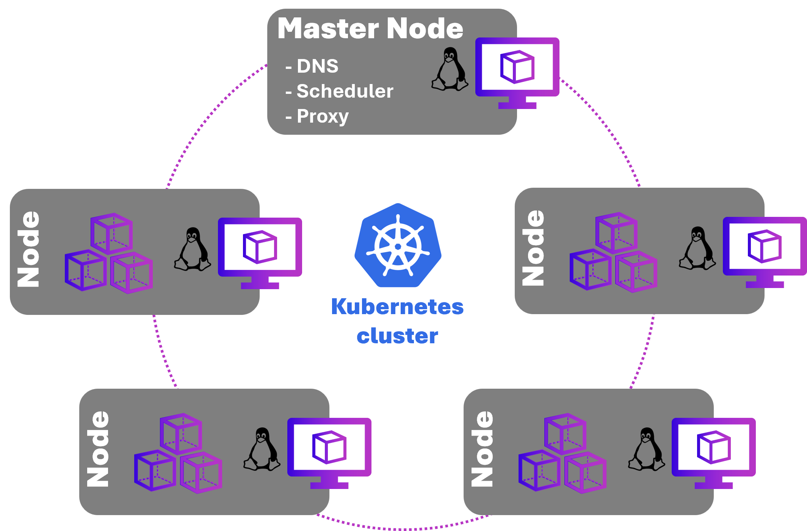

# Communication patterns

[!INCLUDE [download-alert](../includes/download-alert.md)]

When constructing a cloud-native system, communication becomes a significant design decision because the microservices and backing services are loosely couple. How does a front-end client application communicate with a back-end microservice? How do back-end microservices communicate with each other? What are the principles, patterns, and best practices to consider when implementing communication in cloud-native applications?

## Communication considerations

In a monolithic application, communication is straightforward. The code modules execute together in the same process on the same server. This approach can have performance advantages as everything runs together in shared memory, but results in tightly coupled code that becomes difficult to maintain, evolve, and scale.

Cloud-native systems implement a microservice-based architecture with many independent microservices. Each microservice runs inside a container deployed in a *cluster*.

A cluster groups a pool of containers together to form a highly available environment. They're managed with an orchestration tool, which is responsible for deploying and managing the containerized microservices. Figure 5-1 shows a [Kubernetes](https://kubernetes.io) cluster. This arrangement could be deployed in any Kubernetes cluster, including the Azure cloud with the fully managed [Azure Kubernetes Services](/azure/aks/intro-kubernetes).

**Figure 5-1**. A Kubernetes cluster

Across the cluster, microservices communicate with each other through APIs and messaging technologies.

While they provide many benefits, microservices are no free lunch. Local in-process method calls between components are now replaced with network calls. Each microservice must communicate over a network protocol, which adds complexity to your system:

- Network congestion, latency, and transient faults are constant concerns.
- Resiliency, in which failed requests are automatically retried, is essential.
- Some calls must be [idempotent](https://restapitutorial.com/introduction/idempotence) to keep a consistent state.
- Each microservice must authenticate and authorize calls.
- Each message must be serialized and then deserialized, which can be expensive.
- Message encryption and decryption becomes important.

## Communication types

Clients and services can use many different types of communication, each one targeting a different scenario and goals. Initially, those types of communications can be classified along two axes.

The first axis defines if the protocol is synchronous, asynchronous, and streaming:

- **Synchronous protocol**. HTTP is a synchronous protocol. The client sends a request and waits for a response from the service. That's independent of the client code execution that could be synchronous, where thread is blocked, or asynchronous, where the thread isn't blocked and the response will reach a callback eventually. The important point here is that the network protocol (HTTP/HTTPS) is synchronous and the client code can only continue its task when it receives the HTTP server response.
- **Asynchronous protocol**. Other protocols like Advanced Message Queuing Protocol (AMQP) use asynchronous messages. AMQP is a protocol supported by many operating systems and cloud environments. The client code or message sender usually doesn't wait for a response. It just sends the message to a queue and trusts that it will be delivered.
- **Streaming communication**. Streaming communication is a specialized form of asynchronous communication that permits a continuous data flow between services. Websockets aren't a streaming protocol but they can be used to enable streaming communication between services. Streaming is useful for scenarios where services need to exchange large amounts of data, when event streaming, or when there's a need to maintain a persistent connection for real-time updates.

The second axis defines if the communication has a single receiver or multiple receivers:

- **Single receiver**. Each request must be processed by exactly one receiver or service. An example of this communication is the [Command pattern](https://en.wikipedia.org/wiki/Command_pattern).
- **Multiple receivers**. Each request can be processed by zero, one, or multiple receivers. This type of communication must be asynchronous. An example is the [publish/subscribe](https://en.wikipedia.org/wiki/Publish%E2%80%93subscribe_pattern) mechanism used in patterns like [Event-driven architecture](https://microservices.io/patterns/data/event-driven-architecture.html). This is based on an event-bus interface or message broker when propagating data updates between multiple microservices through events. It's usually implemented through a service bus or similar artifact like [Azure Service Bus](https://azure.microsoft.com/services/service-bus/) by using [topics and subscriptions](https://learn.microsoft.com/en-us/azure/service-bus-messaging/service-bus-queues-topics-subscriptions#topics-and-subscriptions).

The book [.NET Microservices: Architecture for Containerized .NET Applications](https://dotnet.microsoft.com/download/thank-you/microservices-architecture-ebook), available for free from Microsoft, provides an in-depth coverage of communication patterns for microservice applications.

>[!div class="step-by-step"]
>[Previous](../architecting-distributed-cloud-native-applications/different-distributed-architectures.md)
>[Next](when-to-use-each-approach.md)
