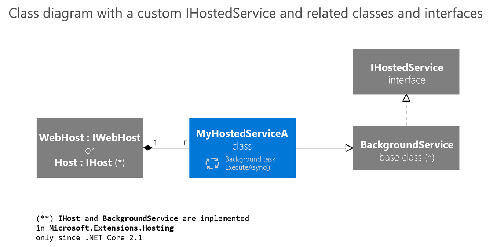

# Implement background tasks in microservices with IHostedService and the BackgroundService class

[!INCLUDE [download-alert](../includes/download-alert.md)]

In the world of microservices, background tasks are essential for operations that need to run independently of user interactions, such as data processing, batch jobs, or periodic maintenance.

Background tasks and scheduled jobs are something you might need to use in any application, whether or not it follows the microservices architecture pattern. The difference when using a microservices architecture is that you can implement the background task in a separate container so you can scale it down or up as necessary.

From a generic point of view, in .NET we called these type of tasks **hosted services**, because they are services that you host within your application or microservice. Note that in this case, the hosted service simply means a class with the background task logic.

Since .NET Core 2.0, the framework provides a new interface named <xref:Microsoft.Extensions.Hosting.IHostedService>, which helps you to implement hosted services easily. The basic idea is that you can register multiple background tasks (hosted services) that run in the background while your web host or host is running, as shown in the image 7-26.


**Figure 7-26**. Using IHostedService in a WebHost or a Host

ASP.NET Core 1.x and 2.x support `IWebHost` for background processes in web apps. .NET Core 2.1 and later versions support `IHost` for background processes with plain console apps. Note the difference made between `WebHost` and `Host`.

A `WebHost` (the base class that implements `IWebHost` in ASP.NET Core 2.0) is the infrastructure artifact you use to provide HTTP server features to your process, such as when you're implementing an MVC web app or Web API service. It provides all the new infrastructure in ASP.NET Core, enabling you to use dependency injection, insert middlewares in the request pipeline, and so on. The `WebHost` uses these very same `IHostedServices` for background tasks.

A `Host` (the base class that implements `IHost`) was introduced in .NET Core 2.1. Basically, a `Host` allows you to have a similar infrastructure to the `WebHost` (dependency injection, hosted services, and so on), but in this case, you have a simple and lighter process as the host, with nothing related to MVC, Web API or HTTP server features.

Therefore, you can either create a specialized host process with `IHost` to handle the hosted services and nothing else, or you can extend an existing ASP.NET Core `WebHost`, such as an existing ASP.NET Core Web API or MVC app.

## Understanding IHostedService and BackgroundService

The `IHostedService` interface is a contract for services that run in the background. It defines two methods: `StartAsync(CancellationToken)` and `StopAsync(CancellationToken)`. Implementing this interface allows you to start and stop the service, and the `CancellationToken` parameter helps handle the task's lifetime.

The `BackgroundService` class is an abstract class that implements `IHostedService` and provides a template for creating long-running background tasks. It introduces the `ExecuteAsync(CancellationToken)` method, which is where the logic of the background task is placed.

## Implementing a background task

To implement a background task, you create a class that inherits from `BackgroundService` and override the `ExecuteAsync` method. Here's a simple example:

```csharp
using Microsoft.Extensions.Hosting;
using System;
using System.Threading;
using System.Threading.Tasks;

public class MyBackgroundTask : BackgroundService
{
    protected override async Task ExecuteAsync(CancellationToken stoppingToken)
    {
        while (!stoppingToken.IsCancellationRequested)
        {
            DoWork();
            await Task.Delay(TimeSpan.FromHours(1), stoppingToken);
        }
    }

    private void DoWork()
    {
        // Task logic here
    }
}
```

In this example, `DoWork` is a placeholder for the actual task logic. The `ExecuteAsync` method runs in a loop, checking the `stoppingToken` to see if a stop request has been made, and waits for an hour before running again.

## Registering the service

After implementing the background task, you need to register it with the dependency injection (DI) container in the `Startup.cs` or `Program.cs` file, depending on your .NET version:

```csharp
public void ConfigureServices(IServiceCollection services)
{
    services.AddHostedService<MyBackgroundTask>();
}
```

## Summary class diagram

The following image shows a visual summary of the classes and interfaces involved when implementing `IHostedServices`.



**Figure 7-27**. Class diagram showing the multiple classes and interfaces related to IHostedService

`IWebHost` and `IHost` can host many services, which inherit from `BackgroundService`, which implements `IHostedService`.

## Deployment considerations and takeaways

It is important to note that the way you deploy your ASP.NET Core `WebHost` or .NET `Host` might impact the final solution. For instance, if you deploy your `WebHost` on IIS or a regular Azure App Service, your host can be shut down because of application pool recycles. But if you are deploying your host as a container into an orchestrator like Kubernetes, you can control the assured number of live instances of your host. In addition, you could consider other approaches in the cloud especially made for these scenarios, like Azure Functions. Finally, if you need the service to be running all the time and are deploying on a Windows Server, you could use a Windows Service.

But even for a `WebHost` deployed into an app pool, there are scenarios that would be still applicable, like repopulating or flushing an application's in-memory cache.

The `IHostedService` interface provides a convenient way to start background tasks in an ASP.NET Core web application (in .NET Core 2.0 and later versions) or in any process/host (starting in .NET Core 2.1 with `IHost`). Its main benefit is the opportunity you get with the graceful cancellation to clean-up the code of your background tasks when the host itself is shutting down.

### Best Practices

When implementing background tasks in microservices, consider the following best practices:

- **Graceful Shutdown**: Ensure your tasks handle cancellation tokens properly to stop gracefully.
- **Error Handling**: Implement robust error handling within the task to prevent unhandled exceptions from crashing the service.
- **Logging**: Include comprehensive logging to track the task's operation and facilitate debugging.
- **Resource Management**: Be mindful of resource consumption and implement efficient use of CPU and memory.

## Additional resources

- **Building a scheduled task in ASP.NET Core/Standard 2.0** \
  <https://blog.maartenballiauw.be/post/2017/08/01/building-a-scheduled-cache-updater-in-aspnet-core-2.html>

- **Implementing IHostedService in ASP.NET Core 2.0** \
  <https://www.stevejgordon.co.uk/asp-net-core-2-ihostedservice>

- **GenericHost Sample using ASP.NET Core 2.1** \
  <https://github.com/aspnet/Hosting/tree/release/2.1/samples/GenericHostSample>

> [!div class="step-by-step"]
> [Previous](rabbitmq-event-bus-development-test-environment.md)
> [Next](subscribe-events.md)
