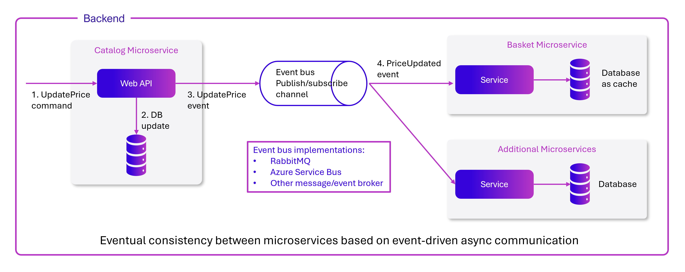
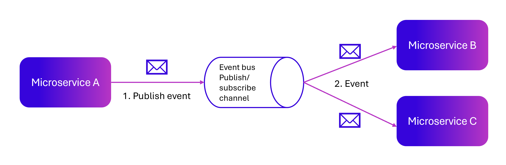
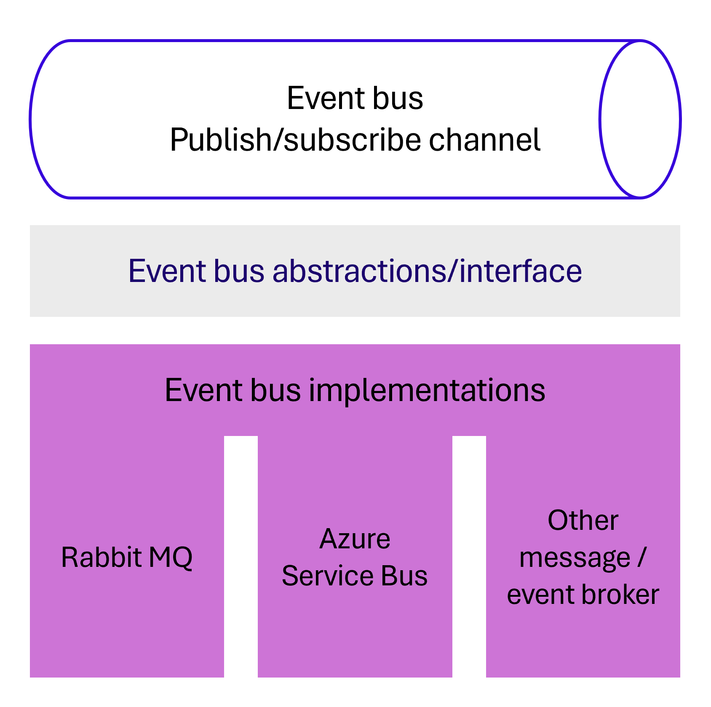

# Implementing event-based communication between microservices

[!INCLUDE [download-alert](../includes/download-alert.md)]

When you use [event-based communication](/azure/architecture/guide/architecture-styles/event-driven), a [microservice](/azure/architecture/microservices/) publishes an event when something notable happens, such as when a product is added to a customer's basket. Other microservices subscribe to those events. When a microservice receives an event, it can update its own business entities, which might lead to more events being published. This is the essence of the eventual consistency concept. This [publish/subscribe](/azure/architecture/patterns/publisher-subscriber) system is usually performed by using an event bus. You can design the event bus as an interface with the API needed to subscribe and unsubscribe to events and to publish events. It can also have one or more implementations based on any inter-process or messaging communication, such as a messaging queue or a service bus that supports asynchronous communication and a publish/subscribe model.

You can use events to implement business transactions that span multiple services, which give you eventual consistency between those services. An eventually consistent transaction consists of a series of distributed actions. At each action, the microservice updates a business entity and publishes an event that triggers the next action. Be aware that transactions don't span the underlying persistence and event bus, so [idempotence needs to be handled](/azure/architecture/reference-architectures/containers/aks-mission-critical/mission-critical-data-platform#idempotent-message-processing). Figure 7-18 below, shows a `PriceUpdated` event published through an event bus, so the price update is propagated to the Basket and other microservices.



**Figure 7-18**. Event-driven communication based on an event bus

This section describes how you can implement this type of communication with .NET by using a generic event bus interface, as shown in Figure 7-18. There are multiple potential implementations, each using a different technology or infrastructure such as RabbitMQ, Azure Service Bus, or any other third-party open-source or commercial service bus.

## Using message brokers and service buses for production systems

As noted in the architecture section, you can choose from multiple messaging technologies for your event bus. But these technologies are at different levels. For instance, RabbitMQ, a messaging broker transport, is at a lower level than commercial products like Azure Service Bus, NServiceBus, MassTransit, or Brighter. Most of these products can work on top of either RabbitMQ or Azure Service Bus. Your choice of product depends on how many features and how much out-of-the-box scalability you need for your application.

For a proof-of-concept or development environment, a simple implementation on [RabbitMQ](https://www.rabbitmq.com/) running as a container might be enough. But for mission-critical and production systems that need high scalability, you might want to evaluate and use [Azure Service Bus](/azure/service-bus-messaging/).

Of course, you could always build your own service bus features on top of lower-level technologies like RabbitMQ and Docker, but the work needed to "reinvent the wheel" might be too costly for a custom enterprise application.

Once you have decided that you want to have asynchronous and event-driven communication, you should choose the service bus product that best fits your needs for production.

## Implementing the Azure Service Bus component with .NET Aspire

.NET Aspire makes it much more straightforward to implement an event bus, because it includes built-in components for systems like:

- RabbitMQ
- Azure Service Bus
- Apache Kafka
- Azure Storage Queues
- NATS

In the .NET Aspire solution, in the app host project, you can register these services and pass them to microservices that need to send or receive event messages. Service discovery is therefore straightforward. You must write code to work with client objects and send or pick up messages from queues as normal for each system.

As an example, Let's examine how you'd implement Azure Service Bus in a .NET Aspire solution.

### Prerequisites
Before you begin, ensure you have an Azure Service Bus namespace. You can learn more about creating a Service Bus namespace [here](https://learn.microsoft.com/dotnet/aspire/messaging/azure-service-bus-component).

### Creating the Azure Service Bus in the app host project

The first step is to install the Azure Service Bus hosting package in the app host project:

```shell
dotnet add package Aspire.Hosting.Azure.ServiceBus
```

Then, in the app host _Program.cs_ file, you can register the Service Bus component and consume the service as follows:

```csharp
var builder = DistributedApplication.CreateBuilder(args);
var serviceBus = builder.ExecutionContext.IsPublishMode 
    ? builder.AddAzureServiceBus("messaging") 
    : builder.AddConnectionString("messaging");

builder.AddProject<Projects.ExampleProject>()
       .WithReference(serviceBus);
```

### Using the Azure Service Bus in microservices

Next, install the necessary NuGet package in each microservice project that will send or receive event messages. Use the following command in your .NET CLI:

```shell
dotnet add package Aspire.Azure.Messaging.ServiceBus
```

In the microservice's `Program.cs` file, register a `ServiceBusClient` like this:

```csharp
builder.AddAzureServiceBusClient("messaging");
```

That adds a `ServiceBusClient` object to the dependency injection container. To retrieve the client when you need it, require it as a constructor parameter in your services. For example:

```csharp
public class ExampleService
{
    private readonly ServiceBusClient _client;

    public ExampleService(ServiceBusClient client)
    {
        _client = client;
    }

    // Your methods here
}
```

### Configuration

The .NET Aspire Service Bus component offers several configuration options to tailor the `ServiceBusClient` to your project's needs. You can use configuration providers to load settings from `appsettings.json` or other configuration files using the `Aspire:Azure:Messaging:ServiceBus` key.

Here's an example of how you might configure the ServiceBusClient in your `appsettings.json`:

```json
{
  "Aspire": {
    "Azure": {
      "Messaging": {
        "ServiceBus": {
          "DisableHealthChecks": true
        }
      }
    }
  }
}
```

For more information, see [.NET Aspire Azure Service Bus component](https://learn.microsoft.com/dotnet/aspire/messaging/azure-service-bus-component?tabs=dotnet-cli)

## Integration events

Integration events are used for bringing domain state into synchronization across multiple microservices or external systems. Each microservice can publish integration events. Other microservices subscribe to the integration events that they need to handle. When an event is published, the appropriate event handler in each receiving microservice handles the event. 

An integration event is basically a data-holding class, as in the following example:

```csharp
public class ProductPriceChangedIntegrationEvent : IntegrationEvent
{
    public int ProductId { get; private set; }
    public decimal NewPrice { get; private set; }
    public decimal OldPrice { get; private set; }

    public ProductPriceChangedIntegrationEvent(int productId, decimal newPrice,
        decimal oldPrice)
    {
        ProductId = productId;
        NewPrice = newPrice;
        OldPrice = oldPrice;
    }
}
```

The integration events can be defined at the application level of each microservice, so they are decoupled from other microservices, in a way comparable to how `ViewModels` are defined in the server and client. It's not recommended to share a common integration events library across multiple microservices; doing that would couple those microservices with a single event definition data library. You don't want to do that for the same reasons that you don't want to share a common domain model across multiple microservices: microservices must be completely autonomous and independent. For more information, see this blog post on [the amount of data to put in events](https://particular.net/blog/putting-your-events-on-a-diet). Be careful not to take this too far, as this other blog post describes [the problem data deficient messages can produce](https://ardalis.com/data-deficient-messages/). The design of your events should aim to be "just right" for the needs of their consumers.

There are only a few kinds of libraries you should share across microservices. One is libraries that are final application blocks, like the [Event Bus client API](https://github.com/dotnet/eShop/tree/main/src/EventBus), as in the eShop reference architecture. Another is libraries that constitute tools that could also be shared as NuGet components, like JSON serializers.

## The event bus

An event bus allows publish/subscribe-style communication between microservices without requiring the components to explicitly be aware of each other, as shown in Figure 7-19.



**Figure 7-19**. Publish/subscribe basics with an event bus

The above diagram shows that microservice A publishes to the event bus, which distributes to subscribing microservices B and C, without the publisher needing to know the subscribers. The event bus is related to the observer pattern and the publish-subscribe pattern.

### Observer pattern

In the [observer pattern](https://en.wikipedia.org/wiki/Observer_pattern), your primary object, known as the observable, notifies other interested objects, known as observers, with relevant information (events).

### Publish/subscribe pattern

The purpose of the [publish/subscribe (pub/sub) pattern](https://learn.microsoft.com/previous-versions/msp-n-p/ff649664(v=pandp.10)) is the same as the observer pattern: you want to notify other services when certain events take place. But there is an important difference between the observer and pub/sub patterns. In the observer pattern, the broadcast is performed directly from the observable to the observers, so they "know" each other. But when using a pub/sub pattern, there is a third component, called broker, or message broker or event bus, which is known by both the publisher and subscriber. Therefore, when using the pub/sub pattern the publisher and the subscribers are precisely decoupled thanks to the event bus or message broker.

### The middleman or event bus

How do you achieve anonymity between publisher and subscriber? An easy way is let a middleman take care of all the communication. An event bus is one such middleman.

An event bus is typically composed of two parts:

- The abstraction or interface.
- One or more implementations.

In Figure 7-19 you can see how, from an application point of view, the event bus is nothing more than a pub/sub channel. The way you implement this asynchronous communication can vary. It can have multiple implementations so that you can swap between them, depending on the environment requirements (for example, production or development environments).

In Figure 7-20, you can see an abstraction of an event bus with multiple implementations based on infrastructure messaging technologies like RabbitMQ, Azure Service Bus, or another event/message broker.



**Figure 7- 20.** Multiple implementations of an event bus

It's good to have the event bus defined through an interface so it can be implemented with several technologies, like RabbitMQ, Azure Service Bus or others. However, and as mentioned previously, using your own abstractions is good only if you need basic event bus features. If you need richer service bus features, you should probably use the API and abstractions provided by your preferred commercial service bus instead.

### Defining an event bus interface

Let's start with some implementation code for the event bus interface and possible implementations for exploration purposes. The interface should be generic and straightforward, as in the following interface.

```csharp
public interface IEventBus
{
    void Publish(IntegrationEvent @event);

    void Subscribe<T, TH>()
        where T : IntegrationEvent
        where TH : IIntegrationEventHandler<T>;

    void SubscribeDynamic<TH>(string eventName)
        where TH : IDynamicIntegrationEventHandler;

    void UnsubscribeDynamic<TH>(string eventName)
        where TH : IDynamicIntegrationEventHandler;

    void Unsubscribe<T, TH>()
        where TH : IIntegrationEventHandler<T>
        where T : IntegrationEvent;
}
```

The `Publish` method is straightforward. The event bus broadcasts the integration event passed to it to any microservice, or even an external application, subscribed to that event. This method is used by the microservice that is publishing the event.

The `Subscribe` methods (you can have several implementations depending on the arguments) are used by the microservices that want to receive events. This method has two arguments. The first is the integration event to subscribe to (`IntegrationEvent`). The second argument is the integration event handler (or callback method), named `IIntegrationEventHandler<T>`, to be executed when the receiver microservice gets that integration event message.

## Additional resources

- **Azure Service Bus** \
  [https://learn.microsoft.com/azure/service-bus-messaging/](/azure/service-bus-messaging/)
  
> [!div class="step-by-step"]
> [Previous](---TO DO---)
> [Next](rabbitmq-event-bus-development-test-environment.md)
