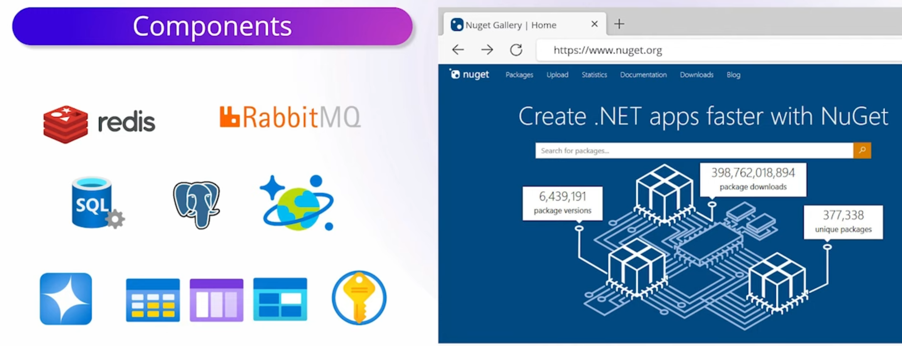

# .NET Aspire Components: Empowering Cloud-Native Applications

[!INCLUDE [download-alert](../includes/download-alert.md)]

**Figure 3-5**. Examples of .NET Aspire components.

.NET Aspire components are curated **NuGet packages** that handle specific cloud-native concerns. These components connect seamlessly with your app, ensuring consistent integration with services such as Redis, PostgreSQL, and more.

Popular .NET Aspire components include:

- **Apache Kafka**: The `Aspire.Confluent.Kafka` package allows you to produce and consume messages from an Apache Kafka broker.
- **Azure AI OpenAI**: Use the `Aspire.Azure.AI.OpenAI` library to call generative AI functionality.
- **Azure Search Documents**: The `Aspire.Azure.Search.Documents` package provides access to Azure AI Search.
- **Azure Blob Storage**: Store files in Azure Blob Storage using the `Aspire.Azure.Storage.Blobs` library.
- **Azure Storage Queues**: Azure Storage Queues are simple and efficient message queues for decoupled microservices. Use the `Aspire.Azure.Storage.Queues` library to send and receive messages.
- **Azure Table Storage**: Azure Tabe Storage provides simple NoSQL database tables. Access the Azure Table service to store and retrieve data with the `Aspire.Azure.Data.Tables` package.
- **Azure Cosmos DB Entity Framework Core**: Access Azure Cosmos DB databases with Entity Framework Core using `Aspire.Microsoft.EntityFrameworkCore.Cosmos`. There's a separate component if you prefer not to use Entity Framework.
- **Azure Event Hubs**: Event Hubs process large volumes of events quickly and reliably. The `Aspire.Azure.Messaging.EventHubs` package enables you to access to Azure Event Hubs easily from your .NET Aspire app.
- **Azure Key Vault**: Access Azure Key Vault to manage secrets using the `Aspire.Azure.Security.KeyVault` library.
- **Azure Service Bus**: Send messages to other microservices by calling Azure Service Bus through the `Aspire.Azure.Messaging.ServiceBus` package. Azure Service Bus provides a more versatile messaging solution than Azure Storage Queues.
- **MongoDB Driver**: Store and retrieve data from the popular NoSQL MongoDB databases using the `Aspire.MongoDB.Driver` package.
- **MySqlConnector**: Access MySql databases with the `Aspire.MySqlConnector` library.
- **NATS**: The `Aspire.NATS.Net` package provides access to NATS messaging servers.
- **Oracle Entity Framework Core**: Access Oracle databases with Entity Framework Core using `Aspire.Oracle.EntityFrameworkCore`.

> [!NOTE]
> This isn't a full list and new components will be created by both Microsoft and third parties.

These components simplify connections to popular services and platforms, handle cloud-native concerns, and ensure standardized configuration patterns. Remember to use the latest versions of .NET Aspire components to benefit from the latest features and security updates.

>[!div class="step-by-step"]
>[Previous](service-discovery.md)
>[Next](observability-and-dashboard.md)
