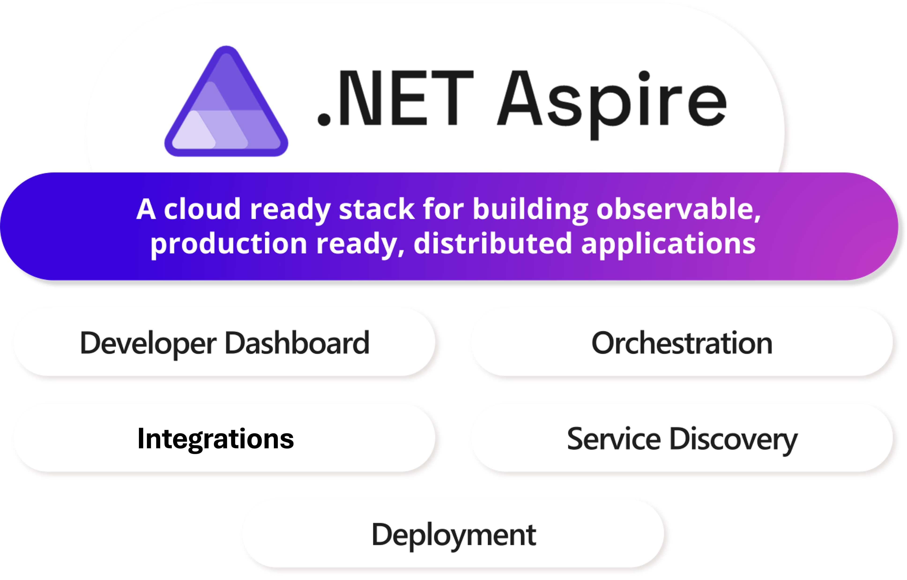

# .NET Aspire overview

[!INCLUDE [download-alert](../includes/download-alert.md)]

**Figure 3-1**. A summary of .NET Aspire.

.NET Aspire is a cloud-ready stack designed to accelerate development of cloud-native applications using .NET. Here's an overview:

- **Cloud-ready stack**: It's an opinionated framework that provides a set of tools and libraries for building distributed applications that are ready for deployment in the cloud. It is designed to take full advantage of cloud features such as scalability, resilience, and manageability.

- **Scalable**: .NET Aspire can be utilized by all sizes of project. .NET Aspire can be deployed in standalone mode to provide the .NET Aspire dashboard without any other .NET Aspire functionality or the need for Internet connectivity. Furthermore, .NET Aspire can scale up to a multi-cloud distributed microservices architecture.
  
- **Observable and production-ready**: .NET Aspire focuses on creating applications that are easy to monitor and ready for production environments, ensuring high reliability and performance.

- **Microservices architecture**: It encourages the use of microservices, which are small, loosely coupled services that work together to form a complete application. This approach allows for easier scaling and maintenance.

- **NuGet package delivery**: The framework is delivered as a set of NuGet packages, each addressing different aspects of cloud-native application development.

- **Distributed application support**: .NET Aspire is ideal for applications that spread their computational workload across multiple nodes, ensuring efficient communication over network boundaries.

- **Enhanced developer experience**: With .NET Aspire, developers get an improved experience with a consistent set of patterns and tools that simplify the process of building and running distributed apps.

- **Orchestration and components**: It provides features for orchestrating multi-project applications and their dependencies, along with standardized components for common services like databases and caching.

- **Integrated tooling**: .NET Aspire comes with integrated tooling for popular development environments like Visual Studio and Visual Studio Code, as well as the .NET CLI, making it easier to create and manage applications.

**Figure 3-2**. Cloud-native features provided by .NET Aspire.

In summary, .NET Aspire is all about providing a robust, opinionated framework that helps developers build cloud-native, distributed applications more efficiently and effectively.

For more information, see [.NET Aspire overview](https://learn.microsoft.com/dotnet/aspire/get-started/aspire-overview)

>[!div class="step-by-step"]
>[Previous](..TODO..)
>[Next](orchestration.md)
