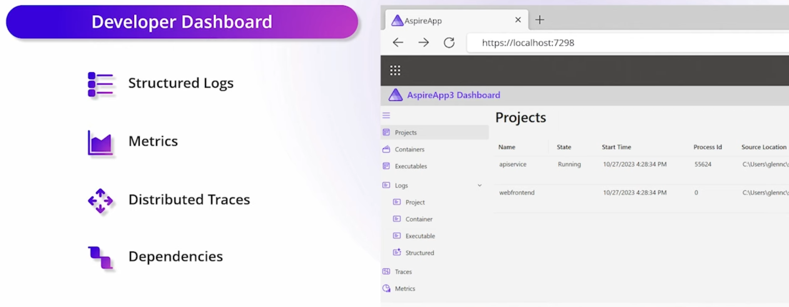

# Observability & Dashboard 

[!INCLUDE [download-alert](../includes/download-alert.md)]



**Figure 3-6**. The .NET Aspire Dashboard and its features.

The **.NET Aspire Dashboard** is a stand alone tool developers can use with their .NET Aspire projects. Here's what you need to know:

1. **Purpose and Features**:

   - The dashboard provides a sophisticated interface for comprehensive app monitoring and inspection.
   - It allows you to track various aspects of your app in real-time, including logs, traces, and environment configurations.
   - Purpose-built to enhance the local development experience, it offers an insightful overview of your app's state and structure.

1. **Integration with .NET Aspire Projects**:

   - The dashboard is seamlessly integrated into the .NET Aspire AppHost.
   - During development, it automatically launches when you start your project.
   - It displays the app's resources and telemetry, helping you understand your app's behavior and performance.

1. **Standalone Mode**:

   - The .NET Aspire dashboard can also be used standalone, independent of the rest of .NET Aspire.
   - It ships as a Docker image, providing a great UI for viewing telemetry.
   - You can use it with any application by running the following Docker command:

     ```docker
     docker run --rm -it -p 18888:18888 -p 4317:18889 -d --name aspire-dashboard mcr.microsoft.com/dotnet/aspire-dashboard:8.0.0
     ```

1. **Configuration**:

   - The dashboard's configuration includes frontend and OTLP addresses, resource service endpoint, authentication, and telemetry limits.
   - Fine-tune it to suit your needs.

1. **Architecture**:

   - The frontend is built using Microsoft's Fluent UI Blazor component library.
   - Apps communicate with the dashboard using the OpenTelemetry Protocol (OTLP).
   - A resource server provides information about app resources (e.g., resource listing, console logs, command execution).
   - The dashboard communicates via gRPC to the resource server.

1. **Security**:

   - The dashboard offers powerful insights into your apps.
   - It displays sensitive data about resources, including configuration, console logs, and in-depth telemetry.

>[!div class="step-by-step"]
>[Previous](components.md)
>[Next](..TODO..)
