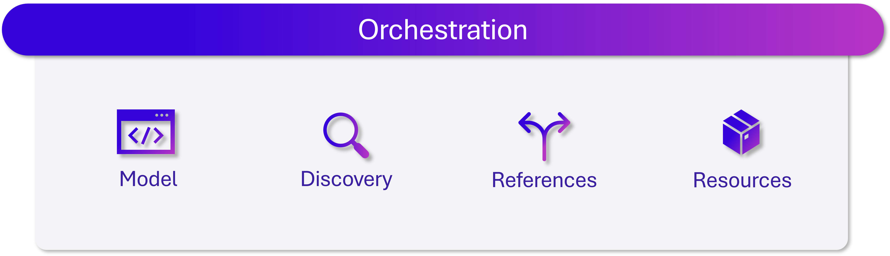

# .NET Aspire Orchestration

[!INCLUDE [download-alert](../includes/download-alert.md)]

### What Is Orchestration?



**Figure 3-3**. The four key aspects of .NET Aspire orchestration.

In a cloud-native environment, orchestrating microservices and other components within a distributed application can be complex. **Orchestration** refers to managing the configuration and interconnections of these components. While .NET Aspire's orchestration is not intended to replace robust production systems like Kubernetes, it significantly enhances local development.

## Key Aspects of .NET Aspire Orchestration

1. **App Model Definition**:
   - Every .NET Aspire app has an app model that outlines the resources in your app and their relationships.
   - Resources include the projects, executables, containers, external services, and cloud resources your app depends on.

1. **App Host Project**:
   - Every .NET Aspire app has a designated **App Host Project**. 
   - The app host project orchestrates all projects within the .NET Aspire application.
   - It runs and manages the entire app model.
   - By convention, the app host project is named with the `*.AppHost` suffix.

1. **Resource Composition**:
   - In the App Host Project, you specify the resources that make up your application.
   - Resources can be .NET projects, containers, executables, databases, caches, or cloud services.
   - For example, in an app with two projects and a Redis cache, this code defines those resources and connects them:

     ```csharp
     var builder = DistributedApplication.CreateBuilder(args);
     
     var cache = builder.AddRedis("cache");
     
     var apiservice = builder.AddProject<Projects.AspireApp_ApiService>("apiservice");
     
     builder.AddProject<Projects.AspireApp_Web>("webfrontend")
         .WithReference(cache)
         .WithReference(apiservice)
         .WithExternalHttpEndpoints();
         
     builder.Build().Run();
     ```

1. **Service Discovery and Connection String Management**:
   - The App Host Porjedct injects connection strings and service discovery information.
   - Abstractions simplify setup, by eliminating low-level implementation details.
   - For more information, see the topic **Service discovery**.

>[!div class="step-by-step"]
>[Previous](dot-net-aspire-overview.md)
>[Next](servicediscovery.md)
