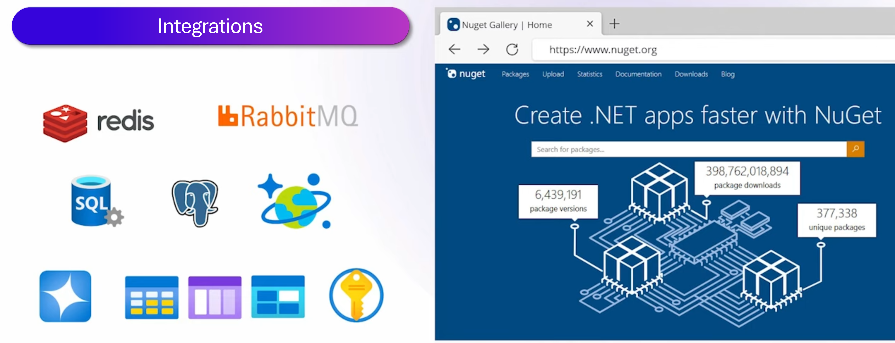

# .NET Aspire integrations: Empowering cloud-native applications

[!INCLUDE [download-alert](../includes/download-alert.md)]

**Figure 3-5**. Examples of .NET Aspire integrations.

.NET Aspire integrations are curated **NuGet packages** that handle specific cloud-native concerns. These integrations connect seamlessly with your app, ensuring consistent integration with services such as Redis, PostgreSQL, and more.

Your choice of integration depends on the problem you want to solve. For example, when you want to use a database to persist information, you can choose from:

- **Azure Cosmos DB Entity Framework Core**: Access Azure Cosmos DB databases with Entity Framework Core using `Aspire.Microsoft.EntityFrameworkCore.Cosmos`. There's a separate integration if you prefer not to use Entity Framework.
- **MongoDB Driver**: Store and retrieve data from the popular NoSQL MongoDB databases using the `Aspire.MongoDB.Driver` package.
- **MySqlConnector**: Access MySql databases with the `Aspire.MySqlConnector` library.
- **Oracle Entity Framework Core**: Access Oracle databases with Entity Framework Core using `Aspire.Oracle.EntityFrameworkCore`.
- **Azure Table Storage**: Azure Tabe Storage provides simple NoSQL database tables. Access the Azure Table service to store and retrieve data with the `Aspire.Azure.Data.Tables` package.

If you want to send messages between you decoupled microservices, you can choose from:

- **Apache Kafka**: The `Aspire.Confluent.Kafka` package allows you to produce and consume messages from an Apache Kafka broker.
- **Azure Storage Queues**: Azure Storage Queues are simple and efficient message queues for decoupled microservices. Use the `Aspire.Azure.Storage.Queues` library to send and receive messages.
- **Azure Service Bus**: Send messages to other microservices by calling Azure Service Bus through the `Aspire.Azure.Messaging.ServiceBus` package. Azure Service Bus provides a more versatile messaging solution than Azure Storage Queues.
- **NATS**: The `Aspire.NATS.Net` package provides access to NATS messaging servers.

Other popular .NET Aspire integrations include:

- **Azure AI OpenAI**: Use the `Aspire.Azure.AI.OpenAI` library to call generative AI functionality.
- **Azure Search Documents**: The `Aspire.Azure.Search.Documents` package provides access to Azure AI Search.
- **Azure Blob Storage**: Store files in Azure Blob Storage using the `Aspire.Azure.Storage.Blobs` library.
- **Azure Event Hubs**: Event Hubs process large volumes of events quickly and reliably. The `Aspire.Azure.Messaging.EventHubs` package enables you to access to Azure Event Hubs easily from your .NET Aspire app.
- **Azure Key Vault**: Access Azure Key Vault to manage secrets using the `Aspire.Azure.Security.KeyVault` library.

> [!NOTE]
> This isn't a full list and new integrations will be created by both Microsoft and third parties.

These integrations simplify connections to popular services and platforms, handle cloud-native concerns, and ensure standardized configuration patterns. Remember to use the latest versions of .NET Aspire integrations to benefit from the latest features and security updates.

>[!div class="step-by-step"]
>[Previous](service-discovery.md)
>[Next](observability-and-dashboard.md)
