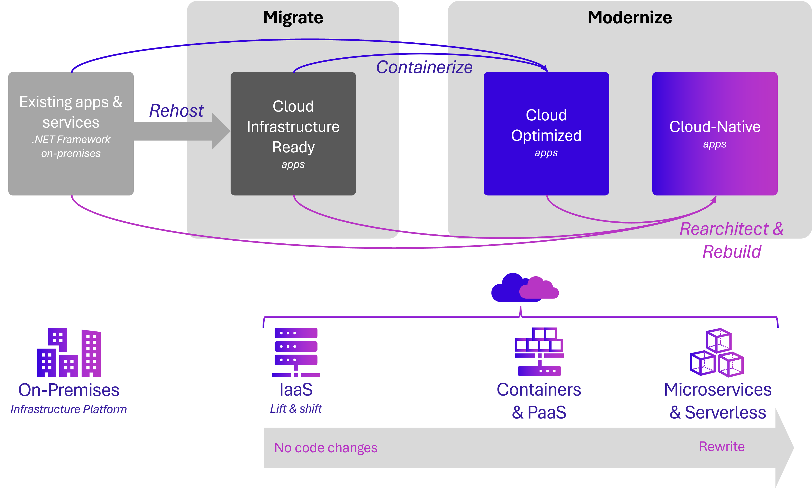

# Candidate apps for cloud-native

[!INCLUDE [download-alert](../includes/download-alert.md)]

Think about the apps your organization needs to build. Then, look at the existing apps in your portfolio. How many of them warrant a cloud-native architecture?

Applying cost/benefit analysis, there's a good chance some wouldn't support the effort. The cost of becoming cloud-native would far exceed the business value of the application.

What type of application might be a good candidate for cloud-native?

- Strategic enterprise systems that need to evolve business features constantly
- An application that requires a high release velocity, with high confidence
- A system where individual features must release *without* a full redeployment of the entire system
- An application developed by multiple teams with expertise in different technology stacks
- An application with components that must scale independently

Smaller, less impactful line-of-business applications might fare well with a simple monolithic architecture hosted in a cloud PaaS environment.

Then there are legacy systems. While we'd all like to build new applications, we're often responsible for modernizing legacy workloads that are critical to the business.

## Modernizing legacy apps

The free Microsoft e-book [Modernize existing .NET applications with Azure cloud and Windows Containers](https://dotnet.microsoft.com/download/thank-you/modernizing-existing-net-apps-ebook) provides guidance about migrating on-premises workloads into the cloud. Figure 1-10 shows that there isn't a single, one-size-fits-all strategy for modernizing legacy applications.

**Figure 1-10**. Strategies for migrating legacy workloads

Monolithic apps that are non-critical might benefit from a quick **lift-and-shift** migration. Here, the on-premises workload is moved to a cloud-based virtual machine (VM), without changes. This approach uses the [IaaS (Infrastructure as a Service) model](https://azure.microsoft.com/resources/cloud-computing-dictionary/what-is-iaas/). Azure includes several tools such as [Azure Migrate](https://azure.microsoft.com/services/azure-migrate/), [Azure Site Recovery](https://azure.microsoft.com/services/site-recovery/), and [Azure Database Migration Service](https://azure.microsoft.com/campaigns/database-migration/) to help streamline the move. While this strategy can yield some cost savings, such applications typically weren't designed to unlock and leverage the benefits of cloud computing.

Legacy apps that are critical to the business often benefit from an enhanced **Cloud Optimized** migration. This approach includes deployment optimizations that enable key cloud services, without changing the core architecture of the application. For example, you might [containerize](https://learn.microsoft.com/virtualization/windowscontainers/about/) the application and deploy it to a container orchestrator, like [Azure Kubernetes Services](https://azure.microsoft.com/services/kubernetes-service/), discussed later in this book. Once in the cloud, the application can consume cloud backing services such as databases, message queues, monitoring, and distributed caching.

Finally, monolithic apps that provide strategic enterprise functions might best benefit from a cloud-native approach. This approach provides agility and velocity but comes at a cost of replatforming, rearchitecting, and rewriting code. Over time, a legacy application could be decomposed into microservices, containerized, and ultimately _replatformed_ into a cloud-native architecture.

If you and your team believe a cloud-native approach is appropriate, you have to rationalize the decision with your organization. What exactly is the business problem that a cloud-native approach will solve? How would it align with business needs?

- Rapid releases of features with increased confidence?
- Fine-grained scalability and more efficient usage of resources?
- Improved system resiliency?
- Improved system performance?
- More visibility into operations?
- Blend development platforms and data stores to arrive at the best tool for the job?
- Future-proof application investment?

The right migration strategy depends on organizational priorities and the systems you're targeting. For many, it may be more cost effective to cloud-optimize a monolithic application or add coarse-grained services to an N-Tier app. In these cases, you can still make full use of cloud PaaS capabilities like the ones offered by Azure App Service.

## Summary

In this chapter, we introduced cloud-native computing. We provided a definition along with the key capabilities that drive a cloud-native application. We looked at the types of applications that might justify this investment and effort. We've also had a introduction to the new .NET Aspire stack, which can help ease cloud-native development for .NET 8 and later solutions.

With the introduction behind, we now dive into a much more detailed look at cloud native.

### References

- [Cloud Native Computing Foundation](https://www.cncf.io/)
- [.NET Microservices: Architecture for Containerized .NET applications](https://dotnet.microsoft.com/download/thank-you/microservices-architecture-ebook)
- [Microsoft Azure Well-Architected Framework](https://learn.microsoft.com/azure/well-architected/)
- [Modernize existing .NET applications with Azure cloud and Windows Containers](https://dotnet.microsoft.com/download/thank-you/modernizing-existing-net-apps-ebook)
- [Cloud Native Patterns by Cornelia Davis](https://www.manning.com/books/cloud-native-patterns)
- [Cloud native applications: Ship faster, reduce risk, and grow your business](https://tanzu.vmware.com/cloud-native)
- [Dapr documents](https://dapr.io/)
- [Beyond the Twelve-Factor Application](https://content.pivotal.io/blog/beyond-the-twelve-factor-app)
- [What is Infrastructure as Code](https://learn.microsoft.com/devops/deliver/what-is-infrastructure-as-code)
- [Uber Engineering's Micro Deploy: Deploying Daily with Confidence](https://www.uber.com/blog/micro-deploy-code/)
- [How Netflix Deploys Code](https://www.infoq.com/news/2013/06/netflix/)
- [Overload Control for Scaling WeChat Microservices](https://www.cs.columbia.edu/~ruigu/papers/socc18-final100.pdf)

>[!div class="step-by-step"]
>[Previous](what-is-cloud-native.md)
>[Next](../chpt2-introduction-containers-docker/what-are-containers.md)
