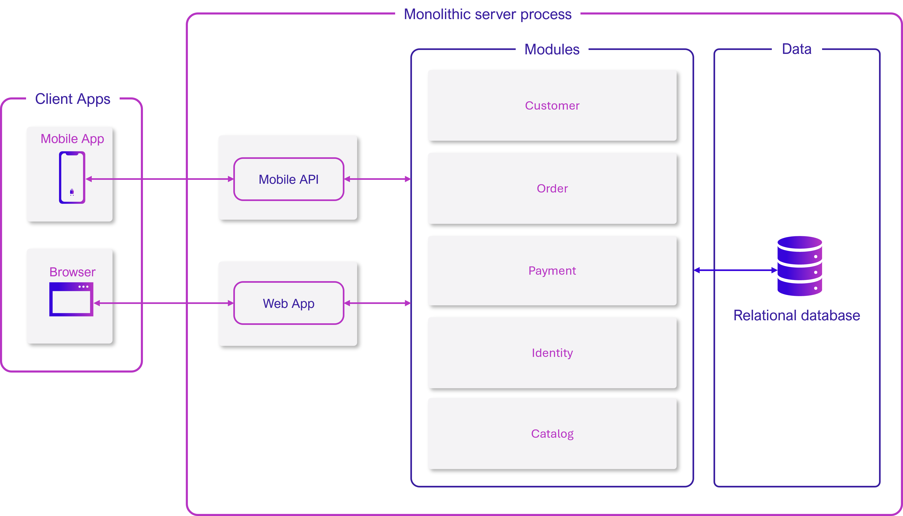
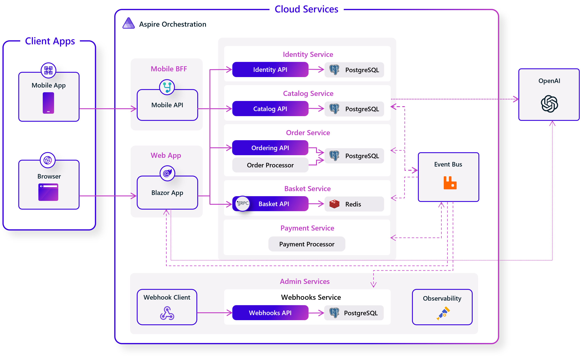

# Introduction to cloud-native applications

[!INCLUDE [download-alert](../includes/download-alert.md)]

Another day at the office, diligently working on "the next big thing."

Your cellphone rings. It's your recruiter, the one who regularly contacts you with enticing new opportunities.

However, this time it is different: a start-up with equity and substantial funding. The mention of cloud computing, microservices, and cutting-edge technology compels you to consider the offer seriously.

A few weeks later, you find yourself employed, participating in a design session, and architecting a major eCommerce application. You're going to compete with the leading eCommerce platforms.

How will you approach this challenge?

If you follow the guidance from past 15 years, you'll most likely build the system shown in Figure 1.1.

**Figure 1-1**. Traditional monolithic design

You construct a large core application containing all of your domain logic. It includes modules such as Identity, Catalog, Ordering, and more. They directly communicate with each other within a single server process. The modules share a large relational database. The core exposes functionality through an HTML  usere interface and a mobile app.

Congratulations! You've created a monolithic application.

This isn't a bad app. Monoliths offer some distinct advantages. For example, they're easy to:

- build
- test
- deploy
- troubleshoot
- scale vertically

Many successful apps that exist today were created as monoliths. Your app is a hit and continues to evolve, iteration after iteration, adding more functionality.

At some point, however, as the app continues to grow and develop you begin to feel uncomfortable. You find yourself losing control of the application. As time goes on, the feeling becomes more intense, and you eventually enter a state known as the `Fear Cycle`:

- The app has become so overwhelmingly complicated that no single person understands it.
- You fear making changes because each change has unintended and costly side effects.
- New features or fixes become tricky, time-consuming, and expensive to implement.
- Each release becomes as small as possible and requires a full deployment of the entire application.
- One unstable component can crash the entire system.
- New technologies and frameworks aren't an option.
- It's difficult to implement agile delivery methodologies.
- Architectural erosion sets in as the code base deteriorates with never-ending "quick fixes."
- Finally, the _consultants_ come in and tell you to rewrite it.

Does this scenario sound familiar?

Many organizations have addressed this monolithic fear cycle by adopting a cloud-native approach to building systems. Figure 1-2 shows the same system built applying cloud-native techniques and practices.

**Figure 1-2**. Cloud-native design

Note how the application is decomposed across a set of small isolated microservices. Each service is self-contained and encapsulates its own code, data, and dependencies. Each is deployed in a software container and managed by a container orchestrator. Instead of a large relational database, each service owns its own datastore, the type of which varies based upon the data needs. Note how some services depend on a relational database but others on NoSQL databases. One service stores its state in a distributed cache. Note how all traffic routes through an API Gateway service that's responsible for routing traffic to the core back-end services and enforcing many cross-cutting concerns. Most importantly, the application takes full advantage of the scalability, availability, and resiliency features found in modern cloud platforms.

### Cloud-native computing

We just used the term, _cloud native_. You might be wondering if that's a meaningful term, or just another industry buzzword concocted by software vendors to sell more product.

Actually, _cloud native_ is a clear and specific term that describes a flexible way to write large scale web applications that won't evolve into a fear cycle.

Within a short time, cloud native has become a driving trend in the software industry. It's a new way to construct large, complex systems. The approach takes full advantage of modern software development practices, technologies, and cloud infrastructure. Cloud native changes the way you design, implement, deploy, and operationalize systems.

Unlike much of the continuous hype that drives our industry, cloud native is a serious new approach to architecture. Consider the [Cloud Native Computing Foundation](https://www.cncf.io/) (CNCF), a consortium of over 400 major corporations. Its charter is to make cloud-native computing ubiquitous across technology and cloud stacks. As one of the most influential open-source groups, it hosts many of the fastest-growing open-source projects in GitHub. These projects include [Kubernetes](https://kubernetes.io/), [Prometheus](https://prometheus.io/), [Helm](https://helm.sh/), [Envoy](https://www.envoyproxy.io/), and [gRPC](https://grpc.io/).

The CNCF fosters an ecosystem of open-source code and vendor-neutrality. Following that lead, this book presents cloud-native principles, patterns, and best practices that are technology agnostic. At the same time, we discuss the services and infrastructure available in the Microsoft Azure cloud for constructing cloud-native systems and we show how Microsoft's new .NET Azure stack eases your build.

So, what exactly is cloud native? Let's explore this new world.

>[!div class="step-by-step"]
>[Previous](..TODO..)
>[Next](what-is-cloud-native.md)
