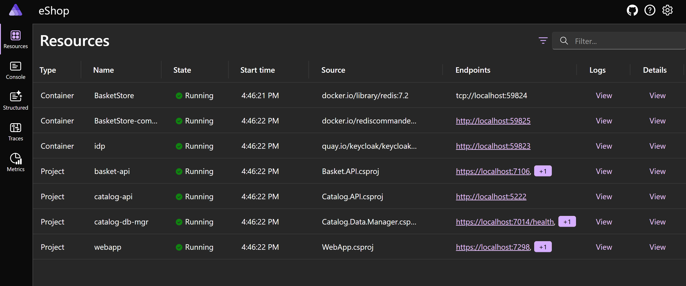

# .NET Aspire dashboard

[!INCLUDE [download-alert](../includes/download-alert.md)]

You can use the .NET Aspire dashboard as your development and test watchdog to monitor the various aspects of your .NET app. This includes detailed information about logs, traces, and environment configuration. All in real-time.

The dashboard is available after you add .NET Aspire to your solution. The dashboard launches automatically alongside your other services when you start your solution. On initial launch, it shows the .NET Aspire app's resources:



**Figure 10-9**. The .NET Aspire dashboard.

There are five main sections in the dashboard:

- **Resources**: Shows the projects in your solution, their state, endpoints, logs, and more
- **Console**: Shows you any console output from each of the projects or containers
- **Structured**: Uses OpenTelemetry to show semantic logs listed by log event
- **Traces**: Show distributed traces between your projects different components
- **Metrics**: Allows you to drill down into any services metrics

## Standalone mode

You can also launch the dashboard in standalone mode, to use it with any .NET app that you've added OpenTelemetry instrumentation too. That's because it's made available as a Docker image.

The standalone dashboard is meant to be used during development or as a short-term diagnostic tool. The reason is that the dashboard persists telemetry in-memory, so data isn't persisted between restarts.

Data shown in the dashboard can potentially be sensitive. For instance, configuration can include secrets in environment variables,  telemetry can show sensitive runtime information, and more.

To block untrusted services or apps from sending unauthorized or malicious telemetry to your dashboard, your OpenTelemetry endpoint is automatically secured when you use the dashboard as part of the .NET Aspire stack. However, when using standalone mode, you'll need to configure this yourself by running the following command:

```bash
docker run --rm -it -p 18888:18888 -p 4317:18889 -d --name aspire-dashboard \
    -e DASHBOARD__OTLP__AUTHMODE='ApiKey' \
    -e DASHBOARD__OTLP__PRIMARYAPIKEY='{Your_APIKEY}' \
    mcr.microsoft.com/dotnet/aspire-dashboard:8.0
```

You'll need to replace `{Your_APIKEY}` with your real API key. The dashboard will use this key to validate any telemetry it receives. For this reason, your app must have also been configured to send telemetry using this key.

>[!div class="step-by-step"]
>[Previous](health-checks-probes.md)
>[Next](observability-platforms.md)