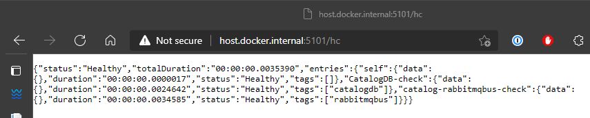
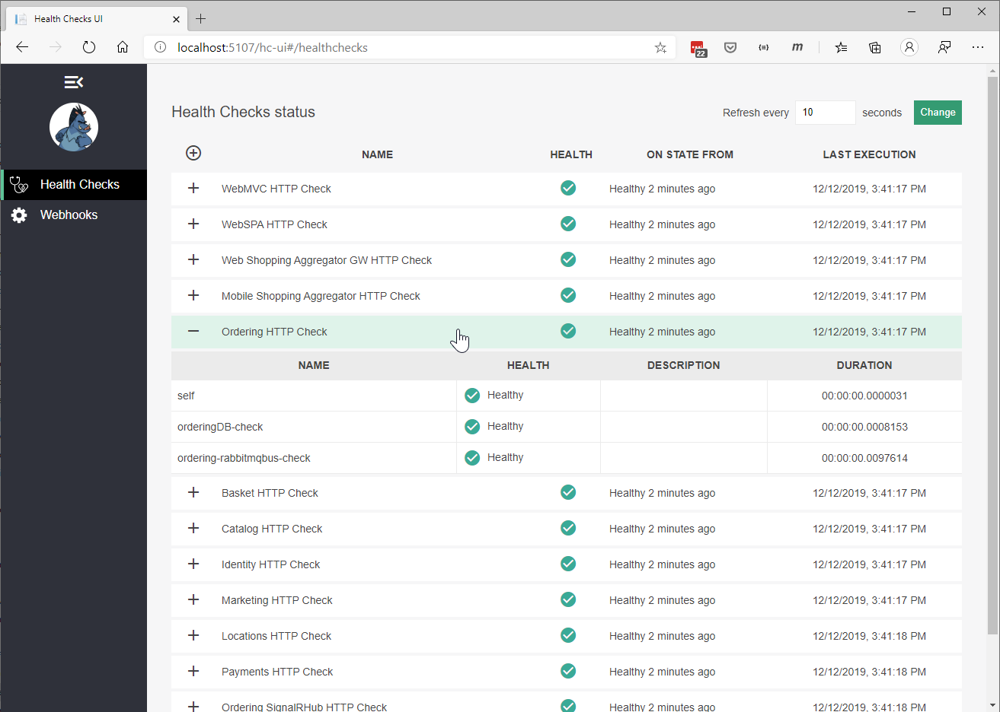
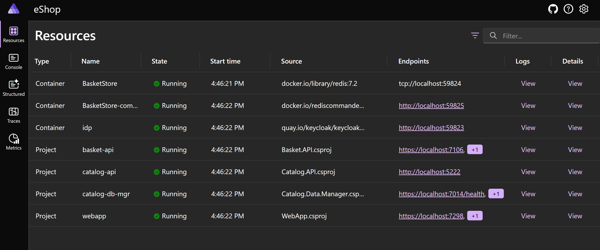

# Health checks and probes

[!INCLUDE [download-alert](../includes/download-alert.md)]

Health monitoring can allow near-real-time information about the state of your containers and microservices. Health monitoring is critical to multiple aspects of operating microservices and is especially important when orchestrators perform partial application upgrades in phases, as explained later.

Microservices-based applications often use heartbeats or health checks to enable their performance monitors, schedulers, and orchestrators to keep track of the multitude of services. If services cannot send some sort of "I'm alive" signal, either on demand or on a schedule, your application might face risks when you deploy updates, or it might just detect failures too late and not be able to stop cascading failures that can end up in major outages.


## Implement health checks in ASP.NET Core services

When developing an ASP.NET Core microservice or web application, you can use the built-in health checks feature in ASP .NET Core ([Microsoft.Extensions.Diagnostics.HealthChecks](https://www.nuget.org/packages/Microsoft.Extensions.Diagnostics.HealthChecks)). Like many ASP.NET Core features, health checks come with a set of services and a middleware.

Health check services and middleware are easy to use and provide capabilities that let you validate if any external resource needed for your application (like a SQL Server database or a remote API) is working properly. When you use this feature, you can also decide what it means that the resource is healthy, as we explain later.

To use this feature effectively, you need to first configure services in your microservices. Second, you need a front-end application that queries for the health reports. That front-end application could be a custom reporting application, or it could be an orchestrator itself that can react accordingly to the health states.

### Use the HealthChecks feature in your back-end ASP.NET microservices

In this section, you'll learn how to implement the HealthChecks feature in a sample ASP.NET Core Web API application when using the [Microsoft.Extensions.Diagnostics.HealthChecks](https://www.nuget.org/packages/Microsoft.Extensions.Diagnostics.HealthChecks) package.

To begin, you need to define what constitutes a healthy status for each microservice. In the sample application, we define the microservice is healthy if its API is accessible via HTTP and its related SQL Server database is also available.

In .NET 8, with the built-in APIs, you can configure the services, add a Health Check for the microservice and its dependent SQL Server database in this way:

```csharp
// Program.cs from .NET 8 Web API sample

//...
// Registers required services for health checks
builder.Services.AddHealthChecks()
    // Add a health check for a SQL Server database
    .AddCheck(
        "OrderingDB-check",
        new SqlConnectionHealthCheck(builder.Configuration["ConnectionString"]),
        HealthStatus.Unhealthy,
        new string[] { "orderingdb" });
```

In the previous code, the `services.AddHealthChecks()` method configures a basic HTTP check that returns a status code **200** with "Healthy".  Further, the `AddCheck()` extension method configures a custom `SqlConnectionHealthCheck` that checks the related SQL Database's health.

The `AddCheck()` method adds a new health check with a specified name and the implementation of type `IHealthCheck`. You can add multiple Health Checks using AddCheck method, so a microservice won't provide a "healthy" status until all its checks are healthy.

`SqlConnectionHealthCheck` is a custom class that implements `IHealthCheck`, which takes a connection string as a constructor parameter and executes a simple query to check if the connection to the SQL database is successful. It returns `HealthCheckResult.Healthy()` if the query was executed successfully and a `FailureStatus` with the actual exception when it fails.

```csharp
// Sample SQL Connection Health Check
public class SqlConnectionHealthCheck : IHealthCheck
{
    private const string DefaultTestQuery = "Select 1";

    public string ConnectionString { get; }

    public string TestQuery { get; }

    public SqlConnectionHealthCheck(string connectionString)
        : this(connectionString, testQuery: DefaultTestQuery)
    {
    }

    public SqlConnectionHealthCheck(string connectionString, string testQuery)
    {
        ConnectionString = connectionString ?? throw new ArgumentNullException(nameof(connectionString));
        TestQuery = testQuery;
    }

    public async Task<HealthCheckResult> CheckHealthAsync(HealthCheckContext context, CancellationToken cancellationToken = default(CancellationToken))
    {
        using (var connection = new SqlConnection(ConnectionString))
        {
            try
            {
                await connection.OpenAsync(cancellationToken);

                if (TestQuery != null)
                {
                    var command = connection.CreateCommand();
                    command.CommandText = TestQuery;

                    await command.ExecuteNonQueryAsync(cancellationToken);
                }
            }
            catch (DbException ex)
            {
                return new HealthCheckResult(status: context.Registration.FailureStatus, exception: ex);
            }
        }

        return HealthCheckResult.Healthy();
    }
}
```

Note that in the previous code, `Select 1` is the query used to check the Health of the database. To monitor the availability of your microservices, orchestrators like Kubernetes periodically perform health checks by sending requests to test the microservices. It's important to keep your database queries efficient so that these operations are quick and don’t result in a higher utilization of resources.

Finally, add a middleware that responds to the url path `/hc`:

```csharp
// Program.cs from .NET 8 Web Api sample

app.MapHealthChecks("/hc");
```

When the endpoint `<yourmicroservice>/hc` is invoked, it runs all the health checks that are configured in the `AddHealthChecks()` method in the Startup class and shows the result.

### Query your microservices to report about their health status

When you've configured health checks as described in this article and you have the microservice running in Docker, you can directly check from a browser if it's healthy. You have to publish the container port in the Docker host, so you can access the container through the external Docker host IP or through `host.docker.internal`, as shown in figure 8-8.



**Figure 10-6**. Checking health status of a single service from a browser

In that test, you can see that the `Catalog.API` microservice (running on port 5101) is healthy, returning HTTP status 200 and status information in JSON. The service also checked the health of its SQL Server database dependency and RabbitMQ, so the health check reported itself as healthy.

### Open source enhancement to .NET Core Health Checks

Instead of writing all your own health checks, you can use the [AspNetCore.Diagnostics.HealthChecks](https://github.com/Xabaril/AspNetCore.Diagnostics.HealthChecks]) open source library, which provides a set of pre-built health checks for common services like endpoint state, SQL Server, Redis, RabbitMQ, and more.

## Use watchdogs

A watchdog is a separate service that can watch health and load across services, and report health about the microservices by querying with the `HealthChecks` library introduced earlier. This can help prevent errors that would not be detected based on the view of a single service. Watchdogs also are a good place to host code that can perform remediation actions for known conditions without user interaction.

Fortunately, you have many options to add such a service. For example if you have built your own health checks using [AspNetCore.Diagnostics.HealthChecks](https://github.com/Xabaril/AspNetCore.Diagnostics.HealthChecks]) there is also the [AspNetCore.HealthChecks.UI](https://www.nuget.org/packages/AspNetCore.HealthChecks.UI/) NuGet package that can be used to display the health check results from the configured URIs.



**Figure 10-7**. Sample health check report

With the introduction of .NET Aspire, you now get a built in dashboard that has many of the same features as the open source package. You'll see more about the dashboard in the next section.



**Figure 10-8**. The .NET Aspire dashboard

In summary, a watchdog service queries each microservice's  endpoint. This will execute all the health checks defined within it and return an overall health state depending on all those checks. The `HealthChecksUI` is easy to consume with a few configuration entries and two lines of code that needs to be added into the *Startup.cs* of the watchdog service.

## Health checks when using orchestrators

To monitor the availability of your microservices, orchestrators like Kubernetes and Service Fabric periodically perform health checks by sending requests to test the microservices. When an orchestrator determines that a service/container is unhealthy, it stops routing requests to that instance. It also usually creates a new instance of that container.

For instance, most orchestrators can use health checks to manage zero-downtime deployments. Only when the status of a service/container changes to healthy will the orchestrator start routing traffic to service/container instances.

Another aspect of service health is reporting metrics from the service. This is an advanced capability of the health model of some orchestrators, like Service Fabric. Metrics are important when using an orchestrator because they are used to balance resource usage. Metrics also can be an indicator of system health. For example, you might have an application that has many microservices, and each instance reports a requests-per-second (RPS) metric. If one service is using more resources (memory, processor, etc.) than another service, the orchestrator could move service instances around in the cluster to try to maintain even resource utilization.

Note that Azure Service Fabric provides its own [Health Monitoring model](/azure/service-fabric/service-fabric-health-introduction), which is more advanced than simple health checks.

## Advanced monitoring: visualization, analysis, and alerts

The final part of monitoring is visualizing the event stream, reporting on service performance, and alerting when an issue is detected. You can use different solutions for this aspect of monitoring.

You can use simple custom applications showing the state of your services, like the custom page shown when explaining the [AspNetCore.Diagnostics.HealthChecks](https://github.com/Xabaril/AspNetCore.Diagnostics.HealthChecks). Or you could use more advanced tools like [Azure Monitor](https://azure.microsoft.com/services/monitor/) to raise alerts based on the stream of events.

Finally, if you're storing all the event streams, you can use Microsoft Power BI or other solutions like Kibana or Splunk to visualize the data.

>[!div class="step-by-step"]
>[Previous](open-telemetry-grafana-prometheus.md)
>[Next](aspire-dashboard.md)
