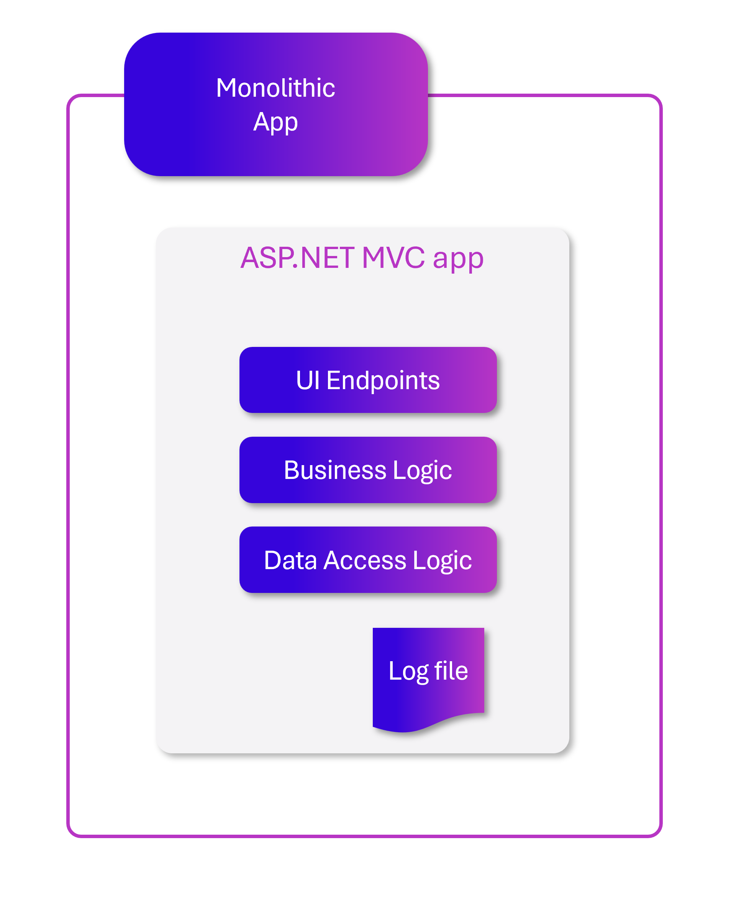
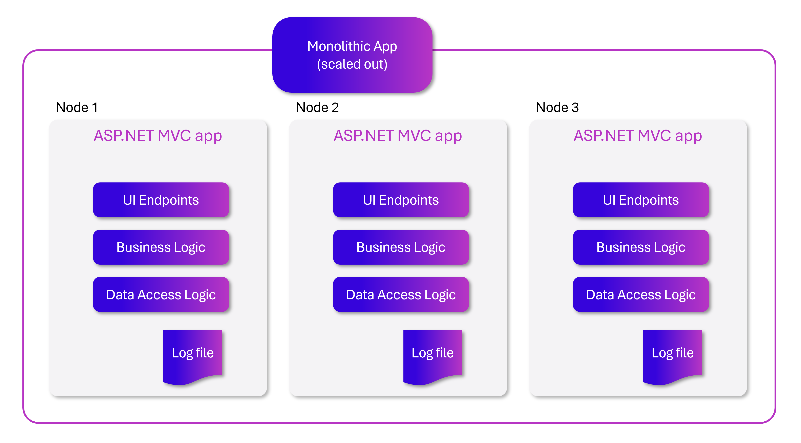
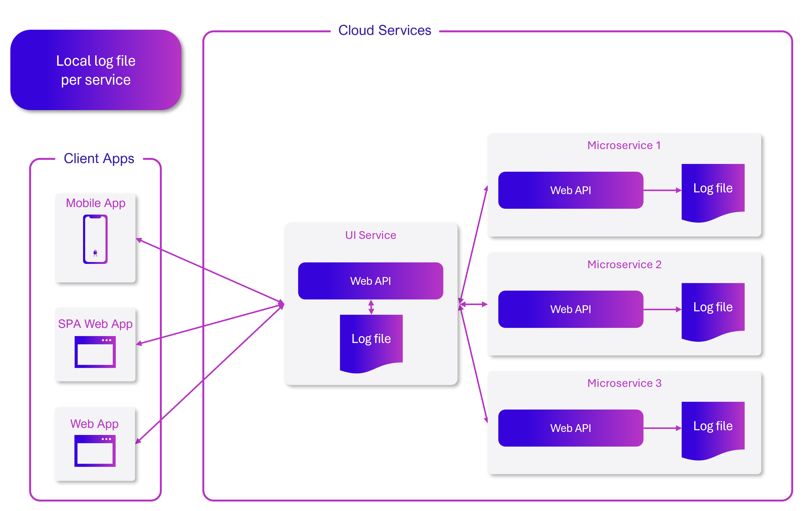
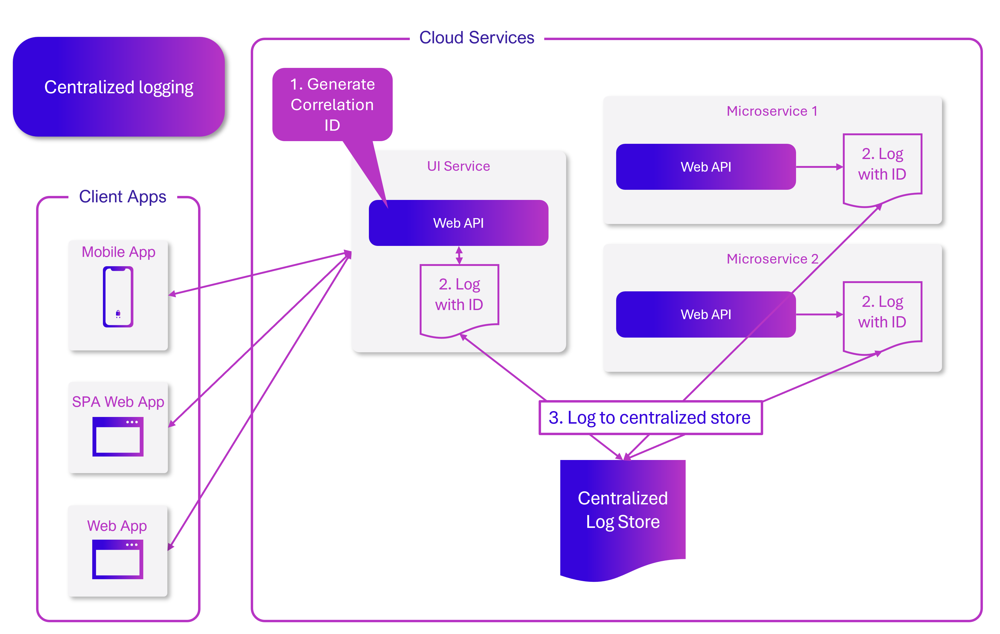

# Observability patterns

[!INCLUDE [download-alert](../includes/download-alert.md)]

!TODO sorry didn't get to these images.  Need to create them.

Just as patterns have been developed to aid in the layout of code in applications, there are patterns for operating applications in a reliable way. Three useful patterns in maintaining applications have emerged: **logging**, **monitoring**, and **alerts**.

## When to use logging
When users report problems with an application, it's useful to be able to see what was going on with the app when the problem occurred. One of the most tried and true ways of capturing information about what an application is doing while it's running is to have the application write down what it's doing. This process is known as logging. Anytime failures or problems occur in production, the goal should be to reproduce the conditions under which the failures occurred, in a non-production environment. Having good logging in place provides a roadmap for developers to follow in order to duplicate problems in an environment that can be tested and experimented with.

### Challenges when logging with cloud-native applications

In traditional applications, log files are typically stored on the local machine. In fact, on Unix-like operating systems, there's a folder structure defined to hold any logs, typically under `/var/log`.

**Figure 10-1**. Logging to a file in a monolithic app.

The usefulness of logging to a flat file on a single machine is vastly reduced in a cloud environment. Applications producing logs may not have access to the local disk or the local disk may be highly transient as containers are shuffled around physical machines. Even simple scaling up of monolithic applications across multiple nodes can make it challenging to locate the appropriate file-based log file.

**Figure 10-2**. Logging to files in a scaled monolithic app.

Cloud-native applications developed using a microservices architecture also pose some challenges for file-based loggers. User requests may now span multiple services that are run on different machines and may include serverless functions with no access to a local file system at all. It would be very challenging to correlate the logs from a user or a session across these many services and machines.

**Figure 10-3**. Logging to local files in a microservices app.

Finally, the number of users in some cloud-native applications is high. Imagine that each user generates a hundred lines of log messages when they log into an application. In isolation, that is manageable, but multiply that over 100,000 users and the volume of logs becomes large enough that specialized tools are needed to support effective use of the logs.

### Logging in cloud-native applications

Every programming language has tooling that permits writing logs, and typically the overhead for writing these logs is low. Many of the logging libraries provide logging different kinds of criticalities, which can be tuned at run time. For instance, the [Serilog library](https://serilog.net/) is a popular structured logging library for .NET that provides the following logging levels:

* Verbose
* Debug
* Information
* Warning
* Error
* Fatal

These different log levels provide granularity in logging. When the application is functioning properly in production, it may be configured to only log important messages. When the application is misbehaving, then the log level can be increased so more verbose logs are gathered. This balances performance against ease of debugging.

Because of the challenges associated with using file-based logs in cloud-native apps, centralized logs are preferred. Logs are collected by the applications and shipped to a central logging application which indexes and stores the logs. This class of system can ingest tens of gigabytes of logs every day.

It's also helpful to follow some standard practices when building logging that spans many services. For instance, generating a [correlation ID](https://blog.rapid7.com/2016/12/23/the-value-of-correlation-ids/) at the start of a lengthy interaction, and then logging it in each message that is related to that interaction, makes it easier to search for all related messages. Standardization makes reading logs much easier. Figure 7-4 demonstrates how a microservices architecture can leverage centralized logging as part of its workflow.

**Figure 10-4**. Logs from various sources are ingested into a centralized log store.

## Challenges with detecting and responding to potential app health issues

Some applications aren't mission critical. Maybe they're only used internally, and when a problem occurs, the user can contact the team responsible and the application can be restarted. However, customers often have higher expectations for the applications they consume. You should know when problems occur with your application *before* users do, or before users notify you. Otherwise, the first you know about a problem may be when you notice an angry deluge of social media posts deriding your application or even your organization.

Some scenarios you may need to consider include:

- One service in your application keeps failing and restarting, resulting in intermittent slow responses.
- At some times of the day, your application's response time is slow.
- After a recent deployment, load on the database has tripled.

Implemented properly, monitoring can let you know about conditions that will lead to problems, letting you address underlying conditions before they result in any significant user impact.

### Monitoring cloud-native apps

Some centralized logging systems take on an additional role of collecting telemetry outside of pure logs. They can collect metrics, such as time to run a database query, average response time from a web server, and even CPU load averages and memory pressure as reported by the operating system. In conjunction with the logs, these systems can provide a holistic view of the health of nodes in the system and the application as a whole.

The metric-gathering capabilities of the monitoring tools can also be fed manually from within the application. Business flows that are of particular interest such as new users signing up or orders being placed, may be instrumented such that they increment a counter in the central monitoring system. This aspect unlocks the monitoring tools to not only monitor the health of the application but the health of the business.

Cloud-native monitoring tools provide real-time telemetry and insight into apps regardless of whether they're single-process monolithic applications or distributed microservice architectures. They include tools that allow collection of data from the app as well as tools for querying and displaying information about the app's health.

## Challenges with reacting to critical problems in cloud-native apps

If you need to react to problems with your application, you need some way to alert the right personnel. This is the third cloud-native application observability pattern and depends on logging and monitoring. Your application needs to have logging in place to allow problems to be diagnosed, and in some cases to feed into monitoring tools. It needs monitoring to aggregate application metrics and health data in one place. Once this has been established, rules can be created that will trigger alerts when certain metrics fall outside of acceptable levels.

Generally, alerts are layered on top of monitoring such that certain conditions trigger appropriate alerts to notify team members of urgent problems. Some scenarios that may require alerts include:

- One of your application's services is not responding after 1 minute of downtime.
- Your application is returning unsuccessful HTTP responses to more than 1% of requests.
- Your application's average response time for key endpoints exceeds 2000 ms.

### Alerts in cloud-native apps

You can craft queries against the monitoring tools to look for known failure conditions. For instance, queries could search through the incoming logs for indications of HTTP status code 500, which indicates a problem on a web server. As soon as one of these is detected, then an e-mail or an SMS could be sent to the owner of the originating service who can begin to investigate. Typically, though, a single 500 error isn't enough to determine that a problem has occurred.

One of the most damaging patterns in alerting is to fire too many alerts for humans to investigate. Service owners will rapidly become desensitized to errors that they've previously investigated and found to be benign. Then, when true errors occur, they'll be lost in the noise of hundreds of false positives. 

>[!div class="step-by-step"]
>[Previous](..TODO..)
>[Next](open-telemetry-grafana-prometheus.md)
