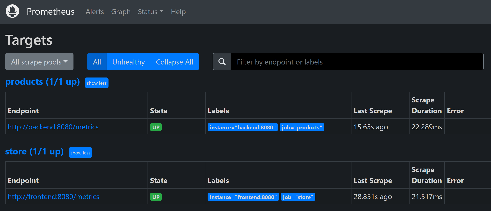

# Using OpenTelemetry in your .NET app

[!INCLUDE [download-alert](includes/download-alert.md)]

OpenTelemetry is an open-source observability framework. OpenTelemetry standardizes the way telemetry data is gathered and shared with back-end platforms. It provides a common format of instrumentation across all your microservices. You don't have to reinstrument code or install different proprietary agents every time a back-end platform changes.

OpenTelemetry helps you to monitor all three pillars of observability. This means logs, metrics, and traces.

## Add OpenTelemetry to your cloud-native app

Your add OpenTelemetry to your cloud-native app through NuGet packages. For example, the [OpenTelemetry package](https://github.com/open-telemetry/opentelemetry-dotnet/blob/main/src/OpenTelemetry/README.md) via the Core API. This is the main library that provides the core OpenTelemetry capabilities. Other packages include the following:

- [OpenTelemetry.Extensions.Hosting](https://github.com/open-telemetry/opentelemetry-dotnet/blob/main/src/OpenTelemetry.Extensions.Hosting/README.md) - Extension methods for automatically starting and stopping OpenTelemetry tracing in ASP.NET Core hosts.
- [OpenTelemetry.Instrumentation.AspNetCore](https://github.com/open-telemetry/opentelemetry-dotnet/blob/main/src/OpenTelemetry.Instrumentation.AspNetCore/README.md) - Can collect many metrics about your cloud-native app, and you won't have to write any code.
- [OpenTelemetry.Exporter.Console](https://github.com/open-telemetry/opentelemetry-dotnet/tree/main/src/OpenTelemetry.Exporter.Console/README.md) - Enables your cloud-native app to write telemetry details to the console.

There are many other [packages](/dotnet/core/diagnostics/observability-with-otel) available, you can use any of them depending on your cloud-native app's needs.

Suppose you have a cloud-native eShop store .NET Core app. In this case, you'd add a new diagnostics project for OpenTelemetry in your app, so that any microservice in your app can access it.

```csharp
using OpenTelemetry.Metrics;
using OpenTelemetry.Resources;
using OpenTelemetry.Trace;

namespace Microsoft.Extensions.DependencyInjection;

public static class DiagnosticServiceCollectionExtensions
{
  public static IServiceCollection AddObservability(this IServiceCollection services,
      string serviceName,
      IConfiguration configuration)
  {
    // create the resource that references the service name passed in
    var resource = ResourceBuilder.CreateDefault().AddService(serviceName: serviceName, serviceVersion: "1.0");

    // add the OpenTelemetry services
    var otelBuilder = services.AddOpenTelemetry();

    otelBuilder
        // add the metrics providers
        .WithMetrics(metrics =>
        {
          metrics
            .SetResourceBuilder(resource)
            .AddRuntimeInstrumentation()
            .AddAspNetCoreInstrumentation()
            .AddHttpClientInstrumentation()
            .AddEventCountersInstrumentation(c =>
            {
              c.AddEventSources(
                      "Microsoft.AspNetCore.Hosting",
                      "Microsoft-AspNetCore-Server-Kestrel",
                      "System.Net.Http",
                      "System.Net.Sockets");
            })
            .AddMeter("Microsoft.AspNetCore.Hosting", "Microsoft.AspNetCore.Server.Kestrel")
            .AddConsoleExporter();

        })
        // add the tracing providers
        .WithTracing(tracing =>
        {
          tracing.SetResourceBuilder(resource)
                      .AddAspNetCoreInstrumentation()
                      .AddHttpClientInstrumentation()
                      .AddSqlClientInstrumentation();
        });

    return services;
  }

  // Add the Prometheus endpoints to your service, this will expose the metrics at http://service/metrics
  public static void MapObservability(this IEndpointRouteBuilder routes)
  {
    routes.MapPrometheusScrapingEndpoint();
  }
}
```

The code does the following:
1. Create a variable `var otelBuilder = services.AddOpenTelemetry()` to store the OpenTelemetry builder. OpenTelemetry metrics and traces are then added to otelBuilder.
1. The `.AddConsoleExporter()` line ensures the metrics are displayed in the console. Tracing is added using `.WithTracing()`.

After adding your diagnostics project, you then need to add reference to it to the service. For example, if you have a Products service in your app, you'd add the fllowing in the corresponding `Product.csproj` file:

```xml
<ProjectReference Include="..\Diagnostics\Diagnostics.csproj" />
```

In your Program.cs file, under the declaration for `builder`, you then add:

```csharp
var builder = WebApplication.CreateBuilder(args);

builder.Services.AddObservability("Products", builder.Configuration);
```

# View telemetry

A common way to view the data collected through OpenTelemetry, in addition to Azure Monitor, is by using Prometheus and Grafana.



**Figure 10-5**. Prometheus UI

Prometheus is an open-source monitoring tool that gets metrics from your app. To use Prometheus you do the following:

1. Add a Prometheus container.
1. Configure the container to collect data from each microservice.
1. Add the Prometheus .NET client library to collect metrics from your cloudnative app.
1. OpenTelemetry comes with an exporter for Prometheus. You add the exporter to your application by including the `OpenTelemetry.Exporter.Prometheus.AspNetCore` NuGet package.
1. Finally, you add the endpoints for your microservices. For instance:

    ```yml
    global:
      scrape_interval: 1s
    
    scrape_configs:
      - job_name: 'products'
        static_configs:
          - targets: ['backend:8080']
      - job_name: 'store'
        static_configs:
          - targets: ['frontend:8080']
    ```

Then you can use Grafana to create dashboards and view the metrics gathered by Prometheus.


To do configure Grafana, you:

1. Add a Grafana container for your app, in the same way as Prometheus.
1. Add Prometheus as the data source for Grafana using YAML:

    ```yml
    apiVersion: 1
    
    datasources:
    - name: Prometheus
      type: prometheus
      url: http://prometheus:9090 
      isDefault: true
      access: proxy
      editable: true
    ```


>[!div class="step-by-step"]
>[Previous](observability-patterns.md)
>[Next](health-checks-probes.md)
